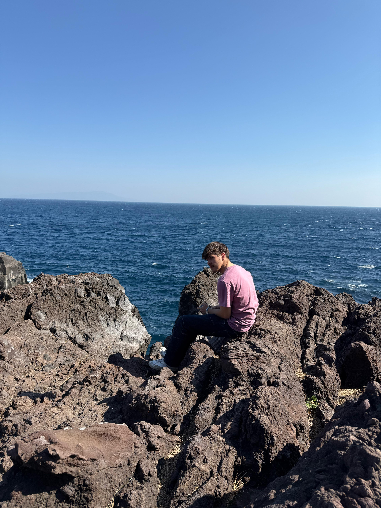

:::: {.columns}

::: {.column width="31%"}
{style="border-radius: 8px; width: 70%;"}
:::

::: {.column width="6%"}
:::

::: {.column width="63%"}
I'm Martinas Jucys Brady, a fourth-year Business Studies International student at Dublin City University, specialising in data analytics and studying Japanese. I'm interested in how data can support better business decisions and how international perspective shapes those decisions in practice. This page gives a quick overview of my studies, interests, and the skills I'm developing as I move towards data-focused roles with a global outlook.
:::

::::

## Undergraduate Studies

During my studies at DCU and Kobe University, I completed modules across broad areas of business, economics, languages and data analytics. Each module highlights key projects, assignments, and presentations that best represent my work.

:::: {.grid}

::: {.g-col-6 .g-col-md-3}
<a href="https://martinas-jucysbrady.github.io/studies/yearone" style="text-decoration:none;">
<div style="background:white; border:1px solid #e0e0f0; border-radius:14px; padding:24px 16px; text-align:center; box-shadow:0 2px 12px rgba(0,0,0,0.07); transition:transform 0.2s ease, box-shadow 0.2s ease; cursor:pointer;" onmouseover="this.style.transform='translateY(-4px)';this.style.boxShadow='0 8px 24px rgba(30,66,100,0.15)'" onmouseout="this.style.transform='translateY(0)';this.style.boxShadow='0 2px 12px rgba(0,0,0,0.07)'">
  
  <div style="font-family:'Plus Jakarta Sans',sans-serif; font-weight:700; font-size:0.95rem; color:#1E4264;">Year 1</div>
</div>
</a>
:::

::: {.g-col-6 .g-col-md-3}
<a href="https://martinas-jucysbrady.github.io/studies/yeartwo" style="text-decoration:none;">
<div style="background:white; border:1px solid #e0e0f0; border-radius:14px; padding:24px 16px; text-align:center; box-shadow:0 2px 12px rgba(0,0,0,0.07); transition:transform 0.2s ease, box-shadow 0.2s ease; cursor:pointer;" onmouseover="this.style.transform='translateY(-4px)';this.style.boxShadow='0 8px 24px rgba(30,66,100,0.15)'" onmouseout="this.style.transform='translateY(0)';this.style.boxShadow='0 2px 12px rgba(0,0,0,0.07)'">
  
  <div style="font-family:'Plus Jakarta Sans',sans-serif; font-weight:700; font-size:0.95rem; color:#1E4264;">Year 2</div>
</div>
</a>
:::

::: {.g-col-6 .g-col-md-3}
<a href="https://martinas-jucysbrady.github.io/studies/yearthree" style="text-decoration:none;">
<div style="background:white; border:1px solid #e0e0f0; border-radius:14px; padding:24px 16px; text-align:center; box-shadow:0 2px 12px rgba(0,0,0,0.07); transition:transform 0.2s ease, box-shadow 0.2s ease; cursor:pointer;" onmouseover="this.style.transform='translateY(-4px)';this.style.boxShadow='0 8px 24px rgba(30,66,100,0.15)'" onmouseout="this.style.transform='translateY(0)';this.style.boxShadow='0 2px 12px rgba(0,0,0,0.07)'">
  
  <div style="font-family:'Plus Jakarta Sans',sans-serif; font-weight:700; font-size:0.95rem; color:#1E4264;">Year 3</div>
</div>
</a>
:::

::: {.g-col-6 .g-col-md-3}
<a href="https://martinas-jucysbrady.github.io/studies/yearfour" style="text-decoration:none;">
<div style="background:white; border:1px solid #e0e0f0; border-radius:14px; padding:24px 16px; text-align:center; box-shadow:0 2px 12px rgba(0,0,0,0.07); transition:transform 0.2s ease, box-shadow 0.2s ease; cursor:pointer;" onmouseover="this.style.transform='translateY(-4px)';this.style.boxShadow='0 8px 24px rgba(30,66,100,0.15)'" onmouseout="this.style.transform='translateY(0)';this.style.boxShadow='0 2px 12px rgba(0,0,0,0.07)'">
  
  <div style="font-family:'Plus Jakarta Sans',sans-serif; font-weight:700; font-size:0.95rem; color:#1E4264;">Year 4</div>
</div>
</a>
:::

::::

## Hobbies & Interests

This section highlights some of the interests that shape my life outside of university. Travel brings together the countries and cities I’ve visited, while sport focuses on the games and teams I follow (rather than play). Food showcases dishes I enjoy cooking and improving over time, and Books collects what I’ve been reading, along with short reflections on each.

:::: {.grid}

::: {.g-col-6 .g-col-md-3}
<a href="https://martinas-jucysbrady.github.io/travel" style="text-decoration:none;">
<div style="background:white; border:1px solid #e0e0f0; border-radius:14px; padding:24px 16px; text-align:center; box-shadow:0 2px 12px rgba(0,0,0,0.07); transition:transform 0.2s ease, box-shadow 0.2s ease; cursor:pointer;" onmouseover="this.style.transform='translateY(-4px)';this.style.boxShadow='0 8px 24px rgba(30,66,100,0.15)'" onmouseout="this.style.transform='translateY(0)';this.style.boxShadow='0 2px 12px rgba(0,0,0,0.07)'">
  <div style="font-size:2rem; margin-bottom:10px;">✈️</div>
  <div style="font-family:'Plus Jakarta Sans',sans-serif; font-weight:700; font-size:0.95rem; color:#1E4264;">Travel</div>
</div>
</a>
:::

::: {.g-col-6 .g-col-md-3}
<a href="https://martinas-jucysbrady.github.io/sport" style="text-decoration:none;">
<div style="background:white; border:1px solid #e0e0f0; border-radius:14px; padding:24px 16px; text-align:center; box-shadow:0 2px 12px rgba(0,0,0,0.07); transition:transform 0.2s ease, box-shadow 0.2s ease; cursor:pointer;" onmouseover="this.style.transform='translateY(-4px)';this.style.boxShadow='0 8px 24px rgba(30,66,100,0.15)'" onmouseout="this.style.transform='translateY(0)';this.style.boxShadow='0 2px 12px rgba(0,0,0,0.07)'">
  <div style="font-size:2rem; margin-bottom:10px;">⚽</div>
  <div style="font-family:'Plus Jakarta Sans',sans-serif; font-weight:700; font-size:0.95rem; color:#1E4264;">Sport</div>
</div>
</a>
:::

::: {.g-col-6 .g-col-md-3}
<a href="https://martinas-jucysbrady.github.io/food" style="text-decoration:none;">
<div style="background:white; border:1px solid #e0e0f0; border-radius:14px; padding:24px 16px; text-align:center; box-shadow:0 2px 12px rgba(0,0,0,0.07); transition:transform 0.2s ease, box-shadow 0.2s ease; cursor:pointer;" onmouseover="this.style.transform='translateY(-4px)';this.style.boxShadow='0 8px 24px rgba(30,66,100,0.15)'" onmouseout="this.style.transform='translateY(0)';this.style.boxShadow='0 2px 12px rgba(0,0,0,0.07)'">
  <div style="font-size:2rem; margin-bottom:10px;">🍜</div>
  <div style="font-family:'Plus Jakarta Sans',sans-serif; font-weight:700; font-size:0.95rem; color:#1E4264;">Food</div>
</div>
</a>
:::

::: {.g-col-6 .g-col-md-3}
<a href="https://martinas-jucysbrady.github.io/books" style="text-decoration:none;">
<div style="background:white; border:1px solid #e0e0f0; border-radius:14px; padding:24px 16px; text-align:center; box-shadow:0 2px 12px rgba(0,0,0,0.07); transition:transform 0.2s ease, box-shadow 0.2s ease; cursor:pointer;" onmouseover="this.style.transform='translateY(-4px)';this.style.boxShadow='0 8px 24px rgba(30,66,100,0.15)'" onmouseout="this.style.transform='translateY(0)';this.style.boxShadow='0 2px 12px rgba(0,0,0,0.07)'">
  <div style="font-size:2rem; margin-bottom:10px;">📚</div>
  <div style="font-family:'Plus Jakarta Sans',sans-serif; font-weight:700; font-size:0.95rem; color:#1E4264;">Books</div>
</div>
</a>
:::

::::

---

## Skills & Qualifications

This section outlines the skills and qualifications I’m actively developing alongside my degree. In Languages, I track the languages I use and am continuously working to improve. In Certificates, I highlight courses and credentials that support my professional growth, focusing on building strong foundations in analytical and business-related skills.

:::: {.grid}

::: {.g-col-6 .g-col-md-6}
```{=html}
<div onclick="document.getElementById('lang-modal').style.display='flex'" style="background:white; border:1px solid #e0e0f0; border-radius:14px; padding:24px 16px; text-align:center; box-shadow:0 2px 12px rgba(0,0,0,0.07); transition:transform 0.2s ease, box-shadow 0.2s ease; cursor:pointer;" onmouseover="this.style.transform='translateY(-4px)';this.style.boxShadow='0 8px 24px rgba(30,66,100,0.15)'" onmouseout="this.style.transform='translateY(0)';this.style.boxShadow='0 2px 12px rgba(0,0,0,0.07)'">
  <div style="font-size:2rem; margin-bottom:10px;">🗣️</div>
  <div style="font-family:'Plus Jakarta Sans',sans-serif; font-weight:700; font-size:0.95rem; color:#1E4264;">Languages</div>
</div>

<div id="lang-modal" onclick="if(event.target===this)this.style.display='none'" style="display:none; position:fixed; inset:0; background:rgba(0,0,0,0.5); z-index:9999; align-items:center; justify-content:center;">
  <div style="background:white; border-radius:16px; padding:36px 40px; max-width:480px; width:90%; box-shadow:0 16px 48px rgba(0,0,0,0.2); position:relative;">
    <button onclick="document.getElementById('lang-modal').style.display='none'" style="position:absolute; top:14px; right:16px; background:none; border:none; font-size:1.2rem; cursor:pointer; color:#9b8877;">✕</button>
    <h3 style="font-family:'Plus Jakarta Sans',sans-serif; font-weight:800; color:#1E4264; margin:0 0 20px;">Languages</h3>
    <div style="display:flex; flex-direction:column; gap:14px;">
      <div style="display:flex; align-items:center; gap:14px;">
        
        <div>
          <div style="font-family:'Plus Jakarta Sans',sans-serif; font-weight:700; font-size:0.95rem; color:#1E4264;">English</div>
          <div style="font-size:0.8rem; color:#9b8877;">Native</div>
        </div>
      </div>
      <div style="display:flex; align-items:center; gap:14px;">
        
        <div>
          <div style="font-family:'Plus Jakarta Sans',sans-serif; font-weight:700; font-size:0.95rem; color:#1E4264;">Lithuanian</div>
          <div style="font-size:0.8rem; color:#9b8877;">Fluent</div>
        </div>
      </div>
      <div style="display:flex; align-items:center; gap:14px;">
        
        <div>
          <div style="font-family:'Plus Jakarta Sans',sans-serif; font-weight:700; font-size:0.95rem; color:#1E4264;">Japanese</div>
          <div style="font-size:0.8rem; color:#9b8877;">Intermediate · JLPT N3 · University</div>
        </div>
      </div>
      <div style="display:flex; align-items:center; gap:14px;">
        
        <div>
          <div style="font-family:'Plus Jakarta Sans',sans-serif; font-weight:700; font-size:0.95rem; color:#1E4264;">French</div>
          <div style="font-size:0.8rem; color:#9b8877;">Basic · Secondary school</div>
        </div>
      </div>
      <div style="display:flex; align-items:center; gap:14px;">
        
        <div>
          <div style="font-family:'Plus Jakarta Sans',sans-serif; font-weight:700; font-size:0.95rem; color:#1E4264;">Irish</div>
          <div style="font-size:0.8rem; color:#9b8877;">Basic · School</div>
        </div>
      </div>
      <div style="display:flex; align-items:center; gap:14px;">
        
        <div>
          <div style="font-family:'Plus Jakarta Sans',sans-serif; font-weight:700; font-size:0.95rem; color:#1E4264;">Russian</div>
          <div style="font-size:0.8rem; color:#9b8877;">Basic · Duolingo</div>
        </div>
      </div>
    </div>
  </div>
</div>
```
:::

::: {.g-col-6 .g-col-md-6}
<a href="https://martinas-jucysbrady.github.io/certificates.html" style="text-decoration:none;">
<div style="background:white; border:1px solid #e0e0f0; border-radius:14px; padding:24px 16px; text-align:center; box-shadow:0 2px 12px rgba(0,0,0,0.07); transition:transform 0.2s ease, box-shadow 0.2s ease; cursor:pointer;" onmouseover="this.style.transform='translateY(-4px)';this.style.boxShadow='0 8px 24px rgba(30,66,100,0.15)'" onmouseout="this.style.transform='translateY(0)';this.style.boxShadow='0 2px 12px rgba(0,0,0,0.07)'">
  <div style="font-size:2rem; margin-bottom:10px;">🏅</div>
  <div style="font-family:'Plus Jakarta Sans',sans-serif; font-weight:700; font-size:0.95rem; color:#1E4264;">Certifications</div>
</div>
</a>
:::

::::