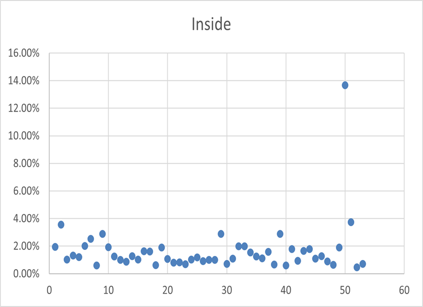
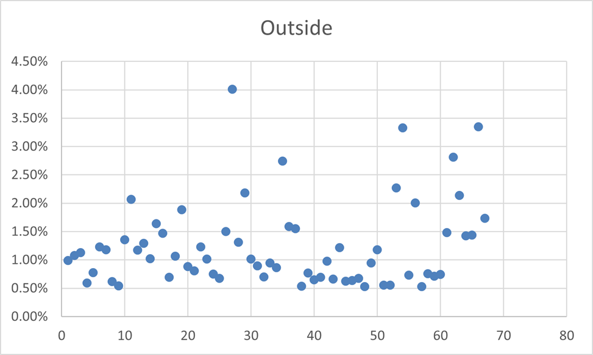
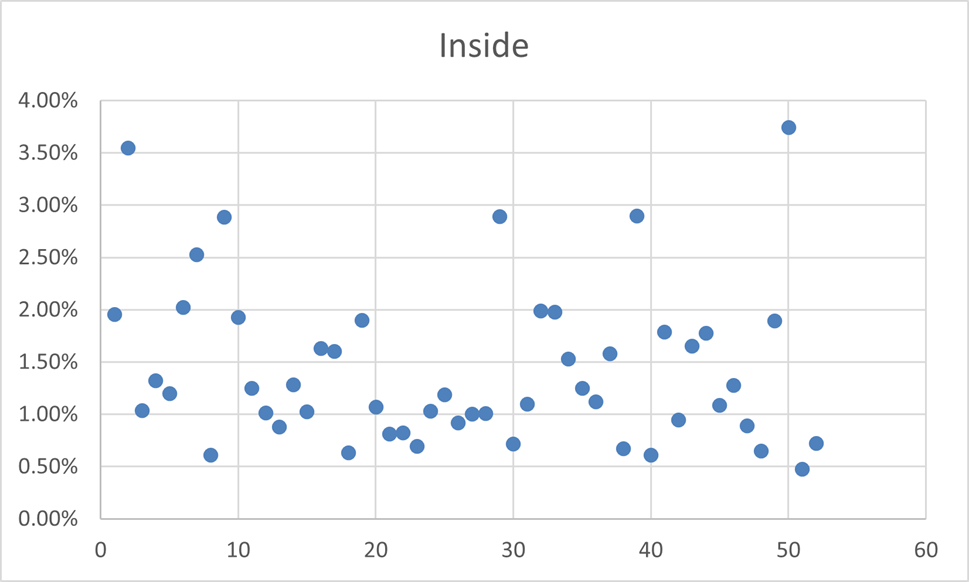
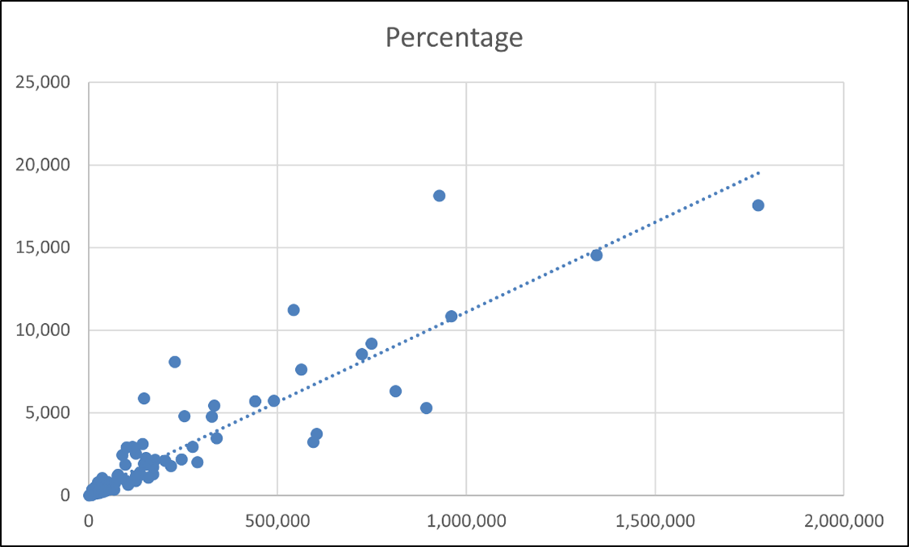

{width="80%"}

---

Hello Vice President Nils Bakker,
I hope all is good with you. I have taken your question onboard and researched it appropriately to answer the question. Is the presence of a physical bank branch creating demand for checking accounts, was truly an intriguing question to answer, and I hope that my conclusion will aid you with sufficient data for the upcoming PAS meeting.

## 1. Introduction

To answer your query I used data from 120 Metropolitan Statistical Areas (MSAs), regarding household numbers in specific areas, the correlating figures for households within these areas that hold a checking account with our company and whether these areas have a physical bank branch within. Using this study I have been able to conclude whether there is a relationship between our physical bank branches and the demand for checking accounts with our company. By using various methodologies, assessments, and data visualisation to view the data gathered we have been able to gain strategical insights into consumer preferences and the effect of having physical banks.

My first step in answering your question was to prepare the data through careful analysis. I organised the data according to whether it the area in question had an inside footprint (with a physical bank branch) or an outside footprint (without a physical bank branch, but with ATMs instead). I then calculated the percentage of households with a checking account by the total number of households. I analysed the percentage values I got and carefully identified any outliers. To identify any outliers I used a scatterplot graph in order to be able to clearly distinguish any abnormalities. Below I have included an example of an outlier that I have identified. 

{width="50%"}

Here the household with the ID 114 is clearly seen as an outlier. I concluded that this was either due to the total number of households or households with a checking account being misinterpreted. The most logical reasoning for it to be an outlier is that instead of 10,731 total households, the real value should have been 107,310 total households, as then the percentage value would have been in line with the rest. Without any evidence I cannot change this value, so I proceeded to not include its values in my data.

Below I have included scatterplot representations of households with a checking account as a percentage of the total population, with any outliers removed.

{width="50%"}

{width="50%"}

## 2. Data Analysis

### 2.1 *Correlation Calculation*

Firstly I conducted a simple calculation to give me the average percentage of households with a checking account when there is a physical bank branch and when there isn’t one. The average percentage of households with a checking account when there is a bank branch is 1.42%. The average percentage of households with a checking account when there isn’t a checking account is 1.24%. These values indicate that there is a minimal difference in demand for a checking account whether or not the area has an inside or an outside footprint. 

Also, the scatterplot below shows the linearity of the percentages of checking accounts from both inside and outside footprint. We can see that there is very little variability between values and that there are no distinct indicators to show that there is a difference in demand if there is a physical bank branch presence or not.

{width="50%"}

To back this hypothesis, I will conduct multiple other studies. 

### 2.2 *Simple Linear Regression*

I used a simple linear regression model with the presence of a physical branch as the independent variable (indicated by using 0 for outside footprint and 1 for inside footprint) and the percentage of households with checking accounts as the dependent variable (in numerical format) in Excel. Using the in-built data analysis tool within Excel I was able to compare both sets of data. Below I have included the data that Excel provided me with.

|                  | Coefficients | Std Error | t Stat | P-value | Lower 95% | Upper 95% |
|------------------|--------------|-----------|--------|---------|-----------|-----------|
| Intercept        | 0.30562      | 0.09675   | 3.15891| 0.0025  | 0.14702   | 0.46412   |
| X                | 8.05829      | 6.11357   | 1.31806| 0.1901  | -4.0846   | 20.1651   |

: Regression results {#tbl-regression}

Here the Intercept X indicates the values for an outside footprint. The values of Variable 1 will be our main focus as these values indicates the differences between demand for checking accounts when there is a physical bank branch in the area compared to when there isn’t. From this data we are given 6 distinct values [@montgomery2021introduction]. 

- Coefficients represent the average change in the dependent variable in line with the change of the independent variable on the regression line. When Variable 1 changes from being an outside footprint to an inside footprint it sees an average increase of 8.059 units.

- Standard error measures the variability of the data around the regression line. When the standard error value is low it indicates less variability from data within the dataset. Here this value is 6.113 and it indicates that there is large variability with the data.

- The T-Stat value is the comparison between the coefficient and the standard error.  When the t-value is higher this indicates that there is a larger influence when there is a change. From this data we can see that the t-value for Variable 1 is 1.318. This suggests that there is little significance in regard to the demand for a checking account if an area is with outside or inside footprint.

- The P-values that are lower than a significance level of 0.05 indicate a strong relationship between the presence of a physical bank branch and an increased demand of checking accounts in an area. However, with the values given through this data it shows that the p-value 0.119 is higher than 0.05. This indicates that there is a poor relationship between a physical bank branch and the demand for a checking account.

- Lower and Upper 95% confidence interval levels indicate where 95% of the population lies within the data.  

The data from this part of the linear regression model indicates that there is minimal significance of a physical bank branch on the demand for a checking account. Using more data from our Excel file, I was able to confirm this.

| Statistic          | Value     |
|--------------------|-----------|
| Multiple R         | 0.120973  |
| R Square           | 0.014634  |
| Adjusted R Square  | 0.006213  |
| Standard Error     | 0.49656   |
| Observations       | 119       |

: Model summary statistics {#tbl-reg-stats}

R square is an important value here as it indicates the percentage of values that have been influenced by the variable. Our variable here was if the area has an inside or outside footprint. The value, 0.014634, is low and shows that there was not much influence on the demand. This data has further strengthened my hypothesis.

## 3. Risk Assessment

Although my data is most likely correct, it may not represent the accurate effect it would have on the total population. Improper guidance can lead to major liquidity and efficiency for any business, so it is extremely important to conduct constant analyses and tests.

### *3.1 Financial Losses*

When we look at the process of risk assessment, the financial outcome is the most important aspect of all. Risks must be weighed in consideration to the correlation of expected income and expected risk, in order to make sure it is worth it. The data provided showed that physical branches have minimal effect on account demands, but this does not take into consideration the overall profits that can be made if a physical bank branch is established in a new area. For it to be worth establishing a new branch, the population of a specific area must be large enough for the company to gain sufficient profits from small percentage changes in account holders. If we were to establish a bank branch in an area with a low population, we may find that losses may be incurred.  Considering this, risk assessments must take place for all scenarios to ensure that the company maximises profitability [@ramlall2018banking]. 

### *3.2 Customer Dissatisfaction*

Another effect of improper risk management can be the growth of customer dissatisfaction, due to consumer demands not being met. My analysis indicates that if there are no further physical bank branches established that there will be minimal increase in new customers, but it does not take the effect it will have on current customers. Just like the lady you had a conversation with on the plane, the establishment of branches in new areas may lead to increased customer loyalty and satisfaction. On the other hand, if we do not continue to grow our presence consumers may switch to more convenient banks with physical presences. When doing risk assessments we must take into consideration all possible positives and possible negatives, this includes consideration of increased interaction with current customers in an area. We may benefit or suffer greatly when taking this into consideration also.

### *3.3 Competitors Gain Advantage*

An easily neglected aspect of risk management regarding our dilemma may be that of the possible gain that can be made in the market share. Considering this, we must also consider the presence of other banks as this will have an effect on our possible gains and losses. Areas with a small physical bank branch presence may be of a higher interest as we can gain a higher market share within this area. On the other hand, in areas that are heavily congested with many competitors we may find it difficult to grow drastically due to the amount of competition. When considering establishing a physical bank branch we must not neglect this factor. 

The following examples are those that depict the possible outcomes when risk assessment is conducted improperly. When risk assessments are done improperly it can lead to severe losses and even liquidation [@hull2012risk]. In the past we have witnessed many banks enter liquidation or similar situations when risk assessment is not properly done. One such example is that of the Anglo-Irish Bank in 2008. This banks improper control of assets led to a terrible banking crisis in Ireland, as borrowing was not sufficiently controlled. “One of the costliest banking crisises in history” arose from the banks inability to accurately measure their capabilities in the department of borrowing and saving [@konzelmann2013banking]. Anglo-Irish Bank were unable to give sustainable interest rates and suffered heavily, with losses financially and in customer satisfaction. This was due to the heavy reliance on international savings and borrowings that should have been analysed with more care.

The improper risk management of Citigroup between 1998 and 2009 proved to be catastrophic for its ability to remain functional. Citigroup employed an universal banking strategy that was designed to compete with those preexisting in the European and Asian markets, by using a high-risk high-reward concept. Excessive risk taking in Citigroup led to its collapse as it became unable to prevent legal violations and improper control of international borrowing [@wilmarth2014citigroup]. Ultimately the risks taken did not reward, as it led to the Fed having to help them remain liquid for a large portion of time and the inability to pay out to its depositors.

## 4. Conclusion

My initial hypothesis of establishing physical bank branches to not have an effect on the demand for checking accounts is highly likely to be accurate. We must also consider possible risks in specific MSAs that may be rewarding. I would suggest that a follow-up analysis of the possible gains that can be made through the establishment of physical bank branches in areas with an outside footprint be made. We would ultimately consider competitors, costs, effect on consumer interactions and the overall growth of market share in further studies so we can get an accurate interpretation of whether it is worth establishing these branches. 

From the data that I have analysed here and before analysing deeper, I would suggest that no establishment of new bank branches be made, we must conduct much further research to ensure that establishing new branches would be viable. Currently I have concluded that the risk heavily outweighs the reward, as building and hiring staff for a new branch will be extremely costly and a failure could lead to many other knock-on effects. These knock-on effects can include the loss of current account holders and heavy financial losses.

## 5. Bibliography

::: {#refs}
:::