{width="40%"}

---

## 0. Company Overview

EcoEnergy Corp is a global sustainable infrastructure and technology company operating across five continents. It develops and sells eco-friendly construction materials, renewable energy solutions and energy-efficient consumer electronics through both online and offline channels. The company’s mission centers on integrating sustainability into every stage of its value chain, from materials sourcing to product recyclability.

## 1. Approach & Executive Summary

Upon analysing our data set we deemed some of the data redundant, for example our region and country fields didn’t match correctly so we decided to base our analysis off of regional data. We also saw no need for the use of sales reps as there were only 5 sales representatives globally with no clear jurisdiction of which regions they worked in. Because of this we decided to remove this column before we began our analysis.

EcoEnergy Corp faces profitability challenges across all sectors, with 39.4% of products sold at a loss and eight out of ten offerings unprofitable. Cost minimisation failures have resulted in a net loss of €8.46 million, highlighting the urgent need for large-scale restructuring.

This report categorises products into Technology, Construction, and Transport & Insurance, analysing regional performance to identify products for discontinuation or outsourcing to restore profitability.

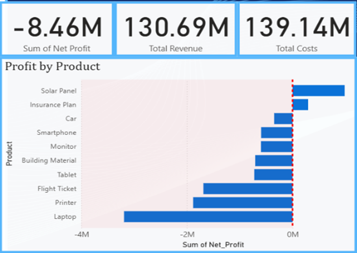{width="50%"}

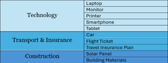{width="50%"}

## 2. Regional Analysis

The analysis began by reviewing each region’s performance to understand their specialisations and key weaknesses. Over the past 10 years, internal data has revealed trends and insights that EcoEnergy Corp should use to boost profitability. A region-by-region evaluation makes the necessary steps for EcoEnergy Corp clear.

### *2.1 Europe*

Europe’s 10-year outlook for EcoEnergy Corp shows volatility, with profit swings driven by market dynamics and cost challenges. The region was profitable from 2015–2018 but rising costs and declining revenues after 2019 led to recurring losses. Transport and Insurance products remained steady performers, while Technology and Construction faced irregular results. Offline channels dominated sales, with a brief online surge in 2020–2021 that temporarily boosted profits. Building materials, Insurance plans and flight tickets were the most reliable, whereas smartphones, tablets, printers and solar panels incurred ongoing losses. Margin compression from high discount rates in 2017 and 2023 also hurt results. To improve, EcoEnergy Corp should build a stable omnichannel presence, focus on strong product lines and reconsider or discontinue persistently unprofitable items.

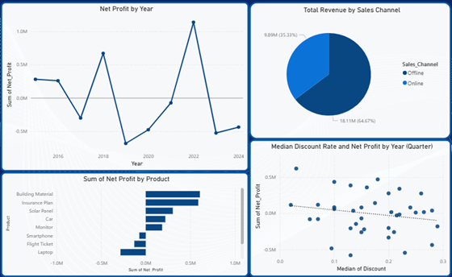{width="80%"}

### *2.2 North America*

North America has seen sharp profitability erosion for EcoEnergy Corp, with seven of ten products posting negative net profits. Technology, Transport and Insurance underperformed, with margins of -23% and -22%. Losses in key lines like printers, cars, smartphones and laptops were worsened by pricing below cost and average discounts of 16%, resulting in €4.15 million in total losses. Only the Construction category performed well, achieving a 13.62% margin. To improve, unprofitable Technology and Transport lines should be discontinued, discount policies tightened and pricing discipline enforced. Future efforts should prioritise reinvesting in Construction and refining the sales mix to balance online and offline channels while avoiding low-margin products.

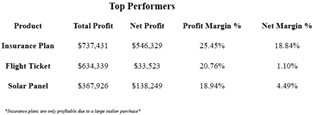{width="50%"}

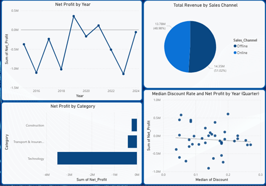{width="80%"}

### *2.3 South America*

Over the past decade, South America has become EcoEnergy Corp’s most reliable hub for low-cost, high-quality technology and solar panel manufacturing. Median production costs are over 30% lower than in Asia or Europe, with Technology and Construction among the cheapest globally. The region’s shift toward online sales has improved margins and reflected stronger digital engagement. From 2021 to 2024, consistent profitability in Technology and Construction aligns with rising sustainability initiatives. However, losses in car and Insurance products and high offline operational costs reduce overall profit, worsened by discounts. To sustain performance, EcoEnergy Corp should prioritise profitable, sustainable lines, such as smartphones, printers, building materials and solar panels, while discontinuing weak Transport and Insurance products. Discount control, balanced channel management and ongoing cost monitoring will be essential to preserve the region’s advantage.

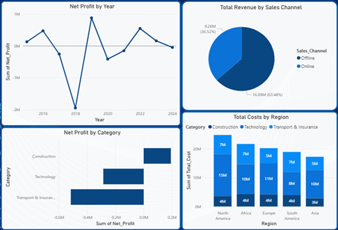{width="80%"}

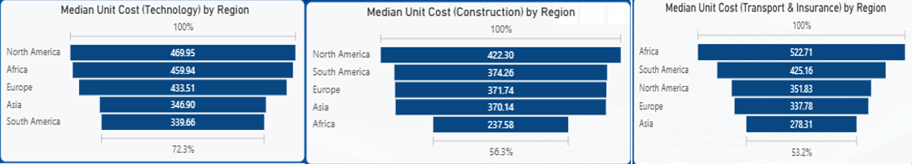{width="80%"}

### *2.4 Asia*

Asia is a high-revenue but nearly break-even region for EcoEnergy Corp, generating €24.05 million in revenue and only €0.14 million in net profit over ten years. Despite the lowest production costs globally, weak portfolio choices and heavy online discounting have limited returns. Profitable periods (2015–2017, 2024) coincided with disciplined portfolio management, while losses stemmed from persisting with unprofitable products. Cars, solar panels, tablets, smartphones and laptops were consistent profit drivers, whereas flight tickets, Insurance, printers and monitors eroded margins. Online channels dominate, but deep discounts offset cost advantages. To ensure sustainable profits, EcoEnergy Corp should leverage cost efficiency into margin gains, enforce minimum margin thresholds, especially in tech and concentrate on profitable lines while phasing out chronic loss-makers.

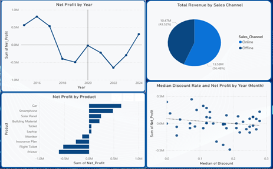{width="80%"}

{width="80%"}

### *2.5 Africa*

Africa remains EcoEnergy Corp’s most challenging region, recording continuous losses of €3.7 million. Over ten years, revenue totalled €25.17 million, but high production costs, especially in Technology, have driven persistent deficits. Online channels contribute 36.7% of sales, yet heavy losses stem from costly tech products. Printers and solar panels only recently turned profitable, while building materials continue to underperform due to weak, inelastic demand. To improve, EcoEnergy Corp should reduce technology production costs, discontinue unprofitable lines like building materials and prioritise solar panels amid rising sustainable demand. Further market research will be vital to align offerings with regional demand trends.

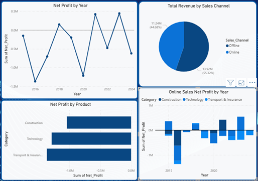{width="80%"}

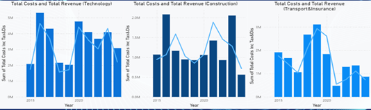{width="80%"}

## 3. Outsourcing Recommendations

Analysis of the past three years of operational and sales data reveals clear regional performance trends across Technology, Construction Materials, and Transport & Insurance. Adapting our outsourcing model to these insights will enable marginal recovery, competitive pricing and targeted growth. We identified regions with the lowest median production costs for outsourcing each product, using median values to minimise the impact of outliers in sales data.

### *3.1 Technology*

Data shows South America and Asia maintain the lowest median unit costs in technology, at €339.66 and €346.9 respectively. South America offers the cheapest production for monitors, tablets and printers, while Asia leads in laptops and smartphones. Africa produces printers at the lowest cost, whereas other regions spend over 25% more on technology production. It is recommended to consolidate tech manufacturing in South America and Asia to capitalise on their cost advantages and proven profitability.

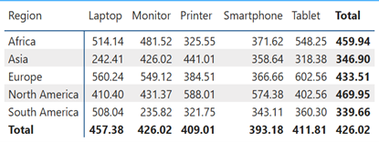{width="50%"}

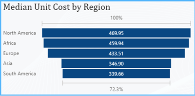{width="40%"}

### *3.2 Construction*

Construction analysis proved more complex. North America has the lowest median production cost at €373.25 but no single cheapest product and it recorded a €1.71 million loss in construction over the past three years. South America offers the lowest cost for solar panels at €273.42 per unit, while Europe produces building materials at €511.81 per unit. Though not the cheapest, Europe leads demand for building materials and was the only region to achieve profits in this category. Prioritising solar panel production in South America and building materials in Europe will sustain profitability. With Europe’s average unit price twice that of its nearest market, manufacturing there supports high-margin growth.

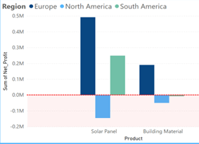{width="40%"}

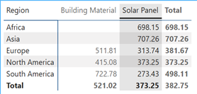{width="30%"}

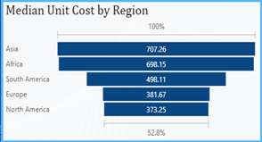{width="30%"}

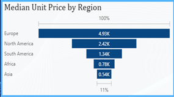{width="30%"}

### *3.3 Transport & Insurance*

Transport & Insurance analysis revealed mixed performance. North America reported the lowest median production cost at €351.83. yet no cost-leading product, alongside a €1.74 million loss in Transport & Insurance over three years. North America also achieved the lowest car and flight ticket cost at €206.84 and 252.73 per unit respectively, while Europe produced insurance plans at €380.49 per unit. Although not the cheapest, Europe led demand and was the only region to deliver profits in Transport & Insurance. Focusing car and flight ticket production in North America and Insurance plans in Europe will strengthen profitability.

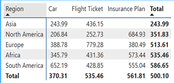{width="40%"}

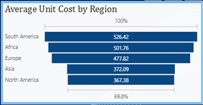{width="40%"}

## 4. Next Steps

The next steps apply strategic principles focused on leveraging leading production hubs through a “winner-takes-all” sourcing model [@jain2024], prioritising regions with the lowest unit costs and targeting markets with strong demand. Export efficiency should be improved by shipping from key hubs, South America for solar and technology products and Europe for construction materials, supported by a scalable supply chain responsive to changing global demand. The Transport and Insurance sectors require product rationalisation, as persistent losses mean they should be restructured or exited entirely.

## 5. Predictive Analysis

To support our recommendations, we developed a predictive sales analysis for the next three years. Predictive analytics is a powerful tool that leverages historical data and statistical models to forecast future outcomes and behaviours. It enables organisations to gain valuable insights, make informed decisions and drive business growth [@wolniak2023]. Using original sales data, we adjusted unit costs to the lowest median costs from new production hubs, for example, solar panel costs were set at €273.43 from South America.

We addressed key issues:

1.	Higher shipping costs due to longer distances are accounted for by multiplying shipping by five.

2.	Production hubs need time to scale, so sales are capped at 50% capacity in year one, 75% in year two and full capacity in year three.

3.	Since 2024 data is incomplete, predictions are based on the full 2023 dataset, representing current industry trends.

## 6. Findings

Predictive analysis indicates steady net profit growth across all industries. In year one, we expect a €1.55 million profit even with capped production, reaching €3.09 million annually at full output with a 49.7% profit margin. Technology leads profitability, generating €7.75 million (49.72% of total revenue). Construction, while earning €2 million, suffers from high costs and weak margins, suggesting potential discontinuation unless market conditions improve. Overall, the proposed production hub strategy is projected to restore EcoEnergy Corp’s profitability and prevent further losses from poor cost management.

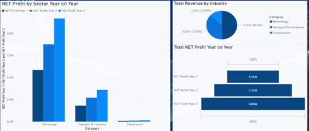{width="60%"}

## 7. Industry Benchmarks

In theory our global production hubs will turn a profit for EcoEnergy Corp, we have conducted the following industry benchmarking study to ground our hypothesis in real-world industry data.

Maintaining a strong green identity is crucial for EcoEnergy Corp as it expands outsourcing. Apple, a leader in consumer technology, shows how large-scale outsourcing can align with sustainability. Apple enforces strict environmental controls and supplier audits in Asia, aiming for carbon neutrality. It commits to 100% renewable energy for manufacturing and increasing recycled, renewable materials in products, transparently reporting emissions progress [@apple2025]. This accountability strengthens Apple’s green brand and stakeholder trust while supporting growth.

Cool Planet shows that becoming sustainable can be straightforward and cost-effective. As an Irish company specialising in energy management and decarbonisation, Cool Planet provides easy-to-use digital dashboards and expert support that help businesses monitor, reduce and manage their carbon footprints [@coolplanet2025]. Their approach demonstrates that strong sustainability performance is achievable for companies of all sizes, offering a clear, practical blueprint for EcoEnergy Corp to follow. 

These examples highlight a vital principle for EcoEnergy Corp: sustainability must be deeply integrated with operational strategy. As the company outsources production to cost-efficient regions, it must ensure transparency, strict environmental standards and continuous improvement [@sourcefit2023]. By doing so, EcoEnergy Corp can combine market leadership with innovative growth, proving that profitability and a strong green commitment go hand in hand.

## 8. Conclusion

EcoEnergy Corp faces a pivotal moment requiring decisive restructuring and targeted outsourcing to reverse losses and restore profitability. Ten years of regional data show South America as the low-cost, high-quality hub for technology and solar products, North America for construction materials and Asia’s pricing advantage in Transport and Insurance remains unrealised in profits. The company should consolidate manufacturing accordingly, discontinue unprofitable products, and recalibrate pricing and discounts to protect margins and enable sustainable growth.

Maintaining EcoEnergy Corp’s green and ethical identity is essential. Leaders like Apple prove large-scale outsourcing can align with sustainability through strict audits, renewable energy use and transparent emissions reporting. Smaller firms like Ireland’s Cool Planet show sustainable outsourcing is feasible at any scale via low-carbon manufacturing and real-time environmental monitoring. By adopting these best practices, EcoEnergy Corp can combine operational excellence with a strong sustainability mission, safeguarding stakeholder trust while achieving commercial success.

## 9. Bibliography

::: {#refs}
:::