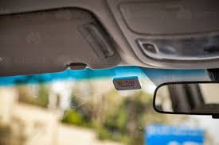
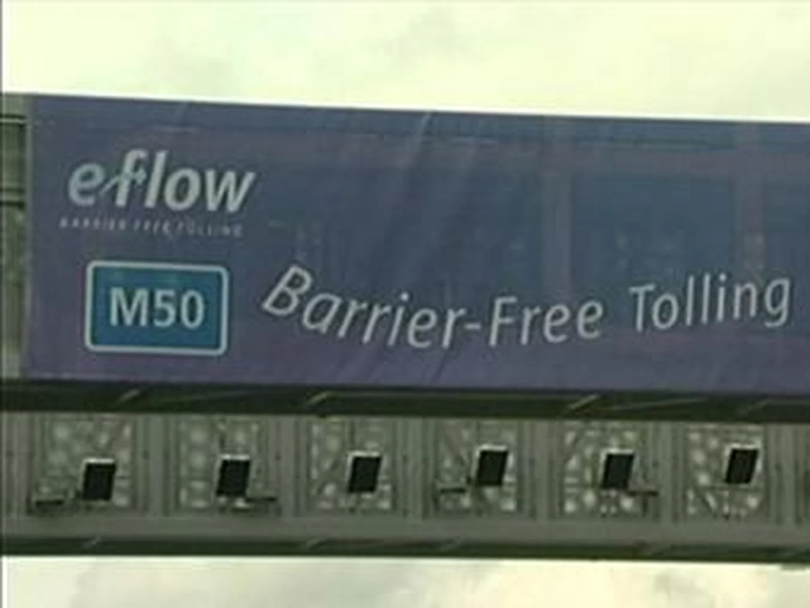
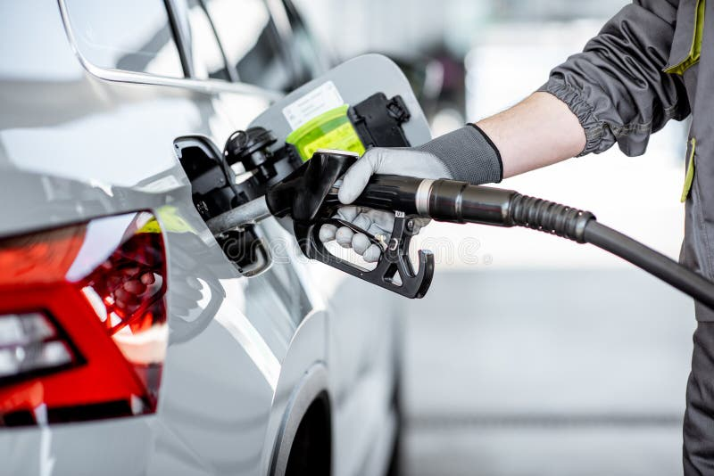
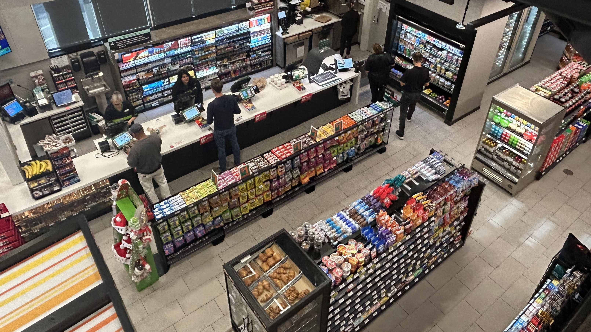
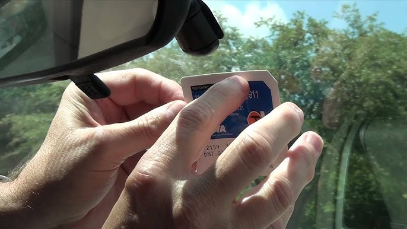
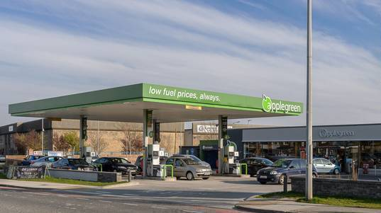

{width="80%"}

---

## 1. Introduction

As we know, in recent times the retail industry has been one of the hardest hit by uncontrollable circumstances. For businesses in the convenience and retail sector like Applegreen, the catastrophe of the Covid-19 pandemic was soon followed by further difficulties brought on by the Russian invasion of Ukraine which impacted one of the sectors leading incomes- fuel. Only the smartest and most innovative businesses have survived thus far and the battle for survival continues.

In this assignment we will, as a team of aspiring businessmen and women, develop a smart service innovation that will lend a hand in Applegreen delivering a superior customer experience and boost customer spends while simultaneously tackling the current challenging labour issues. The chosen smart service innovation will be based on both primary and secondary research and will be catered as much as possible to every type of customer in accordance with Applegreens policy of “customers and their satisfaction being at the heart of everything we do”.

## 2. Our Customer Segments

The first customer segment we decided on was ‘choosey shoppers’. The choosey shoppers tend to not shop a whole lot in the food section of a forecourt. For this reason we decided that the choosey shopper would be much more likely to stop in Applegreen for their fuel, if it had this convenience which we are proposing. We feel as though the choosey shopper would appreciate the convenience on offer for them and the recognition that not all customers want to go inside the forecourt and purchase food.

The second customer segment we decided to focus our project on was the ‘traditionalist’. The traditionalist is the perfect fit for our new proposal of filling up your fuel tank and being on your way. The traditionalist tends to never purchase food in forecourts. They see them as only a garage and the sole purpose of the forecourt to buy fuel, whilst shopping elsewhere for their food. This is why we feel that the traditionalist would be very satisfied with the convenience of filling up their fuel tank and driving off to do their food shop elsewhere which they would have done regardless.

## 3. Research

Members of our team visited Applegreen M1 Southbound and Applegreen Clones Co. Monaghan to gain a more diverse insight into the opinions of Applegreen staff and customers. We decided to visit these vastly different stores as it gave an insight into whether rural and urban customers' views and ideas differed. We conducted interviews and surveys, which resulted in varying results and conclusions. The purpose of our research was to identify consumer needs and wants and the problems they face while at an Applegreen forecourt.

We conducted a brief interview with five staff members across the two stores we visited. Topics such as how efficiency and profitability could be increased were included. Both stores had employees that were concerned to the extent of how much technology has advanced in the last couple of years; this concern stemmed from the idea of robots, AI, and automated technology taking over their jobs of running the forecourt and shop floor.

Another suggestion given by one of our team members that work in Circle K was to implement a strategy to clamp down on the number of drive-offs that occur. Innovation in this area before competitors will lead to savings of vast amounts of money and time.

We also surveyed 15 customers that were willing to answer our questions in-store. As we focused on the customer segments of Traditionalists and Choosey Shoppers, we decided to study more people that opted to purchase fuel. Traditionalists and Choosey Shoppers both would be less attracted to buying ready-made food in store. We also chose to focus on surveying those that appeared to be between 20 and 40 to allow for some differentiation. We identified that younger age groups of people were more open to change and wanted innovation to occur around them. Manual workers were a common sight in both the rural and urban Applegreen stores, some were a mix of Pit Stopper and Traditionalist, and some were mixed with a Choosy Shopper. This allowed us to identify that customers do not always belong to just one customer segment. Questions such as, "How can coming to Applegreen be made more enjoyable for you?", "What would make you come to Applegreen more frequently?" and "How has Applegreen fulfilled your needs on a scale of 1-10" were asked. An average rating of 7 was recorded for the last question above; this shows that Applegreen is meeting its customer standards, but it can still increase its efficiency vastly.

Much of the feedback received was positive, but there were clear areas of improvement that needed to be made regarding fuel and payment methods. Survey feedback from rural and urban customers surprisingly did not differ vastly. Time saving and overall quality of service were the vital customer needs highlighted by our research. One customer even suggested that "Applegreen must follow other service station companies and invest in pay-at-pump systems." Conclusively this feedback sparked an idea for our team, and we developed a concept that would take the pay-at-pump system and improve it. We merged this idea with areas of the already-existing Applegreen app, prepayments, and actions taken at toll bridges.

## 4. Our Needs

We have identified numerous specific needs focused on the customer segment elements of traditionalists and choosy shoppers. Through our effective use of surveys, we identified that for traditionalists and choosey shoppers purchasing ready-made food is not regarded as attractive and therefore cannot be considered as a need. This forced us to focus on the aspect of purchasing fuel in the service station. As has been previously stated we gained an incredibly important and relevant insight into the fact that younger age groups are much more open to new innovations and change which is greatly beneficial for us as a group as we had a plan to innovate and update on the currently in place pay at the pump system. The average rating of 7 relating to how effectively Applegreen has fulfilled the needs of customers has allowed us to identify that there is significant room for improvement in this area. The number of drive-offs that occurred at service stations was a very helpful and eye-opening insight into the problems associated with the industry and forced us to address this issue with our innovation.

Regarding the needs of traditionalists and choosy shoppers, we have identified several. From our survey feedback, Quality and Time Saving make for meaningful customer service. The quality of fuel and services provided is the most important need for choosy shoppers. Based on our research they are more likely to pay higher prices for quality than traditionalists who tend to be more price conscious. This provides glaring evidence that what makes a meaningful experience for one customer differs from another. We had to bear this in mind when developing our improved pay at the pump system as this variation in needs had a duty to be addressed. We had no choice but to have a balanced price but also quality of a respectable standard. This allows for a greater chance of fulfilling the demanded customer needs.

Time saving is a mutual need for both traditionalists and choosy shoppers. Our feedback allowed us to identify that customers feel they waste too much time firstly trying to find a pump as most are occupied as well as having to walk into the forecourt to make a payment which can be simply made at the pump as we discovered. One customer even described their experience of fueling their car as ‘unnecessarily lengthy.’ This particular comment provided us with the knowledge that our plan to improve customer satisfaction ought to be a fuel payment process that is concise and avoids unnecessary time wasting hence the improved idea of paying at the pump.

Overall, the need for quality services and time saving processes of fueling are vital for customer satisfaction. To provide meaningful customer service we decided to develop an electronic payment system which would have the necessary quality and conciseness to meet the needs of the customer.

## 5. The Problem

After having conducted a thorough analysis of our research field, we have identified key elements and established crucial questions concerning Applegreen employees and their customer segments. It is beyond recognizable that there is a critical problem within the management and implementation of customer service within the business due to the insufficiency of employee recruitment and retention during the Covid 19 pandemic. According to @katz2022gasstations, the petrol station industry took a substantial hit to sales and revenue during the global pandemic due to a decrease in motor traffic. This was related to the increase in the number of people working at home and travelling less.

As the world begins to return to normal following Covid 19 restrictions, many companies have decided to continue to have their employees work from home. This further impacts businesses such as Applegreen as it reduces the need for customers to visit their stations regularly. With a decrease in the supply of motor traffic this leads to a decrease in demand for employees to work in the station overall, further hindering customer satisfaction. After empathising with our customer segments, choosey shoppers and traditionalists we have established their required needs and the expectational standards for the business. Many problems arise within the firm as a result of a scarcity of employees such as reduced assistance for customers. It can be difficult for customers to get help or ask any questions concerning their time spent in an Applegreen station if there is a lack of employees. Customers will begin to become frustrated and annoyed by the fact that they cannot engage with the business on a ground level and will reduce their time spent in the store.

Another key problem that arises with the lack of employees on the premises is the reduction in hygienic levels in areas such as cleanliness of bathrooms, petrol pumps and the availability of hand sanitizer, wipes and tissues at the station. These sanitation problems affect the Choosy shopper segment as they are more inclined to visit the station over quality rather than being price cautious. If the quality of the station is considerably low, they will avoid visitation otherwise.

Another significant aspect in relation to a reduced number of employees is a surge in anti-social behaviour on the premises as there is not enough staff to prevent graffiti being drawn on the premises and to pick up litter on the ground. These small attributes to the business create a substantial impact in creating an all-round clean image for the firm. Overall, we have identified one prominent problem in relation to reduced staff that is noticeably re-occurring within each customer complaint. Customers are not willing to spend a substantial amount of time on the premises due to the above problems, which are unlikely to be rectified unless there is an increase in the number of staff. As a team we feel it would be of most efficiency to have customers spend as little time on the premises with little to no contact with staff in order to regulate criticism. We believe the customer segment such as traditionalists will be delighted with this introduction of change and innovation as they are at the petrol station for one product only and the convenience provided.

## 6. Ideation

During the process of creating a new idea for Applegreen, we had many different factors that we took into consideration that we felt would contribute to an all round better service for customers at Applegreen. As well as this we also discussed many different ideas and products and had to eventually decide on which one we think is the best solution. 

Our first port of call was to gather in the DCU library as a team and discuss our ideas with one another. We came up with a couple of different products and services such as a multifunctional pump that allows you to switch between petrol, diesel and a carwash mode but there were various problems and faults with all of these respective ideas. We tried to search for any possible problems with each individual product/service to potentially eliminate any future issues we may run into.

We then drove to two different applegreens in Dublin and watched for 20 minutes or so to gauge what normal service looks like and to see potentially how we could make it a better experience for regular customers.

## 7. Solution

After all of our brainstorming and bouncing ideas off of eachother we came to a mutual agreement on which product we thought would work best in Applegreen and would both boost their sales and customer satisfaction. Together, we have created an electronic payment system quite similar to the tolltag system on the M50, where a tag is attached to your windscreen and a camera is installed above the pumps in the petrol station. With the installation of this camera together with the tag on your windscreen, you can drive out of the petrol station without having to enter the physical shop as the camera scans your tag on your windscreen and automatically debits your account which you will have access to via an app on your smartphone in order to top up.

{width="50%"}

Above is a picture of what the tag on your windscreen would look like obviously not being identical. This would be scanned by the cameras above the pumps therefore allowing access to the pumps and your account is therefore debited after you have finished which would both save time for customers and reduce drive offs to almost zero if used widespread.

{width="50%"}

Above is a picture of the sort of cameras that would have to be installed above the petrol pumps. Although it might be a large initial setup cost, the return on investment would be exponential as customers love systems that are quick and easy.

As mentioned above in Applegreen stores there is a problem with drive-offs with customers not paying for their fuel. By implementing a system where a camera must scan the tag in order to release fuel from the pump and in turn pay for the fuel it limits drive-offs substantially. With a shortage of employees in the retail trade sector, this system eases pressure on the firm to hire employees and can cut back on costs of wages and maintenance. Although the Covid-19 pandemic and its restrictions have lessened, many people are still wary of being infected, especially the older population who may be more compromised and vulnerable. Our toll tag will reduce the need for close contact with employees and other customers in the service station. Particularly during the wintertime as flu cases are much more prevalent and people want to protect themselves and avoid unnecessary interactions.

The technology is already readily available and configuring it to this system would not require a large amount of innovation. There has been a 25% increase in the amount of electronic tag users in Ireland (tii.ie) as of 2021 with the number increasing year on year. Many customers of the firm drive by Applegreen stores on their way to work everyday as many of these stores are located on motorways which are how commuters travel to work. These commuters will already have experience using electronic tags by driving on motorways. It is an attractive product for commuters in particular. The electronic tags are a time saver and this would also imply to our electronic fuel tags as the instant pay method will reduce the amount of time taken in service stations.

The product is designed to be efficient and easy to use. The app layout would be simple to navigate with a user friendly layout and interface. Consumers would have a username and password that they can log into. They would be able to top up by whatever amount they please. There would be security measures including the use of an email address, phone number and security questions. It’s a system that is designed to be safe but also structured in a way that is accessible.

## 8. The Prototype

:::: {layout-ncol=2}

::: {#image-col}

:::

::: {#text-col}
The setting takes place in Applegreen M1 Lusk Southbound Ballystrane, Co. Dublin
and Applegreen Clones Co. Monaghan.

The characters taking place in our story board are **Choosey shoppers** and **Traditionalists**. Choosey shoppers are not price conscious and are willing to pay more for quality. They tend to be more environmentally conscious and have a greater interest in local and Irish produce. Traditionalists are more price conscious and they view apple green as a garage rather than a place to buy fuel.
:::

::::

:::: {layout-ncol=2}

::: {#image-col}

:::

::: {#text-col}
Conflict in our story arises when we realised as a team that these specific customer segments we have chosen preferred convenience rather than experience with their time in the store so we began to brainstorm a prototype to provide this type of customer satisfaction.
:::

::::

:::: {layout-ncol=2}

::: {#image-col}

:::

::: {#text-col}
Currently customers are forced to step out of their car, fill their car with diesel and then queue for a substantial amount of time. We believe this is time wasting for our valuable customers when we can simplify this process into 3 easy steps.
:::

::::

:::: {layout-ncol=2}

::: {#image-col}

:::

::: {#text-col}
As we began to brainstorm ways these specific customer segments can spend less time on the premises whilst receiving a quality experience, we developed the Applegreen car tag.
:::

::::

:::: {layout-ncol=2}

::: {#image-col}

:::

::: {#text-col}
This allows customers to drive in and out of the petrol without having to queue to pay for petrol. This prototype is quick and convenient for customers as they can top up their balance for the tag on the Applegreen app.
:::

::::

:::: {layout-ncol=2}

::: {#image-col}

:::

::: {#text-col}
The development of this prototype can push Applegreen to be one of the leading petrol stations nationally and globally. Their customers are satisfied whilst less staff are needed at checkouts.
:::

::::

## 7. Bibliography

::: {#refs}
:::