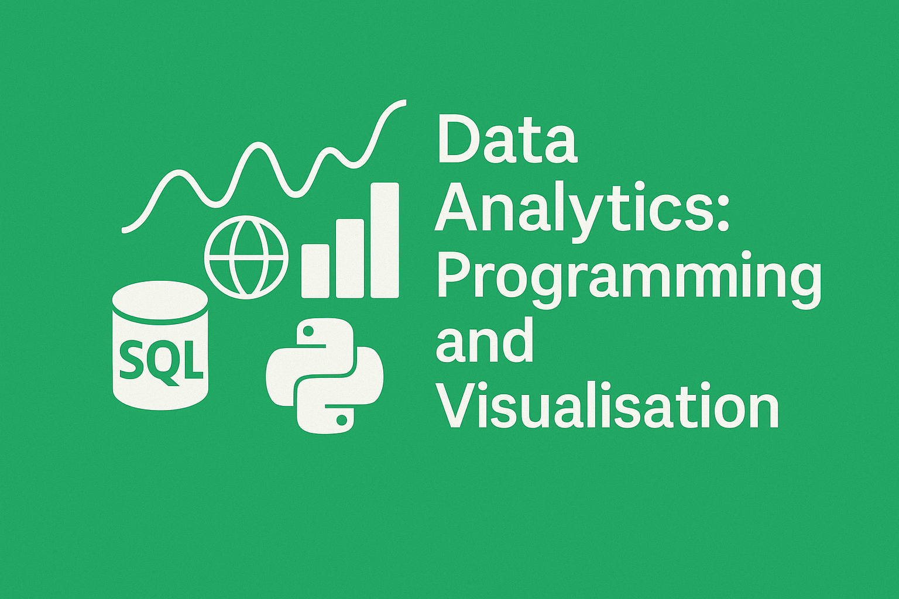

::: {style="text-align: justify;"}
This page contains a summary of the work I have done during my fourth and final year in university. 
:::

## Business Strategy

::: {.grid}

::: {.g-col-12 .g-col-md-2}

:::

::: {.g-col-12 .g-col-md-10}

[Strategic Consultancy Report](http://martinas-jucysbrady.github.io/projects/business_strategy)

Developed understanding of core business strategy concepts, tools, and frameworks across macro, industry and firm levels.
​

Worked in a consulting team to complete a strategic analysis, presentation and written report.

​
Grading: 25% group presentation, 25% group report, 50% case analysis.

:::

:::

## Managing Change and Digital Transformation

::: {.grid}

::: {.g-col-12 .g-col-md-2}

:::

::: {.g-col-12 .g-col-md-10}

[Compare and Contrast Report](http://martinas-jucysbrady.github.io/projects/digital_transformation), &nbsp; [Reflection](http://martinas-jucysbrady.github.io/assets/files/digital_transform_reflection.pdf)

Developed critical understanding of managing organisational change and digital transformation, focusing on technologies, agile structures and the future of work.
​

Applied concepts through case studies on successful and failed digital transformations, linking theory to real-world strategic decisions.

​
Grading: 15% Reflection, 30% Exam, 55% Report. 

:::

:::

## Data Analytics - Programming and Visualisation

::: {.grid}

::: {.g-col-12 .g-col-md-2}

:::

::: {.g-col-12 .g-col-md-10}

[Power BI](https://martinas-jucysbrady.github.io/studies/yearone)

Developed practical skills in business data analytics using SQL, Python and Power BI for end‑to‑end analysis and visualisation.

​
Learned to design databases, write queries, manipulate datasets, and build interactive dashboards that communicate insights to stakeholders.
​

Grading: 30% SQL Exam, 30% Power BI Presentation, 40% Python Exam.

:::

:::

## Data Analytics - Machine Learning and Advanced Python

::: {.grid}

::: {.g-col-12 .g-col-md-2}
 

:::

::: {.g-col-12 .g-col-md-10}

[Research Paper](https://martinas-jucysbrady.github.io/studies/yearone)

Developing skills in machine learning and advanced Python for applied business data analytics and predictive modelling.
​

Applying algorithms and coding techniques through weekly classes, tutorials and case‑based exercises on real datasets.

​
Grading: 40% Exams, 60% Research Paper

:::

:::

## Workflow and Data Management

::: {.grid}

::: {.g-col-12 .g-col-md-2}

:::

::: {.g-col-12 .g-col-md-10}

[ePortfolio - GitHub Repository](https://github.com/martinas-jucysbrady/martinas-jucysbrady.github.io)

Developing practical skills in workflow and data management using modern web, cloud and version‑control tools.
​

Designing secure, cloud‑based data flows and databases to support efficient business analytics and protect sensitive information.
​

Grading: 10% Online Courses, 90% ePortfolio (This website). 

:::

:::

## The Language of Business and the Media across Cultures

::: {.grid}

::: {.g-col-12 .g-col-md-2}

:::

::: {.g-col-12 .g-col-md-10}

[Presentation](https://martinas-jucysbrady.github.io/assets/files/lig1000_presentation.pdf), &nbsp; [Vlog](https://martinas-jucysbrady.github.io/studies/yeartwo), &nbsp; [Essay](https://martinas-jucysbrady.github.io/studies/yeartwo)

Developing awareness of how business and media language varies across cultures and communicative contexts.

​
Reading, presenting and analysing authentic texts to explore power, persuasion and intercultural communication.
​

Grading: 15% Presentation, 18% Vlog, 67% Essay. 

:::

:::

## Perspectives on Japanese Culture

::: {.grid}

::: {.g-col-12 .g-col-md-2}

:::

::: {.g-col-12 .g-col-md-10}

[Poster](http://martinas-jucysbrady.github.io/assets/files/jappers_poster.pdf), &nbsp; [Video Presenation](https://youtu.be/n9-NoHSrM9U), &nbsp; [Report](http://martinas-jucysbrady.github.io/assets/files/jappers_report.pdf), &nbsp; [Reflection](http://martinas-jucysbrady.github.io/assets/files/jappers_reflection.pdf)

Explored key themes in contemporary Japanese culture, identity and everyday life across multiple topics.

Engaged with materials on media, food, fashion, humour, gender and work culture to challenge stereotypes.
​
Grading: 25% Poster, 25% Video Presentation, 25% Report, 25% Reflection.

:::

:::

## Japanese Language 4

::: {.grid}

::: {.g-col-12 .g-col-md-2}
 

:::

::: {.g-col-12 .g-col-md-10}

Improved Japanese language proficiency through integrated practice in vocabulary, grammar, listening, speaking, reading and writing.

Progressed through structured lessons building complex skills for practical communication.

Grading: continuous assignments, tests and exam. 

:::

:::