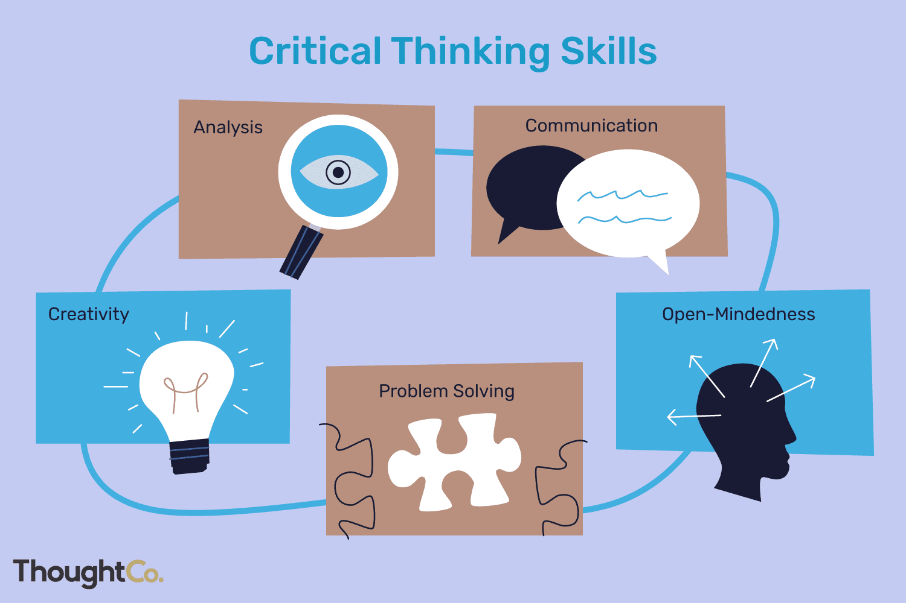

::: {style="text-align: justify;"}
This page contains a summary of the work I have done during my second year in university. 
:::

## Macroeconomics

::: {.grid}

::: {.g-col-12 .g-col-md-2}

:::

::: {.g-col-12 .g-col-md-10}

[Assignment](https://martinas-jucysbrady.github.io/assets/files/macroeconomics.pdf)

Analysed economy-wide phenomena including GDP measurement, business cycles, inflation, unemployment, monetary/fiscal policy, IS-LM framework, aggregate supply/demand and growth theory.

Evaluated macroeconomic models and policy debates through problem sets and current events analysis.

Grading: 40% assignments, 60% exam.

:::

:::

## Psychology in Organisations

::: {.grid}

::: {.g-col-12 .g-col-md-2}

:::

::: {.g-col-12 .g-col-md-10}

[Essay](https://martinas-jucysbrady.github.io/projects/psychology)

Gained foundational understanding of psychological principles including cognition, learning, motivation, emotion, personality, social influence and mental health.

Explored theoretical frameworks and empirical research methods through lectures, discussions and critical analysis.

Grading: 50% exam, 50% essay.

:::

:::

## Operations Management

::: {.grid}

::: {.g-col-12 .g-col-md-2}

:::

::: {.g-col-12 .g-col-md-10}

[Group Assignment](https://martinas-jucysbrady.github.io/studies/yearone), &nbsp; [Individual Assignment](https://martinas-jucysbrady.github.io/studies/yeartwo)

Developed expertise in operations strategy, process design, capacity planning, inventory management, quality control, supply chain coordination and lean/six sigma methodologies.

Analysed operational trade-offs and performance metrics through case studies and process mapping exercises.

Grading: 45% group assignment, 55% individual assignment.

:::

:::

## Business Analytics 2

::: {.grid}

::: {.g-col-12 .g-col-md-2}

:::

::: {.g-col-12 .g-col-md-10}

[Case Study](https://martinas-jucysbrady.github.io/studies/yearone)

Built data analysis skills for business decision-making, covering descriptive statistics, data visualization, regression analysis, forecasting, A/B testing and dashboard creation.

Applied analytics techniques to business case studies using Excel and R for actionable insights.

Grading: 15% group assignment, 30% exams, 55% final assignment.

:::

:::

## Financial Management

::: {.grid}

::: {.g-col-12 .g-col-md-2}
 

:::

::: {.g-col-12 .g-col-md-10}

Developed core corporate finance skills including time value of money, capital budgeting, cost of capital, capital structure, dividend policy, risk management and valuation methods.

Mastered financial decision-making frameworks through problem sets, case analysis and modeling exercises.

Grading: 30% assignments, 70% exam. 

:::

:::

## Industrial Economics

::: {.grid}

::: {.g-col-12 .g-col-md-2}

:::

::: {.g-col-12 .g-col-md-10}

[Assignment](https://martinas-jucysbrady.github.io/assets/files/industrial_assignment.pdf), &nbsp; [Final Assignment](https://martinas-jucysbrady.github.io/assets/files/industrial_final.pdf)

Analysed firm behavior and market structures including perfect competition, monopoly, oligopoly, game theory, pricing strategies, entry deterrence and regulation.

Applied industrial organisation frameworks to antitrust cases, mergers and industry evolution patterns.

Grading: 30% assignments, 70% final essay.

:::

:::

## The Changing Consumer

::: {.grid}

::: {.g-col-12 .g-col-md-2}
 

:::

::: {.g-col-12 .g-col-md-10}

[Group Assignment](https://martinas-jucysbrady.github.io/assets/files/changing_consumer.pdf)

Examined evolving consumer behavior patterns driven by digital transformation, sustainability concerns, personalisation demands and cultural shifts.

Analysed marketing implications of new consumer segments, omnichannel strategies and behavioral economics insights.

Grading: 30% group assignment, 70% exams.

:::

:::

## Critical Thinking in Action

::: {.grid}

::: {.g-col-12 .g-col-md-2}

:::

::: {.g-col-12 .g-col-md-10}

Developed practical critical thinking skills through argument analysis, evidence evaluation, logical reasoning, cognitive biases and decision-making frameworks.

Applied structured thinking tools to real-world problems via case studies, debates and reflective exercises.

Grading: 20% quizzes, 40% reflections, 40% research paper.

:::

:::

## Japanese Language 3

::: {.grid}

::: {.g-col-12 .g-col-md-2}

:::

::: {.g-col-12 .g-col-md-10}

Developed core Japanese language proficiency through integrated practice in vocabulary, grammar, listening, speaking, reading and writing.

Progressed through structured lessons building foundational to intermediate skills for practical communication.

Grading: continuous assignments, tests and exam.

:::

:::

## Japanese Translation Practise

::: {.grid}

::: {.g-col-12 .g-col-md-2}

:::

::: {.g-col-12 .g-col-md-10}

Developed translation skills between Japanese and English, focusing on accurate rendering of meaning, cultural nuances, idiomatic expressions and text types from formal documents to casual dialogue.

Practiced directional and bidirectional translation with emphasis on fidelity, fluency and context-appropriate style.

Grading: 100% exam.

:::

:::

## Japanese Culture and Society

::: {.grid}

::: {.g-col-12 .g-col-md-2}

:::

::: {.g-col-12 .g-col-md-10}

[Presentation](https://martinas-jucysbrady.github.io/studies/yearone), &nbsp; [Essay](https://martinas-jucysbrady.github.io/studies/yeartwo)

Explored contemporary Japanese society through key themes including social structures, family systems, education, work culture, religion, gender roles, popular culture and social issues.

Analysed cultural patterns and their historical roots alongside modern transformations via readings, discussions and presentations.

Grading: 10% participation, 30% presentation, 60% essay.

:::

:::