```{=html}
<style>
  .trip-header {
    text-align: center;
    padding: 60px 20px 40px;
    max-width: 860px;
    margin: 0 auto;
  }
  .trip-label {
    font-size: 0.75rem;
    letter-spacing: 0.2em;
    text-transform: uppercase;
    color: #9b8877;
    margin-bottom: 8px;
  }
  .trip-title {
    font-family: 'Plus Jakarta Sans', sans-serif;
    font-size: 2.6rem;
    font-weight: 800;
    color: #1E4264;
    margin: 0 0 12px;
    line-height: 1.1;
  }
  .trip-subtitle {
    font-family: 'Cormorant Garamond', serif;
    font-style: italic;
    font-size: 1.2rem;
    color: #6b7280;
    margin-bottom: 24px;
  }
  .trip-meta {
    display: flex;
    gap: 24px;
    justify-content: center;
    font-size: 0.8rem;
    color: #9b8877;
    letter-spacing: 0.06em;
    text-transform: uppercase;
    flex-wrap: wrap;
  }
  .section-divider {
    border: none;
    border-top: 1px solid #e0e0f0;
    margin: 48px auto;
    max-width: 600px;
  }
  .prose {
    max-width: 720px;
    margin: 0 auto;
    font-size: 1.05rem;
    line-height: 1.85;
    color: #2d3748;
  }
  .prose h2 {
    font-family: 'Plus Jakarta Sans', sans-serif;
    font-weight: 800;
    font-size: 1.6rem;
    color: #1E4264;
    margin-top: 56px;
    margin-bottom: 12px;
  }
  .prose p {
    margin-bottom: 1.4rem;
  }
  .media-block {
    max-width: 860px;
    margin: 32px auto;
    border-radius: 14px;
    overflow: hidden;
    box-shadow: 0 4px 24px rgba(0,0,0,0.10);
  }
  .media-block img,
  .media-block video {
    width: 100%;
    display: block;
    object-fit: cover;
  }
  .media-caption {
    font-family: 'Cormorant Garamond', serif;
    font-style: italic;
    font-size: 0.9rem;
    color: #9b8877;
    text-align: center;
    margin-top: 10px;
    padding: 0 12px 4px;
  }
  .media-grid {
    display: grid;
    grid-template-columns: 1fr 1fr;
    gap: 16px;
    max-width: 860px;
    margin: 32px auto;
  }
  .media-grid .media-block {
    margin: 0;
  }
  .pull-quote {
    font-family: 'Cormorant Garamond', serif;
    font-style: italic;
    font-size: 1.55rem;
    font-weight: 600;
    color: #1E4264;
    text-align: center;
    max-width: 640px;
    margin: 48px auto;
    line-height: 1.5;
    padding: 0 24px;
    border-left: 3px solid #c9aa96;
  }
  .route-bar {
    display: flex;
    align-items: center;
    justify-content: center;
    gap: 10px;
    font-family: 'Plus Jakarta Sans', sans-serif;
    font-size: 0.82rem;
    font-weight: 600;
    color: #1E4264;
    letter-spacing: 0.05em;
    text-transform: uppercase;
    margin: 24px 0;
    flex-wrap: wrap;
  }
  .route-bar span.dot {
    width: 28px;
    height: 1px;
    background: #c9aa96;
    display: inline-block;
  }
</style>

<div class="trip-header">
  <p class="trip-label">🦘 Travel</p>
  <h1 class="trip-title">The Opposite Side of the World</h1>
  <p class="trip-subtitle">Three weeks in WA and NSW</p>

<div style="max-width:860px; margin: 28px auto 8px;">
  <div id="route-map" style="width:100%; height:380px; border-radius:14px; box-shadow:0 4px 24px rgba(0,0,0,0.10);"></div>
  <p style="font-family:'Cormorant Garamond',serif; font-style:italic; font-size:0.88rem; color:#9b8877; text-align:center; margin-top:10px;">
    Busselton → Perth → Sydney
  </p>
</div>

<div class="trip-meta" style="display:flex; gap:24px; justify-content:center; font-size:0.8rem; color:#9b8877; letter-spacing:0.06em; text-transform:uppercase; flex-wrap:wrap; margin-bottom:32px;">
  <span>August 2025</span>
  <span>📍 Western Australia & New South Wales</span>
  <span>✈️ 3 weeks</span>
</div>

<script>
(function() {
  var rmap = L.map('route-map', {
    center: ,
    zoom: 3,
    zoomControl: false,
    scrollWheelZoom: false,
    dragging: false,
    doubleClickZoom: false,
    boxZoom: false,
    keyboard: false,
    attributionControl: false
  });

  var cartoBase   = 'https://{s}.basemaps.cartocdn.com/light_nolabels/{z}/{x}/{y}{r}.png';
  var cartoLabels = 'https://{s}.basemaps.cartocdn.com/light_only_labels/{z}/{x}/{y}{r}.png';
  L.tileLayer(cartoBase,   {subdomains:'abcd', maxZoom:19}).addTo(rmap);
  L.tileLayer(cartoLabels, {subdomains:'abcd', maxZoom:19, opacity:0.4}).addTo(rmap);

  function makePin(emoji, label) {
    return L.divIcon({
      className: '',
      html: '<div style="text-align:center;min-width:70px;transform:translateX(-50%);">'
          + '<div style="font-size:16px;line-height:1;">' + emoji + '</div>'
          + '<div style="font-family:\'Plus Jakarta Sans\',sans-serif;font-size:8px;'
          + 'font-weight:700;color:#1E4264;margin-top:2px;white-space:nowrap;">' + label + '</div>'
          + '</div>',
      iconSize: ,
      iconAnchor: 
    });
  }

  // Curved arc via intermediate control points
  function arcPoints(from, to, steps) {
    steps = steps || 40;
    var pts = [];
    var midLat = (from + to) / 2 - Math.abs(to - from) * 0.12;[1]
    var midLng = (from + to) / 2;[1]
    for (var i = 0; i <= steps; i++) {
      var t = i / steps;
      var lat = (1-t)*(1-t)*from + 2*(1-t)*t*midLat + t*t*to;
      var lng = (1-t)*(1-t)*from + 2*(1-t)*t*midLng + t*t*to;[1]
      pts.push([lat, lng]);
    }
    return pts;
  }

  var stops = [
    { latlng: [1.35,  103.99], label: 'Singapore',      icon: '🏠' },
    { latlng: [-31.9, 115.9],  label: 'Perth',          icon: '📍' },
    { latlng: [-33.6, 115.3],  label: 'Busselton',      icon: '📍' },
    { latlng: [-31.9, 115.9],  label: 'Perth',          icon: '📍' },
    { latlng: [-30.6, 115.0],  label: 'Pinnacles',      icon: '📍' },
    { latlng: [-31.9, 115.9],  label: 'Perth Airport',  icon: '✈️' },
    { latlng: [-33.9, 151.2],  label: 'Sydney',         icon: '📍' },
    { latlng: [-33.9, 151.28], label: 'Bondi',          icon: '📍' },
    { latlng: [-33.7, 150.3],  label: 'Blue Mountains', icon: '📍' },
    { latlng: [-33.9, 151.2],  label: 'Sydney Airport', icon: '✈️' },
    { latlng: [53.4,  -6.3],   label: 'Dublin',         icon: '🏠' }
  ];

  // Long-haul legs that get curved arcs (index of FROM stop)
  var longHaul = ; // Singapore→Perth, PerthAirport→Sydney, SydneyAirport→Dublin

  var delays = ;

  stops.forEach(function(stop, i) {
    setTimeout(function() {
      // Draw line from previous stop
      if (i > 0) {
        var from = stops[i-1].latlng;
        var to   = stop.latlng;
        var pts  = longHaul.indexOf(i-1) !== -1 ? arcPoints(from, to, 60) : [from, to];
        L.polyline(pts, {
          color: longHaul.indexOf(i-1) !== -1 ? '#9ab8c9' : '#c9aa96',
          weight: longHaul.indexOf(i-1) !== -1 ? 1.5 : 2,
          dashArray: longHaul.indexOf(i-1) !== -1 ? '4,5' : '5,4',
          opacity: 0.85
        }).addTo(rmap);
      }
      // Drop pin
      L.marker(stop.latlng, { icon: makePin(stop.icon, stop.label) }).addTo(rmap);
    }, delays[i]);
  });
})();
</script>

<hr class="section-divider">

::: {.prose}

Busselton — Where It Started {#busselton}

My uncle picked me up from Perth Airport — they lived in Busselton for years, which is how I ended up starting there rather than the city. It turned out to be exactly the right call.

Busselton sits on Geographe Bay, a couple of hours south of Perth, and it moves at a pace that takes a day or two to adjust to — especially coming from a year in Japan. Mornings were spent at the beach with coffee, evenings watching the sky do things over the water that felt almost theatrical. The jetty stretches 1.84 kilometres out into the bay — the longest timber jetty in the Southern Hemisphere — and walking to the end of it becomes a small ritual. The underwater observatory at the tip was closed for maintenance while I was there, which was a minor disappointment, but the walk itself is worth it regardless. By the time you reach the end, the shore behind you looks very far away and very small.

:::

<div class="media-block">
  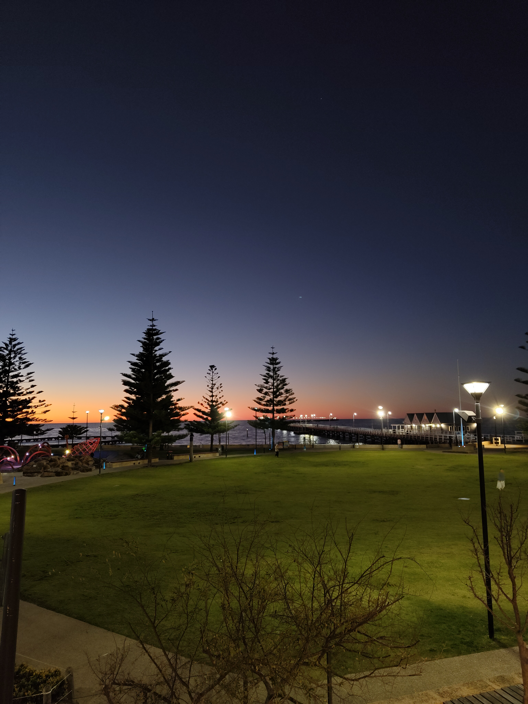
  <p class="media-caption">The first evening in Busselton — the bay doing exactly what it promised.</p>
</div>

::: {.prose}

The surrounding region filled the rest of the days. Yallingup, with its rugged surf breaks and the strange, beautiful rock formations at Canal Rocks. Cape Naturaliste Lighthouse at the tip of the peninsula, looking out at open ocean. A slow drive through Cowaramup — Margaret River wine country, boutique everything — and down into Mammoth Cave, where the limestone formations have been forming for longer than humans have existed. One afternoon, out on the water, we spotted dolphins and what looked like whales moving in the distance. No one got a photo that did it justice.

:::

<div style="display: grid; grid-template-columns: 1fr 1fr; gap: 1rem; margin: 2rem 0;">
  <figure style="margin: 0;">
    
    <figcaption class="media-caption">The Yallingup coast — rugged, windswept, and worth every kilometre of the drive.</figcaption>
  </figure>
  <figure style="margin: 0;">
    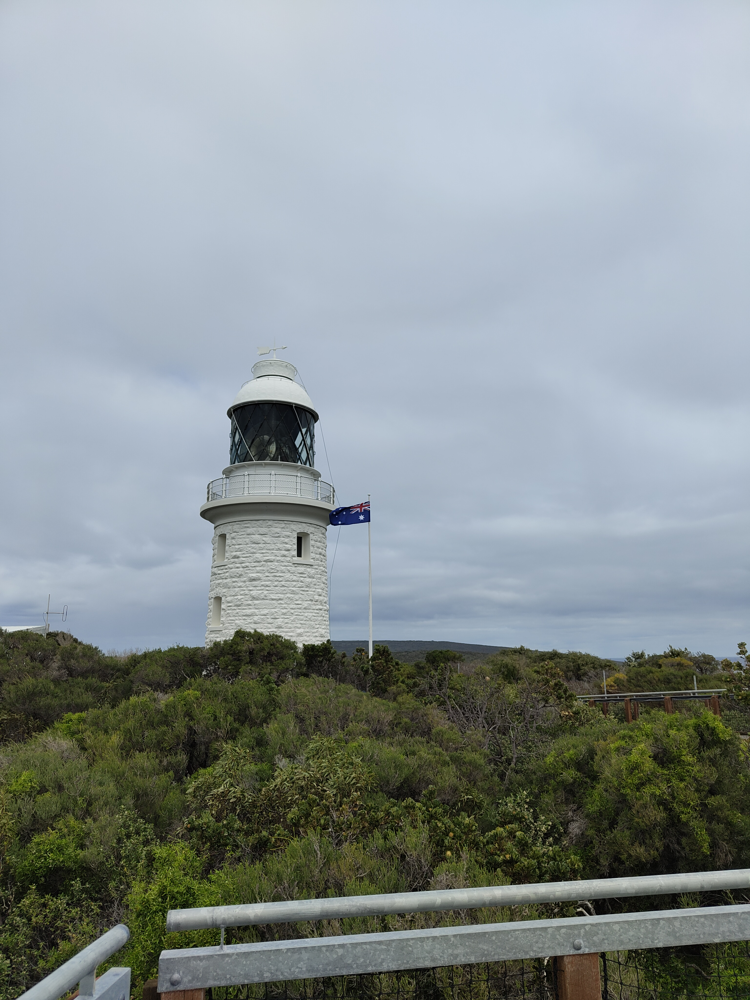
    <figcaption class="media-caption">Cape Naturaliste Lighthouse — looking out over open ocean at the tip of the peninsula.</figcaption>
  </figure>
</div>

<div class="media-block">
  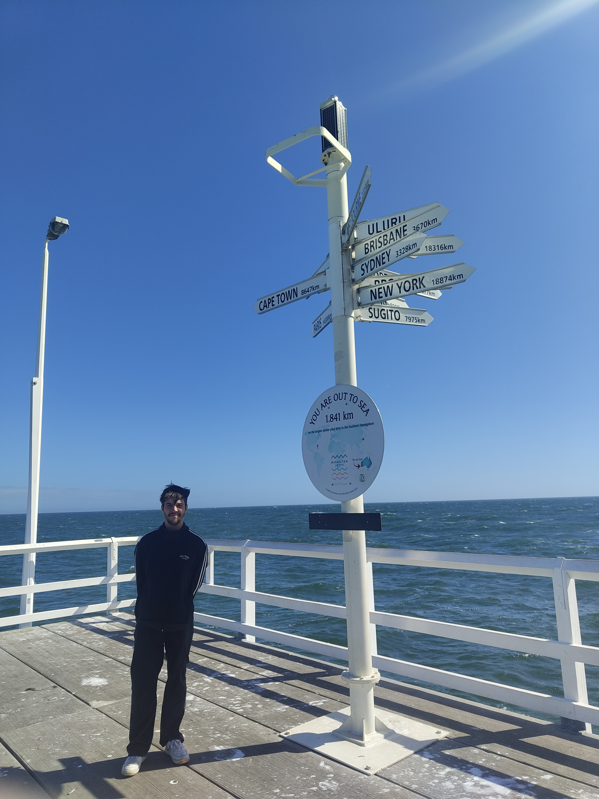
  <p class="media-caption">The Busselton Jetty — the longest wooden jetty in the Southern Hemisphere.</p>
</div>

<div style="display: grid; grid-template-columns: 1fr 1fr; gap: 1rem; margin: 2rem 0;">
  <figure style="margin: 0;">
    
    <figcaption class="media-caption">Geographe Bay.</figcaption>
  </figure>
  <figure style="margin: 0;">
    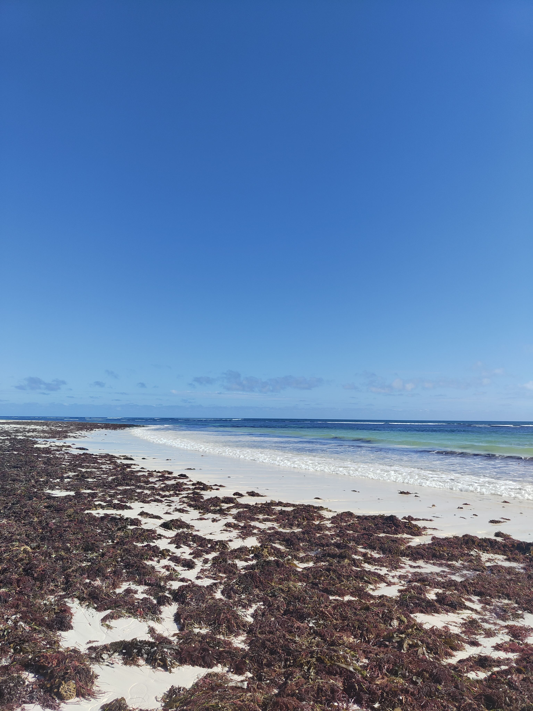
    <figcaption class="media-caption">Morning at the beach.</figcaption>
  </figure>
</div>

<div class="pull-quote">
  "The sky would shift from blue to pink to a deep purple without any urgency."
</div>

::: {.prose}

Perth — A City That Does Things Its Own Way {#perth}

Perth is one of the most isolated cities on earth — closer to Bali than it is to Sydney, and over 2,100 kilometres from its nearest comparable city. That should produce somewhere with a complex about it. Instead, Perth is one of the most self-assured cities I've visited: built on its own terms, answerable to no one, quietly excellent about most things.

The week started with a road trip north to the Pinnacles — hundreds of limestone columns rising out of the desert floor in Nambung National Park, a genuinely alien landscape that was my first real taste of the outback. The drive up was memorable for other reasons too: kangaroos dead on the roadside, every few kilometres, a reminder that the wildlife here is on a different scale entirely. We stopped at Lancelin on the way — a small coastal town with beaches and towering white sand dunes that people sandboard down in the afternoon heat.

:::

<div style="display: grid; grid-template-columns: 1fr 1fr 1fr; gap: 1rem; margin: 2rem 0;">
  <figure style="margin: 0;">
    
    <figcaption class="media-caption">The road north — wildlife warning signs every few kilometres.</figcaption>
  </figure>
  <figure style="margin: 0;">
    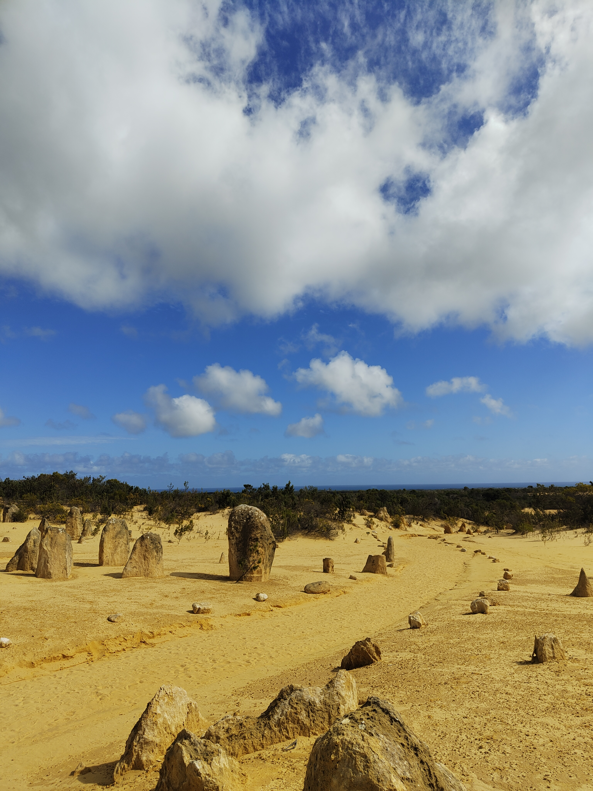
    <figcaption class="media-caption">The Pinnacles — limestone columns rising from the desert floor.</figcaption>
  </figure>
  <figure style="margin: 0;">
    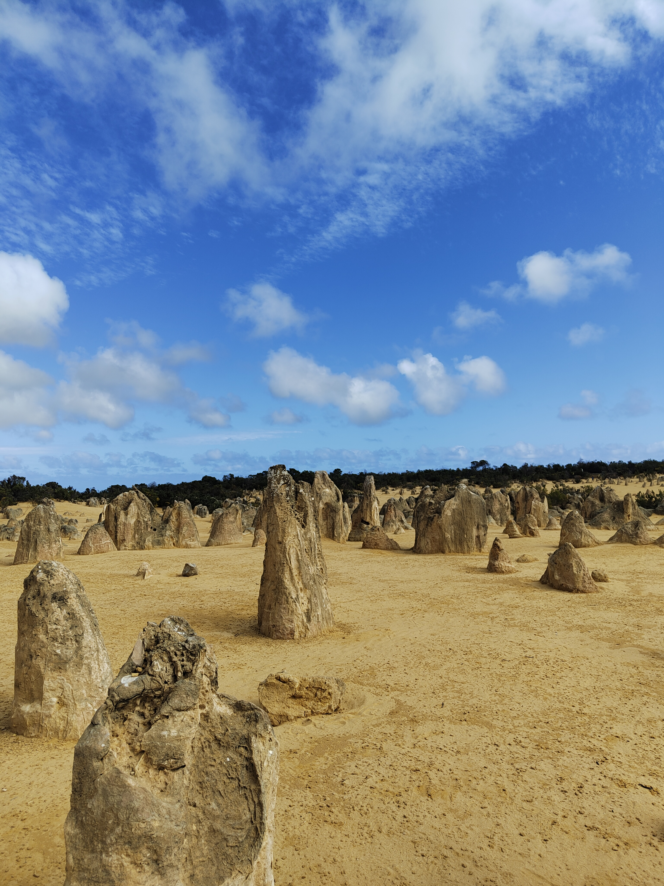
    <figcaption class="media-caption">Nambung National Park — a genuinely alien landscape.</figcaption>
  </figure>
</div>

<div style="display: grid; grid-template-columns: 1fr 1fr; gap: 1rem; margin: 2rem 0;">
  <figure style="margin: 0;">
    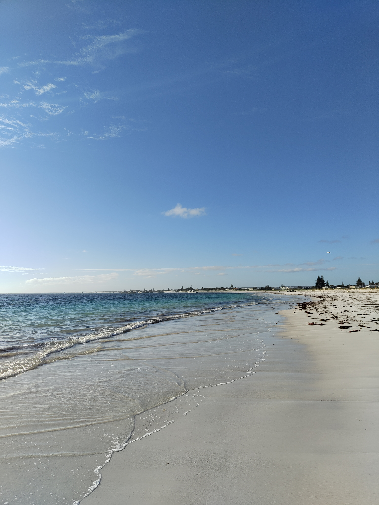
    <figcaption class="media-caption">Lancelin — white dunes and a quiet stretch of coast on the way back.</figcaption>
  </figure>
  <figure style="margin: 0;">
    
    <figcaption class="media-caption">The coast near Nambung — empty beaches that go on further than seems reasonable.</figcaption>
  </figure>
</div>

::: {.prose}

Back in the city, a day trip to Fremantle: the old prison (a heritage site and slightly unsettling to walk around), the markets, and Little Creatures Brewery down by the harbour. Fremantle has its own energy, rougher and saltier than central Perth, and is worth the twenty-minute train from the city.

:::

<div class="media-block">
  
  <p class="media-caption">Fremantle Prison — heritage-listed and slightly unsettling to walk around.</p>
</div>

::: {.prose}

Caversham Wildlife Park gave me everything I'd hoped Australia would deliver — wombats, koalas, emus, and kangaroos that wander freely and will eat pellets from your hand without much ceremony. The Perth Mint was a different kind of education: Western Australia produces a significant portion of the world's gold, and the mint puts that into striking context. One evening, I found Australian-brewed Guinness on tap. It tasted better than it had any right to.

:::

<div style="display: grid; grid-template-columns: 1fr 1fr; gap: 1rem; margin: 2rem 0;">
  <figure style="margin: 0;">
    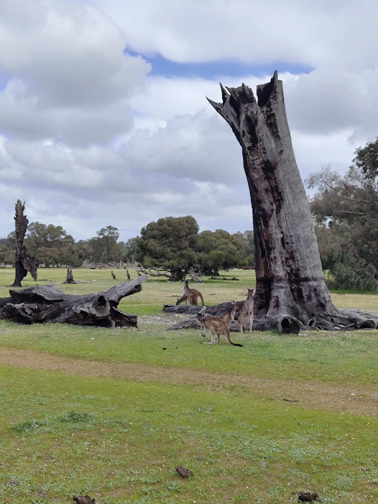
    <figcaption class="media-caption">Caversham Wildlife Park — kangaroos that have no particular interest in being impressed by you.</figcaption>
  </figure>
  <figure style="margin: 0;">
    
    <figcaption class="media-caption">Hand-feeding a kangaroo — no ceremony required.</figcaption>
  </figure>
</div>

::: {.prose}

The city itself — Kings Park overlooking the Swan River, Cottesloe Beach in the afternoon light, the café strips that overshoot most Australian cities twice their size — is easy to spend time in. Perth doesn't perform for visitors. It just gets on with it, and you're welcome to join.

:::

<div class="media-block">
  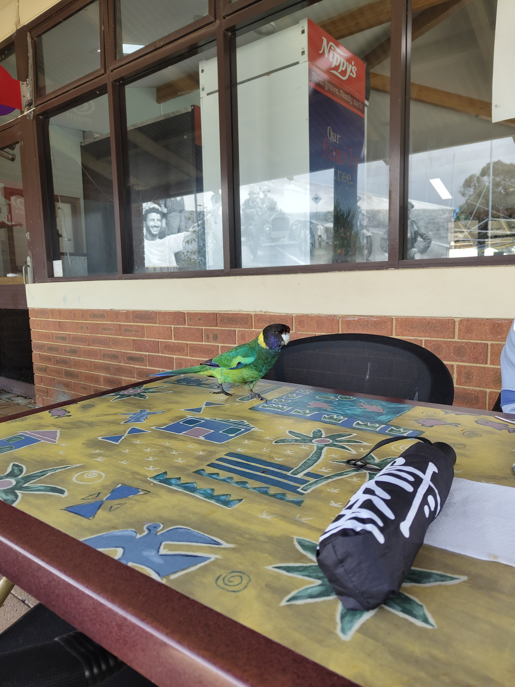
  <p class="media-caption">The wildlife isn't only in the parks.</p>
</div>

<hr class="section-divider">

::: {.prose}

Sydney — The One That Needs No Introduction {#sydney}

Flying east across the continent takes about five hours. Below: red earth, ancient desert, the occasional road going nowhere in particular. Sydney announces itself before you land — the harbour catching the light from the air, the Opera House unmistakable even at altitude.

It's a city that knows it's beautiful, and doesn't apologise for it. The best way to understand how it fits together is to get on a ferry. The Manly Ferry is the classic — half an hour across the harbour from Circular Quay, the Bridge slowly shrinking behind you as the Pacific opens up ahead. Manly Beach itself is something else: the waves there are on a different scale to anything I'd seen before, sets rolling in with a weight and consistency that made it hard to look away. I could have stayed on that beach for a full day.

:::

<div class="media-block" style="margin: 2rem 0;">
  <video autoplay muted loop playsinline
         style="width: 100%; max-height: 560px; object-fit: cover; border-radius: 6px; display: block;">
    <source src="https://github.com/martinas-jucysbrady/martinas-jucysbrady.github.io/releases/download/v1.0-media/sydney_manlyferry.mp4" type="video/mp4" />
  </video>
  <p class="media-caption">The Manly Ferry crossing — the Bridge and Opera House shrinking behind you as the Pacific opens up ahead.</p>
</div>

::: {.prose}

The Opera House and Harbour Bridge are as iconic in person as advertised, though what surprised me more was the Australian Museum — genuinely world-class natural history, with an Indigenous Australia collection that reframes a lot of what you think you understand about the country. Taronga Zoo sits on the north shore with a backdrop of the harbour that feels slightly unfair on every other zoo in the world. SEA LIFE Sydney Aquarium, down at Darling Harbour, has a shark tunnel that takes a moment to fully process.

The Sydney Tower Eye at sunset is the standard tourist tick — and rightly so. The city laid out below in that light, harbour to the north, suburbs sprawling in every direction, is one of those views that earns its reputation without effort. Afterwards: a chicken parmigiana at a local pub. Essential. Non-negotiable. Possibly the best thing I ate in Australia.

Paddy's Markets in Haymarket is a good hour of browsing if you need to bring something home — produce, clothes, souvenirs, everything slightly chaotic in a satisfying way.

:::

<div style="display: grid; grid-template-columns: 1fr 1fr 1fr; gap: 1rem; margin: 2rem 0;">
  <figure style="margin: 0;">
    
    <figcaption class="media-caption">The Opera House — unmistakable from the air, still somehow better in person.</figcaption>
  </figure>
  <figure style="margin: 0;">
    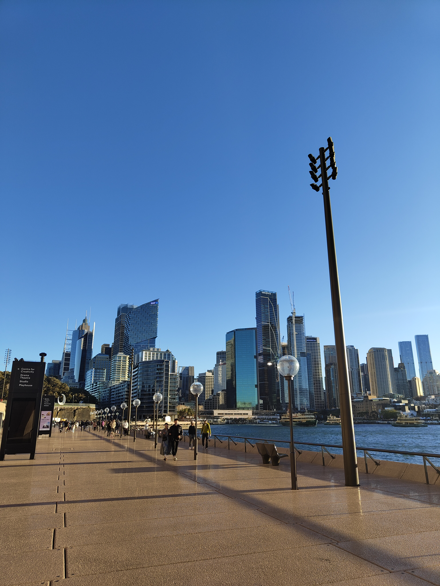
    <figcaption class="media-caption">Sydney from below — the city built on its own terms.</figcaption>
  </figure>
  <figure style="margin: 0;">
    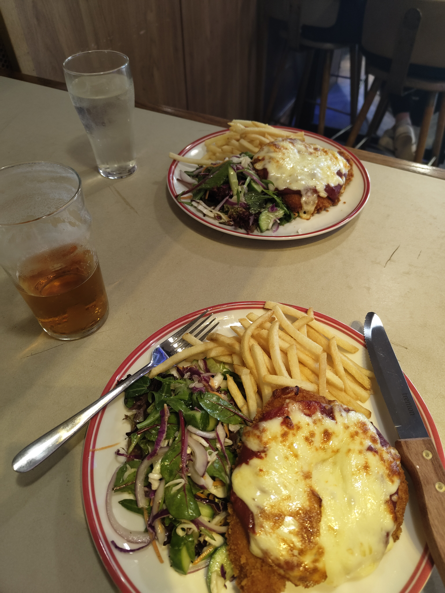
    <figcaption class="media-caption">The chicken parmigiana. Essential. Non-negotiable.</figcaption>
  </figure>
</div>

::: {.prose}

Bondi is exactly what it promises: busy, sun-drenched, and full of people who seem to have quietly figured something out. The coastal walk south to Coogee is one of the best urban walks anywhere — clifftops, sea pools, ocean in every direction. We also spent a day at Cronulla, which is quieter and worth the train south from the city for an afternoon that feels more local.

:::

<div class="media-block">
  
  <p class="media-caption">Cronulla at sunset — quieter, more local, worth the train south.</p>
</div>

<div class="media-block" style="margin: 2rem 0;">
  <video autoplay muted loop playsinline
         style="width: 100%; max-height: 560px; object-fit: cover; border-radius: 6px; display: block;">
    <source src="https://github.com/martinas-jucysbrady/martinas-jucysbrady.github.io/releases/download/v1.0-media/sydney_bondi.mp4" type="video/mp4" />
  </video>
  <p class="media-caption">Bondi — the waves on a different scale to anything I'd seen before.</p>
</div>

::: {.prose}

The Blue Mountains are a couple of hours west and feel like a completely different world. The Three Sisters at Echo Point look like a screensaver until you're standing in front of them and realise they're just genuinely, absurdly real — a sandstone escarpment falling away into a valley that seems to have no floor. Go early before the tour buses arrive.

:::

<div style="display: grid; grid-template-columns: 1fr 1fr; gap: 1rem; margin: 2rem 0;">
  <figure style="margin: 0;">
    
    <figcaption class="media-caption">The Three Sisters — a sandstone escarpment falling into a valley that seems to have no floor.</figcaption>
  </figure>
  <figure style="margin: 0;">
    
    <figcaption class="media-caption">The sky on the way back from the mountains — the trip's last good light.</figcaption>
  </figure>
</div>

<div class="pull-quote">
  "A city that knows it is beautiful and doesn't apologise for it."
</div>

<hr class="section-divider">
::: {.prose}

Three weeks is not enough. Australia is the kind of place where you spend the whole trip recalibrating — your sense of distance, of scale, of how much sky is normal. The distances between places are genuinely vast. The nature is genuinely wild. The people are genuinely relaxed about both.

What surprised me most, moving between two opposite coasts of the same country, was how little they felt like the same country. Busselton and Sydney might as well be different worlds. The west is wide open and unhurried, the east is confident and turned outward. Both unmistakably Australian in ways that are hard to explain until you've been to both.

I'll go back. There's too much left: the Outback, Uluru, Queensland, Tasmania. Australia rewards return visits, and I already know I owe it more than three weeks.

:::

<div class="media-block">
  
  <p class="media-caption">Somewhere between Busselton and everything else.</p>
</div>