```{=html}
<style>
  .trip-header {
    text-align: center;
    padding: 60px 20px 40px;
    max-width: 860px;
    margin: 0 auto;
  }
  .trip-label {
    font-size: 0.75rem;
    letter-spacing: 0.2em;
    text-transform: uppercase;
    color: #9b8877;
    margin-bottom: 8px;
  }
  .trip-title {
    font-family: 'Plus Jakarta Sans', sans-serif;
    font-size: 2.6rem;
    font-weight: 800;
    color: #1E4264;
    margin: 0 0 12px;
    line-height: 1.1;
  }
  .trip-subtitle {
    font-family: 'Cormorant Garamond', serif;
    font-style: italic;
    font-size: 1.2rem;
    color: #6b7280;
    margin-bottom: 24px;
  }
  .trip-meta {
    display: flex;
    gap: 24px;
    justify-content: center;
    font-size: 0.8rem;
    color: #9b8877;
    letter-spacing: 0.06em;
    text-transform: uppercase;
    flex-wrap: wrap;
  }
  .section-divider {
    border: none;
    border-top: 1px solid #e0e0f0;
    margin: 48px auto;
    max-width: 600px;
  }
  .prose {
    max-width: 720px;
    margin: 0 auto;
    font-size: 1.05rem;
    line-height: 1.85;
    color: #2d3748;
  }
  .prose h2 {
    font-family: 'Plus Jakarta Sans', sans-serif;
    font-weight: 800;
    font-size: 1.6rem;
    color: #1E4264;
    margin-top: 56px;
    margin-bottom: 12px;
    text-align: center;
  }
  .prose p {
    margin-bottom: 1.4rem;
  }
  .media-block {
    max-width: 860px;
    margin: 32px auto;
    border-radius: 14px;
    overflow: hidden;
    box-shadow: 0 4px 24px rgba(0,0,0,0.10);
  }
  .media-block img,
  .media-block video {
    width: 100%;
    display: block;
    object-fit: cover;
  }
  .media-caption {
    font-family: 'Cormorant Garamond', serif;
    font-style: italic;
    font-size: 0.9rem;
    color: #9b8877;
    text-align: center;
    margin-top: 10px;
    padding: 0 12px 4px;
  }
  .pull-quote {
    font-family: 'Cormorant Garamond', serif;
    font-style: italic;
    font-size: 1.55rem;
    font-weight: 600;
    color: #1E4264;
    text-align: center;
    max-width: 640px;
    margin: 48px auto;
    line-height: 1.5;
    padding: 0 24px;
    border-left: 3px solid #c9aa96;
  }

  #quarto-document-content {
    display: flex;
    flex-direction: column;
    align-items: center;
  }

  #quarto-document-content > * {
    width: 100%;
    max-width: 860px;
  }
</style>

<div class="trip-header">
  <p class="trip-label">🗻 Travel</p>
  <h1 class="trip-title">Chubu</h1>
  <p class="trip-subtitle">Central Japan — mountains, temples, snow, and Fuji</p>
  <div class="trip-meta">
    <span>2024 – 2025</span>
    <span>📍 Chubu Region, Japan</span>
  </div>
</div>

<hr class="section-divider">
```

<div id="fukui"></div>
::: {.prose}

## Fukui — The Most Amazing Temple

The Echizen Daibutsu is the most impressive temple I've been to in Japan. That's a high bar and it clears it comfortably. The scale is immense — a vast complex in the mountains of Fukui Prefecture, the main hall housing a colossal golden Buddha surrounded on every wall by hundreds of smaller statues arranged in rows that disappear into the upper reaches of the building. In January, with snow covering the pagoda and the surrounding landscape, the whole complex is something that takes a moment to fully accept.

The ramen in Katsuyama nearby rounds out a prefecture that most people drive past without stopping. Stop.

:::

<div class="media-block" style="margin: 2rem 0;">
  <video autoplay muted loop playsinline
         style="width: 100%; max-height: 580px; object-fit: cover; object-position: center; border-radius: 6px; display: block;">
    <source src="https://github.com/martinas-jucysbrady/martinas-jucysbrady.github.io/releases/download/v1.0-media/fukui_buddha.mp4" type="video/mp4" />
  </video>
  <p class="media-caption">Echizen Daibutsu — a panorama inside the most impressive temple I've been to in Japan.</p>
</div>

<div style="display: grid; grid-template-columns: 1fr 1fr; gap: 1rem; margin: 2rem 0;">
  <figure style="margin: 0;">
    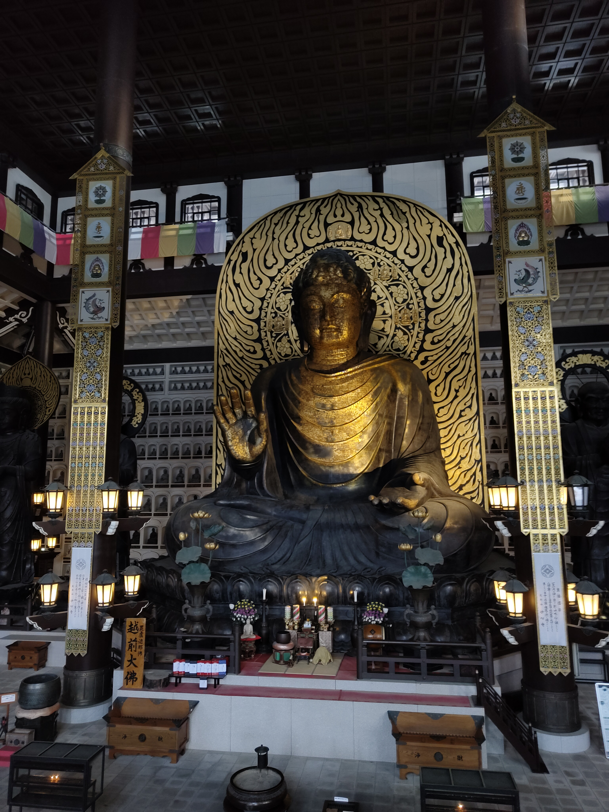
    <figcaption class="media-caption">The main Buddha — the scale of it only makes sense once you're inside.</figcaption>
  </figure>
  <figure style="margin: 0;">
    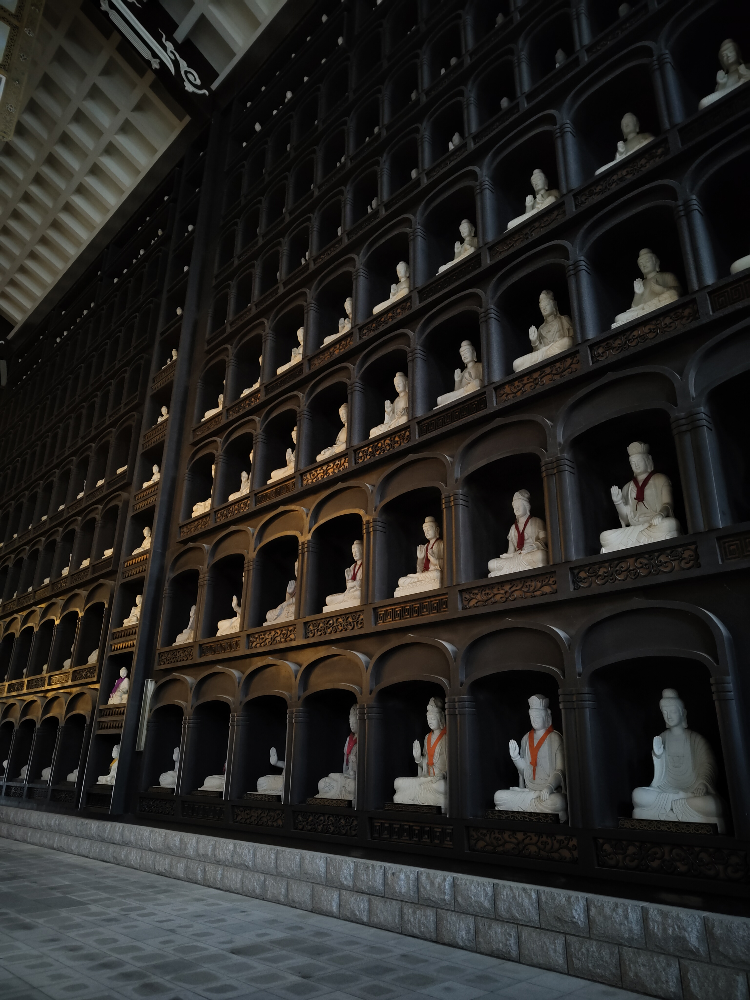
    <figcaption class="media-caption">The walls — hundreds of statues disappearing into the upper reaches of the hall.</figcaption>
  </figure>
</div>

<div style="display: grid; grid-template-columns: 1fr 1fr; gap: 1rem; margin: 2rem 0;">
  <figure style="margin: 0;">
    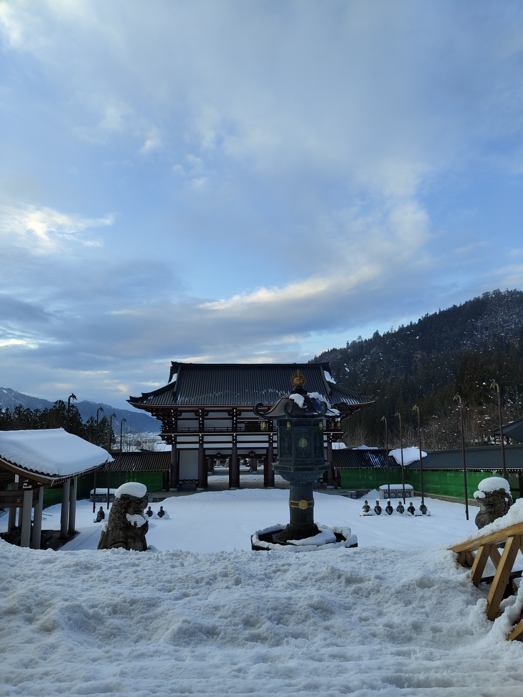
    <figcaption class="media-caption">Snow inside the temple complex — January making it something else entirely.</figcaption>
  </figure>
  <figure style="margin: 0;">
    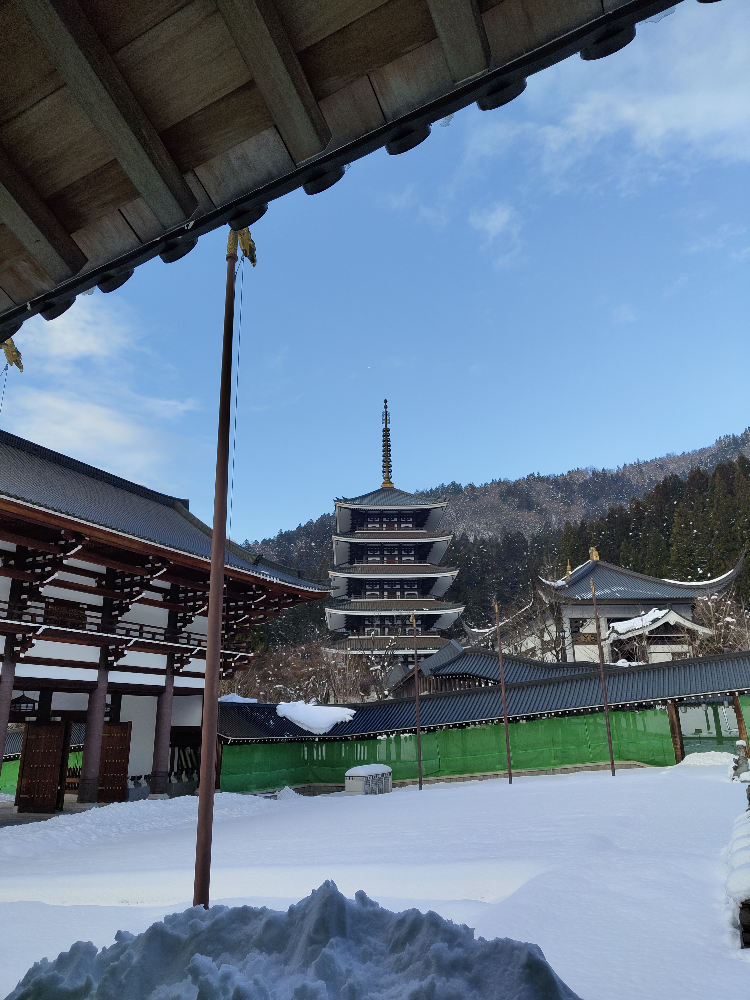
    <figcaption class="media-caption">The pagoda under snow — the landscape framing it perfectly.</figcaption>
  </figure>
</div>

<div class="media-block">
  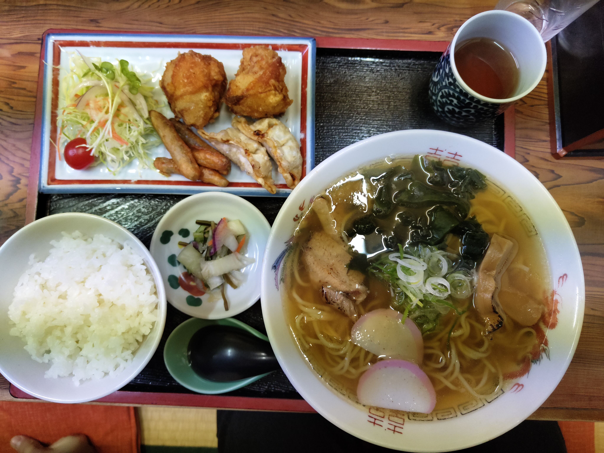
  <p class="media-caption">Ramen in Katsuyama — the right way to end a day in Fukui.</p>
</div>

<hr class="section-divider">

<div id="ishikawa"></div>
::: {.prose}

## Ishikawa — Gardens and Castles in Winter

Kenrokuen in winter is one of the prettier garden experiences in Japan. The garden is considered one of the three great gardens of Japan and in winter the snow-covered branches, the lanterns, and the still ponds produce a scene that photographs reasonably and looks considerably better in person. Cape Kasa is magnificent in daylight and takes on a different quality at night — spooky in the way that remote coastal headlands do when the light goes.

Kanazawa Castle is large, well-maintained, and the views over the city from the grounds are worth the walk. Kanazawa as a city has more to it than most visitors realise — spend longer here.

:::

<div style="display: grid; grid-template-columns: 1fr 1fr; gap: 1rem; margin: 2rem 0;">
  <figure style="margin: 0;">
    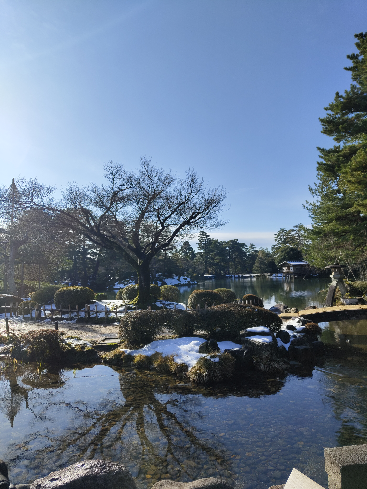
    <figcaption class="media-caption">Kenrokuen in winter — one of the three great gardens of Japan, earning the description.</figcaption>
  </figure>
  <figure style="margin: 0;">
    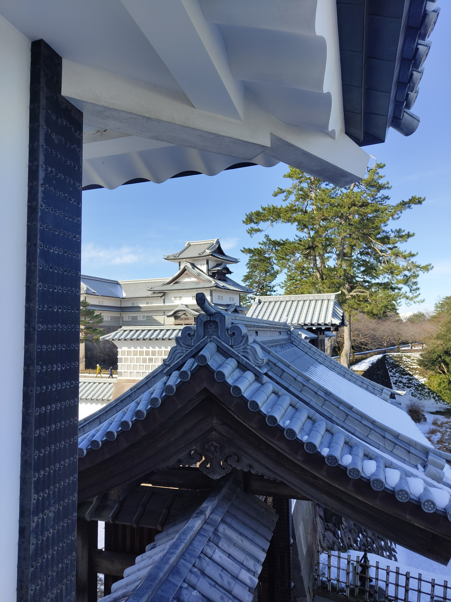
    <figcaption class="media-caption">Kanazawa Castle — large, well-maintained, the city below it.</figcaption>
  </figure>
</div>

<hr class="section-divider">

<div id="gifu"></div>
::: {.prose}

## Gifu — Shirakawa-go Under Snow

Shirakawa-go is a UNESCO World Heritage village in a mountain valley, and in January under heavy snow it looks like somewhere that was imagined before it was built. The gassho-zukuri farmhouses — steeply thatched roofs designed to shed the enormous snowfall this valley receives — have been standing for centuries, and the view from the hillside above the village takes in the whole preserved settlement against a backdrop of snow-covered mountains and forest. It is one of the better views in Japan and one that rewards arriving early before the tour buses.

:::

<div class="media-block" style="margin: 2rem 0;">
  <video autoplay muted loop playsinline
         style="width: 100%; max-height: 580px; object-fit: cover; object-position: center; border-radius: 6px; display: block;">
    <source src="https://github.com/martinas-jucysbrady/martinas-jucysbrady.github.io/releases/download/v1.0-media/gifu_snow.mp4" type="video/mp4" />
  </video>
  <p class="media-caption">Shirakawa-go — the mountains and forest under snow, a panorama from the valley.</p>
</div>

<div style="display: grid; grid-template-columns: 1fr 1fr; gap: 1rem; margin: 2rem 0;">
  <figure style="margin: 0;">
    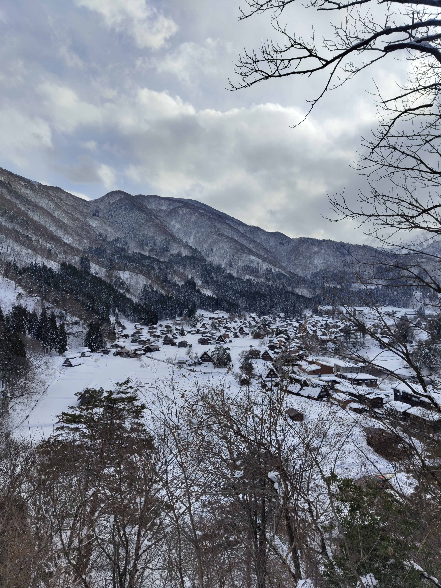
    <figcaption class="media-caption">Shirakawa-go from the viewpoint — the whole village laid out against the mountains.</figcaption>
  </figure>
  <figure style="margin: 0;">
    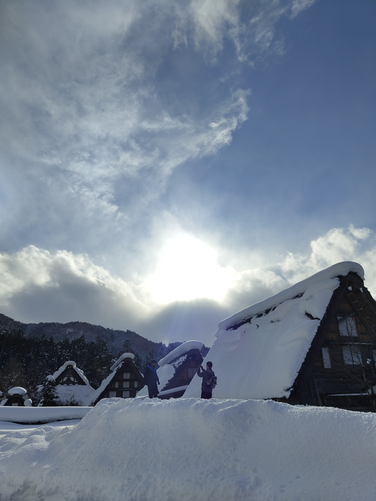
    <figcaption class="media-caption">The gassho-zukuri farmhouses under snow — centuries old, built for exactly this weather.</figcaption>
  </figure>
</div>

<div class="pull-quote">
  "It looks like somewhere that was imagined before it was built."
</div>

<hr class="section-divider">

<div id="mie"></div>
::: {.prose}

## Mie — Light Festivals, Ancient Streets, and Formula One

Nabano no Sato is one of Japan's best winter illumination events — a garden transformed into a landscape of light for the season, with tunnels of LED illuminations and set pieces that include a full recreation of Mount Fuji in lights. The scale and quality of the illuminations is extraordinary and the experience of walking through the tunnel in particular is mesmerising.

Seki post town is a beautifully preserved Edo-era post town on the old Tokaido road — the ancient streets intact and quiet in a way that the more famous post towns aren't.

The Suzuka Formula 1 Grand Prix in April was another exceptional experience. Suzuka is one of the great circuits — the figure-of-eight layout, the quality of the racing, the organisation, the price point relative to other grands prix. Cherry blossoms everywhere throughout the weekend. Max Verstappen winning. Walking the track after the race. Everything in order.

:::

<div style="display: grid; grid-template-columns: 1fr 1fr; gap: 1rem; margin: 2rem 0;">
  <figure style="margin: 0;">
    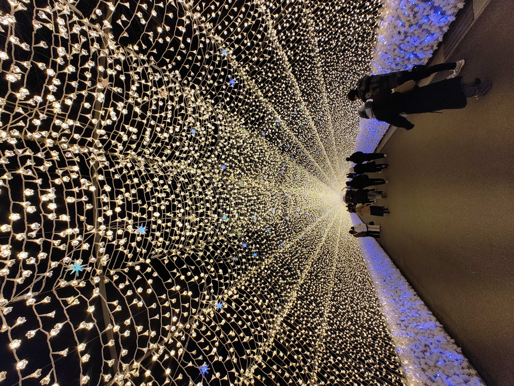
    <figcaption class="media-caption">The light tunnel at Nabano no Sato — mesmerising to walk through.</figcaption>
  </figure>
  <figure style="margin: 0;">
    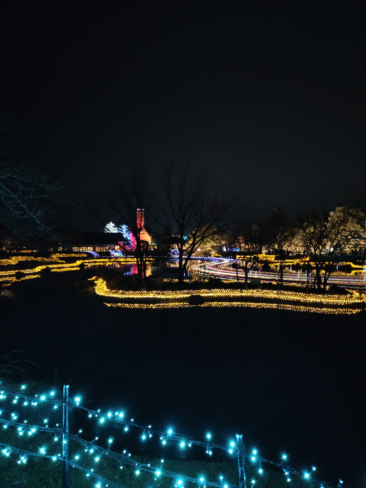
    <figcaption class="media-caption">The garden illuminations — scale and quality that earns the visit.</figcaption>
  </figure>
</div>

<div class="media-block" style="margin: 2rem 0;">
  <video autoplay muted loop playsinline
         style="width: 100%; max-height: 580px; object-fit: cover; object-position: center; border-radius: 6px; display: block;">
    <source src="https://github.com/martinas-jucysbrady/martinas-jucysbrady.github.io/releases/download/v1.0-media/mie_lights3.mp4" type="video/mp4" />
  </video>
  <p class="media-caption">Mt. Fuji in lights — the Nabano no Sato centrepiece being illuminated.</p>
</div>

<div class="media-block">
  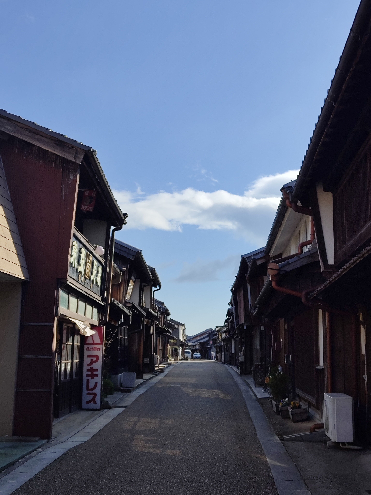
  <p class="media-caption">Seki post town — Edo-era streets preserved and quiet, the Tokaido road still running through it.</p>
</div>

<div class="media-block" style="margin: 2rem 0; position: relative; cursor: pointer;">
  <video id="suzuka-video" loop playsinline
         style="width: 100%; max-height: 560px; object-fit: cover; object-position: center; border-radius: 6px; display: block;">
    <source src="https://github.com/martinas-jucysbrady/martinas-jucysbrady.github.io/releases/download/v1.0-media/mie_suzuka1.mp4" type="video/mp4" />
  </video>
  <div id="suzuka-icon" style="position: absolute; bottom: 12px; right: 12px; background: rgba(0,0,0,0.5); border-radius: 50%; width: 36px; height: 36px; display: flex; align-items: center; justify-content: center; pointer-events: none;">
    🔊
  </div>
  <p class="media-caption">Suzuka — the Formula 1 cars through the bend, the sound arriving before they do.</p>
</div>

<script>
  const vid = document.getElementById('suzuka-video');
  const icon = document.getElementById('suzuka-icon');
  vid.play();
  vid.addEventListener('click', () => {
    vid.muted = !vid.muted;
    icon.textContent = vid.muted ? '🔇' : '🔊';
  });
</script>

<div style="display: grid; grid-template-columns: 1fr 1fr; gap: 1rem; margin: 2rem 0;">
  <figure style="margin: 0;">
    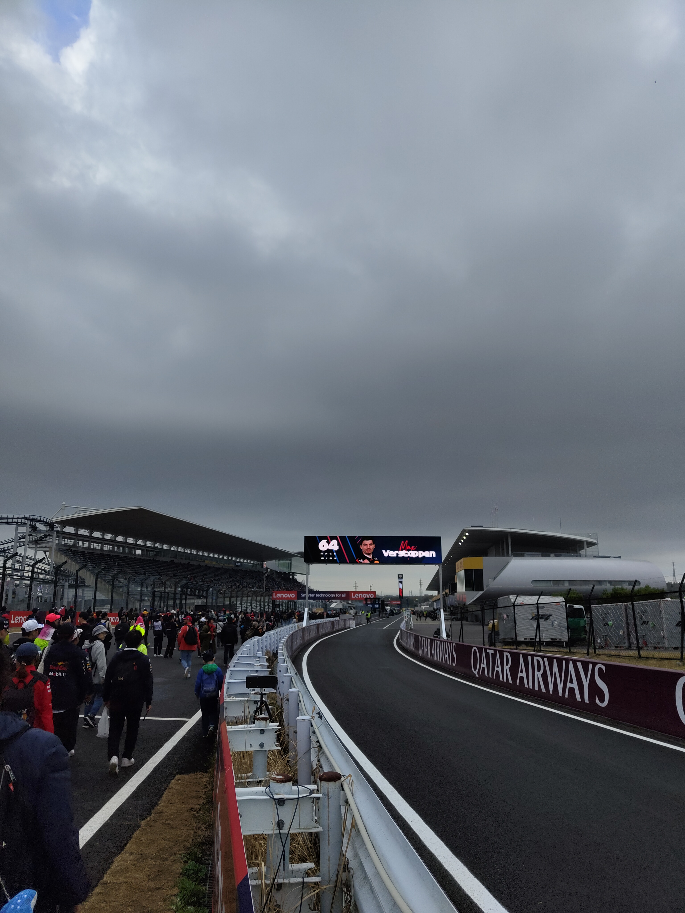
    <figcaption class="media-caption">Walking the track after the race — narrower on foot than it looks on television.</figcaption>
  </figure>
  <figure style="margin: 0;">
    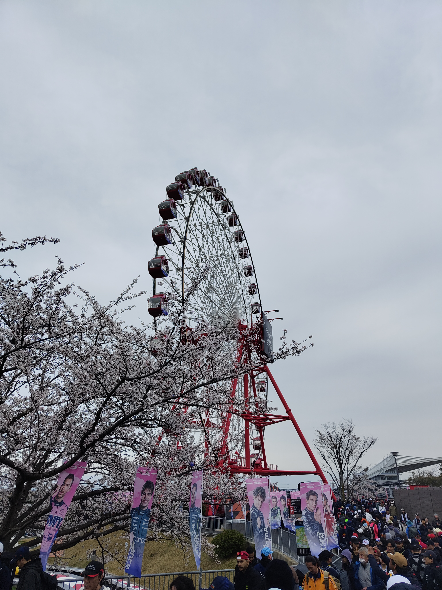
    <figcaption class="media-caption">Cherry blossoms at Suzuka — the whole weekend in one image.</figcaption>
  </figure>
</div>

<hr class="section-divider">

<div id="aichi"></div>
::: {.prose}

## Aichi — Nagoya Castle and the Jellyfish

Nagoya is a business city and presents itself accordingly — grey, functional, the infrastructure of a major industrial hub. The castle is the exception that makes the visit worthwhile. Nagoya Castle is genuinely beautiful — the main keep reconstructed in its original form, the surrounding grounds large and well-maintained, the trees around it providing the contrast the architecture needs.

The Nagoya Aquarium has one of the better jellyfish displays in Japan, which is a competitive category. Illuminated and flowing, it is the kind of exhibit you stand in front of longer than any other.

:::

<div style="display: grid; grid-template-columns: 1fr 1fr; gap: 1rem; margin: 2rem 0;">
  <figure style="margin: 0;">
    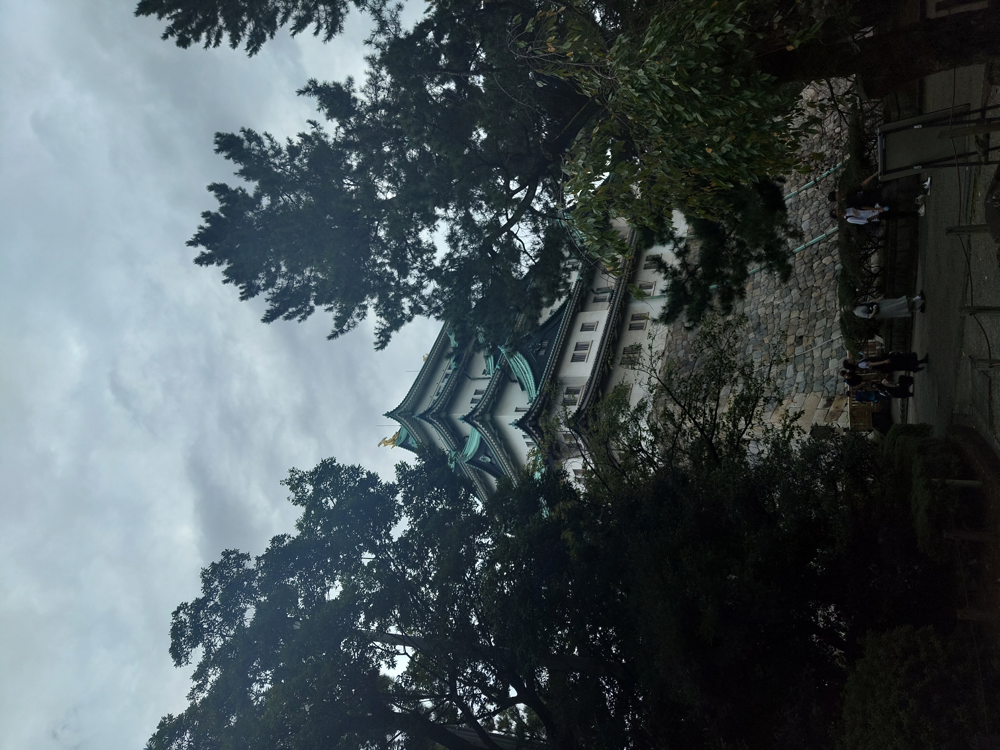
    <figcaption class="media-caption">Nagoya Castle — the exception that makes the city worth the visit.</figcaption>
  </figure>
  <figure style="margin: 0;">
    <video autoplay muted loop playsinline
           style="width: 100%; height: 480px; object-fit: cover; border-radius: 6px; display: block;">
      <source src="https://github.com/martinas-jucysbrady/martinas-jucysbrady.github.io/releases/download/v1.0-media/aichi_jelly.mp4" type="video/mp4" />
    </video>
    <figcaption class="media-caption">The jellyfish display — illuminated, flowing, impossible to walk past quickly.</figcaption>
  </figure>
</div>

<hr class="section-divider">

<div id="nagano"></div>
::: {.prose}

## Nagano — Snow Monkeys and Mountain Castles

Nagano in December delivers on every front. Matsumoto Castle is one of the best-preserved original castles in Japan — the black exterior, the heavy timber construction, the moat around it — and it earns its reputation as one of the most beautiful. Ueda Castle ruins illuminated at night are impressive in a completely different register, the stone walls lit against the winter sky. Matsushiro Castle ruins are older and untouched by restoration, the stones worn and the site quiet.

The Hokusai Museum in Obuse holds the largest collection of Katsushika Hokusai's work outside of Tokyo — the Great Wave prints in their original context, the scale of the artistic output of a single life made apparent. Worth the detour.

The snow monkeys are the reason most people come to Nagano and they deliver completely. The walk to Jigokudani Yaen-koen through a snow-filled forest in the morning, the macaques soaking in the natural hot spring pool as the steam rises around them — warm, entirely unbothered, the forest quiet except for the sound of the water. The car covered in snow that morning was the preview.

:::

<div class="media-block" style="margin: 2rem 0;">
  <video autoplay muted loop playsinline
         style="width: 100%; max-height: 520px; object-fit: cover; object-position: center; border-radius: 6px; display: block;">
    <source src="https://github.com/martinas-jucysbrady/martinas-jucysbrady.github.io/releases/download/v1.0-media/nagano_snow.mp4" type="video/mp4" />
  </video>
  <p class="media-caption">Walking to the snow monkeys — through the forest, the snow deep on both sides.</p>
</div>

<div style="display: grid; grid-template-columns: 1fr 1fr; gap: 1rem; margin: 2rem 0;">
  <figure style="margin: 0;">
    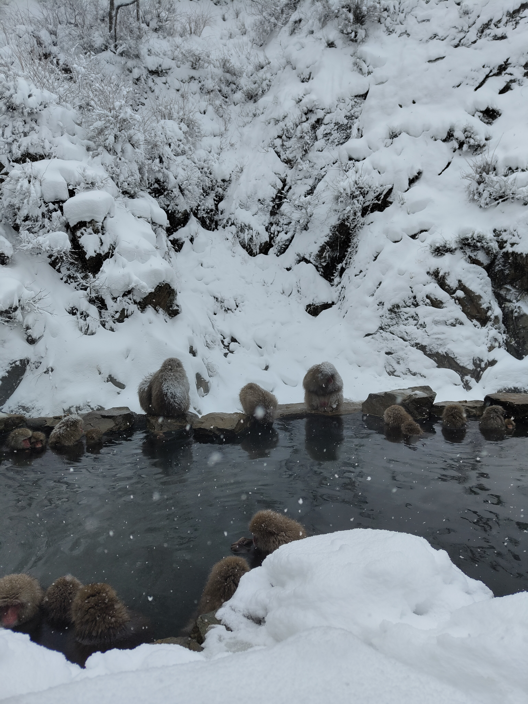
    <figcaption class="media-caption">The snow monkeys — warm in the hot spring, entirely unbothered.</figcaption>
  </figure>
  <figure style="margin: 0;">
    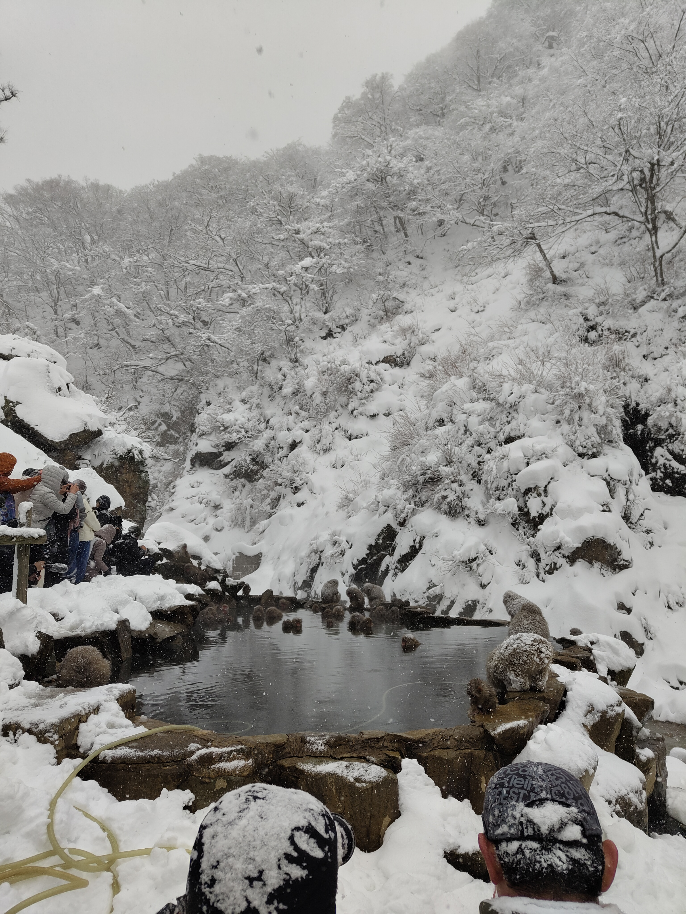
    <figcaption class="media-caption">The steam rising, the forest quiet — the monkeys making the most of it.</figcaption>
  </figure>
</div>

<div style="display: grid; grid-template-columns: 1fr 1fr; gap: 1rem; margin: 2rem 0;">
  <figure style="margin: 0;">
    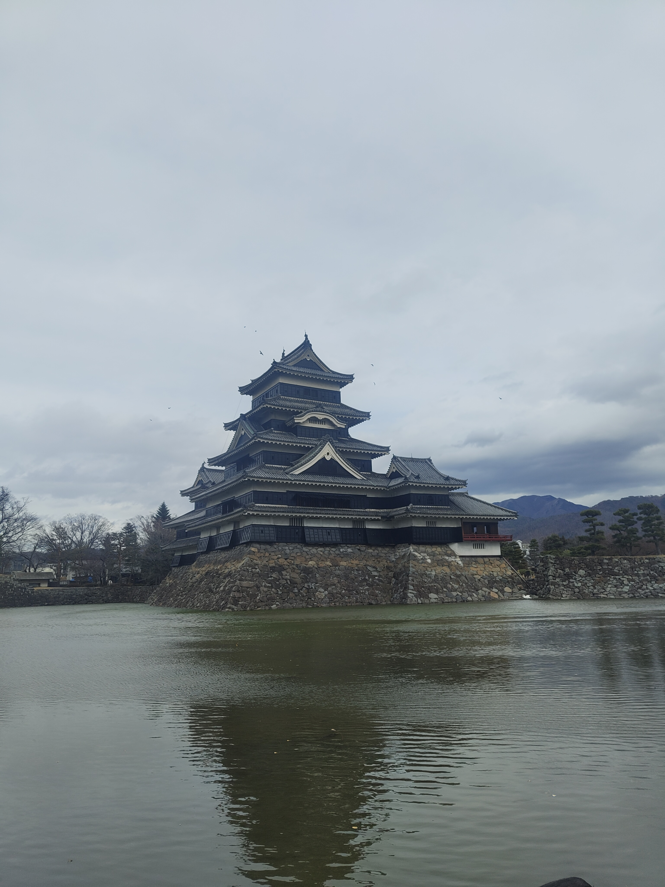
    <figcaption class="media-caption">Matsumoto Castle — black exterior, timber construction, the moat frozen in December.</figcaption>
  </figure>
  <figure style="margin: 0;">
    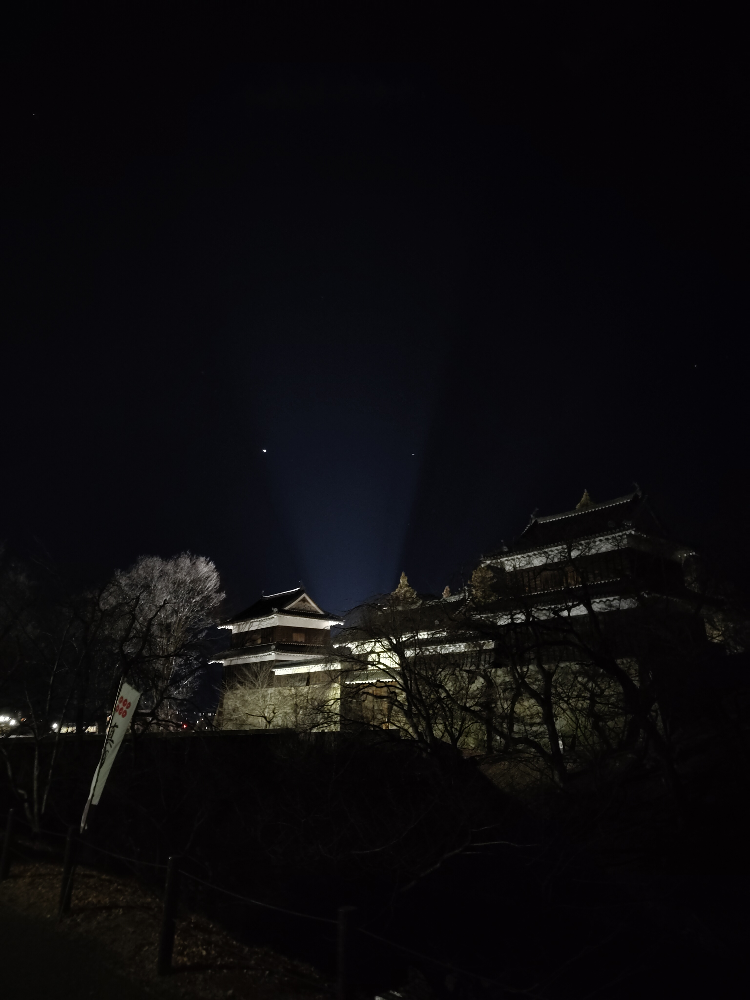
    <figcaption class="media-caption">Ueda Castle at night — the stone walls lit against the winter sky.</figcaption>
  </figure>
</div>

<div style="display: grid; grid-template-columns: 1fr 1fr; gap: 1rem; margin: 2rem 0;">
  <figure style="margin: 0;">
    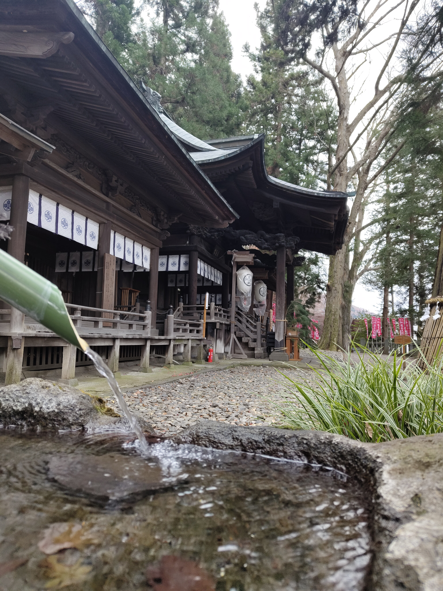
    <figcaption class="media-caption">Suwa Tenaga Shrine — ancient, well-preserved, the kind of shrine that accumulates atmosphere.</figcaption>
  </figure>
  <figure style="margin: 0;">
    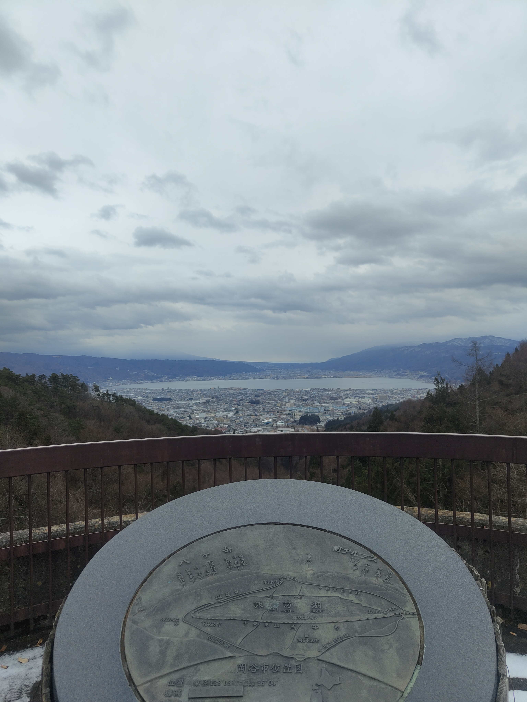
    <figcaption class="media-caption">Enrei Onodachi Park — the town and the circular lake below, the mountains behind.</figcaption>
  </figure>
</div>

<div class="media-block">
  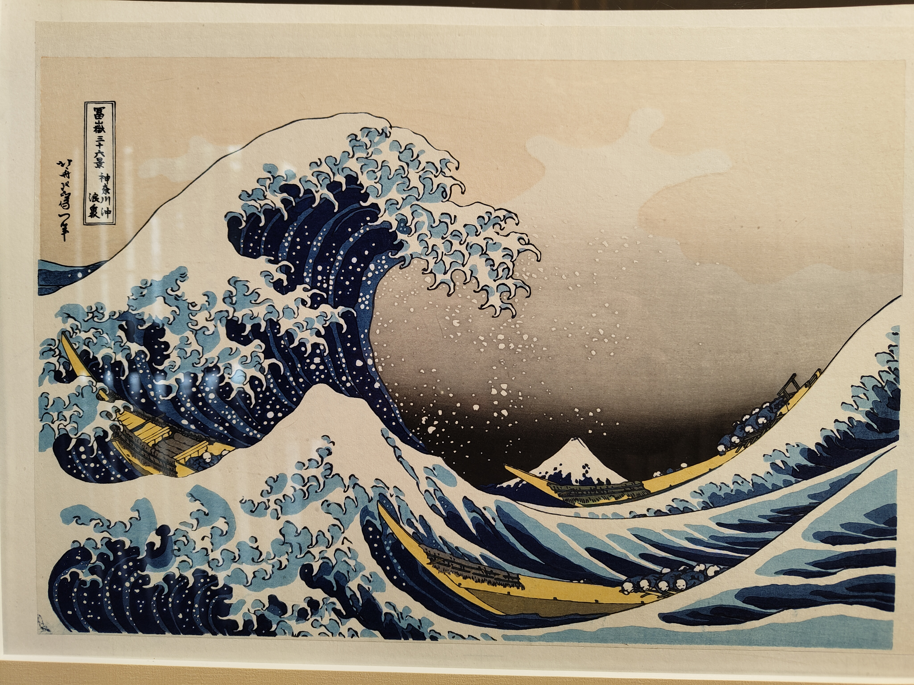
  <p class="media-caption">The Hokusai Museum — the Great Wave in its original context, the scale of a single life's work apparent.</p>
</div>

<hr class="section-divider">

<div id="shizuoka"></div>
::: {.prose}

## Shizuoka — The Izu Peninsula and Fuji from Below

Shizuoka is where Fuji becomes real. The Jukkoku Pass observation deck gives the first proper angle on it — the mountain rising above the surrounding hills, the scale of it making everything else in the view smaller than it should be. The Iwamoto Mountain Park gives another angle, the mountain framed differently each time.

The Izu Peninsula is the discovery. The Kadowaki suspension bridge spans a gorge above cliffs and coastline that is genuinely unforgettable — the bridge itself is dramatic but the views from it, the cliff faces dropping into the sea below, are what make the stop. Shirahama Beach has crystal blue water and a torii gate in the shallows. The Ryugu sea caves cut through to the ocean in a way that produces views unlike anything else on the peninsula.

The Kawazu Loop Bridge descends in a spiral above the Kawazu Seven Waterfalls, and coming down it at night — the sound of the water before you can see it, the falls glistening in the moonlight at the bottom — is one of those accidental perfect moments that travel produces. The Mt. Fuji ramen in Fujinomiya is the best ramen I had in the region. The family mart with Fuji perfectly framed in the background is the photograph that needed to be taken.

:::

<div style="display: grid; grid-template-columns: 1fr 1fr; gap: 1rem; margin: 2rem 0;">
  <figure style="margin: 0;">
    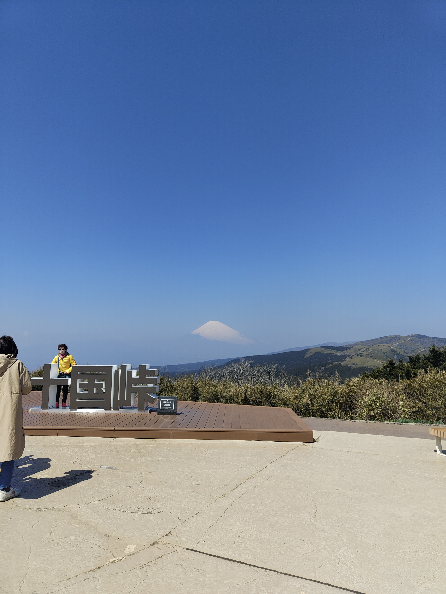
    <figcaption class="media-caption">Jukkoku Pass — the first proper angle on Fuji, the mountain making everything else smaller.</figcaption>
  </figure>
  <figure style="margin: 0;">
    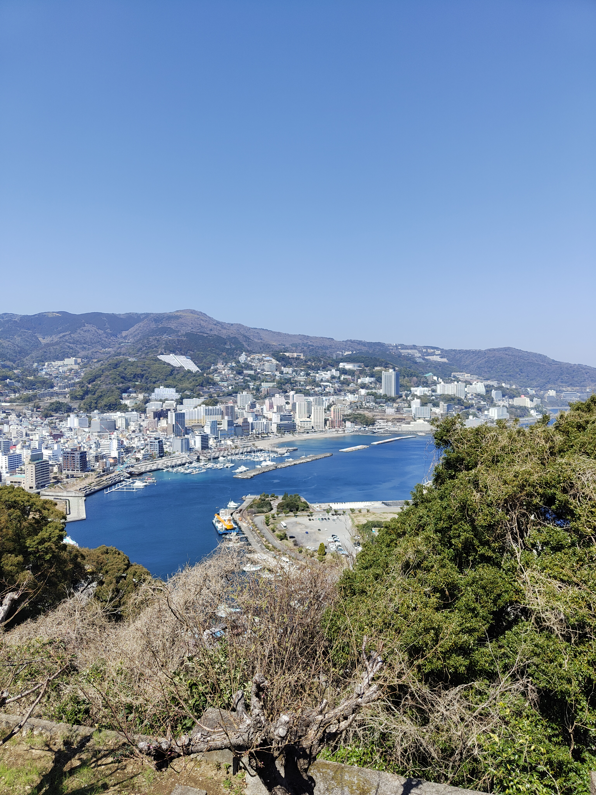
    <figcaption class="media-caption">Atami Castle — the hint of red against the coastline below.</figcaption>
  </figure>
</div>

<div style="display: grid; grid-template-columns: 1fr 1fr; gap: 1rem; margin: 2rem 0;">
  <figure style="margin: 0;">
    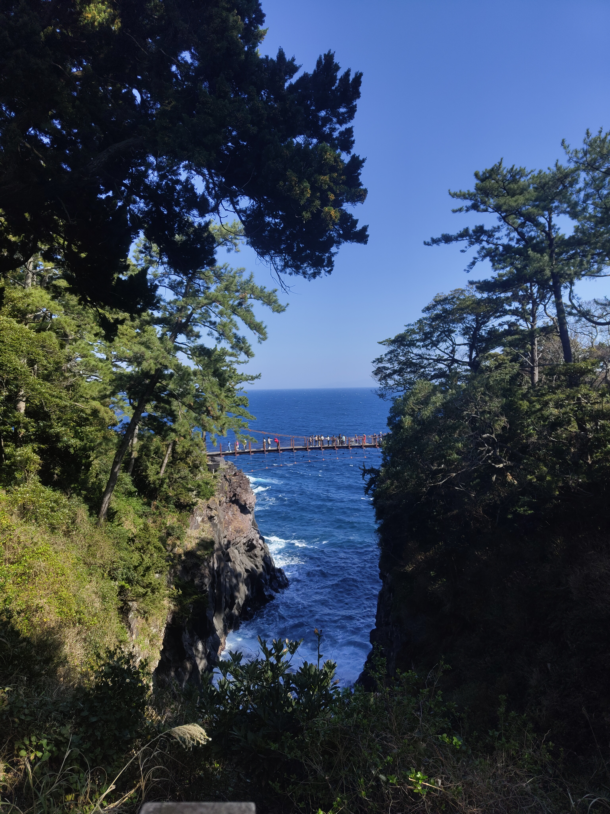
    <figcaption class="media-caption">Kadowaki bridge — spanning the gorge, the cliffs below it.</figcaption>
  </figure>
  <figure style="margin: 0;">
    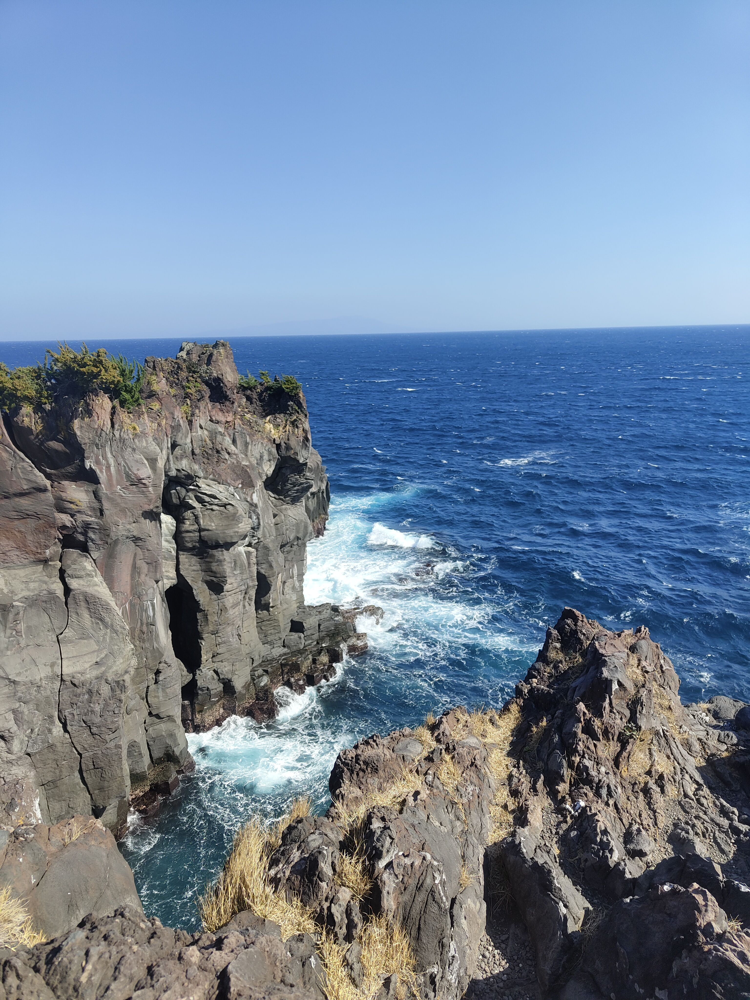
    <figcaption class="media-caption">The cliffs from the bridge — the coastline unforgettable from this angle.</figcaption>
  </figure>
</div>

<div class="media-block" style="margin: 2rem 0;">
  <video autoplay muted loop playsinline
         style="width: 100%; max-height: 520px; object-fit: cover; object-position: center; border-radius: 6px; display: block;">
    <source src="https://github.com/martinas-jucysbrady/martinas-jucysbrady.github.io/releases/download/v1.0-media/shizuoka_shirahama.mp4" type="video/mp4" />
  </video>
  <p class="media-caption">Shirahama Beach — crystal blue water, the waves, the torii in the shallows.</p>
</div>

<div style="display: grid; grid-template-columns: 1fr 1fr 1fr; gap: 1rem; margin: 2rem 0;">
  <figure style="margin: 0;">
    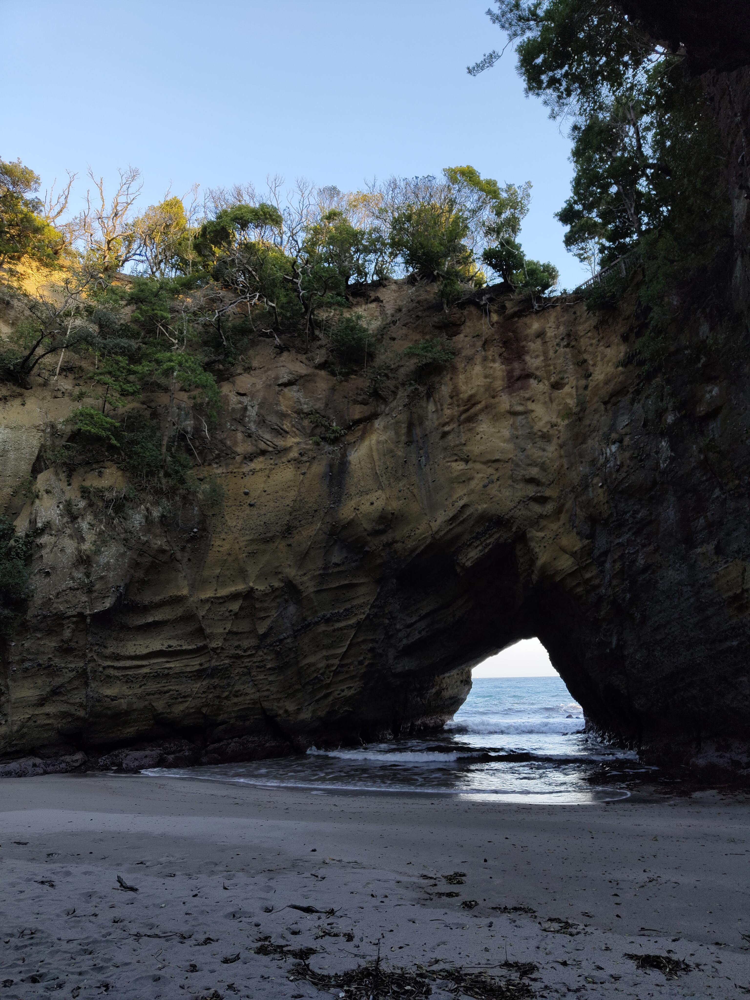
    <figcaption class="media-caption">Ryugu sea caves — cutting through to the ocean, unique views.</figcaption>
  </figure>
  <figure style="margin: 0;">
    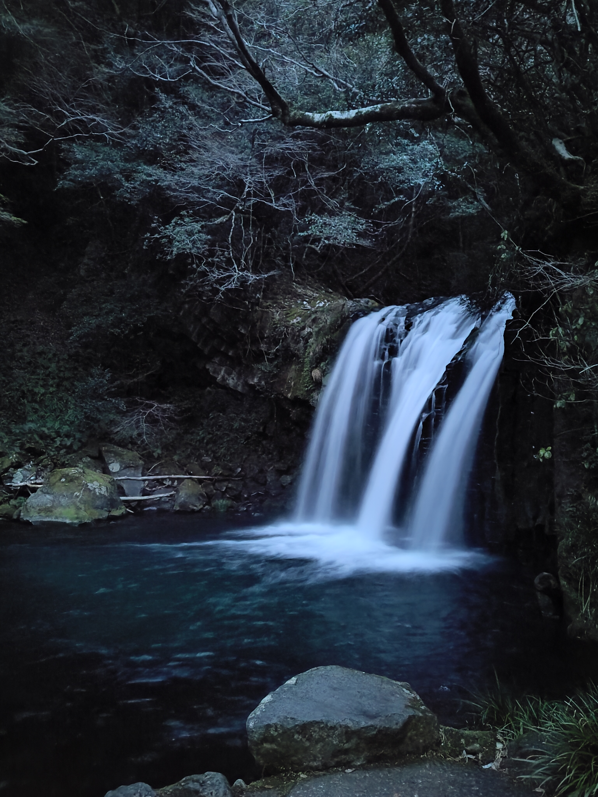
    <figcaption class="media-caption">Kawazu Falls at night — the sound first, then the light on the water.</figcaption>
  </figure>
  <figure style="margin: 0;">
    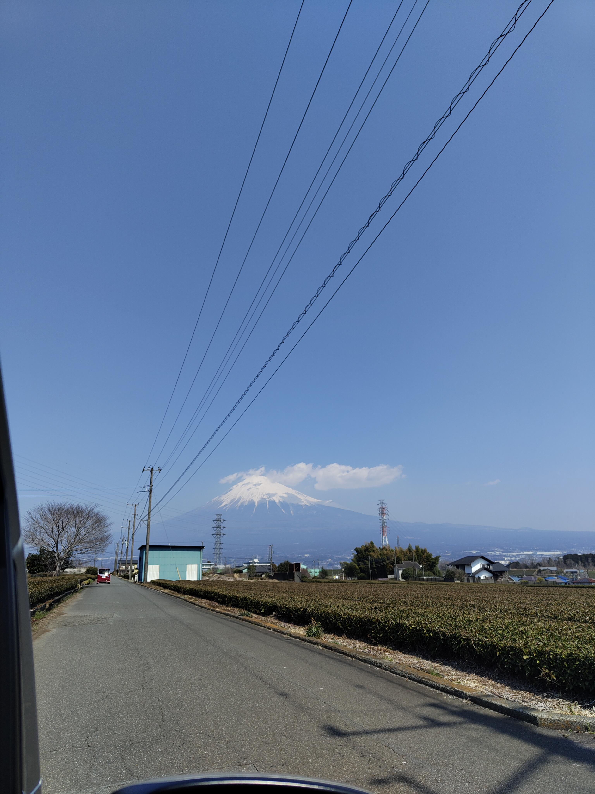
    <figcaption class="media-caption">Iwamoto Mountain Park — Fuji framed differently, just as good.</figcaption>
  </figure>
</div>

<div class="media-block">
  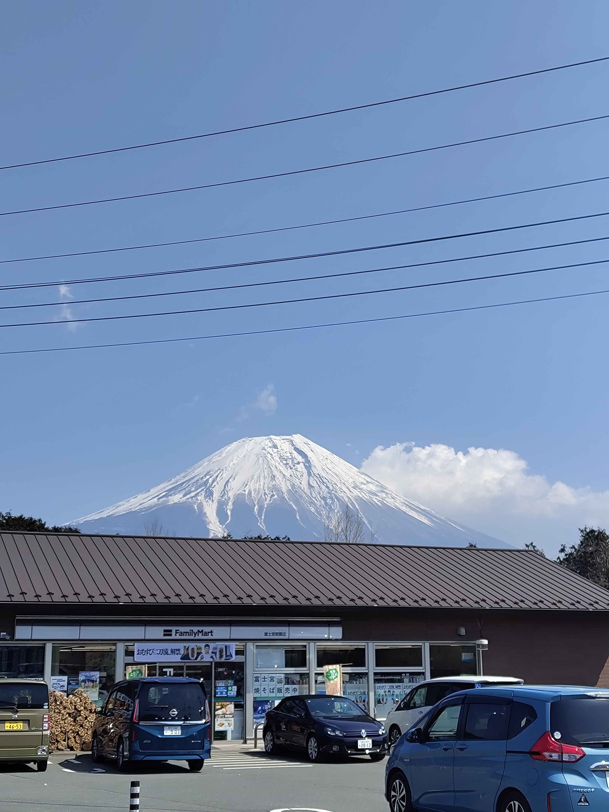
  <p class="media-caption">The iconic Family Mart with Fuji behind it — the photograph that needed to be taken.</p>
</div>

<hr class="section-divider">

<div id="yamanashi"></div>
::: {.prose}

## Yamanashi — Fuji from Every Angle

Yamanashi is where you understand what Fuji actually means to the landscape around it. Every viewpoint, every village, every lake exists in relation to the mountain — it is visible from everywhere and different from every angle, and the region has arranged itself accordingly.

Aokigahara — the forest at the foot of Fuji — has a reputation that precedes it and a reality that is more nuanced. It is dense, quiet, and has a stillness that is peaceful rather than unsettling, the ancient lava formations beneath the forest floor creating a landscape unlike anything else. The trees grow in unusual shapes around the rock, the light filters differently, and the whole place rewards the walk rather than the reputation.

Saiko Nenba Hama gives a viewpoint over the lakes surrounding Fuji with traditional villages in the foreground — the kind of composition that makes clear why people have been painting this mountain for centuries. Arakurayama Sengen is the iconic Fuji-and-pagoda view that appears on half the images ever associated with Japan, and it earns it — the red pagoda on the hillside with the mountain filling the sky behind it is as good in person as the photographs suggest. Oshino Hakkai — the old village with its canals, ponds, and lakes fed by Fuji's snowmelt — provides the final angle: the mountain reflected in still water, the village unchanged, everything pointing back toward the same peak.

:::

<div style="display: grid; grid-template-columns: 1fr 1fr; gap: 1rem; margin: 2rem 0;">
  <figure style="margin: 0;">
    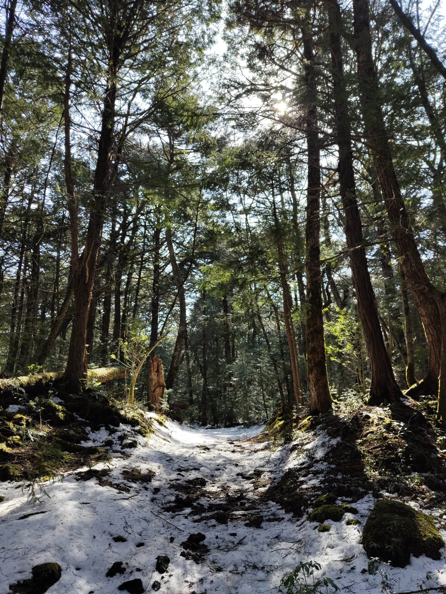
    <figcaption class="media-caption">Aokigahara — dense, quiet, peaceful rather than unsettling.</figcaption>
  </figure>
  <figure style="margin: 0;">
    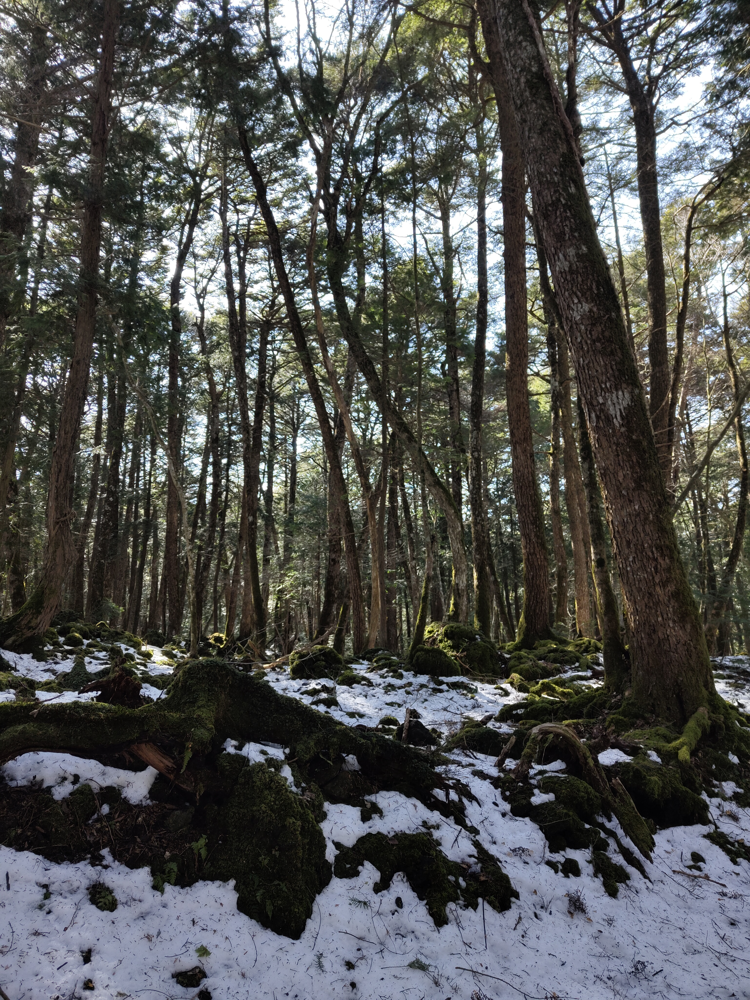
    <figcaption class="media-caption">The forest — the trees growing around the ancient lava rock below.</figcaption>
  </figure>
</div>

<div class="media-block">
  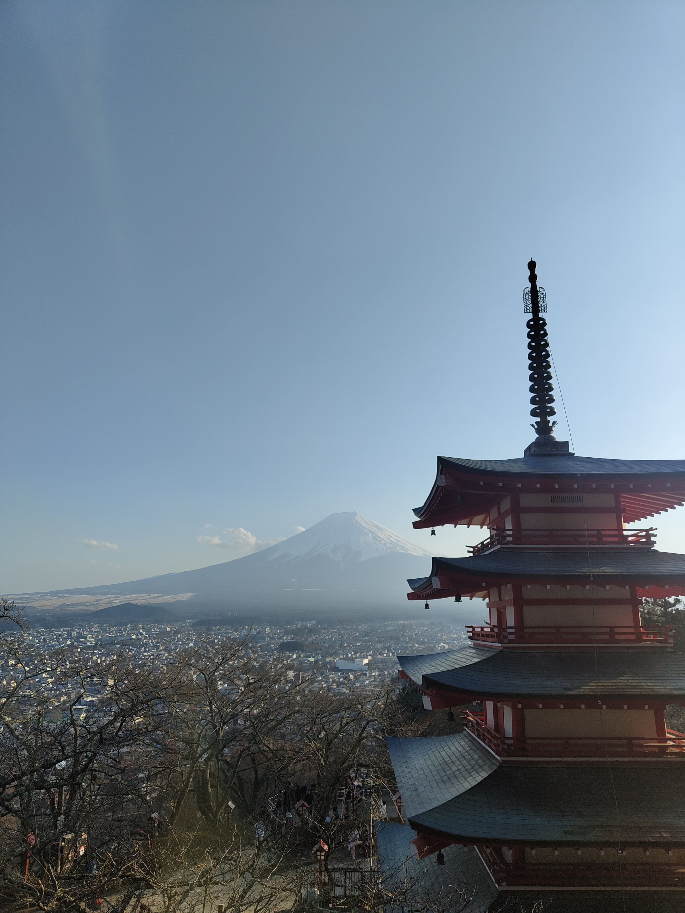
  <p class="media-caption">Arakurayama Sengen — the pagoda, the mountain behind it, the image that earns its reputation.</p>
</div>

<div style="display: grid; grid-template-columns: 1fr 1fr; gap: 1rem; margin: 2rem 0;">
  <figure style="margin: 0;">
    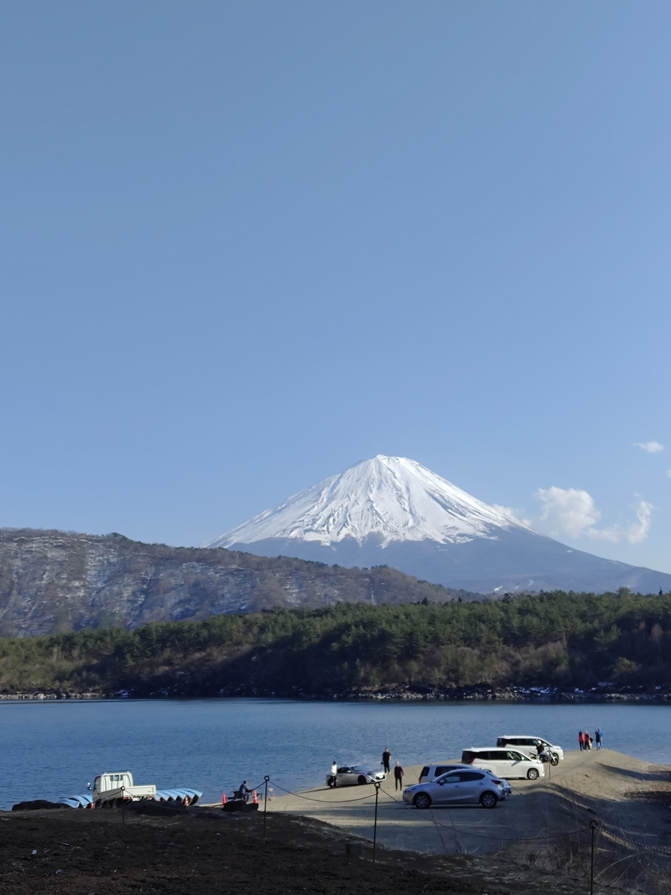
    <figcaption class="media-caption">Saiko Nenba Hama — the lakes, the villages, the mountain behind everything.</figcaption>
  </figure>
  <figure style="margin: 0;">
    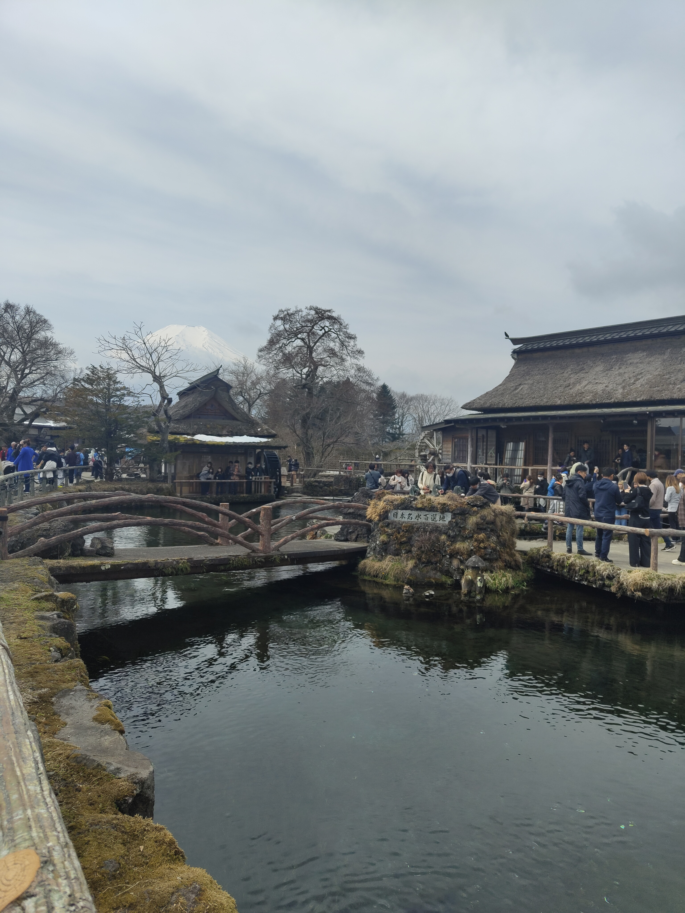
    <figcaption class="media-caption">Oshino Hakkai — the old village, the canals, Fuji reflected in the still water.</figcaption>
  </figure>
</div>

<div class="pull-quote">
  "Every viewpoint, every village, every lake exists in relation to the mountain."
</div>

<hr class="section-divider">

::: {.prose}

Eight prefectures across central Japan, visited across different seasons and different years. Chubu doesn't have the profile of Kansai or the draw of Tokyo but it has more variety than almost any other region — the snow temples of Fukui, the preserved villages of Gifu, the light festivals of Mie, the mountain castles of Nagano, the peninsula coastline of Shizuoka, and Fuji filling the sky above Yamanashi. The Formula One at Suzuka. The monkeys in the hot spring. The Buddha surrounded by hundreds of smaller Buddhas in a valley full of snow.

The region rewards the slower pace of exploring by prefecture rather than by list.

:::

<div class="media-block">
  
  <p class="media-caption">Chubu — and always, somewhere above it all, Fuji.</p>
</div>
