```{=html}
<style>
  .trip-header {
    text-align: center;
    padding: 60px 20px 40px;
    max-width: 860px;
    margin: 0 auto;
  }
  .trip-label {
    font-size: 0.75rem;
    letter-spacing: 0.2em;
    text-transform: uppercase;
    color: #9b8877;
    margin-bottom: 8px;
  }
  .trip-title {
    font-family: 'Plus Jakarta Sans', sans-serif;
    font-size: 2.6rem;
    font-weight: 800;
    color: #1E4264;
    margin: 0 0 12px;
    line-height: 1.1;
  }
  .trip-subtitle {
    font-family: 'Cormorant Garamond', serif;
    font-style: italic;
    font-size: 1.2rem;
    color: #6b7280;
    margin-bottom: 24px;
  }
  .trip-meta {
    display: flex;
    gap: 24px;
    justify-content: center;
    font-size: 0.8rem;
    color: #9b8877;
    letter-spacing: 0.06em;
    text-transform: uppercase;
    flex-wrap: wrap;
  }
  .section-divider {
    border: none;
    border-top: 1px solid #e0e0f0;
    margin: 48px auto;
    max-width: 600px;
  }
  .prose {
    max-width: 720px;
    margin: 0 auto;
    font-size: 1.05rem;
    line-height: 1.85;
    color: #2d3748;
  }
  .prose h2 {
    font-family: 'Plus Jakarta Sans', sans-serif;
    font-weight: 800;
    font-size: 1.6rem;
    color: #1E4264;
    margin-top: 56px;
    margin-bottom: 12px;
    text-align: center;
  }
  .prose p {
    margin-bottom: 1.4rem;
  }
  .media-block {
    max-width: 860px;
    margin: 32px auto;
    border-radius: 14px;
    overflow: hidden;
    box-shadow: 0 4px 24px rgba(0,0,0,0.10);
  }
  .media-block img,
  .media-block video {
    width: 100%;
    display: block;
    object-fit: cover;
  }
  .media-caption {
    font-family: 'Cormorant Garamond', serif;
    font-style: italic;
    font-size: 0.9rem;
    color: #9b8877;
    text-align: center;
    margin-top: 10px;
    padding: 0 12px 4px;
  }
  .pull-quote {
    font-family: 'Cormorant Garamond', serif;
    font-style: italic;
    font-size: 1.55rem;
    font-weight: 600;
    color: #1E4264;
    text-align: center;
    max-width: 640px;
    margin: 48px auto;
    line-height: 1.5;
    padding: 0 24px;
    border-left: 3px solid #c9aa96;
  }

  #quarto-document-content {
    display: flex;
    flex-direction: column;
    align-items: center;
  }

  #quarto-document-content > * {
    width: 100%;
    max-width: 860px;
  }
</style>

<div class="trip-header">
  <p class="trip-label">⛩️ Travel</p>
  <h1 class="trip-title">Chugoku & Shikoku</h1>
  <p class="trip-subtitle">Castles, whirlpools, sand dunes, and a village full of scarecrows</p>
  <div class="trip-meta">
    <span>December 2024 · March 2025 · April 2025 · May 2025</span>
    <span>📍 Western Honshu & Shikoku, Japan</span>
  </div>
</div>

<hr class="section-divider">
```

<div id="okayama"></div>
::: {.prose}

## Okayama — The Black Castle and the Garden

Okayama Castle is one of the most striking castles in Japan — jet black exterior, tiered rooflines, and a presence that makes it immediately one of the better-looking castles in the country. It sits beside Korakuen, one of Japan's three great gardens, which in cherry blossom season becomes something extraordinary: the carefully designed landscape of ponds, lawns, and tea houses overlaid with pink and white, the castle visible above the trees behind it.

:::

<div style="display: grid; grid-template-columns: 1fr 1fr; gap: 1rem; margin: 2rem 0;">
  <figure style="margin: 0;">
    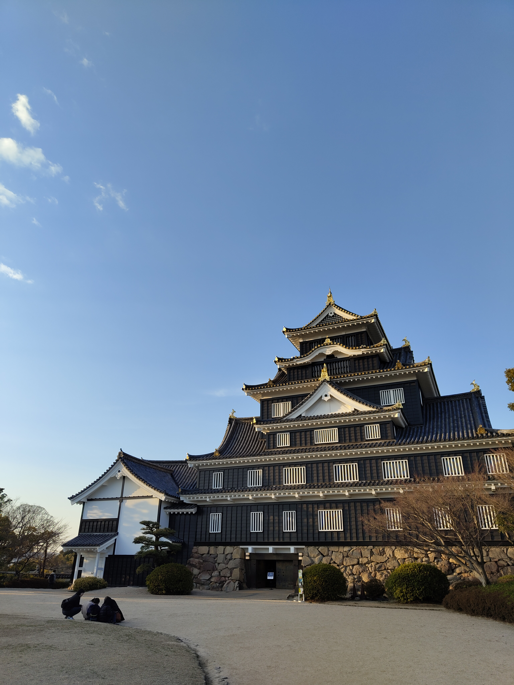
    <figcaption class="media-caption">Okayama Castle — jet black, tiered, one of the best-looking castles in Japan.</figcaption>
  </figure>
  <figure style="margin: 0;">
    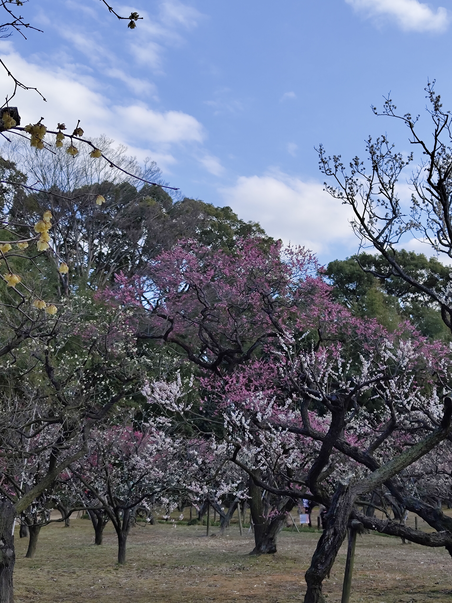
    <figcaption class="media-caption">Korakuen in cherry blossom season — the garden and the castle together.</figcaption>
  </figure>
</div>

<hr class="section-divider">

<div id="hiroshima"></div>
::: {.prose}

## Hiroshima — The Dome, the Deer, and the Island

The Atomic Bomb Dome and museum are essential — the building that survived the blast, preserved exactly as it was left, is one of those sights that produces a particular kind of silence. The museum is one of the most important in Japan and deserves several hours. How the dome stayed standing is genuinely marvellous and the answer, when you learn it, only makes it more affecting.

Miyajima Island, a short ferry ride from the city, operates on a completely different register. Itsukushima Jinja — the floating shrine — is larger and more beautiful in person than the photographs suggest, the torii gate standing in the water at high tide one of the most iconic images in Japan. The deer that wander freely across the island are friendly to the point of being a mild nuisance, and entirely charming about it.

Daishoin Temple on the island is the hidden highlight: a complex of buildings climbing the hillside, and hundreds of small stone Jizo statues lining the paths, each wearing a hand-knitted red hat. The cumulative effect of them is somewhere between Buddhist devotion and something deeply endearing. Inside the main hall, lanterns fill the ceiling.

The tea ceremony invitation — extended after buying something small from a jewellery store — was one of those unplanned moments that makes a trip.

:::

<div style="display: grid; grid-template-columns: 1fr 1fr; gap: 1rem; margin: 2rem 0;">
  <figure style="margin: 0;">
    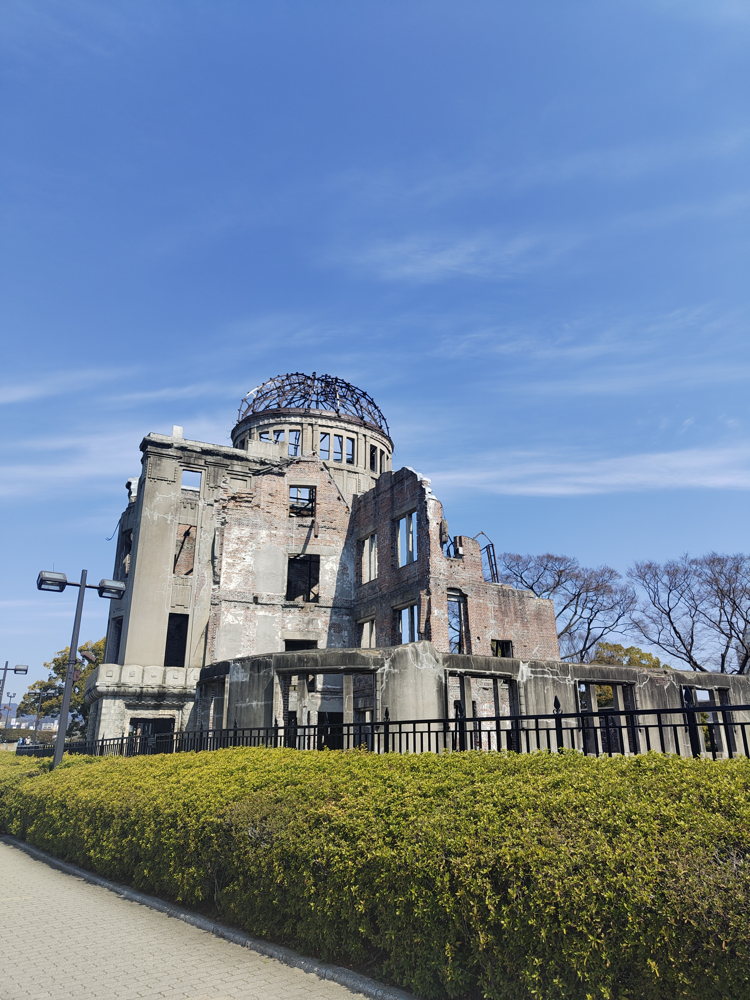
    <figcaption class="media-caption">The Atomic Bomb Dome — preserved exactly as the blast left it.</figcaption>
  </figure>
  <figure style="margin: 0;">
    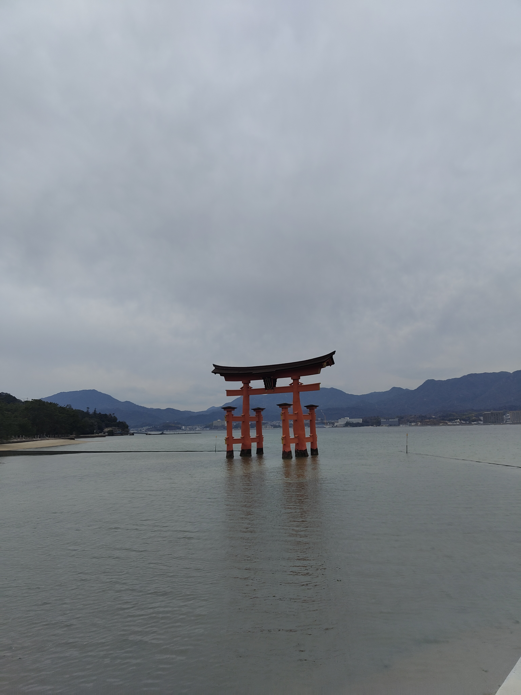
    <figcaption class="media-caption">Itsukushima Jinja — larger and more beautiful in person than the photographs suggest.</figcaption>
  </figure>
</div>

<div style="display: grid; grid-template-columns: 1fr 1fr; gap: 1rem; margin: 2rem 0;">
  <figure style="margin: 0;">
    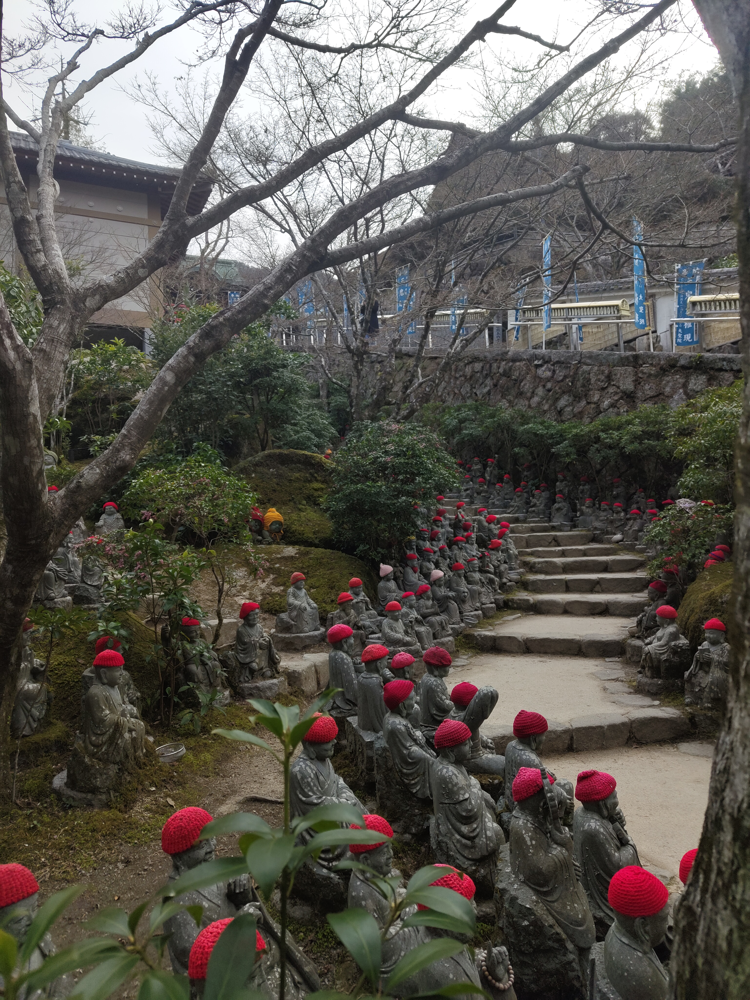
    <figcaption class="media-caption">Daishoin — hundreds of Jizo statues, each with a hand-knitted red hat.</figcaption>
  </figure>
  <figure style="margin: 0;">
    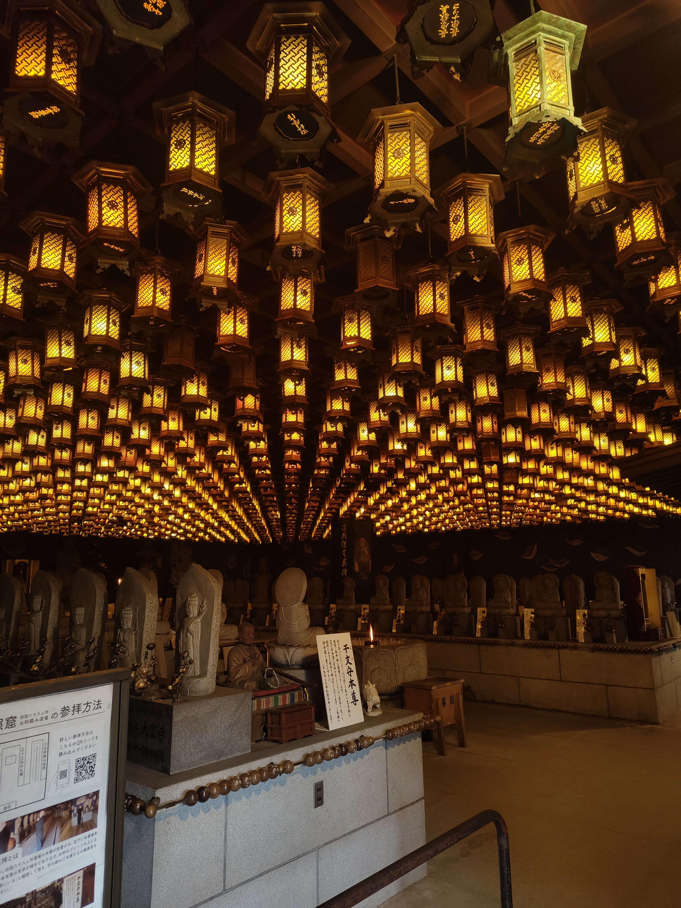
    <figcaption class="media-caption">Inside Daishoin — lanterns filling the ceiling of the main hall.</figcaption>
  </figure>
</div>

<div style="display: grid; grid-template-columns: 1fr 1fr; gap: 1rem; margin: 2rem 0;">
  <figure style="margin: 0;">
    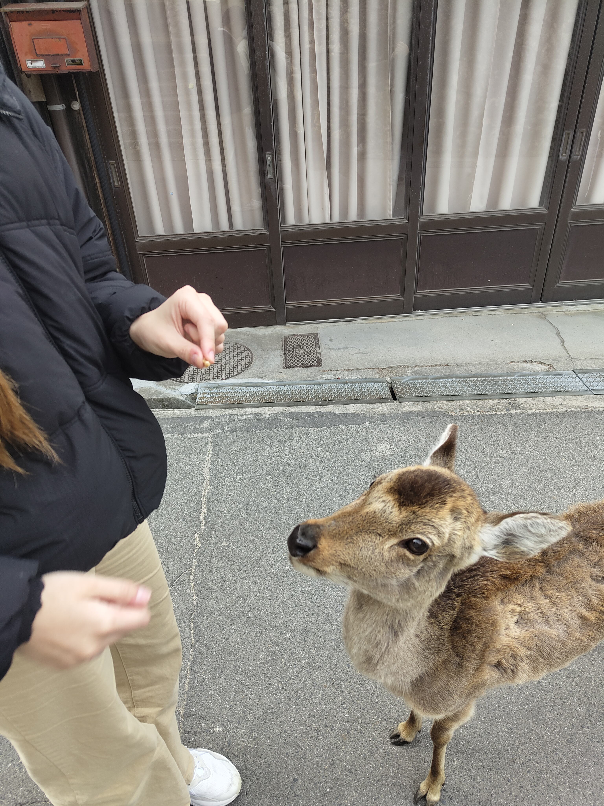
    <figcaption class="media-caption">The Miyajima deer — friendly to the point of being a mild nuisance.</figcaption>
  </figure>
  <figure style="margin: 0;">
    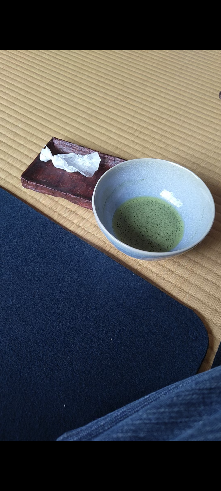
    <figcaption class="media-caption">The tea ceremony — unplanned, invited in from the street, one of those moments.</figcaption>
  </figure>
</div>

<div class="media-block">
  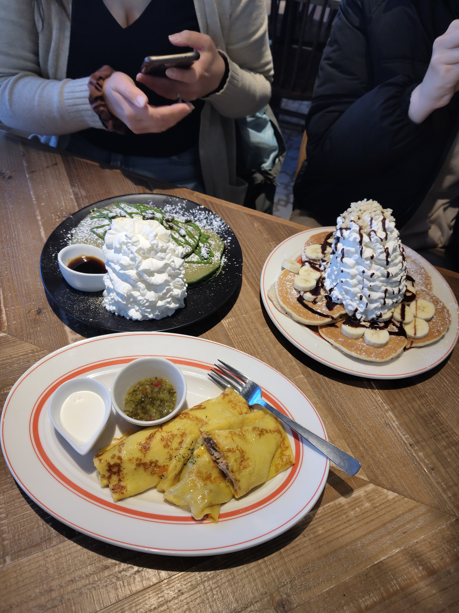
  <p class="media-caption">Hiroshima pancakes - smothered in whipped cream.</p>
</div>

<hr class="section-divider">

<div id="ehime"></div>
::: {.prose}

## Ehime — Rabbit Island and the Inland Sea

Okunoshima — Rabbit Island — is one of those places that sounds too good to be true and delivers completely. A small island in the Seto Inland Sea, used as a poison gas factory during the Second World War and now largely ruined, it is overrun with hundreds of rabbits descended from animals released after the war. The combination of industrial ruins being reclaimed by nature and an extraordinary density of very friendly rabbits is unlike anything else. The ruins add context the rabbits are entirely unbothered by.

The Setonaikai National Park drive through the islands is one of the better drives in western Japan — the Seto Inland Sea visible at every turn, islands in every direction, the light on the water in the afternoon something to plan around.

:::

<div style="display: grid; grid-template-columns: 1fr 1fr; gap: 1rem; margin: 2rem 0;">
  <figure style="margin: 0;">
    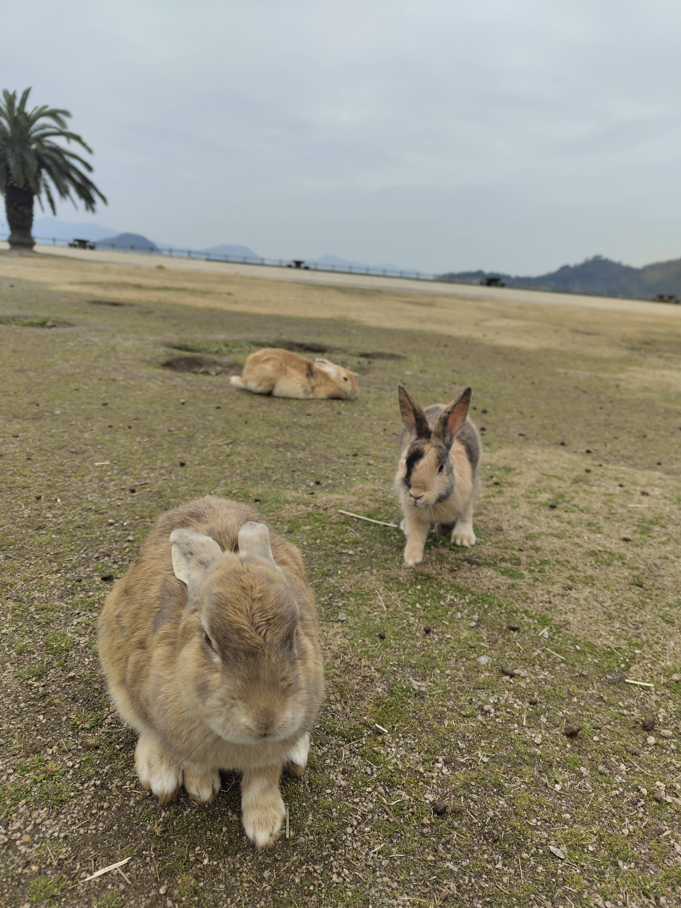
    <figcaption class="media-caption">Okunoshima — hundreds of very friendly rabbits, the ruins behind them.</figcaption>
  </figure>
  <figure style="margin: 0;">
    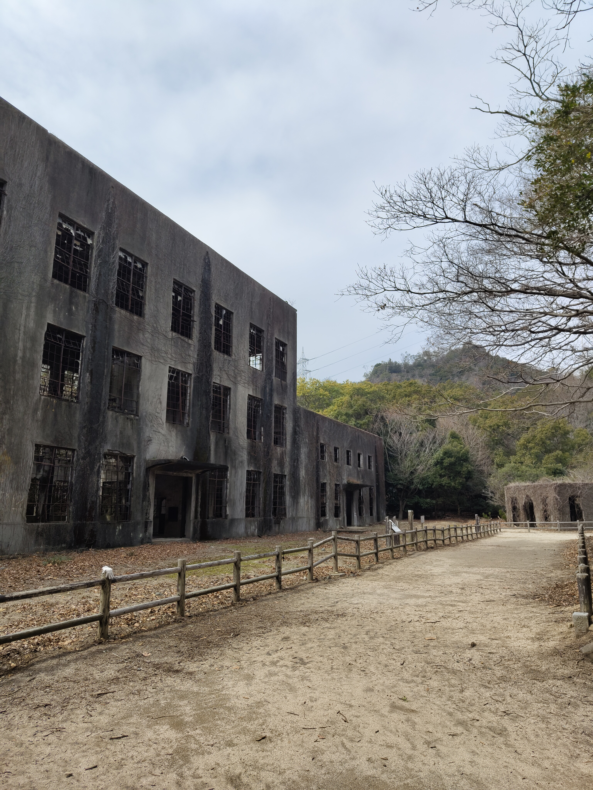
    <figcaption class="media-caption">The ruins — nature reclaiming the old poison gas factory, the rabbits entirely unbothered.</figcaption>
  </figure>
</div>

<div class="media-block" style="margin: 2rem 0;">
  <video autoplay muted loop playsinline
         style="width: 100%; max-height: 480px; object-fit: cover; object-position: center; border-radius: 6px; display: block;">
    <source src="https://github.com/martinas-jucysbrady/martinas-jucysbrady.github.io/releases/download/v1.0-media/ehime_rabbit2.mp4" type="video/mp4" />
  </video>
  <p class="media-caption">Feeding the rabbits — they come from every direction.</p>
</div>

<div class="media-block">
  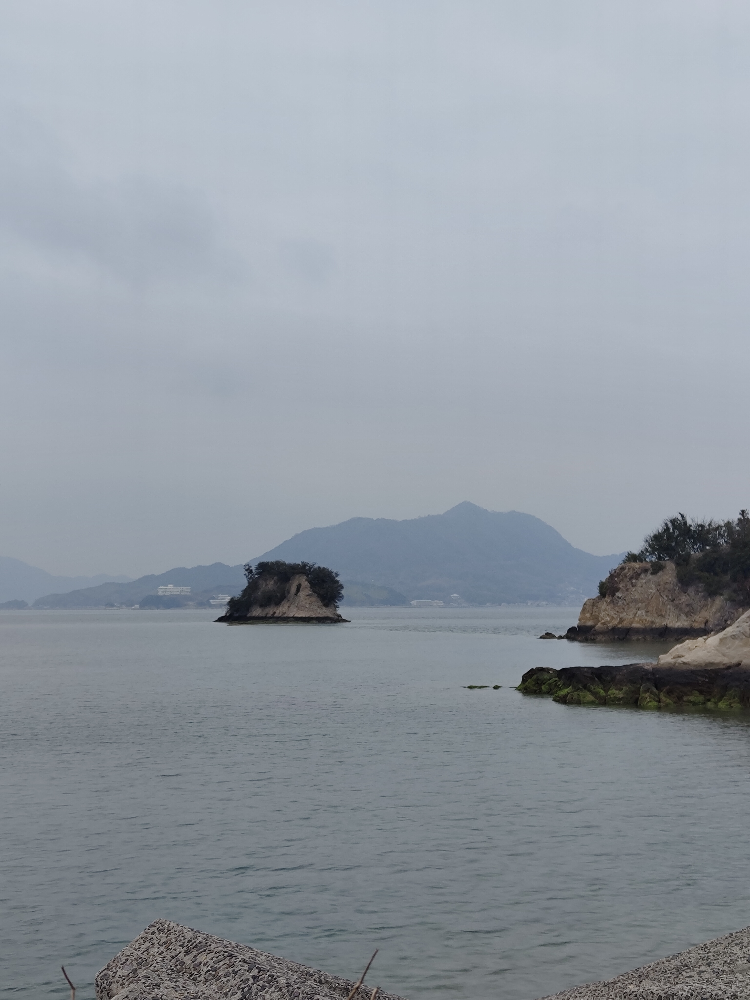
  <p class="media-caption">Setonaikai National Park — islands in every direction, the Inland Sea catching the afternoon light.</p>
</div>

<hr class="section-divider">

<div id="tokushima"></div>
::: {.prose}

## Tokushima — Whirlpools, the Iya Valley, and the Scarecrow Village

The Naruto whirlpools form where the tidal currents of the Seto Inland Sea and the Pacific meet in a narrow strait, and the boat tour takes you directly into them. They are larger and more powerful than expected and the motion sickness is real — worth it regardless. The view from the bridge above gives a completely different perspective: the whirlpools laid out below, the scale of them suddenly apparent.

The Otsuka Museum of Art is one of the more unusual museums in Japan — a collection of thousands of full-scale ceramic reproductions of famous Western artworks, from Lascaux cave paintings to the Sistine Chapel ceiling, all rendered in ceramic tile. It is enormous, strange, and genuinely impressive in a way that the description doesn't prepare you for.

The Iya Valley is the reward for going further into Shikoku than most visitors do. The valley cuts deep into the island's mountainous interior and the scenery is the untouched kind — the Iya River bending below sheer forested slopes, the vine bridge crossing a gorge that drops away on both sides and sways enough to make the crossing memorable. The statue of the peeing boy perched on a rock above the valley is a piece of local humour that has been there for decades.

Nagoro is the scarecrow village — a small mountain settlement where a local woman began making scarecrow replicas of former residents who moved away or died, until the scarecrows outnumbered the living people. Walking into buildings and finding only scarecrows is exactly as eerie as it sounds, and the project is genuinely moving once you understand what it is.

:::

<div class="media-block" style="margin: 2rem 0;">
  <video autoplay muted loop playsinline
         style="width: 100%; max-height: 520px; object-fit: cover; object-position: center; border-radius: 6px; display: block;">
    <source src="https://github.com/martinas-jucysbrady/martinas-jucysbrady.github.io/releases/download/v1.0-media/tokushima_naruto.mp4" type="video/mp4" />
  </video>
  <p class="media-caption">The Naruto whirlpools by boat — larger and more powerful than expected.</p>
</div>

<div style="display: grid; grid-template-columns: 1fr 1fr; gap: 1rem; margin: 2rem 0;">
  <figure style="margin: 0;">
    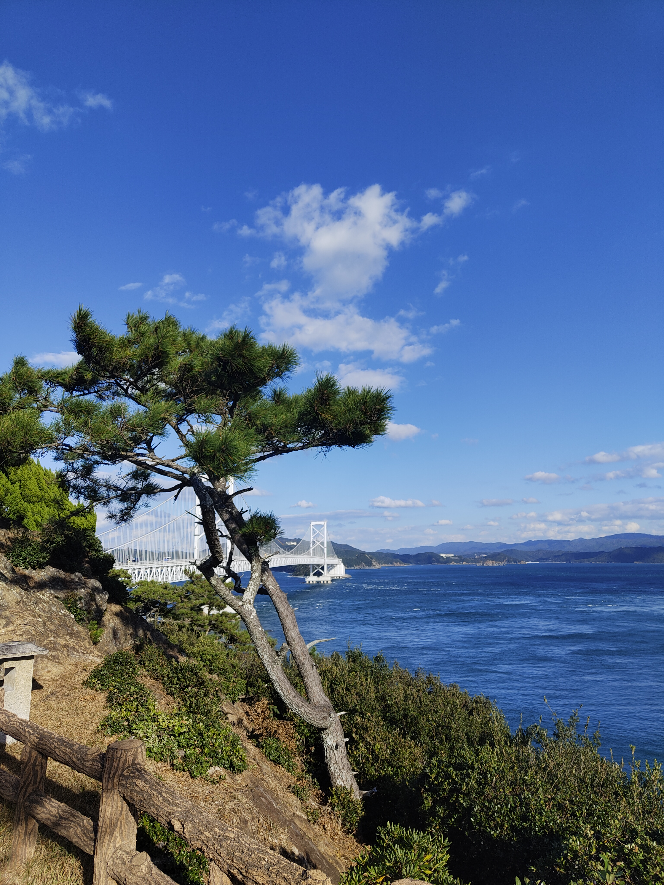
    <figcaption class="media-caption">From the bridge above — the whirlpools laid out below, the scale of them suddenly apparent.</figcaption>
  </figure>
  <figure style="margin: 0;">
    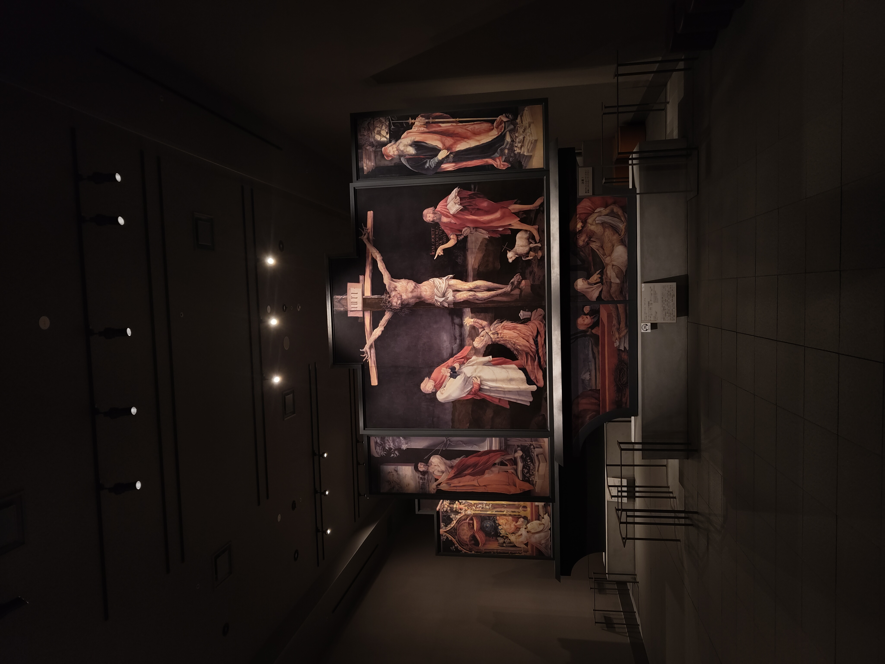
    <figcaption class="media-caption">Otsuka Museum — thousands of full-scale ceramic reproductions of famous Western art.</figcaption>
  </figure>
</div>

<div class="media-block">
  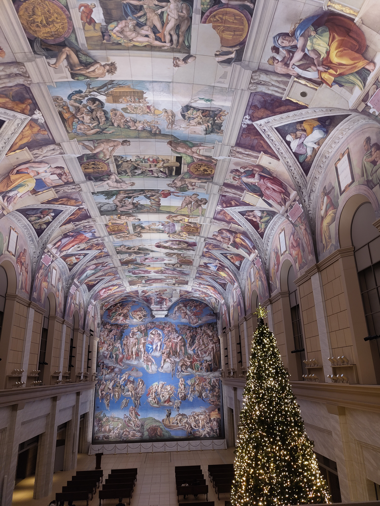
  <p class="media-caption">The Sistine Chapel ceiling in ceramic — strange, enormous, and genuinely impressive.</p>
</div>

<div style="display: grid; grid-template-columns: 1fr 1fr; gap: 1rem; margin: 2rem 0;">
  <figure style="margin: 0;">
    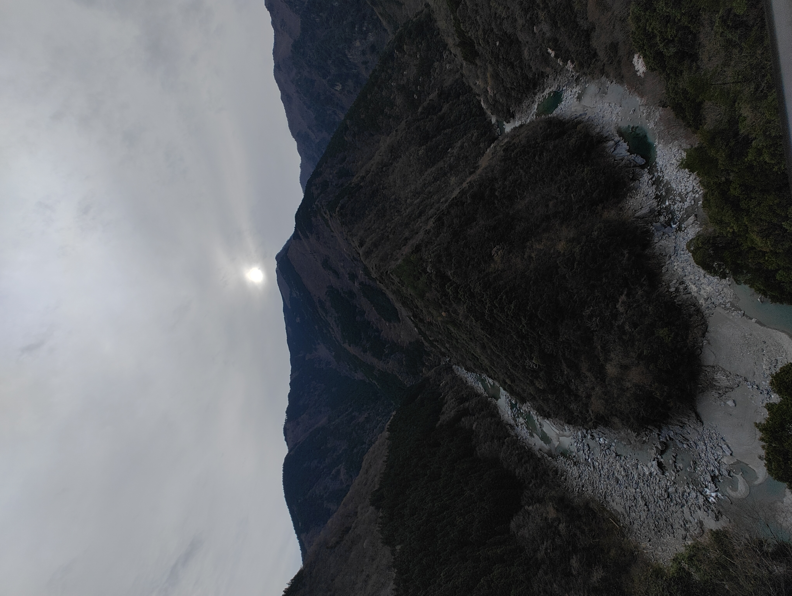
    <figcaption class="media-caption">The Iya River — bending through a valley of untouched forested slopes.</figcaption>
  </figure>
  <figure style="margin: 0;">
    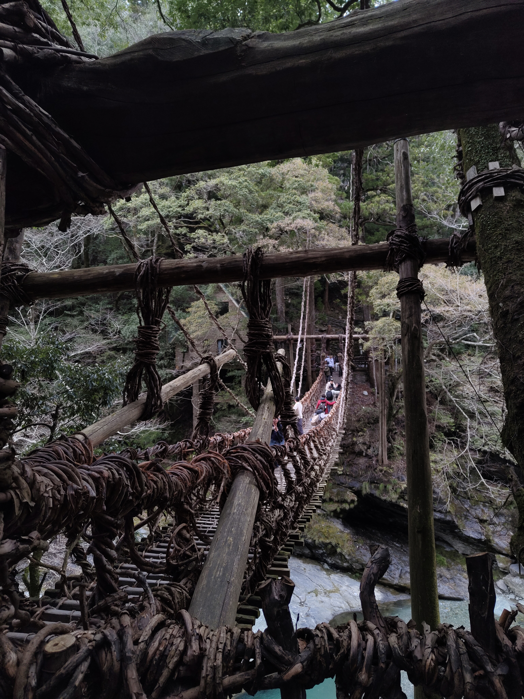
    <figcaption class="media-caption">The vine bridge — it sways, the drop below it is real, worth crossing anyway.</figcaption>
  </figure>
</div>

<div style="display: grid; grid-template-columns: 1fr 1fr; gap: 1rem; margin: 2rem 0;">
  <figure style="margin: 0;">
    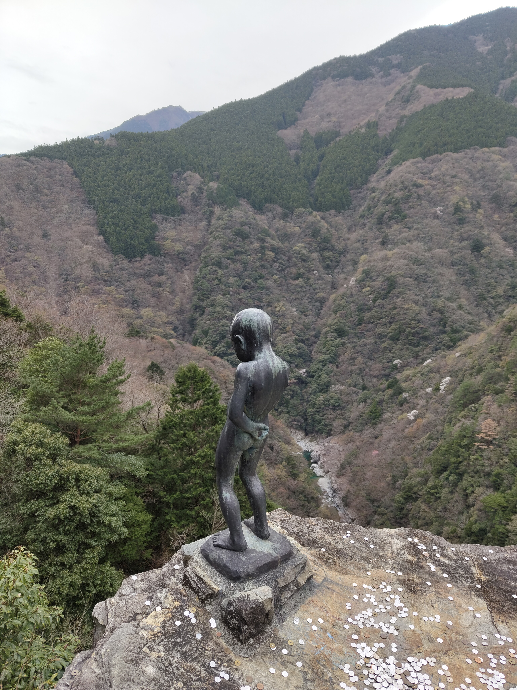
    <figcaption class="media-caption">The peeing boy — perched above the valley, local humour that has been there for decades.</figcaption>
  </figure>
  <figure style="margin: 0;">
    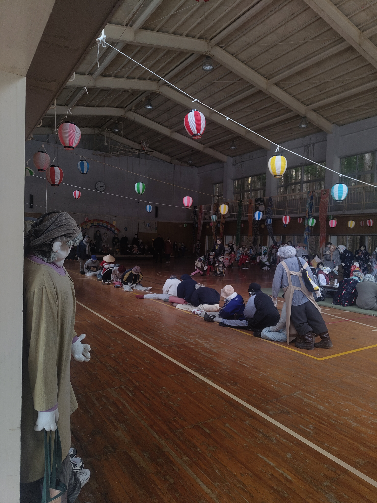
    <figcaption class="media-caption">Nagoro — the scarecrows outnumber the living residents.</figcaption>
  </figure>
</div>

<div class="media-block">
  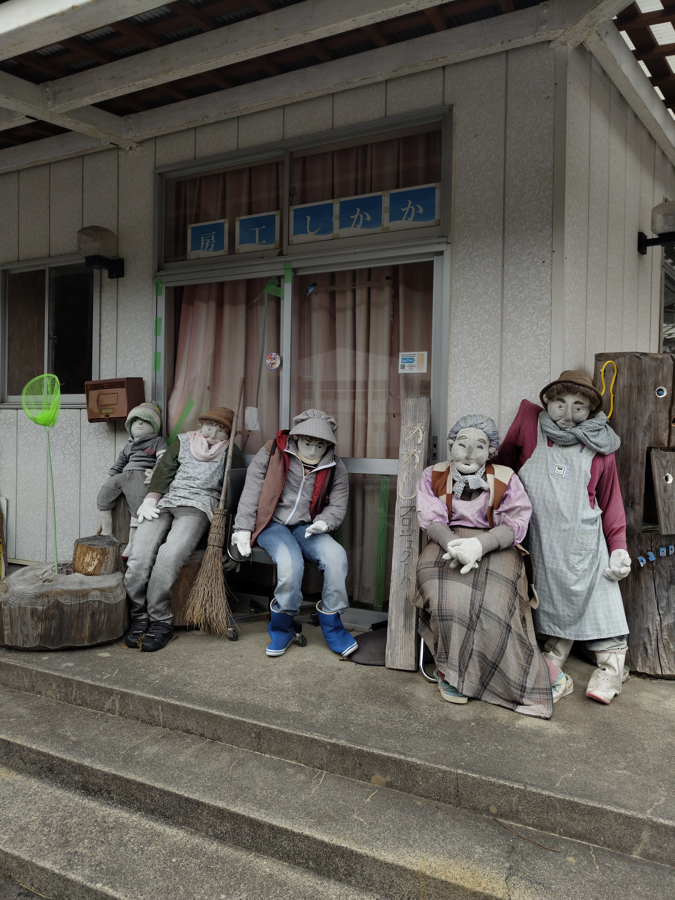
  <p class="media-caption">Walking into buildings and finding only scarecrows — eerie, and genuinely moving once you understand it.</p>
</div>

<div class="pull-quote">
  "The scarecrows outnumber the living — replicas of people who moved away or died, made by a woman who didn't want to forget them."
</div>

<hr class="section-divider">

<div id="shimane"></div>
::: {.prose}

## Shimane — Lafcadio Hearn, Owls, and Izumo

Matsue is a castle town with a quiet, historic quality and an unexpected Irish connection: Lafcadio Hearn, the Greek-Irish writer who came to Japan in 1890 and spent the rest of his life there, lived in Matsue and wrote some of the most important early Western accounts of Japanese culture. His museum and former residence sit in the old samurai district alongside streets that look largely as they did in his time. Matsue Castle overlooking the city is genuinely magnificent — one of the twelve original Japanese castles still standing with their wooden interiors intact.

The Matsue Vogel Park gets unexpectedly close to birds — snowy owls, tropical species, the kind of proximity that makes you reconsider what zoos should be. The Irish restaurant in Matsue, which turned up by complete coincidence, served food that genuinely recalled home in a way that felt out of place and perfect simultaneously.

Izumo Taisha is one of the most important Shinto shrines in Japan — ancient, extensive, and operating at a scale and atmosphere that Kyoto's more visited shrines sometimes lose. The torii gates lined up at the entrance, Inasa Beach with its shrine on a rock in the water and the cliffs visible in the distance, the cedar trees with the Japanese flag above them — Izumo has a presence.

:::

<div style="display: grid; grid-template-columns: 1fr 1fr; gap: 1rem; margin: 2rem 0;">
  <figure style="margin: 0;">
    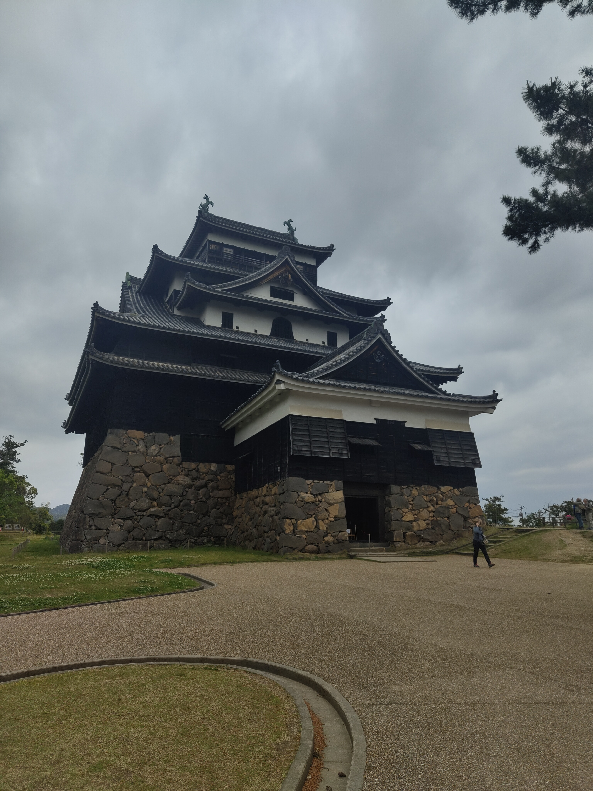
    <figcaption class="media-caption">Matsue Castle — one of twelve original castles with their wooden interiors intact.</figcaption>
  </figure>
  <figure style="margin: 0;">
    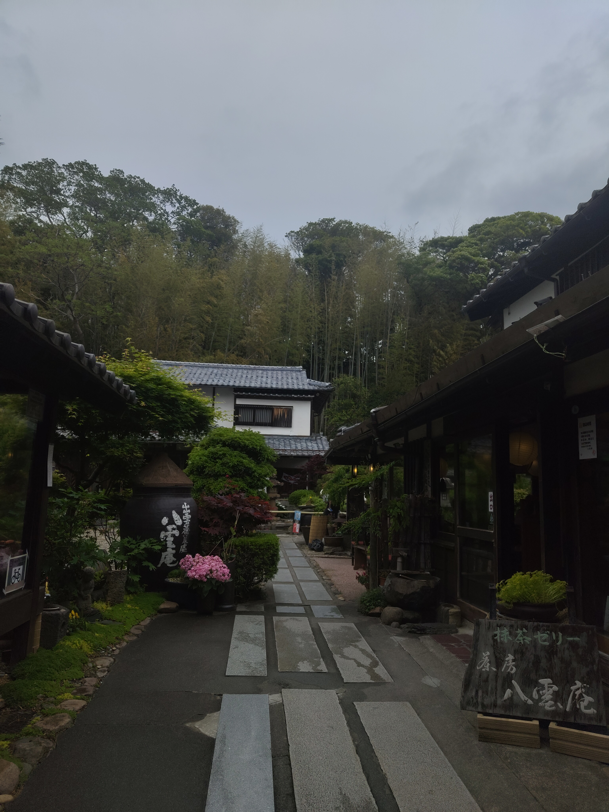
    <figcaption class="media-caption">The old samurai district — streets that look largely as they did in Lafcadio Hearn's time.</figcaption>
  </figure>
</div>

<div style="display: grid; grid-template-columns: 1fr 1fr 1fr; gap: 1rem; margin: 2rem 0;">
  <figure style="margin: 0;">
    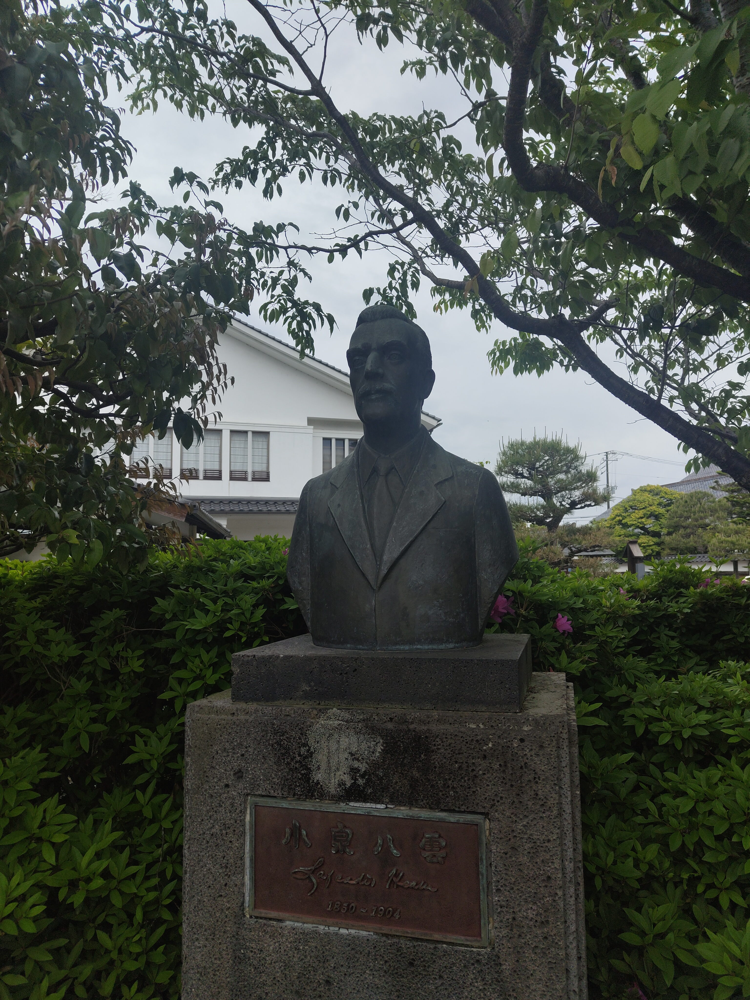
    <figcaption class="media-caption">Lafcadio Hearn — the Greek-Irish writer who made Matsue his home.</figcaption>
  </figure>
  <figure style="margin: 0;">
    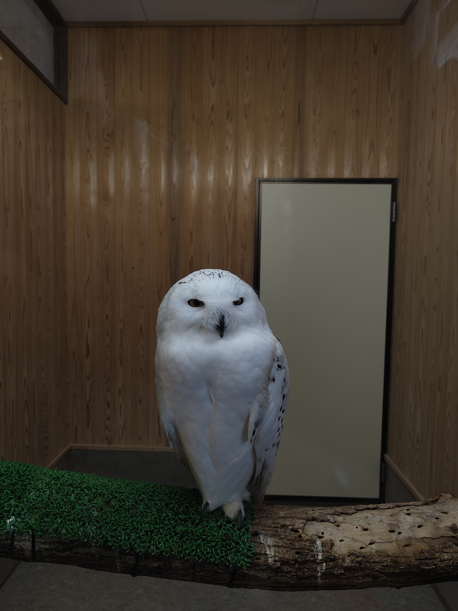
    <figcaption class="media-caption">The snowy owl at Vogel Park — unexpectedly close.</figcaption>
  </figure>
  <figure style="margin: 0;">
    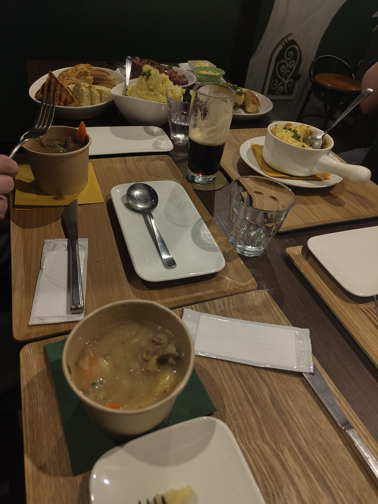
    <figcaption class="media-caption">The Irish restaurant — felt like home, out of place, and perfect simultaneously.</figcaption>
  </figure>
</div>

<div style="display: grid; grid-template-columns: 1fr 1fr; gap: 1rem; margin: 2rem 0;">
  <figure style="margin: 0;">
    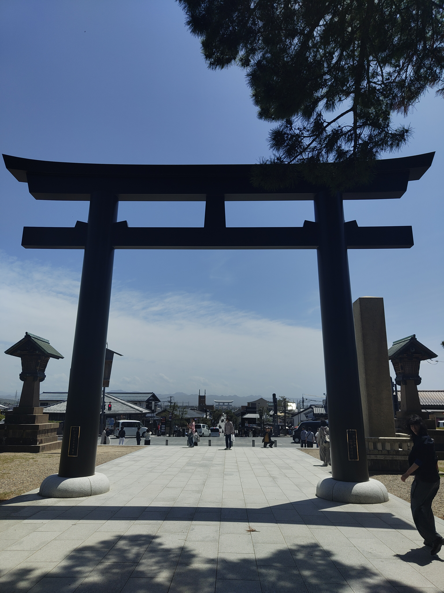
    <figcaption class="media-caption">Izumo Taisha — the torii gates lined up at the entrance, one of the most important shrines in Japan.</figcaption>
  </figure>
  <figure style="margin: 0;">
    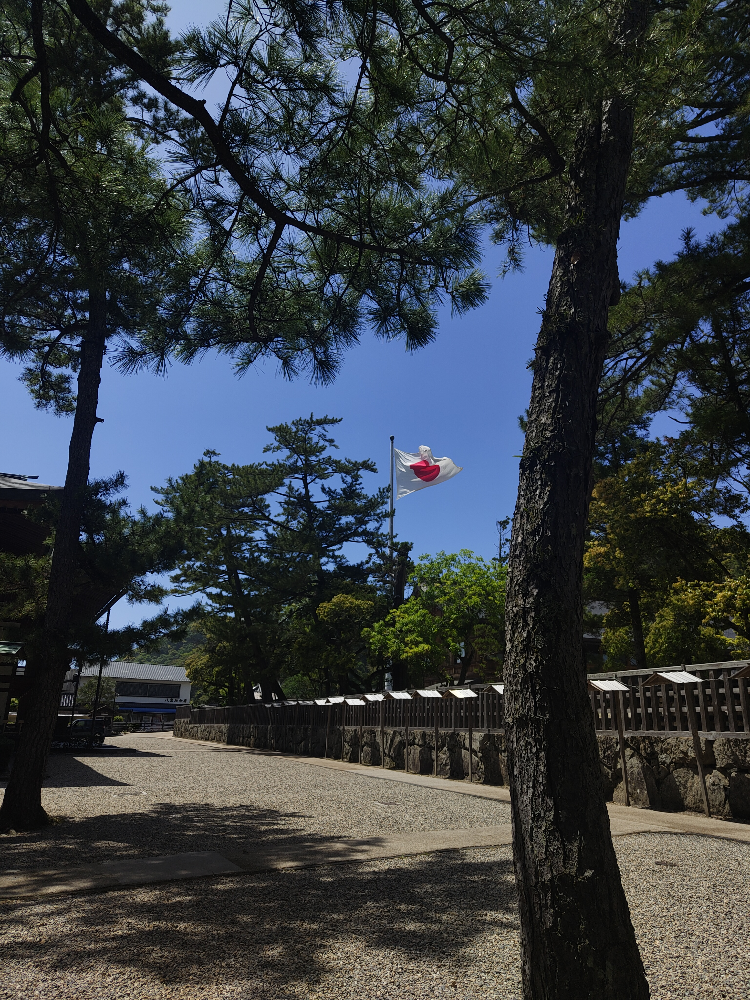
    <figcaption class="media-caption">The cedar trees and the flag — Izumo operating at a scale and atmosphere that Kyoto's shrines sometimes lose.</figcaption>
  </figure>
</div>

<div class="media-block">
  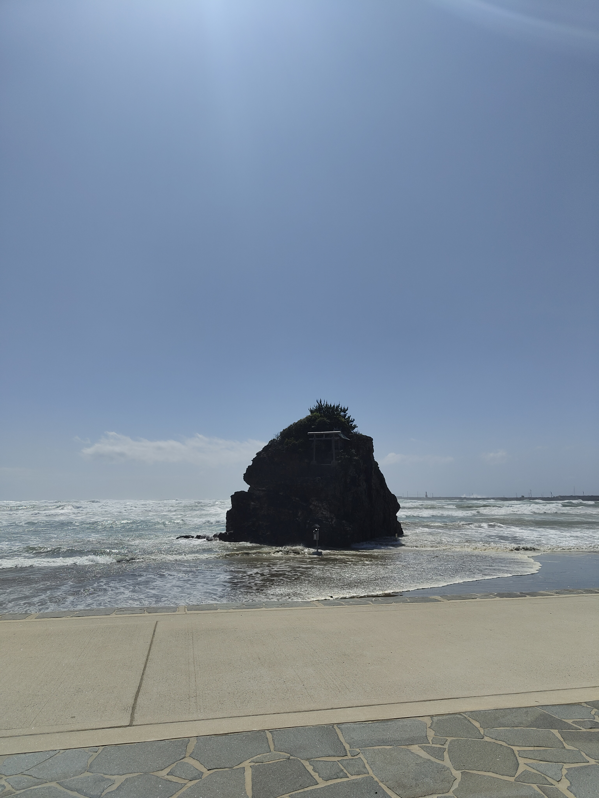
  <p class="media-caption">Inasa Beach — the shrine on the rock, the cliffs in the distance, the Sea of Japan beyond.</p>
</div>

<hr class="section-divider">

<div id="tottori"></div>
::: {.prose}

## Tottori — Sand Dunes and Hidden Castles

Tottori has Japan's only large sand dune system — a stretch of dunes on the Sea of Japan coast that reach thirty metres in height and feel genuinely out of place in a country otherwise defined by mountains and forest. Sandboarding down them is the obvious thing to do and it is exactly as good as it should be.

The sand sculpture museum nearby takes the dunes as its starting point and goes considerably further — artists carve elaborate scenes from the sand, some of them several metres tall, and the precision and scale of the work is extraordinary. Kawahara Castle, hidden in the valleys of the Tottori interior, is the kind of small, remote castle that most visitors never find and is better for it.

:::

<div style="display: grid; grid-template-columns: 1fr 1fr; gap: 1rem; margin: 2rem 0;">
  <figure style="margin: 0;">
    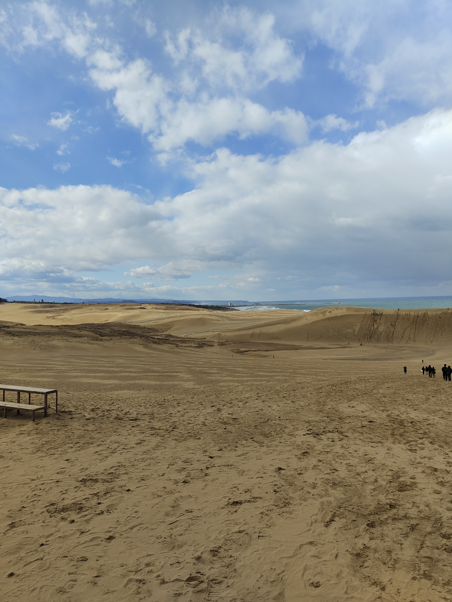
    <figcaption class="media-caption">The Tottori Sand Dunes — thirty metres high, entirely out of place, perfect.</figcaption>
  </figure>
  <figure style="margin: 0;">
    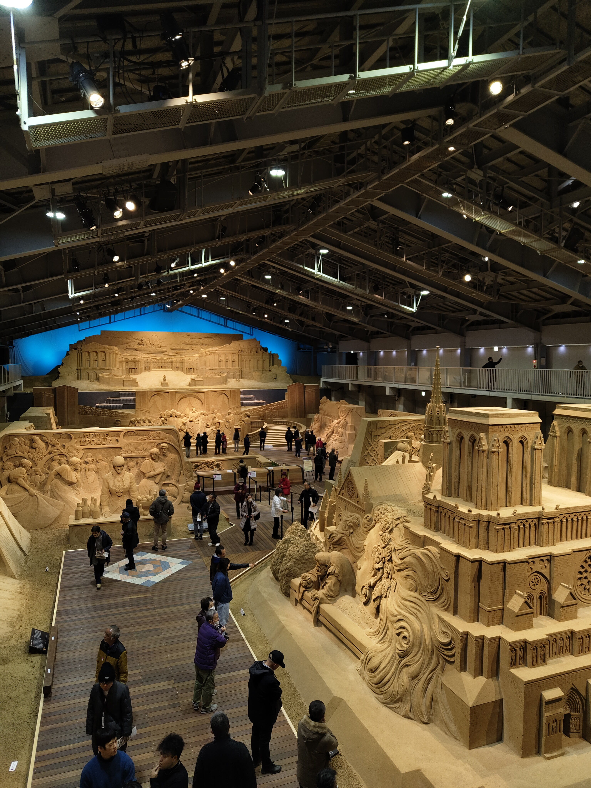
    <figcaption class="media-caption">The sand sculptures — precision and scale that the photographs undersell.</figcaption>
  </figure>
</div>

<div class="media-block" style="margin: 2rem 0;">
  <video autoplay muted loop playsinline
         style="width: 100%; max-height: 480px; object-fit: cover; object-position: center; border-radius: 6px; display: block;">
    <source src="https://github.com/martinas-jucysbrady/martinas-jucysbrady.github.io/releases/download/v1.0-media/tottori_boarding.mp4" type="video/mp4" />
  </video>
  <p class="media-caption">Sandboarding down the dunes — the obvious thing to do, exactly as good as it should be.</p>
</div>

<div class="media-block">
  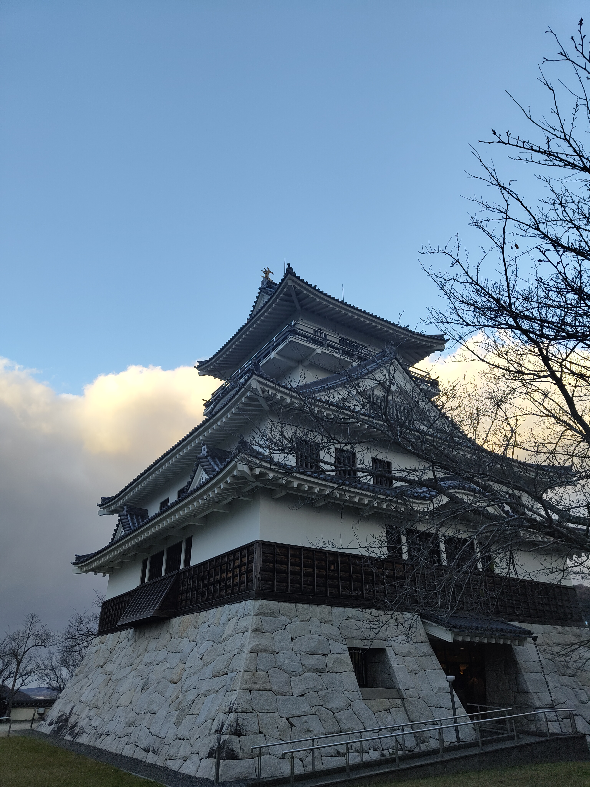
  <p class="media-caption">Kawahara Castle — small, remote, hidden in the valleys, better for it.</p>
</div>

<div class="pull-quote">
  "Thirty metres of sand dunes on the Sea of Japan coast — entirely out of place in Japan, and entirely worth it."
</div>

<hr class="section-divider">

::: {.prose}

Six prefectures across two regions that most visitors pass through on the way to somewhere else. The Atomic Bomb Dome in Hiroshima is essential. The whirlpools at Naruto are worth the motion sickness. Rabbit Island is exactly what it sounds like. The scarecrow village is eerie and moving in equal measure. The sand dunes are absurd and excellent. Izumo Taisha is one of the most important shrines in Japan and operates like it.

The Iya Valley in Tokushima is the one that stays with you — the vine bridge, the river below, the untouched mountains, the scarecrows at the end of the road. Go further into Shikoku than the tourist route suggests. It rewards the distance.

:::

<div class="media-block">
  
  <p class="media-caption">Itsukushima Jinja — the floating shrine, the image that Hiroshima gives you to take home.</p>
</div>