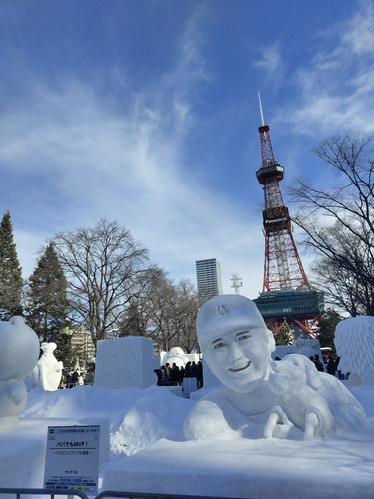
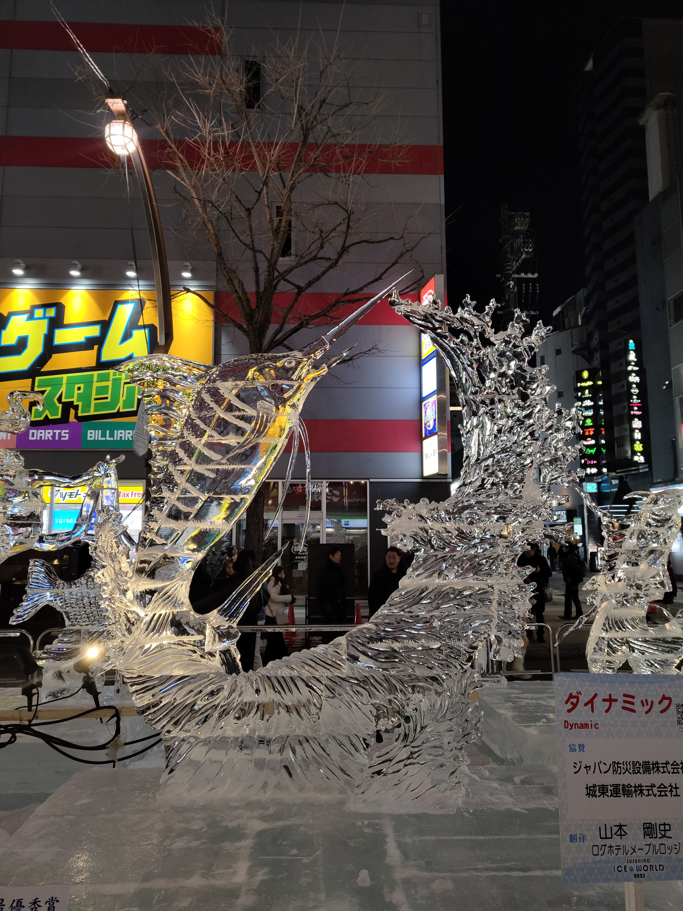
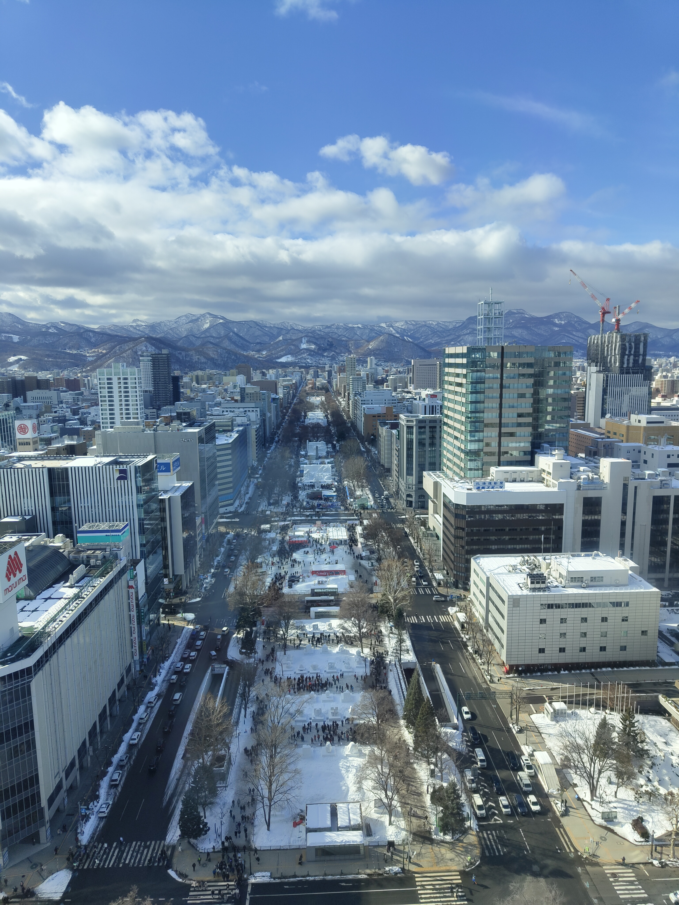
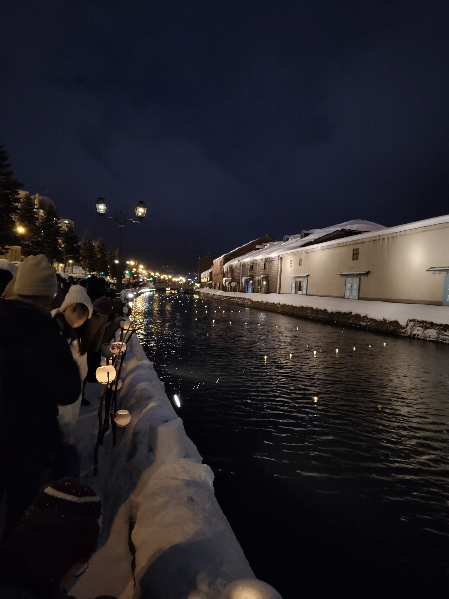
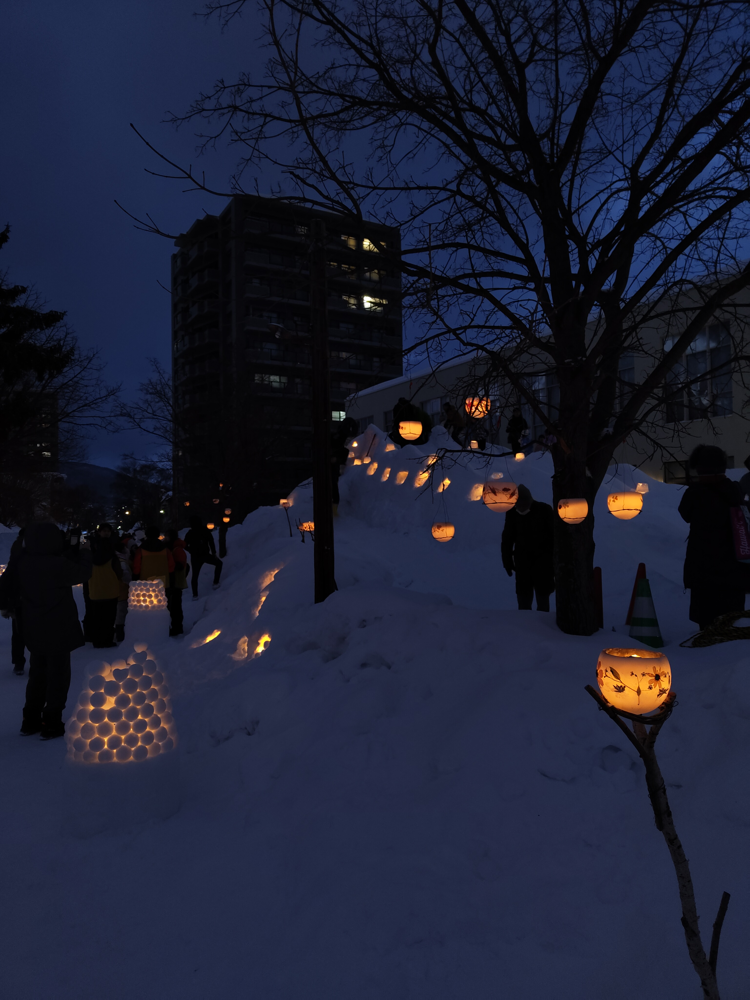

```{=html}
<style>
  .trip-header {
    text-align: center;
    padding: 60px 20px 40px;
    max-width: 860px;
    margin: 0 auto;
  }
  .trip-label {
    font-size: 0.75rem;
    letter-spacing: 0.2em;
    text-transform: uppercase;
    color: #9b8877;
    margin-bottom: 8px;
  }
  .trip-title {
    font-family: 'Plus Jakarta Sans', sans-serif;
    font-size: 2.6rem;
    font-weight: 800;
    color: #1E4264;
    margin: 0 0 12px;
    line-height: 1.1;
  }
  .trip-subtitle {
    font-family: 'Cormorant Garamond', serif;
    font-style: italic;
    font-size: 1.2rem;
    color: #6b7280;
    margin-bottom: 24px;
  }
  .trip-meta {
    display: flex;
    gap: 24px;
    justify-content: center;
    font-size: 0.8rem;
    color: #9b8877;
    letter-spacing: 0.06em;
    text-transform: uppercase;
    flex-wrap: wrap;
  }
  .section-divider {
    border: none;
    border-top: 1px solid #e0e0f0;
    margin: 48px auto;
    max-width: 600px;
  }
  .prose {
    max-width: 720px;
    margin: 0 auto;
    font-size: 1.05rem;
    line-height: 1.85;
    color: #2d3748;
  }
  .prose h2 {
    font-family: 'Plus Jakarta Sans', sans-serif;
    font-weight: 800;
    font-size: 1.6rem;
    color: #1E4264;
    margin-top: 56px;
    margin-bottom: 12px;
    text-align: center;
  }
  .prose p {
    margin-bottom: 1.4rem;
  }
  .media-block {
    max-width: 860px;
    margin: 32px auto;
    border-radius: 14px;
    overflow: hidden;
    box-shadow: 0 4px 24px rgba(0,0,0,0.10);
  }
  .media-block img,
  .media-block video {
    width: 100%;
    display: block;
    object-fit: cover;
  }
  .media-caption {
    font-family: 'Cormorant Garamond', serif;
    font-style: italic;
    font-size: 0.9rem;
    color: #9b8877;
    text-align: center;
    margin-top: 10px;
    padding: 0 12px 4px;
  }
  .pull-quote {
    font-family: 'Cormorant Garamond', serif;
    font-style: italic;
    font-size: 1.55rem;
    font-weight: 600;
    color: #1E4264;
    text-align: center;
    max-width: 640px;
    margin: 48px auto;
    line-height: 1.5;
    padding: 0 24px;
    border-left: 3px solid #c9aa96;
  }

  #quarto-document-content {
    display: flex;
    flex-direction: column;
    align-items: center;
  }

  #quarto-document-content > * {
    width: 100%;
    max-width: 860px;
  }
</style>

<div class="trip-header">
  <p class="trip-label">❄️ Travel</p>
  <h1 class="trip-title">So Much Snow</h1>
  <p class="trip-subtitle">Five days in Hokkaido in the depths of winter</p>
  <div class="trip-meta">
    <span>February 2025</span>
    <span>📍 Hokkaido, Japan</span>
    <span>✈️ 5 days</span>
  </div>
</div>

<hr class="section-divider">
```

<div id="sapporo"></div>
::: {.prose}

## Sapporo — Ice, Snow, and Genghis Khan

Hokkaido in February is a different planet. The snow is not the occasional dusting that the rest of Japan manages — it is deep, continuous, and entirely in charge. Sapporo under it becomes something between a city and a snow globe, and the Yuki Matsuri — the Snow Festival — leans into this completely, filling Odori Park with ice and snow sculptures on a scale that takes a moment to accept. Teams from around the world spend days constructing things that will melt in a few weeks, and the care and ambition of the results is extraordinary. Learning about Ainu culture at the festival added context that Hokkaido's history particularly rewards.

Skiing at Teine is the practical extension of all that snow — the slopes above the city, the powder genuinely excellent, the views over Sapporo and the bay below. The Hokkaido Jingu shrine surrounded by snow and stripped of summer crowds is a completely different experience from any other shrine visit. The Sapporo Beer Museum and the Koibito chocolate museum cover the remaining food groups. Genghis Khan — mutton grilled at the table over a domed iron plate — is the Hokkaido dish and the right choice for dinner in that cold.

:::

<div class="media-block">
  
  <p class="media-caption">Sapporo Snow Festival — the sculptures and the tower, the whole city under snow.</p>
</div>

<div style="display: grid; grid-template-columns: 1fr 1fr; gap: 1rem; margin: 2rem 0;">
  <figure style="margin: 0;">
    
    <figcaption class="media-caption">The ice sculptures — built to melt, remarkable while they last.</figcaption>
  </figure>
  <figure style="margin: 0;">
    
    <figcaption class="media-caption">From the top of the tower — Sapporo and the bay below, all of it white.</figcaption>
  </figure>
</div>

<div style="display: flex; gap: 1rem; margin: 2rem 0;">

  <div style="flex: 1;">
    <video autoplay muted loop playsinline
           style="width: 100%; max-height: 600px; object-fit: none; object-position: center; border-radius: 6px; display: block;">
      <source src="https://github.com/martinas-jucysbrady/martinas-jucysbrady.github.io/releases/download/v1.0-media/sapporo_snow.mp4" type="video/mp4" />
    </video>
    <p class="media-caption">The snow falling — continuous, heavy, entirely in charge.</p>
  </div>

  <div style="flex: 1;">
    <video autoplay muted loop playsinline
           style="width: 100%; max-height: 600px; object-fit: none; object-position: center; border-radius: 6px; display: block;">
      <source src="https://github.com/martinas-jucysbrady/martinas-jucysbrady.github.io/releases/download/v1.0-media/sapporo_angel.mp4" type="video/mp4" />
    </video>
    <p class="media-caption">Snow angels in the drifts — the only appropriate response to this much snow.</p>
  </div>
</div>

<div class="media-block" style="margin: 2rem 0;">
  <video autoplay muted loop playsinline
         style="width: 100%; max-height: 560px; object-fit: cover; object-position: center; border-radius: 6px; display: block;">
    <source src="https://github.com/martinas-jucysbrady/martinas-jucysbrady.github.io/releases/download/v1.0-media/sapporo_ski.mp4" type="video/mp4" />
  </video>
  <p class="media-caption">Teine — the slopes above the city, the powder doing what Hokkaido powder does.</p>
</div>

<div class="pull-quote">
  "The snow is not the occasional dusting that the rest of Japan manages — it is deep, continuous, and entirely in charge."
</div>

<hr class="section-divider">

<div id="otaru"></div>
::: {.prose}

## Otaru — Candlelight on the Canal

Otaru is an hour from Sapporo by train and a completely different atmosphere. The canal that runs through the old port district was built in the early twentieth century and the stone warehouses along it have been converted into cafés, shops, and restaurants — charming in the way that port towns with good bones tend to be when they stop being working ports.

In February it hosts the Otaru Snow Light Path festival — candles placed along the canal and through the streets, the whole town lit by candlelight in the snow. The effect in the evening is quiet and genuinely beautiful, the kind of thing that requires being there rather than photographed and explained.

:::

<div style="display: grid; grid-template-columns: 1fr 1fr; gap: 1rem; margin: 2rem 0;">
  <figure style="margin: 0;">
    
    <figcaption class="media-caption">The Otaru canal by candlelight — quiet, snow-covered, and worth the train.</figcaption>
  </figure>
  <figure style="margin: 0;">
    
    <figcaption class="media-caption">The streets lit by candles in the snow — the kind of thing that requires being there.</figcaption>
  </figure>
</div>

<div class="pull-quote">
  "The whole town lit by candlelight in the snow — quiet and genuinely beautiful."
</div>

<hr class="section-divider">

::: {.prose}

Five days in Hokkaido in February is exactly the right amount of time to understand why people talk about it the way they do. The snow is the point — not as a backdrop but as the thing itself, the defining condition that changes every experience from the skiing to the shrine visit to the canal walk. Sapporo under it is a different city. Otaru under it is a different town.

Go in winter. Go specifically for the snow. It will not disappoint.

:::

<div class="media-block">
  
  <p class="media-caption">Otaru — the right way to end a Hokkaido winter trip.</p>
</div>
