```{=html}
<style>
  .trip-header {
    text-align: center;
    padding: 60px 20px 40px;
    max-width: 860px;
    margin: 0 auto;
  }
  .trip-label {
    font-size: 0.75rem;
    letter-spacing: 0.2em;
    text-transform: uppercase;
    color: #9b8877;
    margin-bottom: 8px;
  }
  .trip-title {
    font-family: 'Plus Jakarta Sans', sans-serif;
    font-size: 2.6rem;
    font-weight: 800;
    color: #1E4264;
    margin: 0 0 12px;
    line-height: 1.1;
  }
  .trip-subtitle {
    font-family: 'Cormorant Garamond', serif;
    font-style: italic;
    font-size: 1.2rem;
    color: #6b7280;
    margin-bottom: 24px;
  }
  .trip-meta {
    display: flex;
    gap: 24px;
    justify-content: center;
    font-size: 0.8rem;
    color: #9b8877;
    letter-spacing: 0.06em;
    text-transform: uppercase;
    flex-wrap: wrap;
  }
  .section-divider {
    border: none;
    border-top: 1px solid #e0e0f0;
    margin: 48px auto;
    max-width: 600px;
  }
  .prose {
    max-width: 720px;
    margin: 0 auto;
    font-size: 1.05rem;
    line-height: 1.85;
    color: #2d3748;
  }
  .prose h2 {
    font-family: 'Plus Jakarta Sans', sans-serif;
    font-weight: 800;
    font-size: 1.6rem;
    color: #1E4264;
    margin-top: 56px;
    margin-bottom: 12px;
    text-align: center;
  }
  .prose p {
    margin-bottom: 1.4rem;
  }
  .media-block {
    max-width: 860px;
    margin: 32px auto;
    border-radius: 14px;
    overflow: hidden;
    box-shadow: 0 4px 24px rgba(0,0,0,0.10);
  }
  .media-block img,
  .media-block video {
    width: 100%;
    display: block;
    object-fit: cover;
  }
  .media-caption {
    font-family: 'Cormorant Garamond', serif;
    font-style: italic;
    font-size: 0.9rem;
    color: #9b8877;
    text-align: center;
    margin-top: 10px;
    padding: 0 12px 4px;
  }
  .pull-quote {
    font-family: 'Cormorant Garamond', serif;
    font-style: italic;
    font-size: 1.55rem;
    font-weight: 600;
    color: #1E4264;
    text-align: center;
    max-width: 640px;
    margin: 48px auto;
    line-height: 1.5;
    padding: 0 24px;
    border-left: 3px solid #c9aa96;
  }

  #quarto-document-content {
    display: flex;
    flex-direction: column;
    align-items: center;
  }

  #quarto-document-content > * {
    width: 100%;
    max-width: 860px;
  }
</style>

<div class="trip-header">
  <p class="trip-label">🌋 Travel</p>
  <h1 class="trip-title">Kyushu</h1>
  <p class="trip-subtitle">Japan's southern island — volcanoes, shrines, and seafood</p>
  <div class="trip-meta">
    <span>March 2025 & August 2025</span>
    <span>📍 Kyushu, Japan</span>
    <span>✈️ 2 trips</span>
  </div>
</div>

<hr class="section-divider">
```

<div id="oita"></div>
::: {.prose}

## Oita — Hells, Shrines, and Stone Buddhas

Oita Prefecture is defined by its geothermal energy — hot springs, steam rising from the ground, and the Hells of Beppu, a collection of dramatic boiling pools in vivid blues, reds, and greys that are named accordingly. Visiting all of them is the right call: each has a completely different character and the cumulative effect of them is genuinely extraordinary.

The Usuki Stone Buddhas are one of the more unexpected finds in Japan — a collection of over sixty stone-carved Buddhist figures dating from the late Heian period, worn by centuries of weather into something both ancient and mesmerising. The Hachiman Nada-gu shrine sits on rocks in the water and is beautiful in the way that coastal shrines in Japan tend to be, which is not a small thing to say. The Bishago Sister Rock shrine, hanging between rock formations, is another of those places that rewards the detour entirely.

The Bungo Mori Roundhouse is a preserved railway roundhouse from the steam era — cool history, well-maintained, and the kind of place that makes you glad someone decided to keep it. The cherry blossoms, the seafood, the art museum. Oita packs more than its reputation suggests.

:::

<div class="media-block" style="margin: 2rem 0;">
  <video autoplay muted loop playsinline
         style="width: 100%; max-height: 520px; object-fit: cover; object-position: center; border-radius: 6px; display: block;">
    <source src="https://github.com/martinas-jucysbrady/martinas-jucysbrady.github.io/releases/download/v1.0-media/oita_beppu.mp4" type="video/mp4" />
  </video>
  <p class="media-caption">One of the Hells of Beppu — that blue is real, and it is that blue.</p>
</div>

<div style="display: grid; grid-template-columns: 1fr 1fr; gap: 1rem; margin: 2rem 0;">
  <figure style="margin: 0;">
    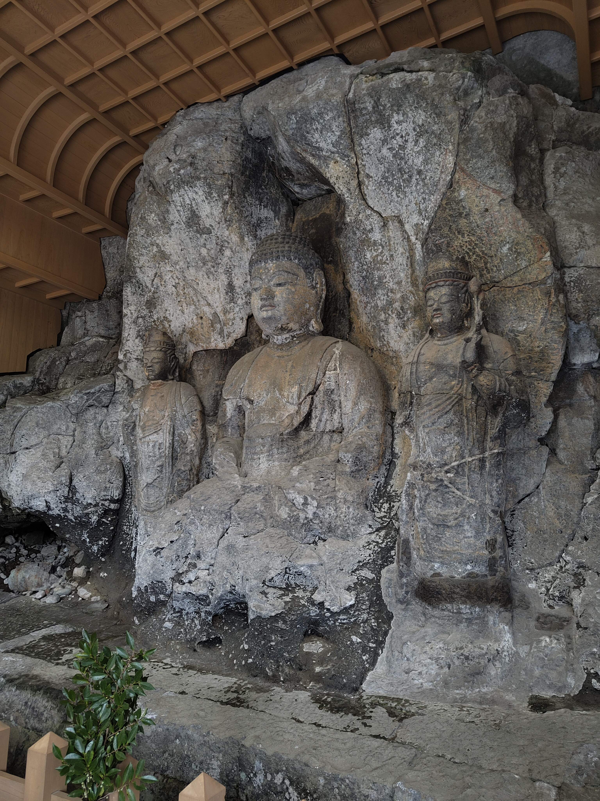
    <figcaption class="media-caption">The Usuki Stone Buddhas — centuries of weather, still mesmerising.</figcaption>
  </figure>
  <figure style="margin: 0;">
    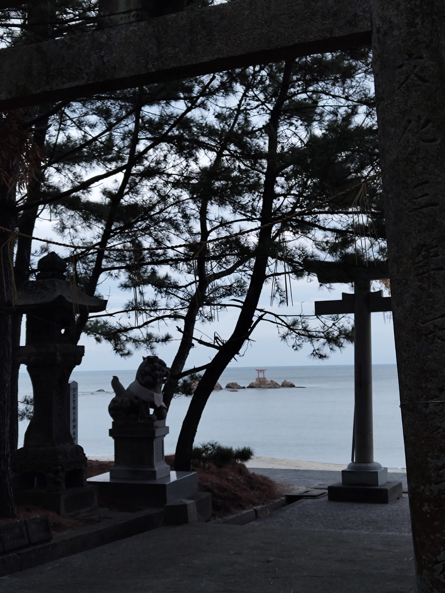
    <figcaption class="media-caption">Hachiman Nada-gu — the shrine on the rocks, the water around it.</figcaption>
  </figure>
</div>

<div style="display: grid; grid-template-columns: 1fr 1fr; gap: 1rem; margin: 2rem 0;">
  <figure style="margin: 0;">
    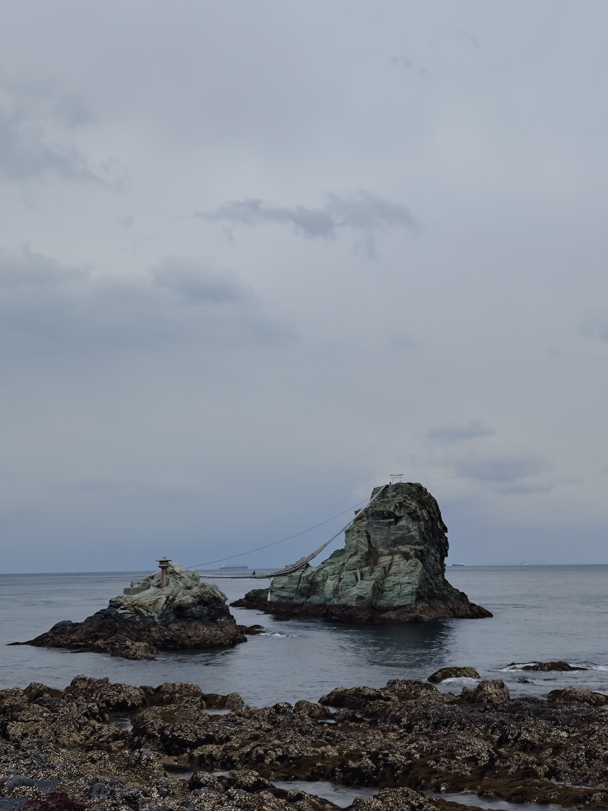
    <figcaption class="media-caption">Bishago Sister Rock — a shrine hanging between the rocks, beautiful.</figcaption>
  </figure>
  <figure style="margin: 0;">
    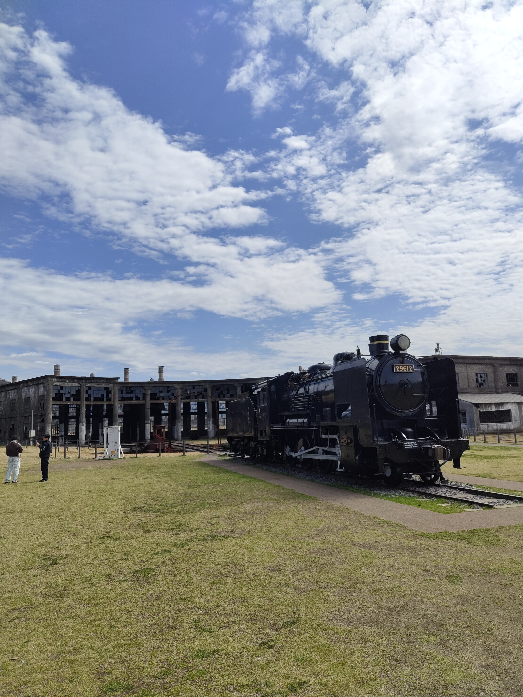
    <figcaption class="media-caption">Bungo Mori Roundhouse — preserved steam-era railway history.</figcaption>
  </figure>
</div>

<div style="display: grid; grid-template-columns: 1fr 1fr; gap: 1rem; margin: 2rem 0;">
  <figure style="margin: 0;">
    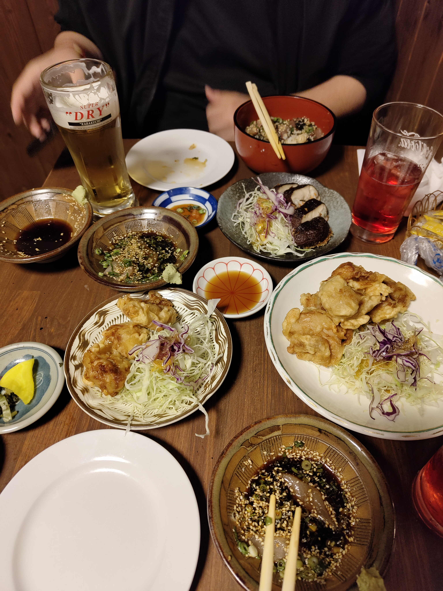
    <figcaption class="media-caption">Oita seafood — fresh, varied, and the right way to end a day here.</figcaption>
  </figure>
  <figure style="margin: 0;">
    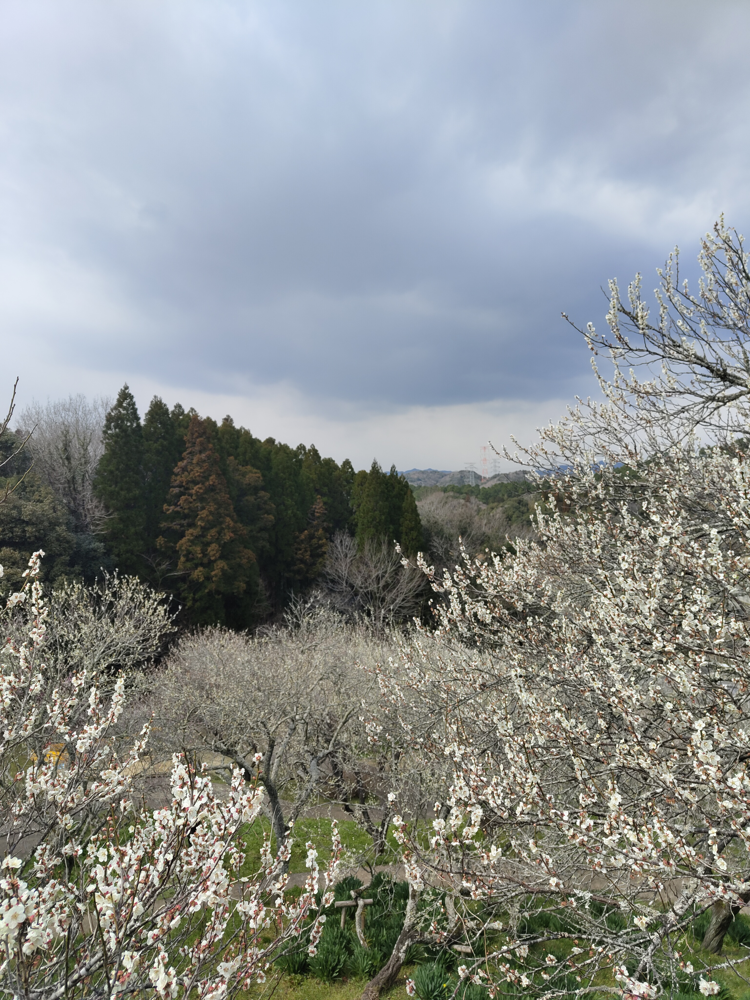
    <figcaption class="media-caption">Cherry blossoms in March — Oita in the right season.</figcaption>
  </figure>
</div>

<hr class="section-divider">

<div id="fukuoka"></div>
::: {.prose}

## Fukuoka — Hidden Temples and Koi Streets

Fukuoka is often treated as a gateway city and undersold as a destination. It shouldn't be. The city itself has a vibrant, charming quality — the canal city shopping complex is genuinely good, Ohori Park is the kind of park you spend longer in than planned, and Hakata ramen is among the best ramen in Japan, which is a high bar.

Nanzo-in Temple is the hidden gem near the city that most visitors miss — a massive reclining bronze Buddha, the largest in the world, resting in a quiet forest complex that operates at a completely different pace from the city twenty minutes away. The koi fish street in Yame is exactly what it sounds like and better than that suggests. Shika Island has a beach and a shrine and a ferry crossing that is worth doing for the crossing alone. The Futamigaura torii gate standing on rocks in the ocean is one of those images that Kyushu keeps producing — white, dramatic, the sea around it.

:::

<div style="display: grid; grid-template-columns: 1fr 1fr; gap: 1rem; margin: 2rem 0;">
  <figure style="margin: 0;">
    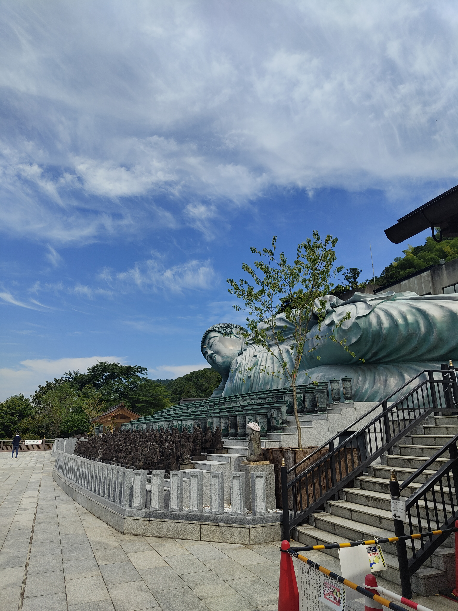
    <figcaption class="media-caption">Nanzo-in — a hidden gem, the reclining Buddha in a quiet forest.</figcaption>
  </figure>
  <figure style="margin: 0;">
    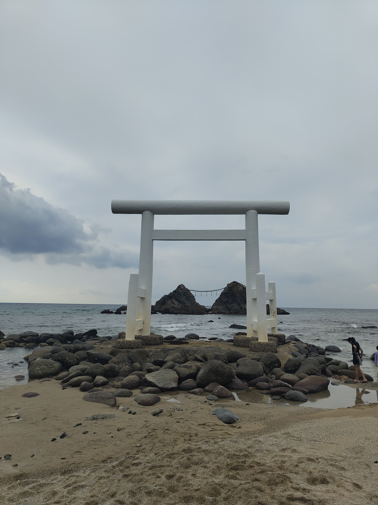
    <figcaption class="media-caption">Futamigaura — the white torii on the rocks, the ocean around it.</figcaption>
  </figure>
</div>

<div style="display: grid; grid-template-columns: 1fr 1fr 1fr; gap: 1rem; margin: 2rem 0;">
  <figure style="margin: 0;">
    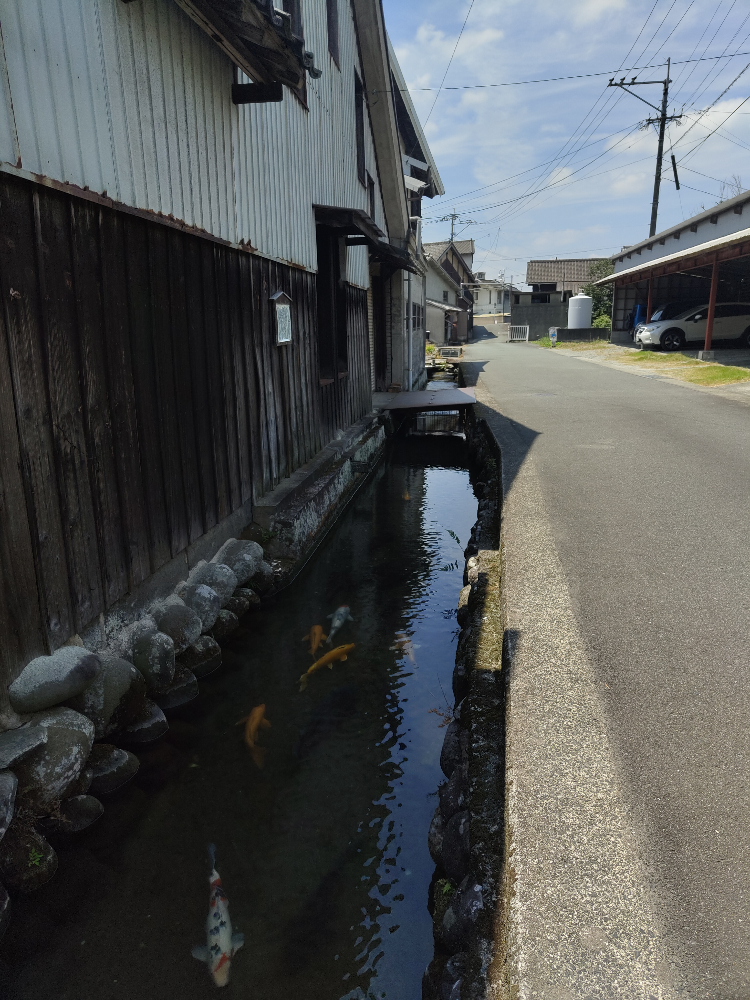
    <figcaption class="media-caption">Koi street in Yame — better than it sounds.</figcaption>
  </figure>
  <figure style="margin: 0;">
    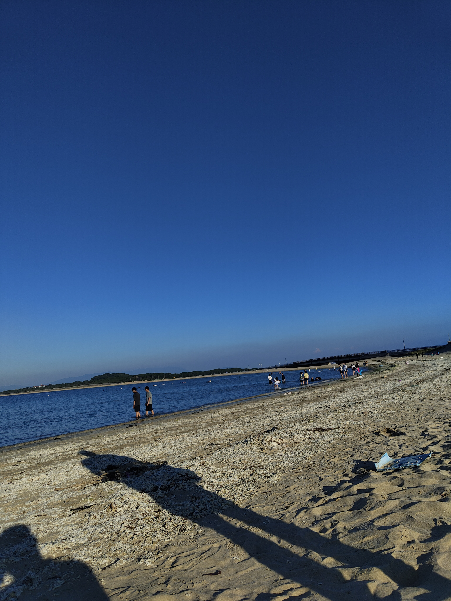
    <figcaption class="media-caption">Shika Island — beach, shrine, ferry worth taking for the crossing.</figcaption>
  </figure>
  <figure style="margin: 0;">
    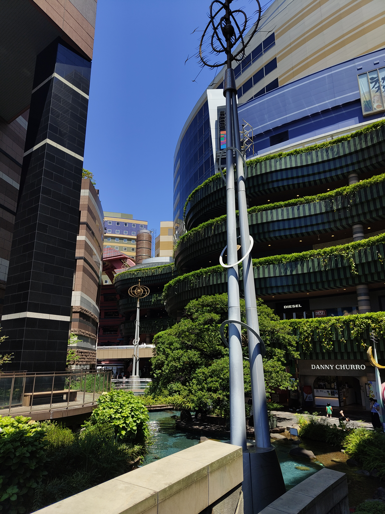
    <figcaption class="media-caption">Canal City — genuinely good shopping complex.</figcaption>
  </figure>
</div>

<div style="display: grid; grid-template-columns: 1fr 1fr; gap: 1rem; margin: 2rem 0;">
  <figure style="margin: 0;">
    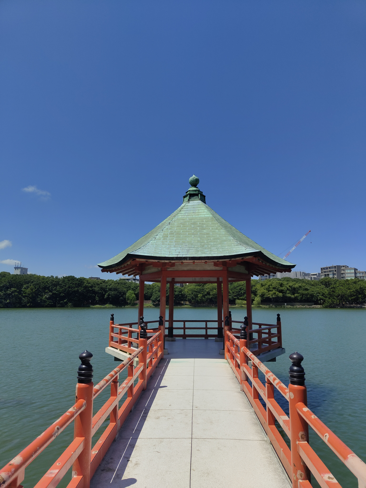
    <figcaption class="media-caption">Ohori Park — the kind of park you spend longer in than planned.</figcaption>
  </figure>
  <figure style="margin: 0;">
    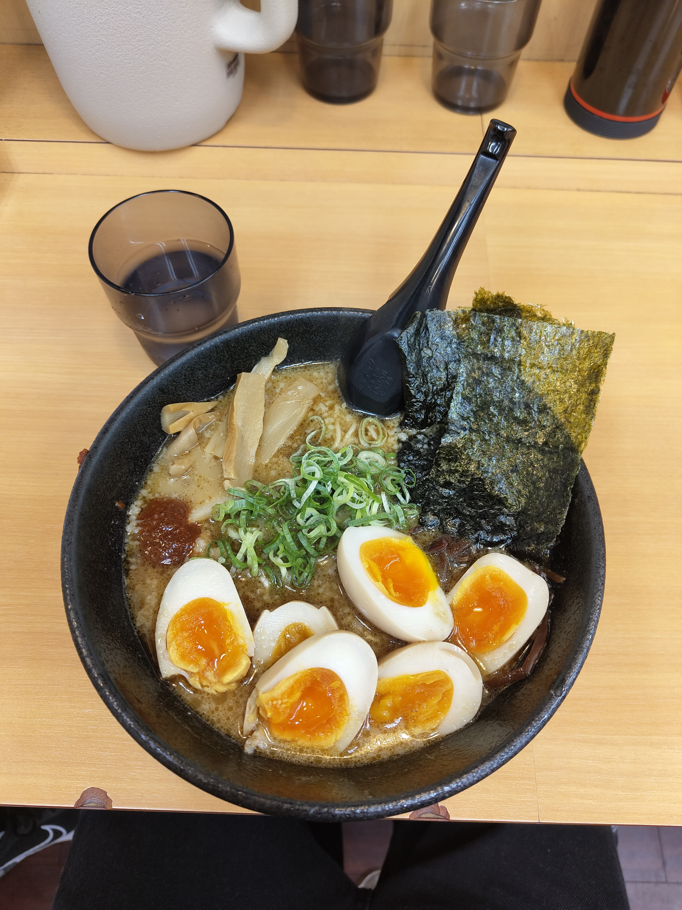
    <figcaption class="media-caption">Hakata ramen — among the best ramen in Japan, which is a high bar.</figcaption>
  </figure>
</div>

<hr class="section-divider">

<div id="saga"></div>
::: {.prose}

## Saga — Rice Fields and Pottery

Saga is a prefecture that rewards the detour. The terraced rice fields of Hamanoura are the kind of scenery that makes you stop the car and get out — the fields stepping down the hillside in curves that look designed rather than farmed, surrounded by forest and mountains. It is one of the better landscapes in Kyushu.

Okawachiyama is a village built entirely around pottery — the narrow streets lined with workshops and galleries producing Imari ware, one of Japan's most celebrated ceramic traditions. It is charming, unhurried, and the kind of place where you buy something you didn't know you needed and are glad you did.

:::

<div style="display: grid; grid-template-columns: 1fr 1fr; gap: 1rem; margin: 2rem 0;">
  <figure style="margin: 0;">
    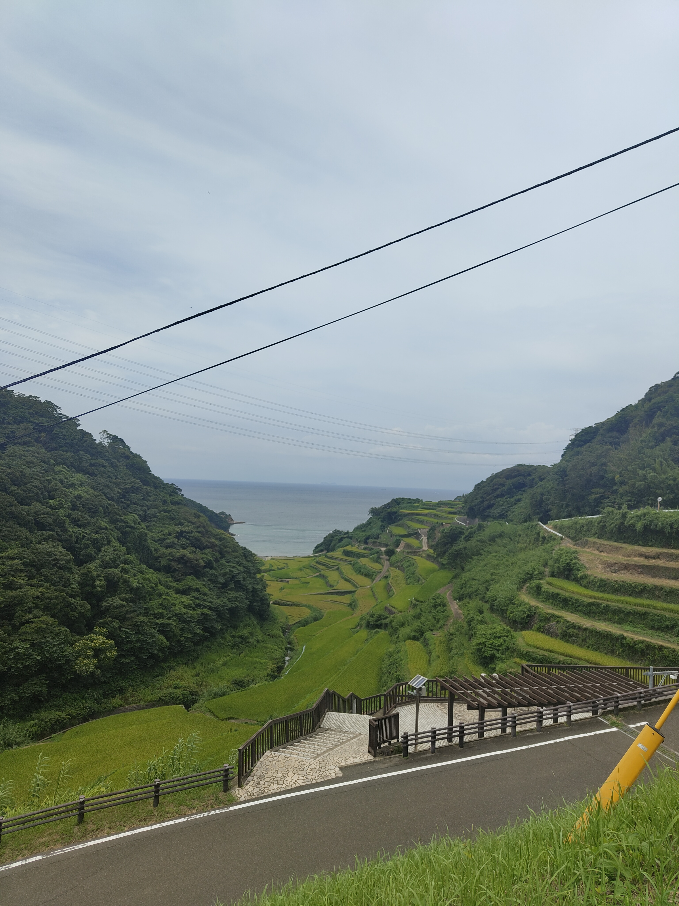
    <figcaption class="media-caption">Hamanoura — terraced rice fields stepping down the hillside in curves.</figcaption>
  </figure>
  <figure style="margin: 0;">
    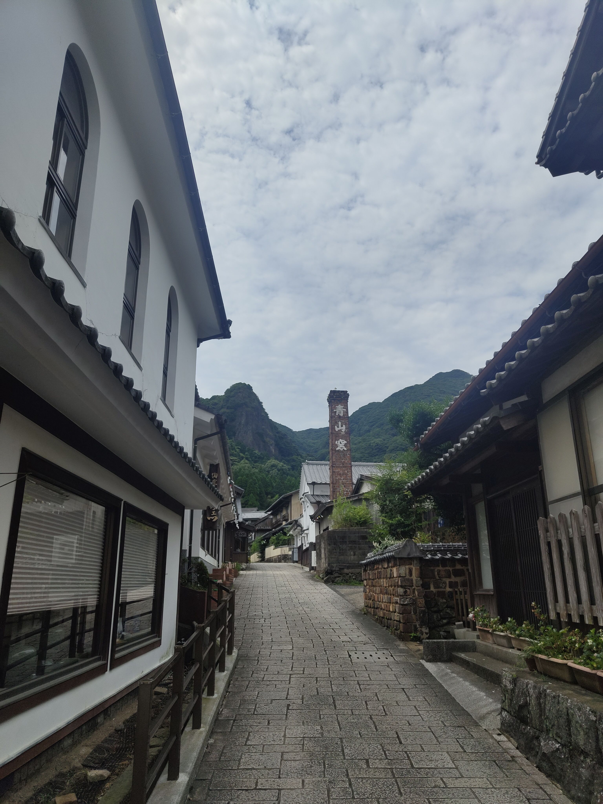
    <figcaption class="media-caption">Okawachiyama — a village built entirely around pottery, charming and unhurried.</figcaption>
  </figure>
</div>

<hr class="section-divider">

<div id="nagasaki"></div>
::: {.prose}

## Nagasaki — History Layered Deep

Nagasaki carries more history per square kilometre than almost anywhere in Japan. The atomic bomb remnants and museum are essential — the split torii gate, standing at an angle where the blast caught it, is the image that stays with you long after leaving. The museum itself is one of the most important in Japan and deserves more time than most visitors give it.

Ikeshima Island is the unexpected highlight — a former coal mining island now largely abandoned, where a guided tour takes you into the mines themselves via minecart. The industrial ruins above ground are being reclaimed by nature in the way that Hashima (Gunkanjima) made famous, and Gunkanjima's silhouette is visible on the horizon from the Nagasaki coast.

Unzen Jigoku is a different kind of geological spectacle — an onsen town in the mountains where the ground vents steam between rocks and trees, the whole landscape smelling of sulphur and hot water. The Shimabara Castle below it is one of the better castles in Kyushu. Ayugaeri Falls, catching the light through the surrounding forest, is the kind of waterfall that makes you stay longer than planned. The buried houses of Mt. Unzen — preserved under volcanic debris from the 1991 eruption — are a surreal and sobering reminder of what volcanoes actually do.

The dinosaur museum with its Pokémon fossil event was a surprise bonus.

:::

<div style="display: grid; grid-template-columns: 1fr 1fr; gap: 1rem; margin: 2rem 0;">
  <figure style="margin: 0;">
    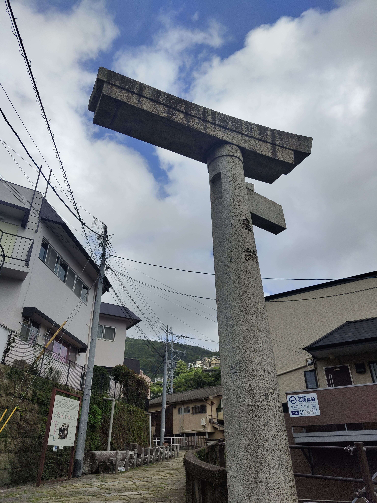
    <figcaption class="media-caption">The split torii — caught by the blast at an angle, still standing.</figcaption>
  </figure>
  <figure style="margin: 0;">
    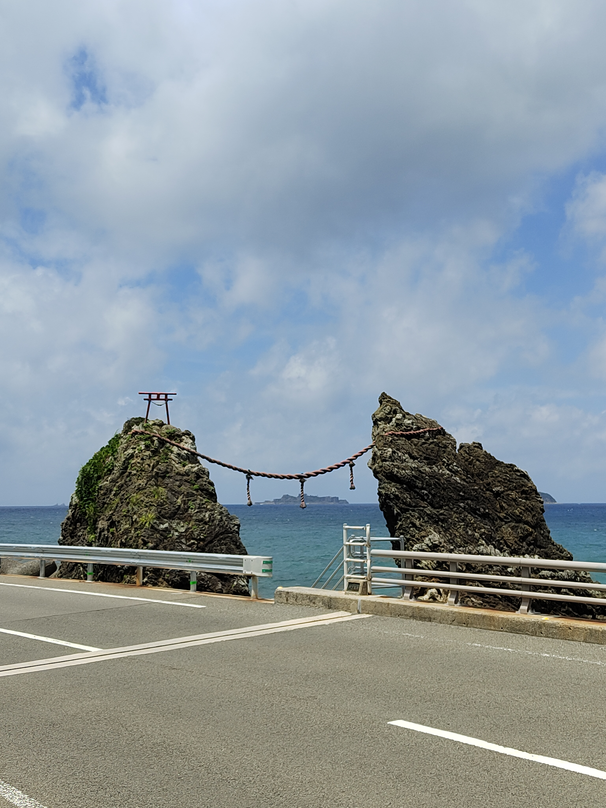
    <figcaption class="media-caption">Gunkanjima on the horizon — the abandoned island visible from the coast.</figcaption>
  </figure>
</div>

<div style="display: grid; grid-template-columns: 1fr 1fr; gap: 1rem; margin: 2rem 0;">
  <figure style="margin: 0;">
    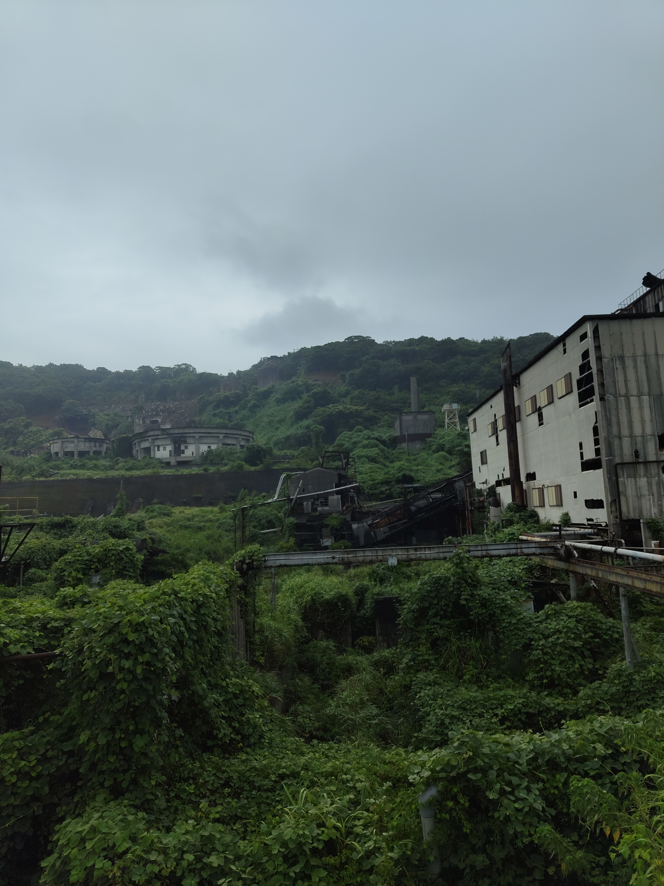
    <figcaption class="media-caption">Ikeshima — nature reclaiming the abandoned mining complex.</figcaption>
  </figure>
  <figure style="margin: 0;">
    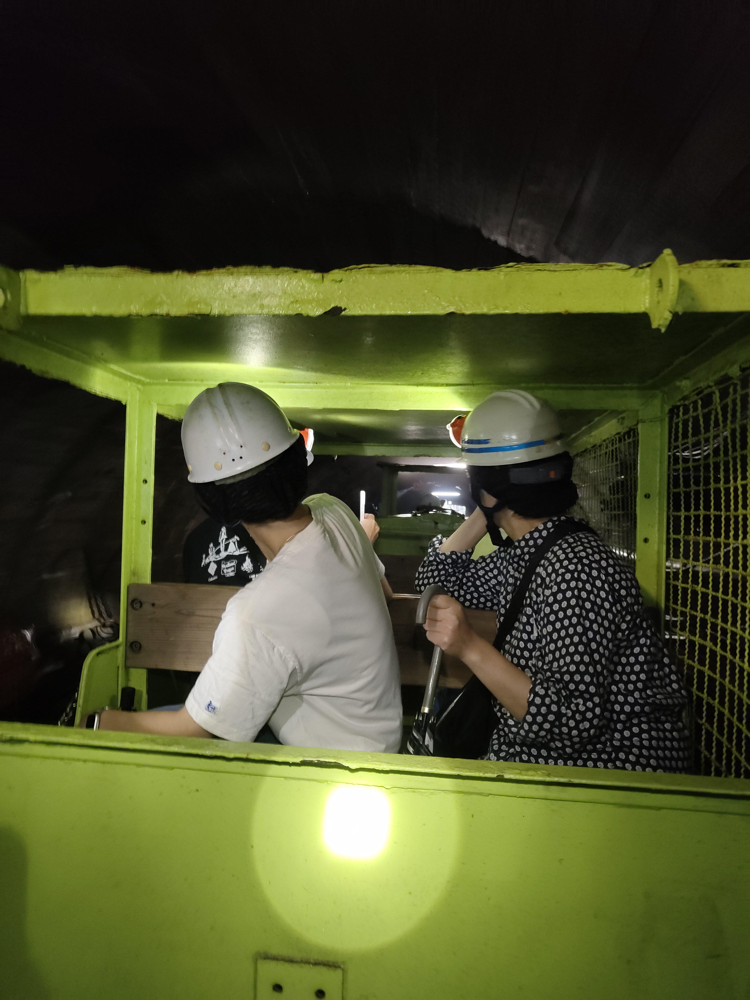
    <figcaption class="media-caption">Into the mines by minecart — one of the better tours in Kyushu.</figcaption>
  </figure>
</div>

<div style="display: grid; grid-template-columns: 1fr 1fr; gap: 1rem; margin: 2rem 0;">
  <figure style="margin: 0;">
    
    <figcaption class="media-caption">Unzen Jigoku — steam rising through the rocks and trees.</figcaption>
  </figure>
  <figure style="margin: 0;">
    
    <figcaption class="media-caption">Shimabara Castle — one of the better castles in Kyushu.</figcaption>
  </figure>
</div>

<div style="display: grid; grid-template-columns: 1fr 1fr; gap: 1rem; margin: 2rem 0;">
  <figure style="margin: 0;">
    
    <figcaption class="media-caption">Ayugaeri Falls — catching the light through the surrounding forest.</figcaption>
  </figure>
  <figure style="margin: 0;">
    
    <figcaption class="media-caption">The buried houses of Mt. Unzen — a sobering reminder of what volcanoes actually do.</figcaption>
  </figure>
</div>

<div style="display: grid; grid-template-columns: 1fr 1fr; gap: 1rem; margin: 2rem 0;">
  <figure style="margin: 0;">
    
    <figcaption class="media-caption">Mt. Inasa at night — Nagasaki spread below, one of Japan's three great night views.</figcaption>
  </figure>
  <figure style="margin: 0;">
    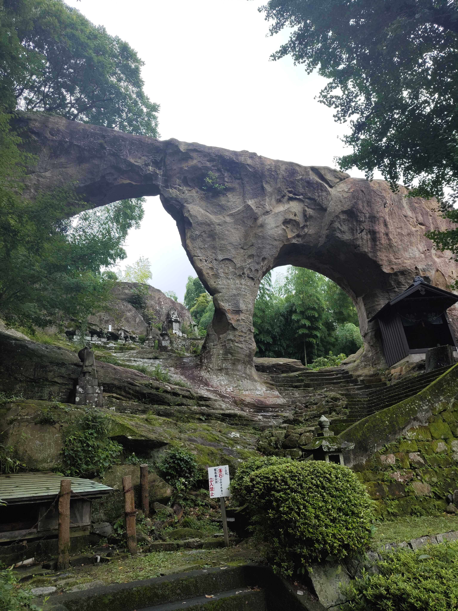
    <figcaption class="media-caption">Megane-iwa — the glasses rock, weird and beautiful in equal measure.</figcaption>
  </figure>
</div>

<div style="display: grid; grid-template-columns: 1fr 1fr; gap: 1rem; margin: 2rem 0;">
  <figure style="margin: 0;">
    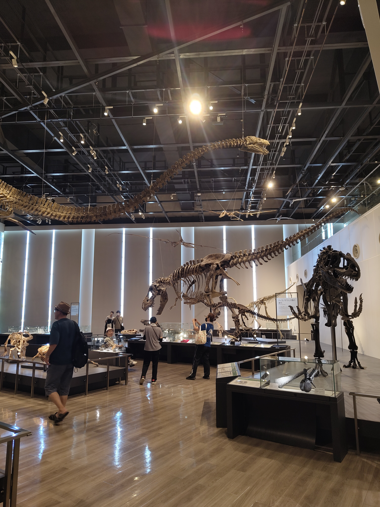
    <figcaption class="media-caption">The dinosaur museum — skeletons and a Pokémon fossil event.</figcaption>
  </figure>
  <figure style="margin: 0;">
    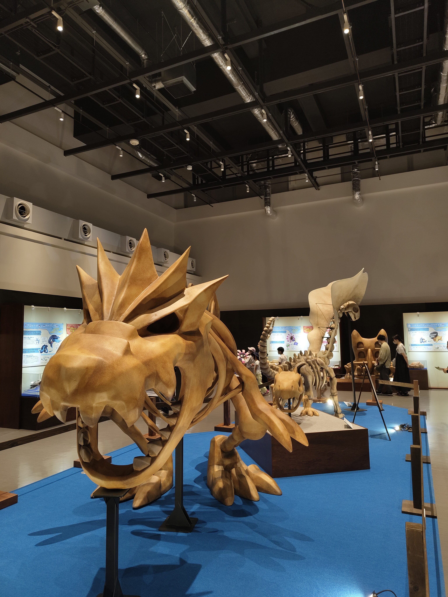
    <figcaption class="media-caption">The Pokémon fossil event — an unexpected bonus.</figcaption>
  </figure>
</div>

<div class="pull-quote">
  "The split torii — caught by the blast at an angle, still standing."
</div>

<hr class="section-divider">

<div id="kumamoto"></div>
::: {.prose}

## Kumamoto — Dolphins, Volcanoes, and the Shrine in the Forest

Kumamoto is the prefecture where Kyushu fully reveals itself. The Amakusa Islands off the west coast are a chain of small islands connected by bridges, and the dolphin watching tours that operate from there are the kind of experience that photographs do not capture — the dolphins coming alongside the boat, surfacing repeatedly, the whole bay alive with them.

Kuratake Shrine sits at the top of the mountains overlooking all the islands, and the view from there is genuinely indescribable. The kind of panorama that makes you stand still for a long time. The Nagabeta seabed road — a concrete road that disappears into the ocean at high tide — is one of those things that exists in Japan and makes perfect sense in context.

Mount Aso is the centrepiece of the prefecture — an active caldera so large that towns exist inside it, and the view from the Daikanbo lookout over the caldera, and the Kusasenrigahama grasslands rolling toward the crater, is among the best landscapes in Japan. The Kamishikimi Kumanoimasu Shrine near Aso is the hidden one: moss-covered torii gates in a forest approach, stone pillars, a cave at the top. The kind of shrine that makes you understand why people call Kyushu the spiritual heart of Japan.

:::

<div class="media-block" style="margin: 2rem 0;">
  <video autoplay muted loop playsinline
         style="width: 100%; max-height: 520px; object-fit: cover; object-position: center; border-radius: 6px; display: block;">
    <source src="https://github.com/martinas-jucysbrady/martinas-jucysbrady.github.io/releases/download/v1.0-media/kumamoto_dolphins.mp4" type="video/mp4" />
  </video>
  <p class="media-caption">Dolphins off the Amakusa Islands — coming alongside the boat, the bay full of them.</p>
</div>

<div class="media-block" style="margin: 2rem 0;">
  <video autoplay muted loop playsinline
         style="width: 100%; max-height: 520px; object-fit: cover; object-position: center; border-radius: 6px; display: block;">
    <source src="https://github.com/martinas-jucysbrady/martinas-jucysbrady.github.io/releases/download/v1.0-media/kumamoto_kuratake1.mp4" type="video/mp4" />
  </video>
  <p class="media-caption">Kuratake Shrine — the view over the Amakusa Islands from the top of the mountain.</p>
</div>

<div style="display: grid; grid-template-columns: 1fr 1fr; gap: 1rem; margin: 2rem 0;">
  <figure style="margin: 0;">
    
    <figcaption class="media-caption">Kuratake — looks even better in real life, which is not nothing.</figcaption>
  </figure>
  <figure style="margin: 0;">
    
    <figcaption class="media-caption">The Nagabeta seabed road — swallowed by the ocean at high tide.</figcaption>
  </figure>
</div>

<div style="display: grid; grid-template-columns: 1fr 1fr; gap: 1rem; margin: 2rem 0;">
  <figure style="margin: 0;">
    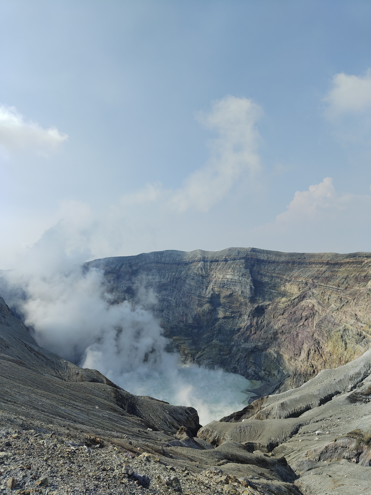
    <figcaption class="media-caption">Mt. Aso's crater — active, spectacular, the scale of it impossible to photograph properly.</figcaption>
  </figure>
  <figure style="margin: 0;">
    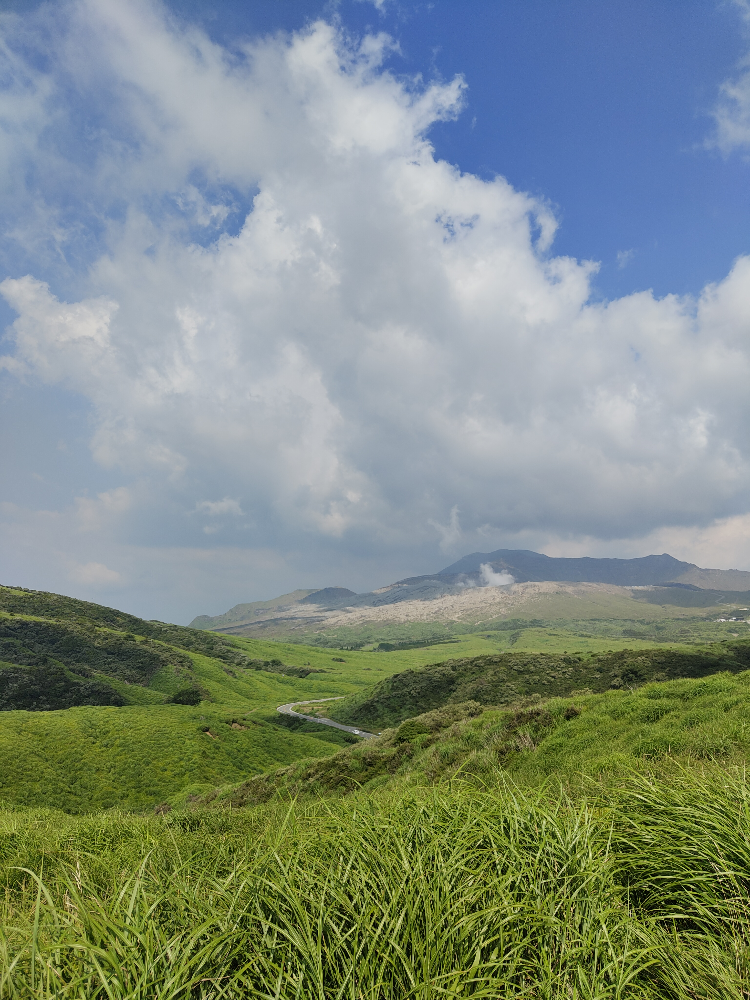
    <figcaption class="media-caption">The Kusasenrigahama grasslands rolling toward the volcano — among the best landscapes in Japan.</figcaption>
  </figure>
</div>

<div style="display: grid; grid-template-columns: 1fr 1fr; gap: 1rem; margin: 2rem 0;">
  <figure style="margin: 0;">
    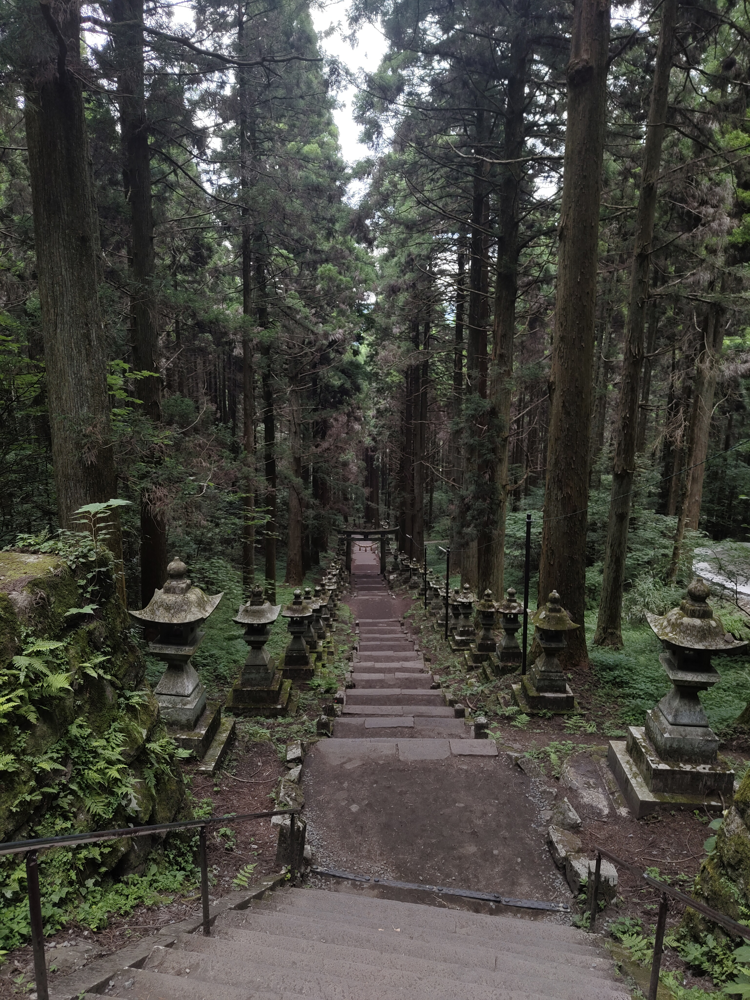
    <figcaption class="media-caption">Kamishikimi Kumanoimasu — moss-covered torii in the forest, looking down from the approach.</figcaption>
  </figure>
  <figure style="margin: 0;">
    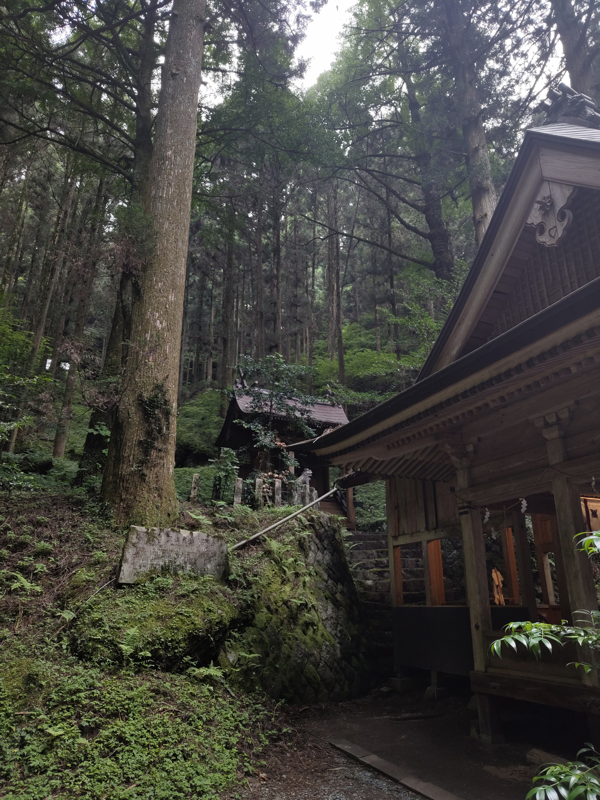
    <figcaption class="media-caption">The cave at the top — overgrowth and stone, the forest closing in around it.</figcaption>
  </figure>
</div>

<hr class="section-divider">

<div id="kagoshima"></div>
::: {.prose}

## Kagoshima — Sakurajima and the Food

Kagoshima is defined by Sakurajima — an active stratovolcano sitting in the middle of Kagoshima Bay that erupts regularly and deposits ash across the city. The day we were there the sky around it was heavy with ominous cloud. The day after we left, it erupted. The Kurokami buried shrine shows what that means in practice: a shrine entrance nearly completely buried under accumulated volcanic ash, the torii visible only at the top. Nature making its position clear.

The cave at Mizunokuchi is beautiful from outside — the trees and shrine at the entrance framing the darkness beyond in a way that earns the visit before you've gone in. The Kirishima Shrine and Maruo Falls are both worth the time.

The food in Kagoshima is the best argument for spending longer here. Black pork — kurobuta, effectively wagyu-level quality applied to pork — is the local speciality and the description does not oversell it: you would think it was a prime cut of beef. Raw chicken sold fresh from supermarket packets is a Kagoshima thing made possible by the prefecture's salmonella-resistant chicken breeds — it is exactly as unusual as it sounds and surprisingly good. Traditional yakiniku rounds it all out.

The cat that followed us around Sakurajima was an unexpected highlight.

:::

<div style="display: grid; grid-template-columns: 1fr 1fr; gap: 1rem; margin: 2rem 0;">
  <figure style="margin: 0;">
    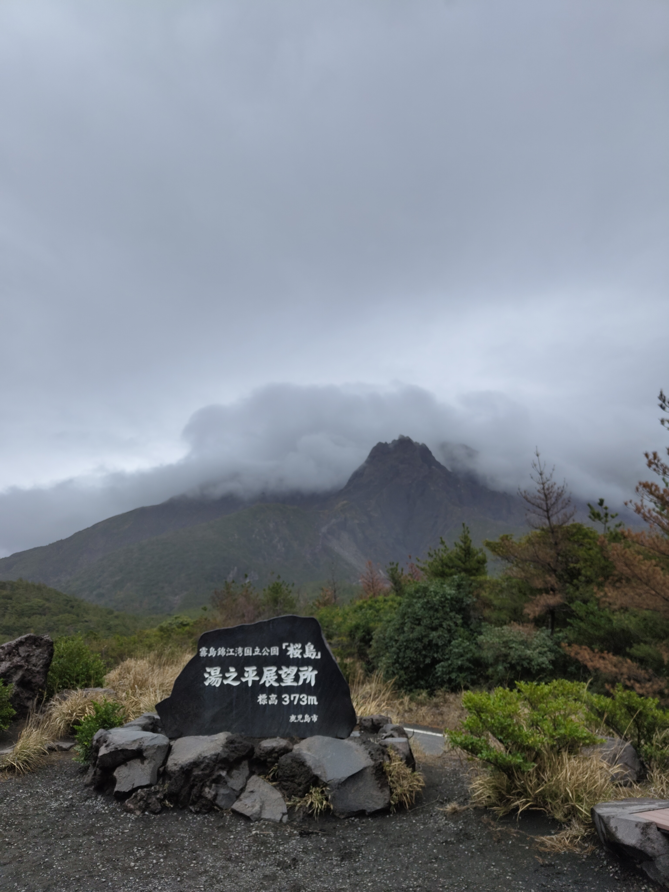
    <figcaption class="media-caption">Sakurajima — surrounded by ominous cloud, and it erupted the day after we left.</figcaption>
  </figure>
  <figure style="margin: 0;">
    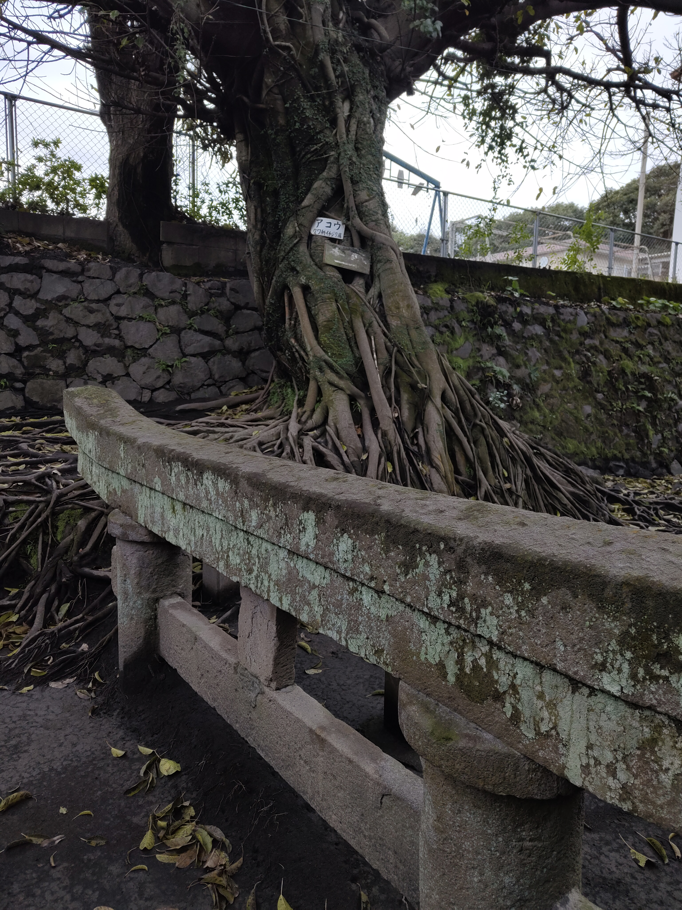
    <figcaption class="media-caption">The Kurokami buried shrine — the torii visible only at the top, the rest under ash.</figcaption>
  </figure>
</div>

<div class="media-block" style="margin: 2rem 0;">
  <video autoplay muted loop playsinline
         style="width: 100%; max-height: 520px; object-fit: cover; object-position: center; border-radius: 6px; display: block;">
    <source src="https://github.com/martinas-jucysbrady/martinas-jucysbrady.github.io/releases/download/v1.0-media/kagoshima_caveout.mp4" type="video/mp4" />
  </video>
  <p class="media-caption">Mizunokuchi — the trees and shrine outside the cave, the darkness beyond.</p>
</div>

<div style="display: grid; grid-template-columns: 1fr 1fr; gap: 1rem; margin: 2rem 0;">
  <figure style="margin: 0;">
    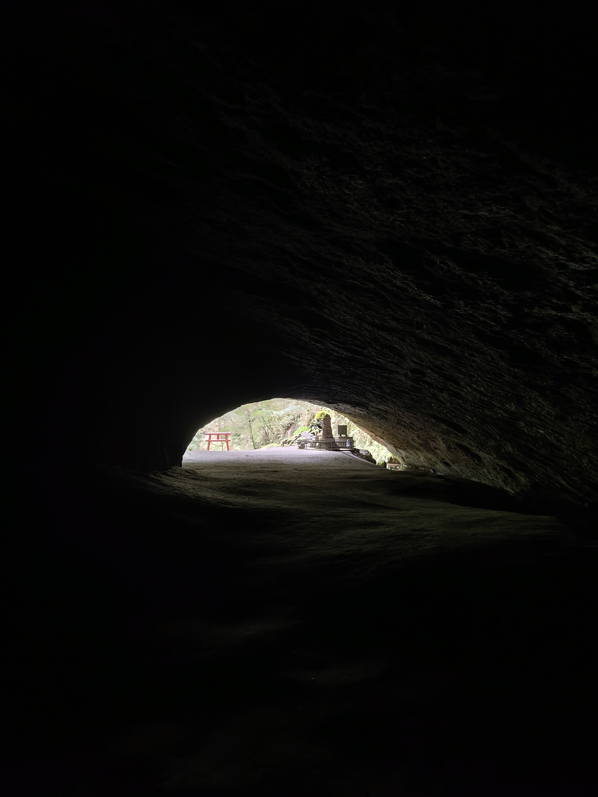
    <figcaption class="media-caption">From inside the cave — the shrine framed in the entrance, the forest beyond.</figcaption>
  </figure>
  <figure style="margin: 0;">
    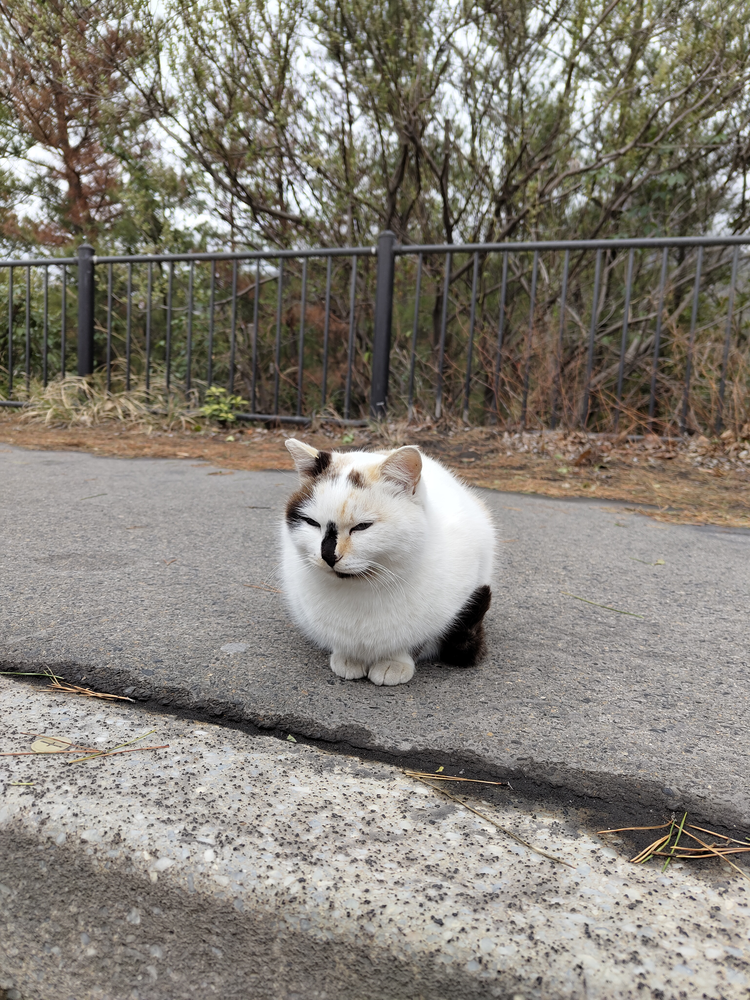
    <figcaption class="media-caption">The Sakurajima cat — followed us around, entirely unbothered by the volcano.</figcaption>
  </figure>
</div>

<div style="display: grid; grid-template-columns: 1fr 1fr 1fr; gap: 1rem; margin: 2rem 0;">
  <figure style="margin: 0;">
    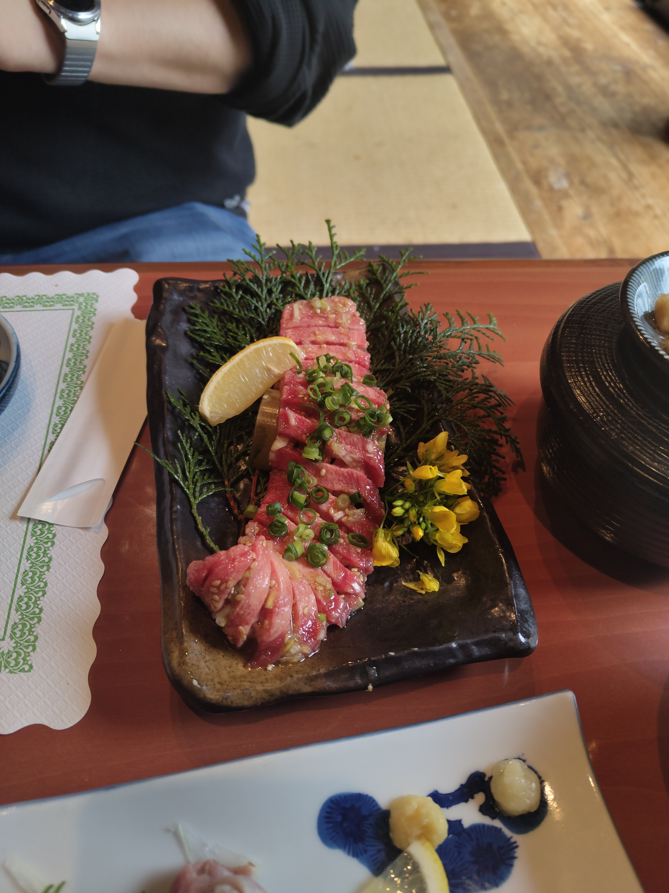
    <figcaption class="media-caption">Black pork — you would think it was a prime cut of beef.</figcaption>
  </figure>
  <figure style="margin: 0;">
    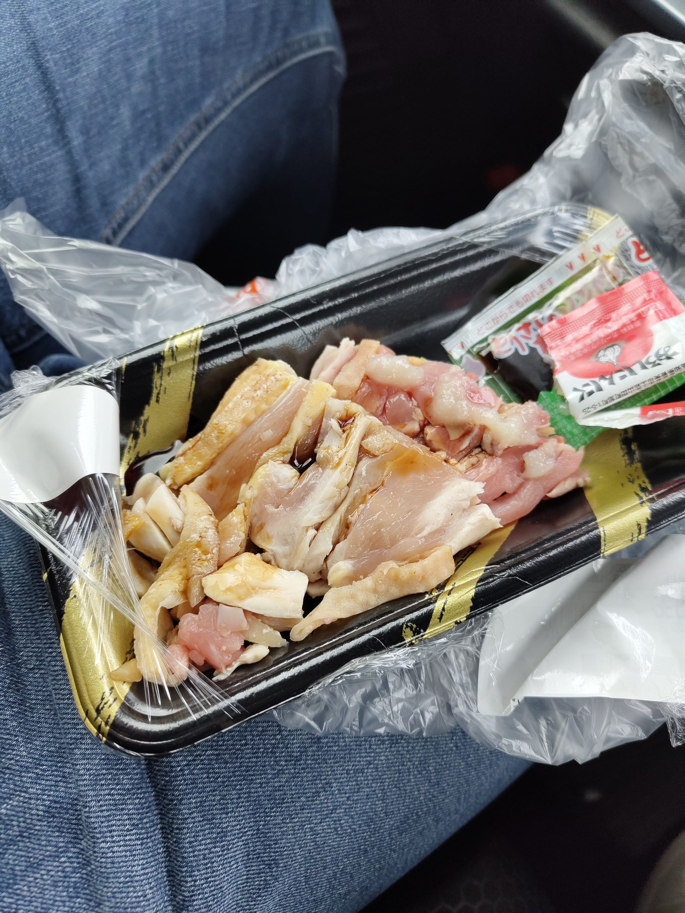
    <figcaption class="media-caption">Raw chicken from the supermarket — a Kagoshima thing, surprisingly good.</figcaption>
  </figure>
  <figure style="margin: 0;">
    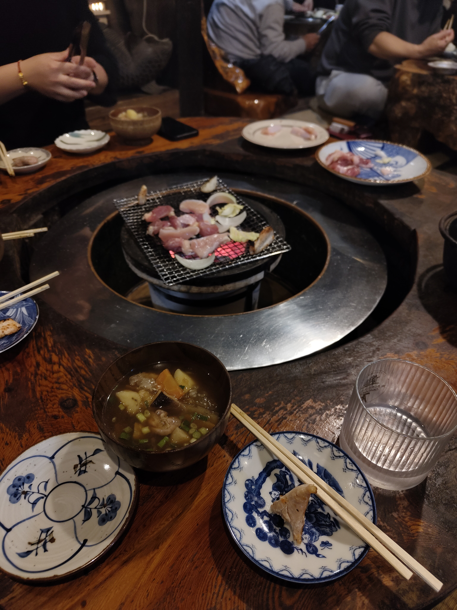
    <figcaption class="media-caption">Yakiniku — the third argument for staying longer in Kagoshima.</figcaption>
  </figure>
</div>

<div class="pull-quote">
  "The day after we left, it erupted."
</div>

<hr class="section-divider">

<div id="miyazaki"></div>
::: {.prose}

## Miyazaki — Gorges, Shrines, and the Ocean

Miyazaki is the prefecture that keeps surprising you. The landscapes are extraordinary — Takachiho Gorge, where the river runs between sheer basalt walls and boats navigate under a waterfall, is one of the most dramatic natural sites in Japan. The canoes under the waterfall are the image. Sekinoo Falls is a wide and powerful waterfall surrounded by forest, reached by a walk that is worth every minute.

The shrines match the landscapes. Udo Shrine is built into the cliff face above the ocean and the walk to it — along the coast, through tunnels in the rock — is as good as the shrine itself. Takachiho Shrine sits in cedar forest in the gorge town and operates at the kind of atmosphere that makes you want to stay until dark. Aoshima is a small island connected to the mainland by a causeway, with a rainforest-like shrine at its centre and the sea on every side — genuinely picturesque.

Sun Messe Nichinan has copies of the Easter Island moai statues on a headland above the Pacific, which is either a tourist gimmick or an excellent use of a coastal cliff depending on your perspective. Both, probably. The Tower of Peace at night produces an acoustic phenomenon — clapping from a specific spot sends back a sound unlike anything normal, somewhere between a whistle and something alien. The Aya suspension bridge is very high and worth it. The Hyuga overlook above the cliffs is one of the better ocean views in Kyushu.

Chicken nanban — fried chicken in a sweet-sour sauce with tartar — is the Miyazaki dish and one of the best things eaten on the whole trip.

:::

<div class="media-block" style="margin: 2rem 0;">
  <video autoplay muted loop playsinline
         style="width: 100%; max-height: 520px; object-fit: cover; object-position: center; border-radius: 6px; display: block;">
    <source src="https://github.com/martinas-jucysbrady/martinas-jucysbrady.github.io/releases/download/v1.0-media/miyazaki_sekinoo.mp4" type="video/mp4" />
  </video>
  <p class="media-caption">Sekinoo Falls — surrounded by nature, the water coming down through the forest.</p>
</div>

<div style="display: grid; grid-template-columns: 1fr 1fr; gap: 1rem; margin: 2rem 0;">
  <figure style="margin: 0;">
    
    <figcaption class="media-caption">Takachiho Gorge — basalt walls, the river below, one of the most dramatic sites in Japan.</figcaption>
  </figure>
  <figure style="margin: 0;">
    
    <figcaption class="media-caption">The canoes under the waterfall — the iconic Takachiho image.</figcaption>
  </figure>
</div>

<div class="media-block" style="margin: 2rem 0;">
  <video autoplay muted loop playsinline
         style="width: 100%; max-height: 520px; object-fit: cover; object-position: center; border-radius: 6px; display: block;">
    <source src="https://github.com/martinas-jucysbrady/martinas-jucysbrady.github.io/releases/download/v1.0-media/miyazaki_udo.mp4" type="video/mp4" />
  </video>
  <p class="media-caption">Udo Shrine — built into the cliff face, the walk to it as good as the shrine itself.</p>
</div>

<div style="display: grid; grid-template-columns: 1fr 1fr; gap: 1rem; margin: 2rem 0;">
  <figure style="margin: 0;">
    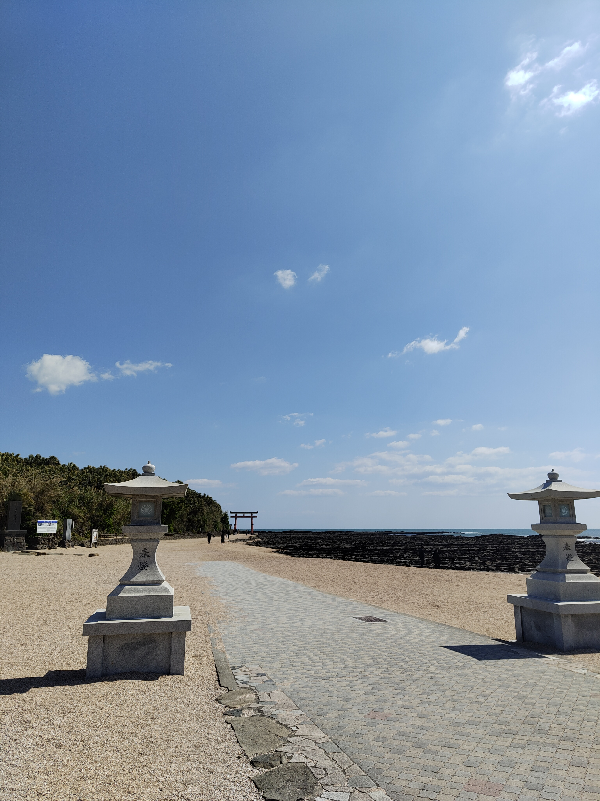
    <figcaption class="media-caption">Aoshima — a small island, a rainforest shrine, the sea on every side.</figcaption>
  </figure>
  <figure style="margin: 0;">
    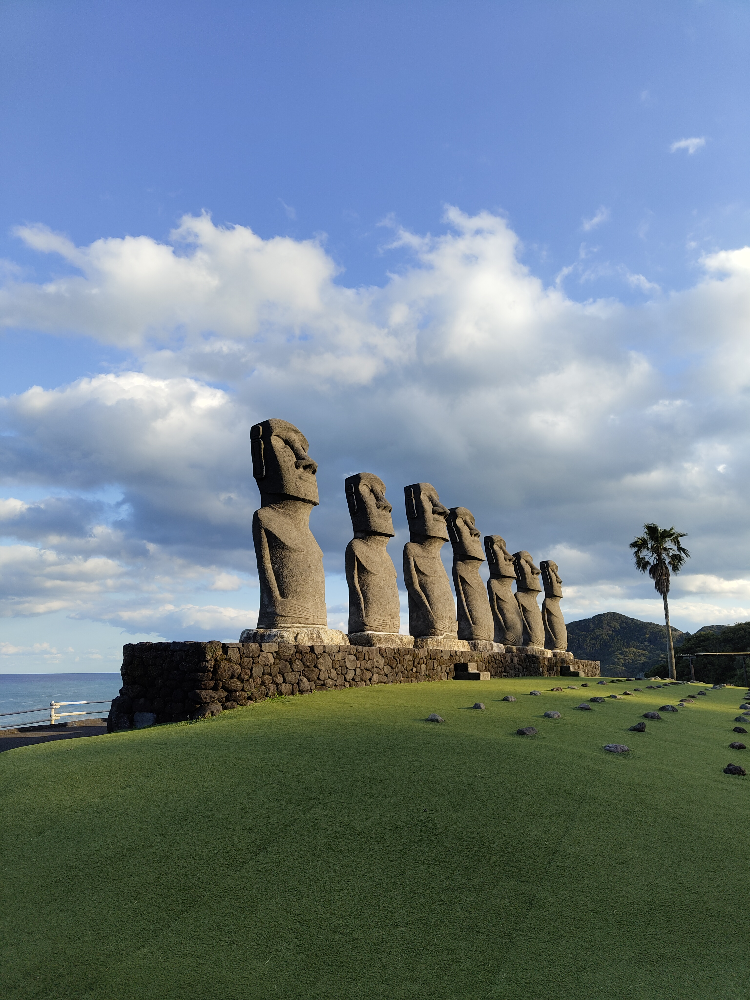
    <figcaption class="media-caption">Sun Messe Nichinan — Easter Island moai on a Pacific headland. Both a gimmick and excellent.</figcaption>
  </figure>
</div>

<div style="display: grid; grid-template-columns: 1fr 1fr; gap: 1rem; margin: 2rem 0;">
  <figure style="margin: 0;">
    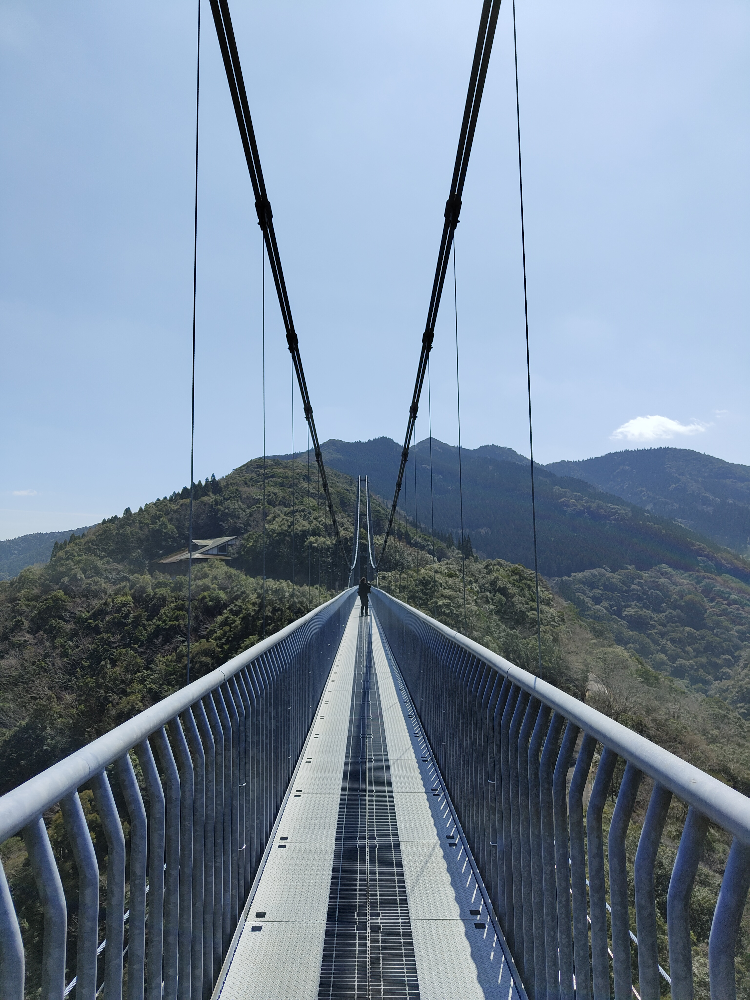
    <figcaption class="media-caption">The Aya bridge — very high, worth it.</figcaption>
  </figure>
  <figure style="margin: 0;">
    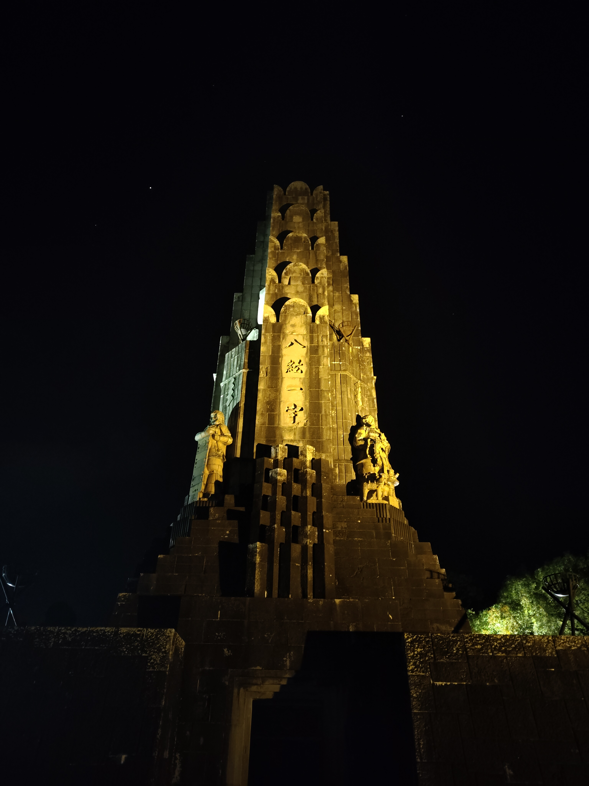
    <figcaption class="media-caption">The Tower of Peace at night — clap from the right spot and something alien comes back.</figcaption>
  </figure>
</div>

<div style="display: grid; grid-template-columns: 1fr 1fr; gap: 1rem; margin: 2rem 0;">
  <figure style="margin: 0;">
    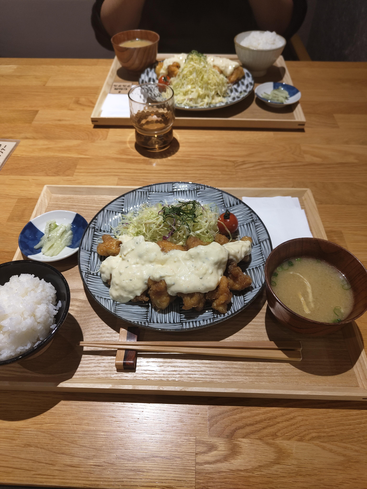
    <figcaption class="media-caption">Chicken nanban — one of my favourite dishes from Japan.</figcaption>
  </figure>
  <figure style="margin: 0;">
    <video autoplay muted loop playsinline
           style="width: 100%; height: 420px; object-fit: cover; border-radius: 6px; display: block;">
      <source src="https://github.com/martinas-jucysbrady/martinas-jucysbrady.github.io/releases/download/v1.0-media/miyazaki_hyuga.mp4" type="video/mp4" />
    </video>
    <figcaption class="media-caption">The Hyuga overlook — the cliffs of Miyazaki, the Pacific beyond, that blue.</figcaption>
  </figure>
</div>

<div class="pull-quote">
  "Kyushu keeps producing this — the landscape, the shrine, the view. Each prefecture a different argument for the same island."
</div>

<hr class="section-divider">

::: {.prose}

Two trips, seven prefectures, one island that keeps revealing itself. Kyushu is the part of Japan that rewards going off the well-worn path — the shrines that nobody queues for, the islands that the tour buses don't reach, the food that the mainland doesn't have. Oita has the hells and the stone Buddhas. Fukuoka has the temple and the torii in the sea. Saga has the terraced fields. Nagasaki has the history that demands time. Kumamoto has the volcano and the shrine in the forest. Kagoshima has the eruption waiting to happen. Miyazaki has the gorge and everything around it.

Go to all of it. Go slowly. Eat everything.

:::

<div class="media-block">
  
  <p class="media-caption">Kyushu — the shrine in the forest, the moss on the stone, the island making its case.</p>
</div>
