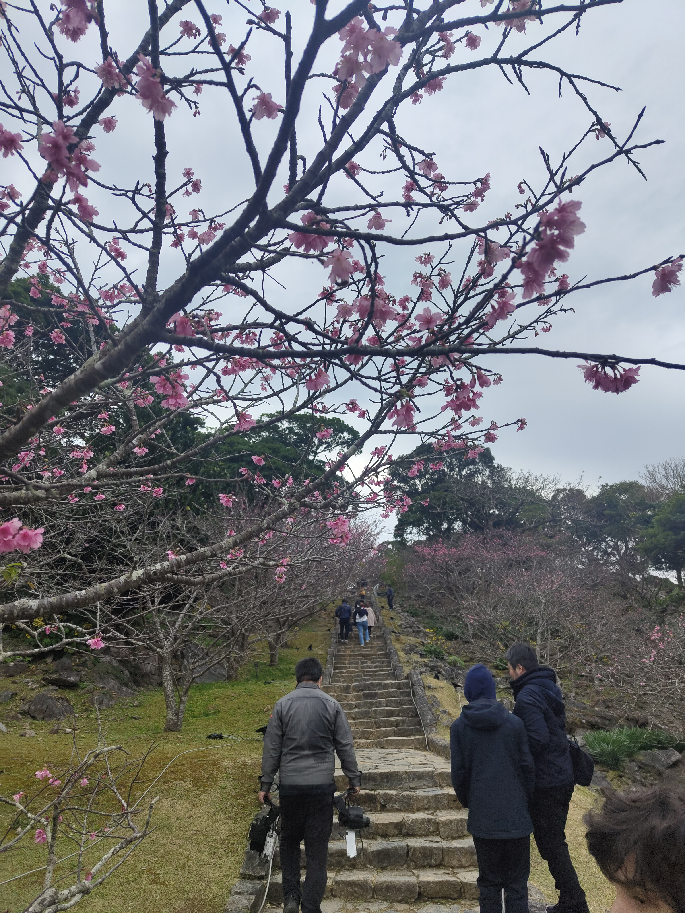
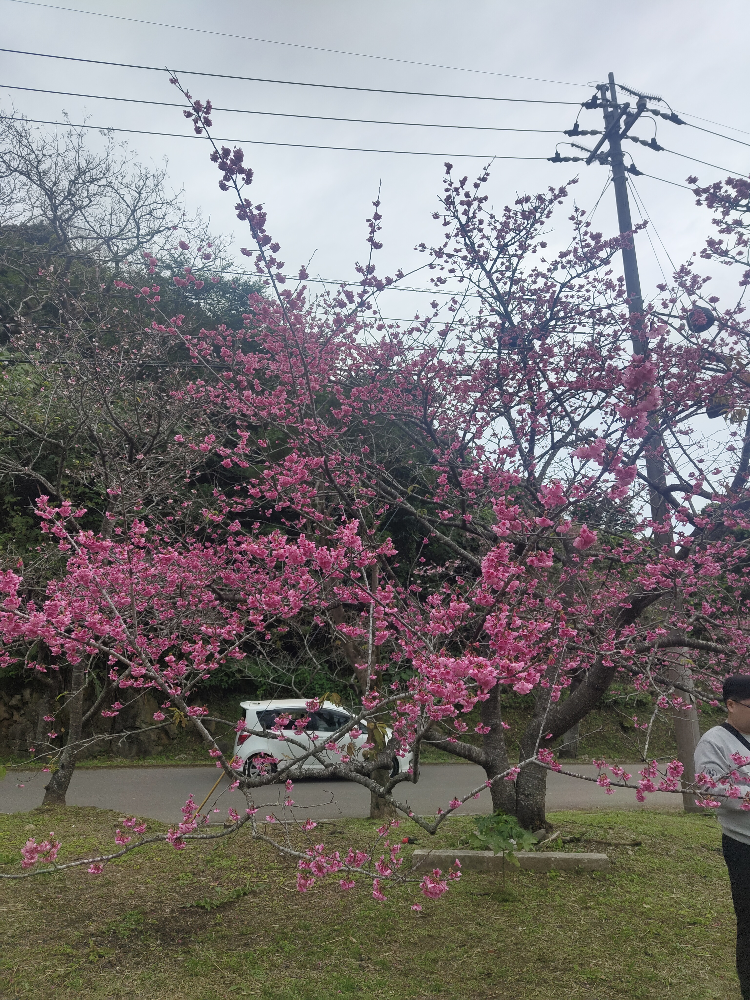
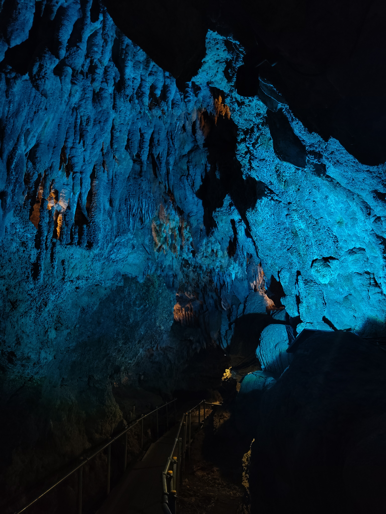
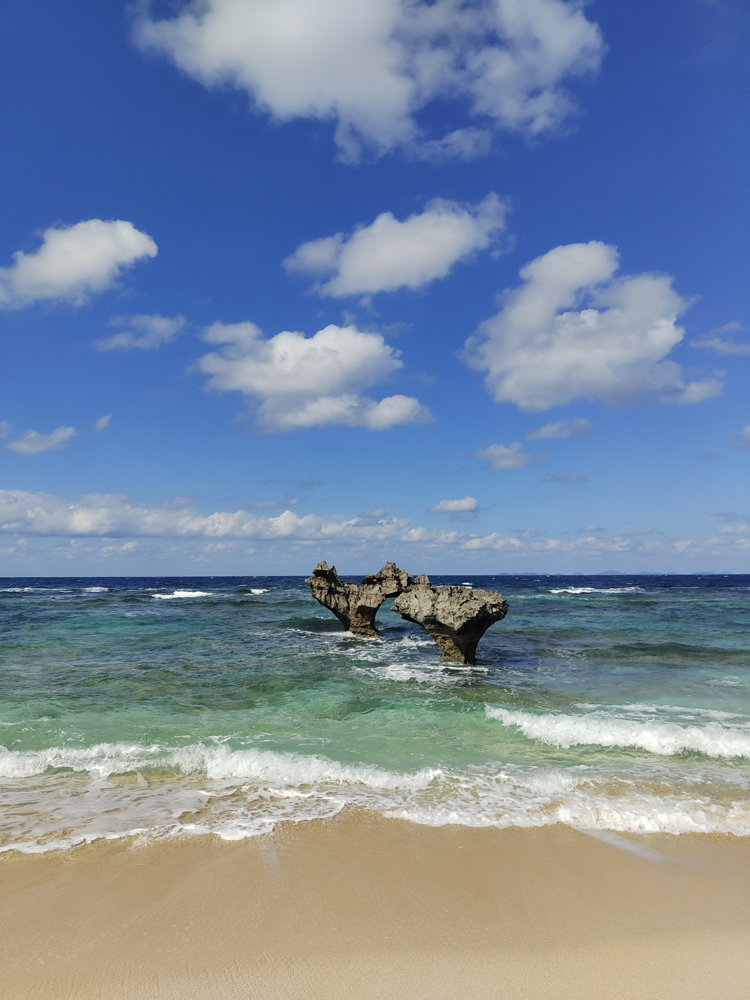
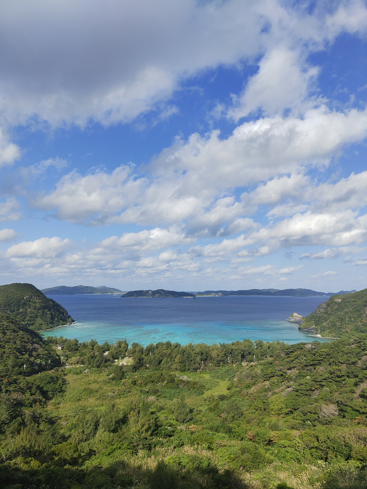
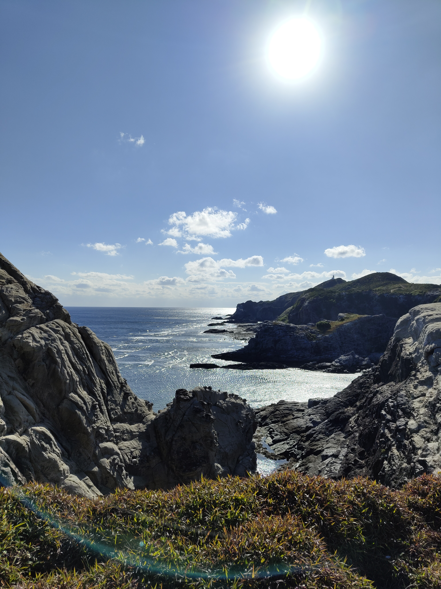
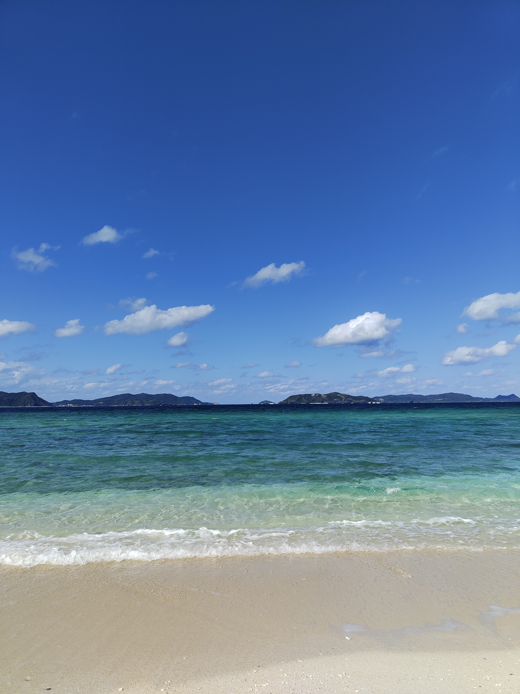
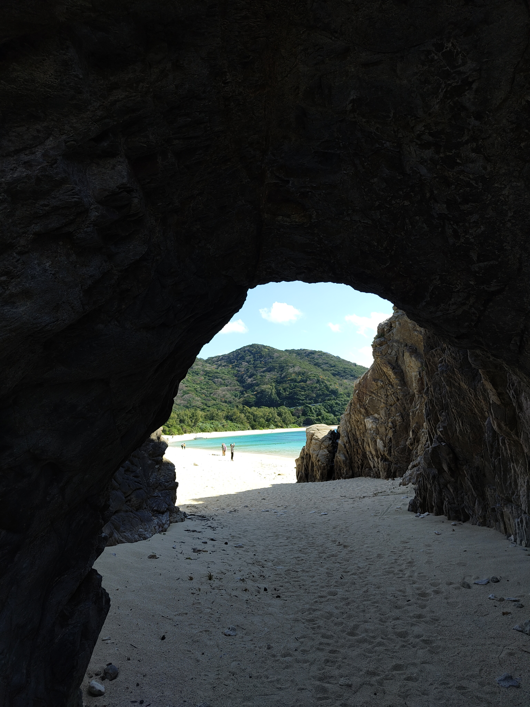
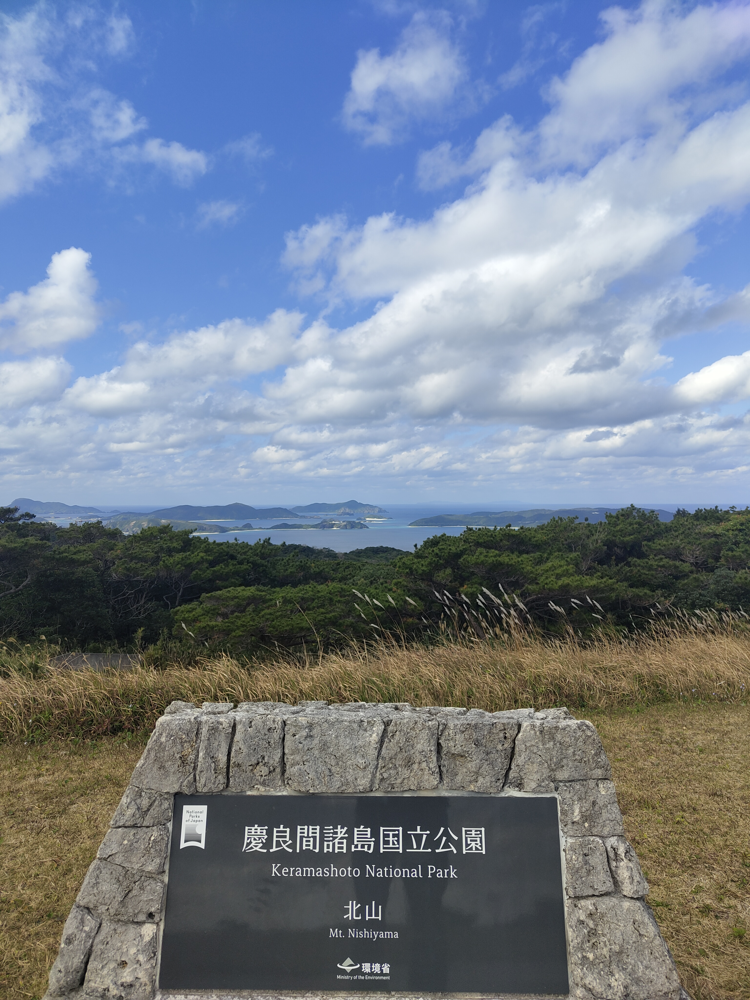

```{=html}
<style>
  .trip-header {
    text-align: center;
    padding: 60px 20px 40px;
    max-width: 860px;
    margin: 0 auto;
  }
  .trip-label {
    font-size: 0.75rem;
    letter-spacing: 0.2em;
    text-transform: uppercase;
    color: #9b8877;
    margin-bottom: 8px;
  }
  .trip-title {
    font-family: 'Plus Jakarta Sans', sans-serif;
    font-size: 2.6rem;
    font-weight: 800;
    color: #1E4264;
    margin: 0 0 12px;
    line-height: 1.1;
  }
  .trip-subtitle {
    font-family: 'Cormorant Garamond', serif;
    font-style: italic;
    font-size: 1.2rem;
    color: #6b7280;
    margin-bottom: 24px;
  }
  .trip-meta {
    display: flex;
    gap: 24px;
    justify-content: center;
    font-size: 0.8rem;
    color: #9b8877;
    letter-spacing: 0.06em;
    text-transform: uppercase;
    flex-wrap: wrap;
  }
  .section-divider {
    border: none;
    border-top: 1px solid #e0e0f0;
    margin: 48px auto;
    max-width: 600px;
  }
  .prose {
    max-width: 720px;
    margin: 0 auto;
    font-size: 1.05rem;
    line-height: 1.85;
    color: #2d3748;
  }
  .prose h2 {
    font-family: 'Plus Jakarta Sans', sans-serif;
    font-weight: 800;
    font-size: 1.6rem;
    color: #1E4264;
    margin-top: 56px;
    margin-bottom: 12px;
    text-align: center;
  }
  .prose p {
    margin-bottom: 1.4rem;
  }
  .media-block {
    max-width: 860px;
    margin: 32px auto;
    border-radius: 14px;
    overflow: hidden;
    box-shadow: 0 4px 24px rgba(0,0,0,0.10);
  }
  .media-block img,
  .media-block video {
    width: 100%;
    display: block;
    object-fit: cover;
  }
  .media-caption {
    font-family: 'Cormorant Garamond', serif;
    font-style: italic;
    font-size: 0.9rem;
    color: #9b8877;
    text-align: center;
    margin-top: 10px;
    padding: 0 12px 4px;
  }
  .pull-quote {
    font-family: 'Cormorant Garamond', serif;
    font-style: italic;
    font-size: 1.55rem;
    font-weight: 600;
    color: #1E4264;
    text-align: center;
    max-width: 640px;
    margin: 48px auto;
    line-height: 1.5;
    padding: 0 24px;
    border-left: 3px solid #c9aa96;
  }

  #quarto-document-content {
    display: flex;
    flex-direction: column;
    align-items: center;
  }

  #quarto-document-content > * {
    width: 100%;
    max-width: 860px;
  }
</style>

<div class="trip-header">
  <p class="trip-label">🌺 Travel</p>
  <h1 class="trip-title">Tropical Paradise</h1>
  <p class="trip-subtitle">Five days on Japan's southern island</p>
  <div class="trip-meta">
    <span>January 2025</span>
    <span>📍 Okinawa, Japan</span>
    <span>✈️ 5 days</span>
  </div>
</div>

<hr class="section-divider">
```

::: {.prose}

## Naha — Snake Sake and Shuri Castle

Okinawa announces itself differently from the rest of Japan. The air is warmer, the pace is slower, the food is different, and the culture carries traces of the Ryukyu Kingdom that ruled these islands independently for centuries before Japanese annexation in 1879. Naha, the capital, wears all of this lightly — the charming streets of Kokusai-dori full of shops selling things you won't find on the mainland, the architecture lower and more open, the whole city feeling subtropical in a way that takes some adjustment after a winter on Honshu.

Shuri Castle is the centrepiece — the restored seat of the Ryukyu kings, rebuilt after wartime destruction, sitting on the hill above the city in vivid red lacquerwork. It burned down again in 2019 and restoration is ongoing, but the grounds and surrounding structures are still worth the visit and the context they provide is essential for understanding what Okinawa is and where it comes from.

Snake sake — habushu — is the local speciality: awamori rice spirit with a habu pit viper aged inside the bottle. It tastes stronger than it looks and the pouring of it is a performance worth watching.

:::

<div class="media-block" style="margin: 2rem 0;">
  <video autoplay muted loop playsinline
         style="width: 100%; max-height: 480px; object-fit: cover; object-position: center; border-radius: 6px; display: block;">
    <source src="https://github.com/martinas-jucysbrady/martinas-jucysbrady.github.io/releases/download/v1.0-media/okinawa_snake.mp4" type="video/mp4" />
  </video>
  <p class="media-caption">Snake sake being poured — habu pit viper inside the bottle, stronger than it looks.</p>
</div>

<hr class="section-divider">

::: {.prose}

## The North — Whales, Blossoms, and the Aquarium

The north of the main island is where Okinawa opens up. The drive up the west coast passes Cape Manzamo — the coral cliff above the ocean — and continues through to Motobu, where the whale watching tours depart in winter. Humpback whales migrate through Okinawan waters between January and March, and the tours find them reliably. Watching a humpback surface is one of those moments that photographs and videos gesture at but don't fully capture — the scale of it, the proximity, the sound.

Mount Yaedake in January is covered in cherry blossoms — Okinawa's cherry season runs weeks earlier than the mainland because the variety here blooms in the cold. The blossoms on the ancient castle steps are the particular image. Churaumi Aquarium, nearby, houses one of the largest tanks in the world and the whale shark inside it is genuinely mesmerising — the scale of the fish and the scale of the tank together producing something that takes time to process.

Cave Okinawa is a small but beautifully illuminated limestone cave worth the stop on the way.

:::

<div style="display: grid; grid-template-columns: 1fr 1fr; gap: 1rem; margin: 2rem 0;">
  <figure style="margin: 0;">
    
    <figcaption class="media-caption">Mt. Yaedake — cherry blossoms on the ancient steps, weeks before the mainland.</figcaption>
  </figure>
  <figure style="margin: 0;">
    
    <figcaption class="media-caption">The blossoms in January — Okinawa's cherry season running on its own schedule.</figcaption>
  </figure>
</div>

<div class="media-block" style="margin: 2rem 0;">
  <video autoplay muted loop playsinline
         style="width: 100%; max-height: 520px; object-fit: cover; object-position: center; border-radius: 6px; display: block;">
    <source src="https://github.com/martinas-jucysbrady/martinas-jucysbrady.github.io/releases/download/v1.0-media/okinawa_whales.mp4" type="video/mp4" />
  </video>
  <p class="media-caption">Whale watching off Motobu — the humpbacks surfacing, the scale of it arriving all at once.</p>
</div>

<div style="display: grid; grid-template-columns: 1fr 1fr; gap: 1rem; margin: 2rem 0;">
  <figure style="margin: 0;">
    
    <figcaption class="media-caption">Cave Okinawa — small, illuminated, and worth the stop.</figcaption>
  </figure>
  <figure style="margin: 0;">
    <video autoplay muted loop playsinline
           style="width: 100%; height: 480px; object-fit: cover; border-radius: 6px; display: block;">
      <source src="https://github.com/martinas-jucysbrady/martinas-jucysbrady.github.io/releases/download/v1.0-media/okinawa_churaumi.mp4" type="video/mp4" />
    </video>
    <figcaption class="media-caption">The whale shark at Churaumi — one of the largest tanks in the world, and the shark filling it.</figcaption>
  </figure>
</div>

<hr class="section-divider">

::: {.prose}

## Kouri Island and Kijioka — Heart Rock and Waterfalls

The drive to Kouri Island crosses a two-kilometre bridge over open ocean, and the approach — the water on both sides turning from deep blue to turquoise as you get closer — is one of the better drives in Okinawa. The island is small enough to do a full lap without rushing. Heart Rock is two naturally formed coral boulders on the beach that look exactly like a heart from the right angle, framed by crystal blue water and open sky.

The Nakijin Castle ruins on the way back are another Ryukyu Kingdom site — the stone walls intact, the views over the coast from the ramparts excellent. Ostrich Land, where the ostriches eat directly from your hand with considerably more aggression than expected, rounds out the afternoon.

The Seven Falls of Kijoka are a series of small waterfalls connected by a jungle trail in the north — lush, cool, and a complete contrast to the coast. The trail is short and the falls are worth every minute of it.


:::

<div class="media-block">
  
  <p class="media-caption">Heart Rock at Kouri Island — crystal water, clear sky, two coral boulders doing exactly what the name suggests.</p>
</div>

<div class="media-block" style="margin: 2rem 0;">
  <video autoplay muted loop playsinline
         style="width: 100%; max-height: 520px; object-fit: cover; object-position: center; border-radius: 6px; display: block;">
    <source src="https://github.com/martinas-jucysbrady/martinas-jucysbrady.github.io/releases/download/v1.0-media/okinawa_waterfall.mp4" type="video/mp4" />
  </video>
  <p class="media-caption">The Seven Falls of Kijoka — jungle, cool air, water coming down through the green.</p>
</div>

<hr class="section-divider">

::: {.prose}

## Tokashiki — The Keramas

The ferry to Tokashiki Island in the Kerama Islands takes thirty-five minutes from Naha and arrives somewhere that feels entirely removed from the main island. Tokashiki is small, quiet, and extraordinarily beautiful — the observation decks from the cliffs look out over islands fading into the distance, the water between them a colour that makes every previous description of turquoise feel inadequate. The beaches are among the best in Japan, which is not a small thing to say.

The island also carries history that deserves acknowledgement: during the Battle of Okinawa in 1945, many of the island's civilians died in what are now called the Kerama Islands mass suicides — a tragedy the island commemorates quietly and that any visit should take time to understand.

The cats are everywhere, entirely untroubled, and deeply at home.

:::

<div style="display: grid; grid-template-columns: 1fr 1fr; gap: 1rem; margin: 2rem 0;">
  <figure style="margin: 0;">
    
    <figcaption class="media-caption">From the observation deck — islands fading into the distance, the water between them extraordinary.</figcaption>
  </figure>
  <figure style="margin: 0;">
    
    <figcaption class="media-caption">The cliffs — the Keramas dropping into the ocean below.</figcaption>
  </figure>
</div>

<div style="display: grid; grid-template-columns: 1fr 1fr; gap: 1rem; margin: 2rem 0;">
  <figure style="margin: 0;">
    
    <figcaption class="media-caption">Tokashiki beach — the water a colour that makes every previous use of the word turquoise feel inadequate.</figcaption>
  </figure>
  <figure style="margin: 0;">
    
    <figcaption class="media-caption">Caves leading to the beach — the island revealing itself slowly.</figcaption>
  </figure>
</div>

<div style="display: grid; grid-template-columns: 1fr 1fr; gap: 1rem; margin: 2rem 0;">
  <figure style="margin: 0;">
    
    <figcaption class="media-caption">Kerama National Park — thirty-five minutes from Naha, a different world.</figcaption>
  </figure>
  <figure style="margin: 0;">
    <video autoplay muted loop playsinline
           style="width: 100%; height: 480px; object-fit: cover; border-radius: 6px; display: block;">
      <source src="https://github.com/martinas-jucysbrady/martinas-jucysbrady.github.io/releases/download/v1.0-media/tokashiki_cat.mp4" type="video/mp4" />
    </video>
    <figcaption class="media-caption">One of the many island cats — entirely untroubled, deeply at home.</figcaption>
  </figure>
</div>

<div class="media-block" style="margin: 2rem 0;">
  <video autoplay muted loop playsinline
         style="width: 100%; max-height: 560px; object-fit: cover; object-position: center; border-radius: 6px; display: block;">
    <source src="https://github.com/martinas-jucysbrady/martinas-jucysbrady.github.io/releases/download/v1.0-media/tokashiki_beach3.mp4" type="video/mp4" />
  </video>
  <p class="media-caption">The beach at sunset — crystal clear water, the light going, nothing else needed.</p>
</div>

<div class="pull-quote">
  "Among the best beaches in Japan — which is not a small thing to say."
</div>

<hr class="section-divider">

::: {.prose}

Five days is not enough for Okinawa. The main island alone has more than a week in it, and the outer islands — Tokashiki, Zamami, Ishigaki, Iriomote — each deserve their own trip. What Okinawa offers that nowhere else in Japan quite manages is the combination: the history of the Ryukyu Kingdom, the tragedy of the war, the tropical coast, the distinct food and culture, and the particular quality of light and water that the Pacific produces this far south.

Go in January for the cherry blossoms and the whales. Go whenever you can for everything else.

:::

<div class="media-block">
  
  <p class="media-caption">The Keramas — the outer islands of Okinawa, and the reason to keep coming back.</p>
</div>
