```{=html}
<style>
  .trip-header {
    text-align: center;
    padding: 60px 20px 40px;
    max-width: 860px;
    margin: 0 auto;
  }
  .trip-label {
    font-size: 0.75rem;
    letter-spacing: 0.2em;
    text-transform: uppercase;
    color: #9b8877;
    margin-bottom: 8px;
  }
  .trip-title {
    font-family: 'Plus Jakarta Sans', sans-serif;
    font-size: 2.6rem;
    font-weight: 800;
    color: #1E4264;
    margin: 0 0 12px;
    line-height: 1.1;
  }
  .trip-subtitle {
    font-family: 'Cormorant Garamond', serif;
    font-style: italic;
    font-size: 1.2rem;
    color: #6b7280;
    margin-bottom: 24px;
  }
  .trip-meta {
    display: flex;
    gap: 24px;
    justify-content: center;
    font-size: 0.8rem;
    color: #9b8877;
    letter-spacing: 0.06em;
    text-transform: uppercase;
    flex-wrap: wrap;
  }
  .section-divider {
    border: none;
    border-top: 1px solid #e0e0f0;
    margin: 48px auto;
    max-width: 600px;
  }
  .prose {
    max-width: 720px;
    margin: 0 auto;
    font-size: 1.05rem;
    line-height: 1.85;
    color: #2d3748;
  }
  .prose h2 {
    font-family: 'Plus Jakarta Sans', sans-serif;
    font-weight: 800;
    font-size: 1.6rem;
    color: #1E4264;
    margin-top: 56px;
    margin-bottom: 12px;
    text-align: center;
  }
  .prose p {
    margin-bottom: 1.4rem;
  }
  .media-block {
    max-width: 860px;
    margin: 32px auto;
    border-radius: 14px;
    overflow: hidden;
    box-shadow: 0 4px 24px rgba(0,0,0,0.10);
  }
  .media-block img,
  .media-block video {
    width: 100%;
    display: block;
    object-fit: cover;
  }
  .media-caption {
    font-family: 'Cormorant Garamond', serif;
    font-style: italic;
    font-size: 0.9rem;
    color: #9b8877;
    text-align: center;
    margin-top: 10px;
    padding: 0 12px 4px;
  }
  .pull-quote {
    font-family: 'Cormorant Garamond', serif;
    font-style: italic;
    font-size: 1.55rem;
    font-weight: 600;
    color: #1E4264;
    text-align: center;
    max-width: 640px;
    margin: 48px auto;
    line-height: 1.5;
    padding: 0 24px;
    border-left: 3px solid #c9aa96;
  }

  #quarto-document-content {
    display: flex;
    flex-direction: column;
    align-items: center;
  }

  #quarto-document-content > * {
    width: 100%;
    max-width: 860px;
  }
</style>

<div class="trip-header">
  <p class="trip-label">🇰🇷 Travel</p>
  <h1 class="trip-title">Korea</h1>
  <p class="trip-subtitle">Two trips — Seoul in winter, then south to Busan and Gyeongju</p>
  <div class="trip-meta">
    <span>January 2025 & May 2025</span>
    <span>📍 South Korea</span>
    <span>✈️ 2 trips</span>
  </div>
</div>

<hr class="section-divider">
```

<div id="seoul"></div>
::: {.prose}

## Seoul — Palaces, the DMZ, and Snow

Seoul was the first Korea trip, in January, and it arrived with snow — which turns out to be the right condition for the city. The palaces under snow are something else entirely, the grey stone and the red-painted woodwork made more vivid by the contrast, the grounds quieter than they'd be in any other season.

Gyeongbokgung is the main palace and the scale of it takes a moment to accept — the vast ceremonial spaces, the mountains visible behind the northern gate, the traditional marching ceremony outside the entrance where the palace guards perform the changing of the guard in full Joseon-era dress and formation. It is the kind of spectacle that could feel staged and somehow doesn't. Changdeokgung, a short walk away, is the more intimate of the two and rewards the time: the Secret Garden behind it is one of the better palace grounds in the city.

The Bukchon Hanok Village sits between the two palaces — a hillside neighbourhood of preserved traditional Korean houses whose narrow streets and tiled rooftops offer one of the more photographed views in Seoul, though arriving early before the crowds is strongly advised.

The day trip to the Demilitarised Zone is the one that stays with you. The bus north through the checkpoints, the tunnels dug by North Korea under the border and discovered by the South, the observation platform where you can look across the most heavily fortified border in the world at the North Korean flag flying in the distance — the whole experience is quietly extraordinary, a reminder that the Korean War never formally ended and that the peninsula is still, technically, at war. The War Memorial in the city itself is among the better war museums anywhere — immersive, honest, and worth a full morning.

The food is excellent throughout. Dakgalbi — spicy stir-fried chicken with rice cakes and vegetables — is the one to order. The squid game dalgona crackers are a tourist gimmick that is entirely worth doing once.

:::

<div class="media-block" style="margin: 2rem 0;">
  <video autoplay muted loop playsinline
         style="width: 100%; max-height: 520px; object-fit: cover; object-position: center; border-radius: 6px; display: block;">
    <source src="https://github.com/martinas-jucysbrady/martinas-jucysbrady.github.io/releases/download/v1.0-media/seoul_ceremony.mp4" type="video/mp4" />
  </video>
  <p class="media-caption">The traditional ceremony outside Gyeongbokgung — palace guards in full Joseon-era formation.</p>
</div>

<div style="display: grid; grid-template-columns: 1fr 1fr; gap: 1rem; margin: 2rem 0;">
  <figure style="margin: 0;">
    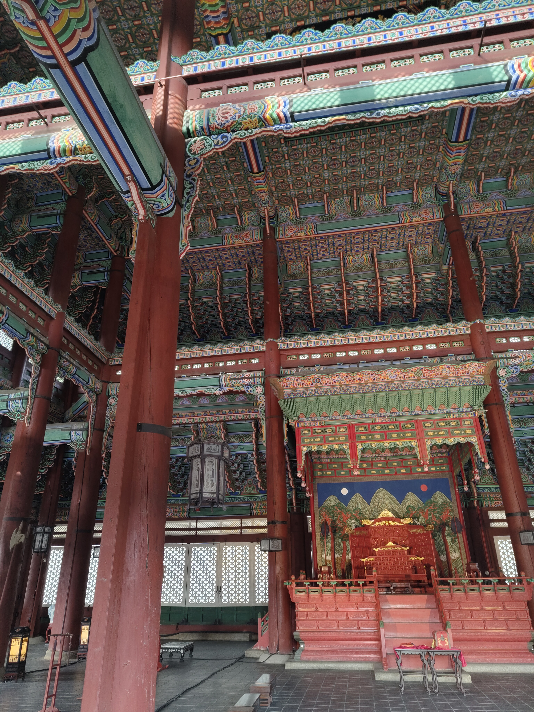
    <figcaption class="media-caption">Inside the palace grounds — the red lacquerwork and detailed paintwork up close.</figcaption>
  </figure>
  <figure style="margin: 0;">
    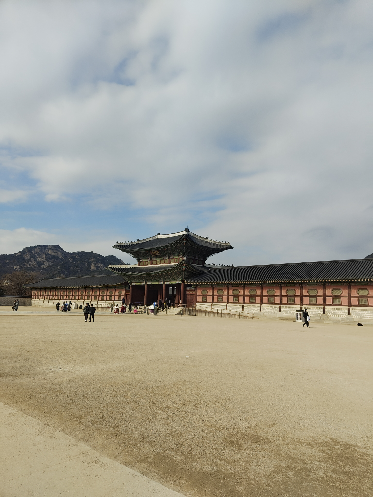
    <figcaption class="media-caption">Gyeongbokgung — the scale of it takes a moment to accept.</figcaption>
  </figure>
</div>

<div style="display: grid; grid-template-columns: 1fr 1fr 1fr; gap: 1rem; margin: 2rem 0;">
  <figure style="margin: 0;">
    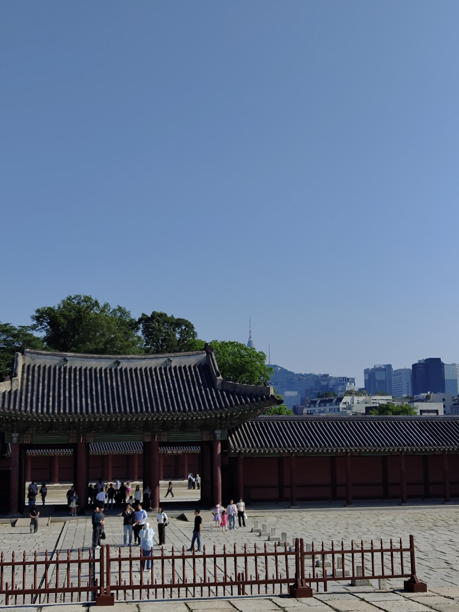
    <figcaption class="media-caption">Changdeokgung — the more intimate of the two great palaces.</figcaption>
  </figure>
  <figure style="margin: 0;">
    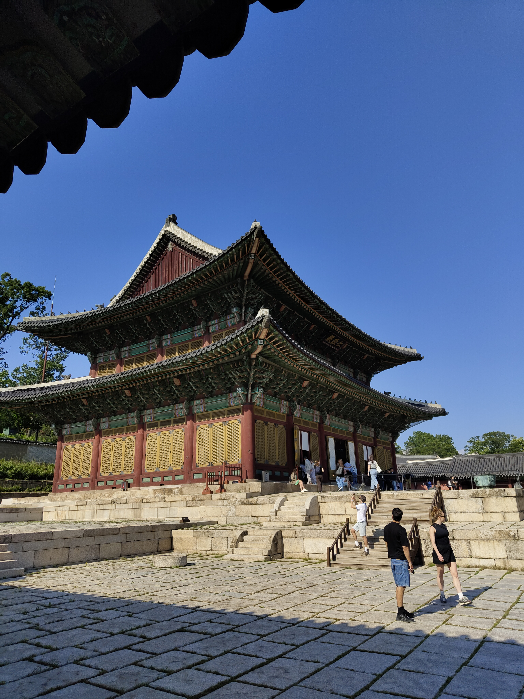
    <figcaption class="media-caption">The palace grounds — layers of rooftiles and courtyards.</figcaption>
  </figure>
  <figure style="margin: 0;">
    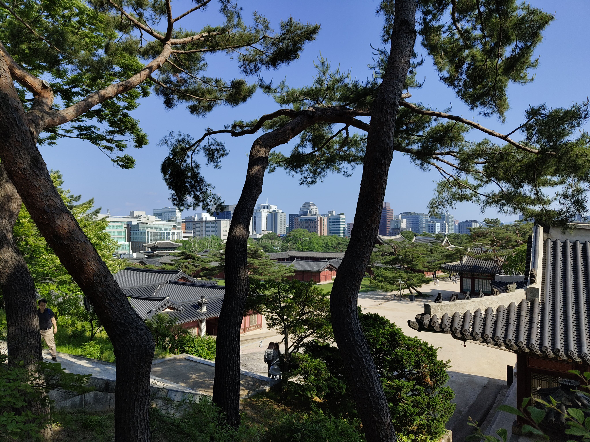
    <figcaption class="media-caption">Changdeokgung in winter — the Secret Garden behind it worth every step.</figcaption>
  </figure>
</div>

<div style="display: grid; grid-template-columns: 1fr 1fr; gap: 1rem; margin: 2rem 0;">
  <figure style="margin: 0;">
    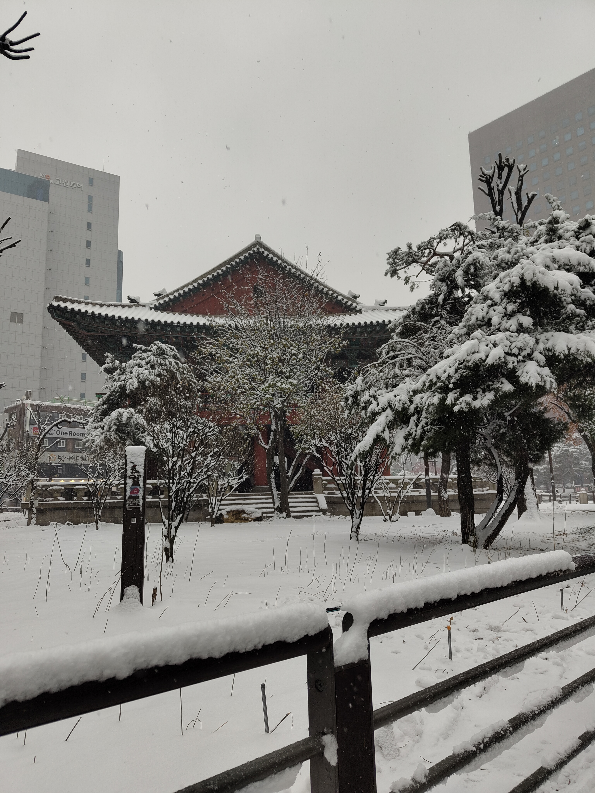
    <figcaption class="media-caption">Snow in Seoul — the right condition for the palaces.</figcaption>
  </figure>
  <figure style="margin: 0;">
    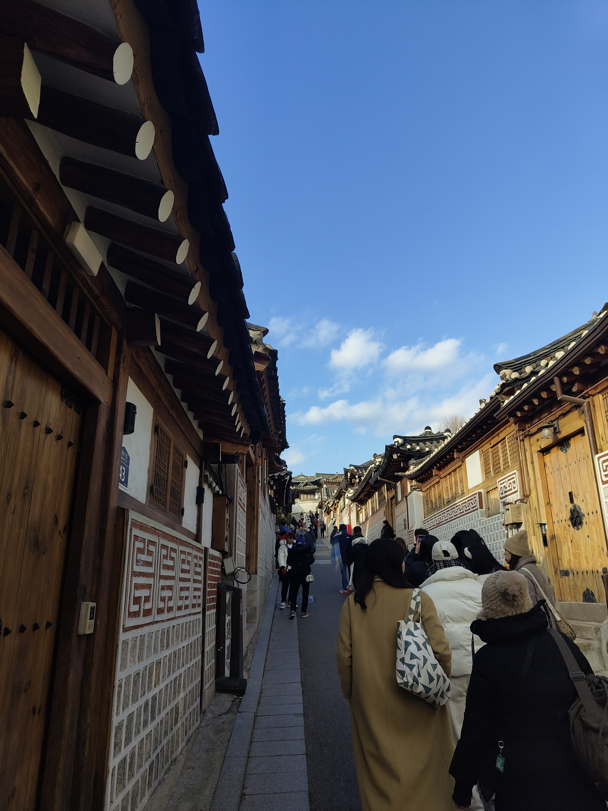
    <figcaption class="media-caption">Bukchon Hanok Village — arrive early before the crowds.</figcaption>
  </figure>
</div>

<div style="display: grid; grid-template-columns: 1fr 1fr; gap: 1rem; margin: 2rem 0;">
  <figure style="margin: 0;">
    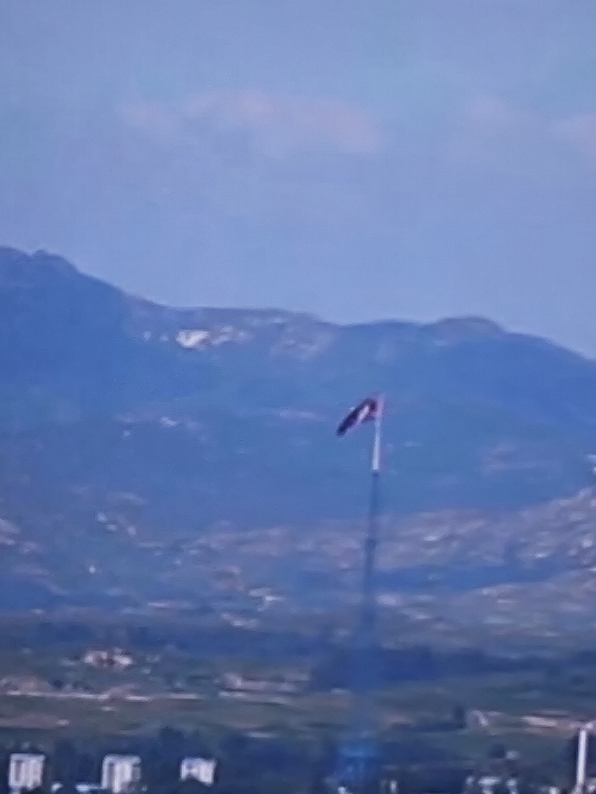
    <figcaption class="media-caption">The North Korean flag in the distance — the most heavily fortified border in the world.</figcaption>
  </figure>
  <figure style="margin: 0;">
    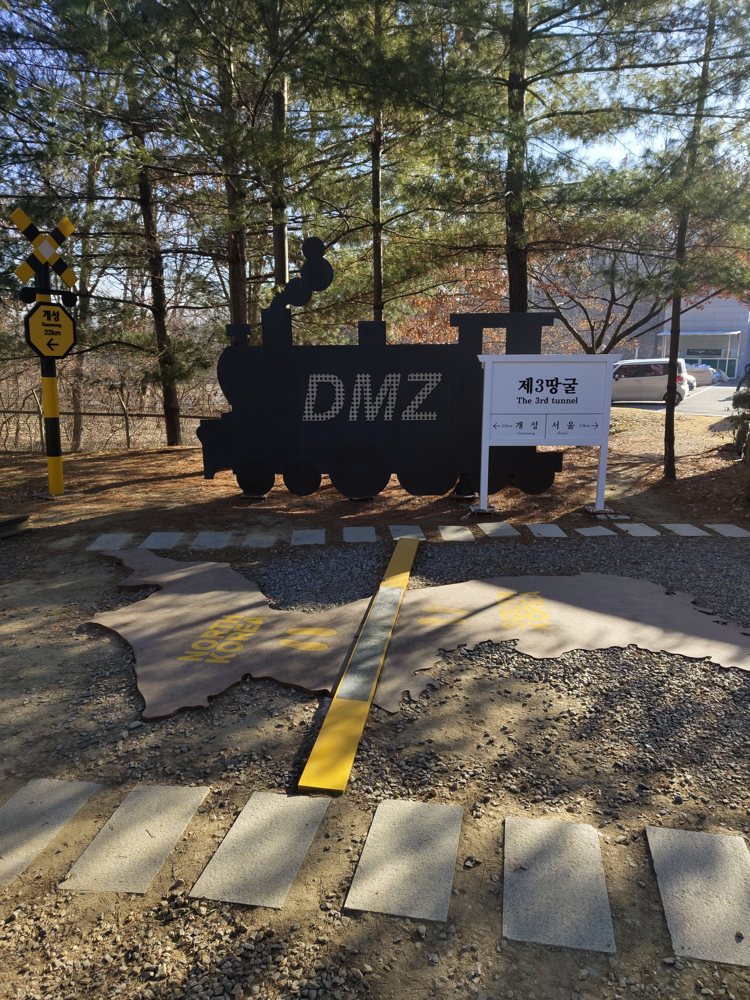
    <figcaption class="media-caption">The DMZ — a reminder that the Korean War never formally ended.</figcaption>
  </figure>
</div>

<div style="display: grid; grid-template-columns: 1fr 1fr; gap: 1rem; margin: 2rem 0;">
  <figure style="margin: 0;">
    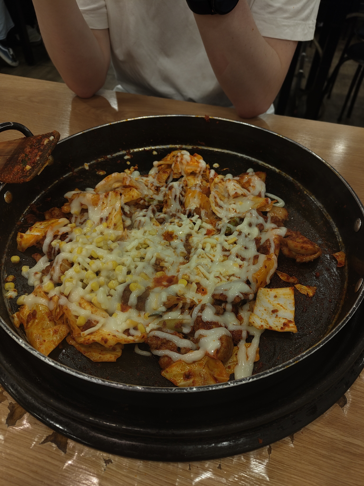
    <figcaption class="media-caption">Dakgalbi — spicy, rich, the one to order.</figcaption>
  </figure>
  <figure style="margin: 0;">
    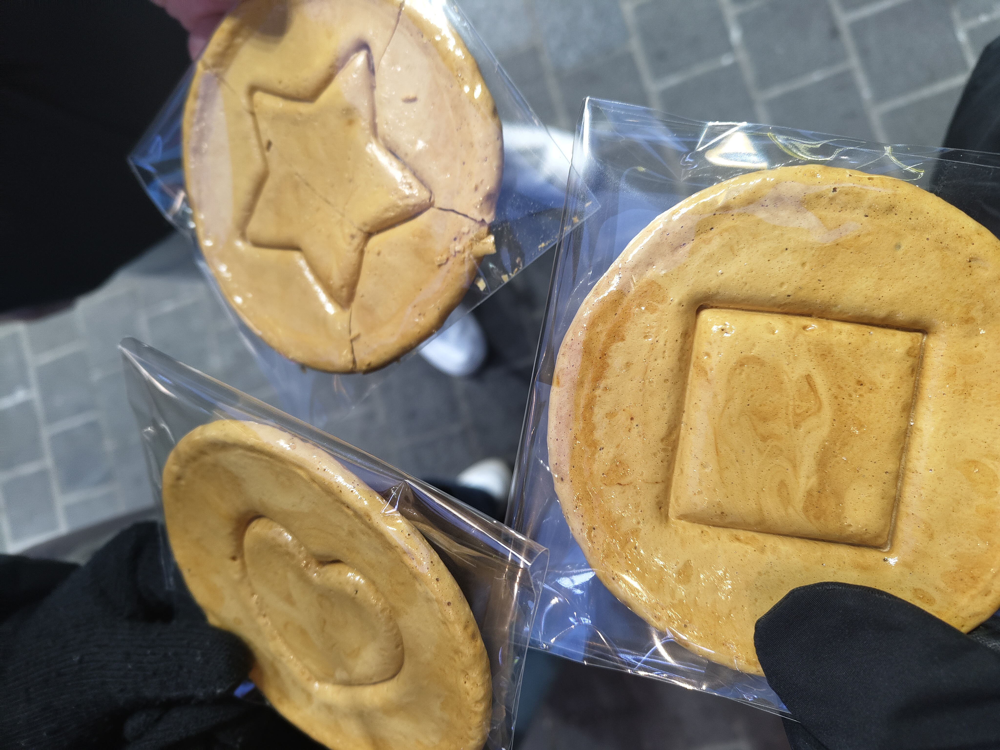
    <figcaption class="media-caption">The squid game crackers — a tourist gimmick entirely worth doing once.</figcaption>
  </figure>
</div>

<div class="pull-quote">
  "The tunnels, the flag in the distance, the checkpoints — a reminder that this border is unlike any other."
</div>

<hr class="section-divider">

<div id="busan"></div>
::: {.prose}

## Busan — Culture Village and the Beach

Busan is Korea's second city and operates with a confidence that doesn't feel second to anything. The Gamcheon Culture Village is the visual highlight — a hillside neighbourhood of houses painted in vivid colours that cascade down the slope above the port, the streets between them full of murals and small galleries and cafés tucked into improbable spaces. The effect from above is extraordinary: the colour against the grey of the city below and the sea beyond.

Haeundae Beach is one of the better urban beaches in Asia — wide, backed by skyscrapers, and in May hosting sand sculpture competitions that produce work on a scale that has no right to be as impressive as it is. The corndogs are essential: Korean corndogs are a different proposition from their American namesake — the batter thick and slightly sweet, the filling varied, the whole thing worth eating immediately and hot.

:::

<div style="display: grid; grid-template-columns: 1fr 1fr; gap: 1rem; margin: 2rem 0;">
  <figure style="margin: 0;">
    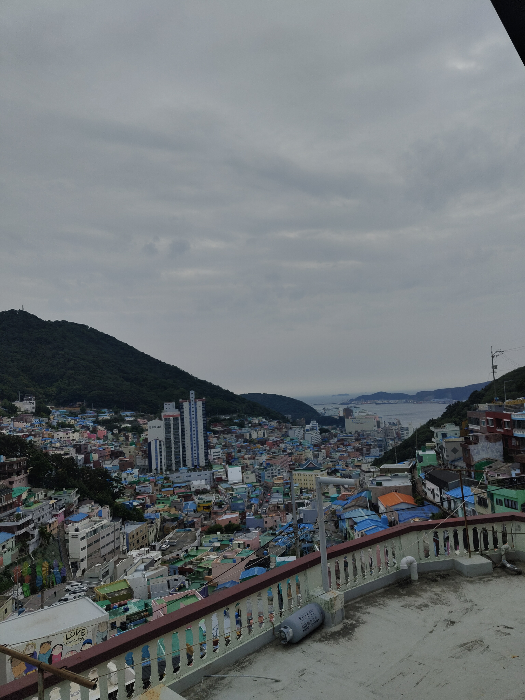
    <figcaption class="media-caption">Gamcheon Culture Village — vivid colours cascading down the hillside above the port.</figcaption>
  </figure>
  <figure style="margin: 0;">
    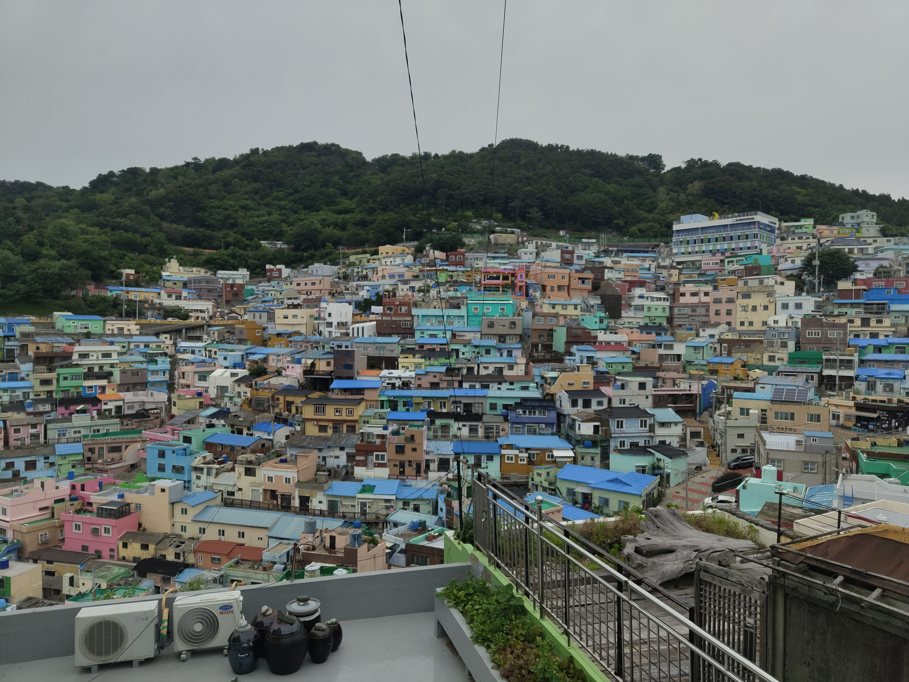
    <figcaption class="media-caption">The village from above — the colour against the city and sea below it.</figcaption>
  </figure>
</div>

<div style="display: grid; grid-template-columns: 1fr 1fr; gap: 1rem; margin: 2rem 0;">
  <figure style="margin: 0;">
    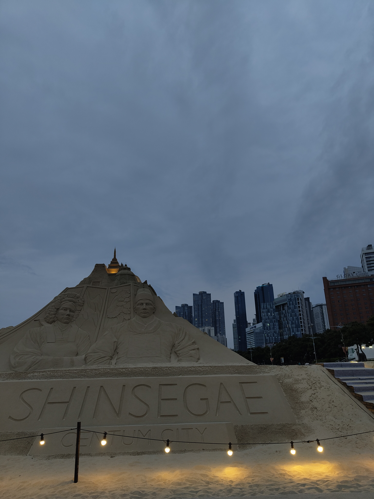
    <figcaption class="media-caption">Haeundae Beach — sand sculptures and skyscrapers, the sea beyond both.</figcaption>
  </figure>
  <figure style="margin: 0;">
    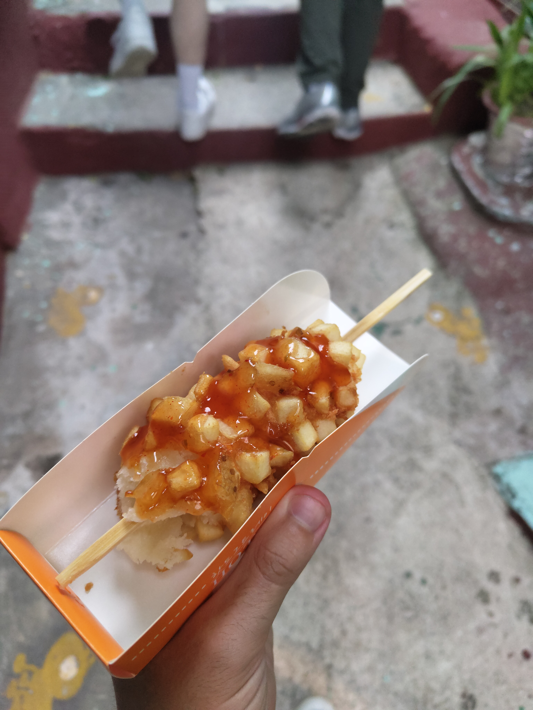
    <figcaption class="media-caption">The Korean corndog — a different proposition entirely, eat it hot and immediately.</figcaption>
  </figure>
</div>

<hr class="section-divider">

<div id="gyeongju"></div>
::: {.prose}

## Gyeongju — The Forest City

Gyeongju is unlike anywhere else in Korea. The former capital of the Silla Kingdom sits in a landscape of dense forested hills dotted with ancient burial mounds, and the city itself has preserved its traditional character in a way that most Korean cities haven't. Walking through it feels like being in a different century — not in the curated way of a heritage district, but in the way of a place that simply kept going without needing to demolish what came before.

The Woljeonggyo Bridge crosses the Namcheon stream and is one of the most beautiful bridges in the country — a Silla-era wooden bridge reconstructed on its original site, the detailing intricate, the reflection in the still water below it the photograph that every visit produces. Arriving in the evening when it is lit up makes the already beautiful considerably more so.

:::

<div class="media-block">
  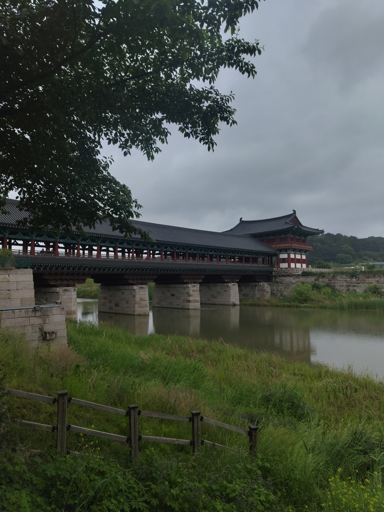
  <p class="media-caption">Woljeonggyo Bridge from the riverbank — the reflection in the water doing most of the work.</p>
</div>

<div class="media-block">
  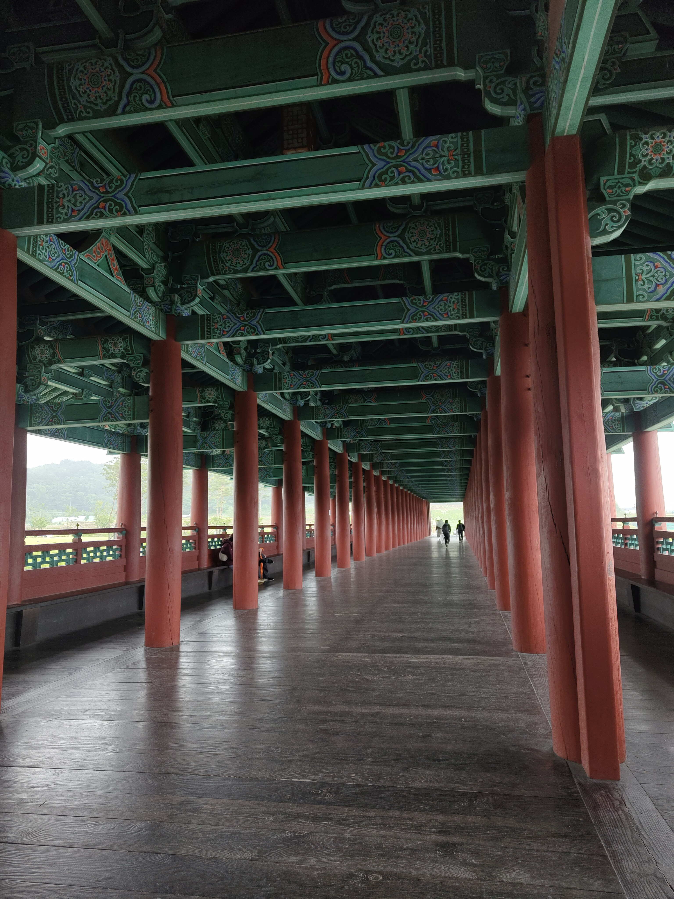
  <p class="media-caption">On the bridge — the Silla-era detailing close up, the forest and hills behind.</p>
</div>

<div class="pull-quote">
  "A place that simply kept going without needing to demolish what came before."
</div>

<hr class="section-divider">

::: {.prose}

Two trips and three cities that each make the case for Korea in a completely different way. Seoul is the one with everything — history, food, the weight of the border to the north, the energy of a capital that operates at full intensity. Busan is the one that surprises you with how good it is. Gyeongju is the one that makes you slow down and look at things properly.

The food throughout is excellent and consistently underrated in the global conversation. The people are warm. The cities are clean and easy to navigate. Korea rewards the visit and then rewards coming back.

:::

<div class="media-block">
  
  <p class="media-caption">Seoul — the one with everything, and the reason the second trip happened.</p>
</div>
