```{=html}
<style>
  .trip-header {
    text-align: center;
    padding: 60px 20px 40px;
    max-width: 860px;
    margin: 0 auto;
  }
  .trip-label {
    font-size: 0.75rem;
    letter-spacing: 0.2em;
    text-transform: uppercase;
    color: #9b8877;
    margin-bottom: 8px;
  }
  .trip-title {
    font-family: 'Plus Jakarta Sans', sans-serif;
    font-size: 2.6rem;
    font-weight: 800;
    color: #1E4264;
    margin: 0 0 12px;
    line-height: 1.1;
  }
  .trip-subtitle {
    font-family: 'Cormorant Garamond', serif;
    font-style: italic;
    font-size: 1.2rem;
    color: #6b7280;
    margin-bottom: 24px;
  }
  .trip-meta {
    display: flex;
    gap: 24px;
    justify-content: center;
    font-size: 0.8rem;
    color: #9b8877;
    letter-spacing: 0.06em;
    text-transform: uppercase;
    flex-wrap: wrap;
  }
  .section-divider {
    border: none;
    border-top: 1px solid #e0e0f0;
    margin: 48px auto;
    max-width: 600px;
  }
  .prose {
    max-width: 720px;
    margin: 0 auto;
    font-size: 1.05rem;
    line-height: 1.85;
    color: #2d3748;
  }
  .prose h2 {
    font-family: 'Plus Jakarta Sans', sans-serif;
    font-weight: 800;
    font-size: 1.6rem;
    color: #1E4264;
    margin-top: 56px;
    margin-bottom: 12px;
    text-align: center;
  }
  .prose p {
    margin-bottom: 1.4rem;
  }
  .media-block {
    max-width: 860px;
    margin: 32px auto;
    border-radius: 14px;
    overflow: hidden;
    box-shadow: 0 4px 24px rgba(0,0,0,0.10);
  }
  .media-block img,
  .media-block video {
    width: 100%;
    display: block;
    object-fit: cover;
  }
  .media-caption {
    font-family: 'Cormorant Garamond', serif;
    font-style: italic;
    font-size: 0.9rem;
    color: #9b8877;
    text-align: center;
    margin-top: 10px;
    padding: 0 12px 4px;
  }
  .pull-quote {
    font-family: 'Cormorant Garamond', serif;
    font-style: italic;
    font-size: 1.55rem;
    font-weight: 600;
    color: #1E4264;
    text-align: center;
    max-width: 640px;
    margin: 48px auto;
    line-height: 1.5;
    padding: 0 24px;
    border-left: 3px solid #c9aa96;
  }

  #quarto-document-content {
    display: flex;
    flex-direction: column;
    align-items: center;
  }

  #quarto-document-content > * {
    width: 100%;
    max-width: 860px;
  }
</style>

<div class="trip-header">
  <p class="trip-label">🌿 Travel</p>
  <h1 class="trip-title">The Remote North</h1>
  <p class="trip-subtitle">Five days through Japan's least-visited region</p>
  <div class="trip-meta">
    <span>June 2025</span>
    <span>📍 Tohoku, Japan</span>
    <span>✈️ 5 days</span>
  </div>
</div>

<hr class="section-divider">
```

<div id="miyagi"></div>
::: {.prose}

## Miyagi — Cats, Foxes, and Floating Islands

Miyagi is where Tohoku starts making its case. Sendai is a lively city with good shopping and the Dai Kannon — a forty-metre white goddess statue on the hillside above the city — visible from a long way off. But the prefecture is best understood by what's outside the city: Matsushima, Tashirojima, Akiu, and Zao, all within reach and all completely different from each other.

Matsushima is one of the three views traditionally considered the most beautiful in Japan — a bay scattered with hundreds of small pine-covered islands rising from the water, the iconic red bridge connecting the shore to the main island. It lives up to the designation.

Tashirojima is Cat Island, and that description is accurate rather than whimsical. The resident population of cats vastly outnumbers the human one, and they have the run of the entire island — following you on walks, sleeping on every available surface, entirely untroubled by visitors. The walk around the island is one of the better few hours in the whole trip.

Akiu Great Falls is secluded in a way that most waterfalls in Japan aren't — the walk to it is short and the setting is quiet enough that dipping your feet in feels like something you've found rather than been directed to. Zao Fox Village is full of charming foxes and hard to fully enjoy given the feeling that they'd be better off in the wild. Go with managed expectations.

:::

<div class="media-block">
  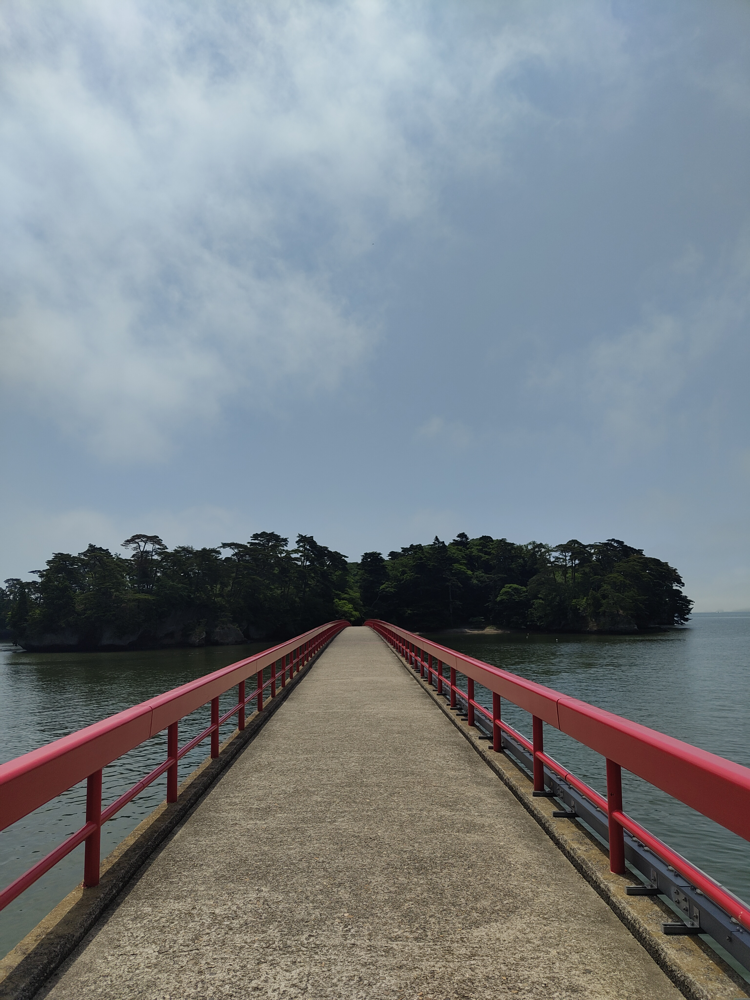
  <p class="media-caption">Matsushima — one of the three traditionally most beautiful views in Japan, and it earns it.</p>
</div>

<div style="display: grid; grid-template-columns: 1fr 1fr; gap: 1rem; margin: 2rem 0;">
  <figure style="margin: 0;">
    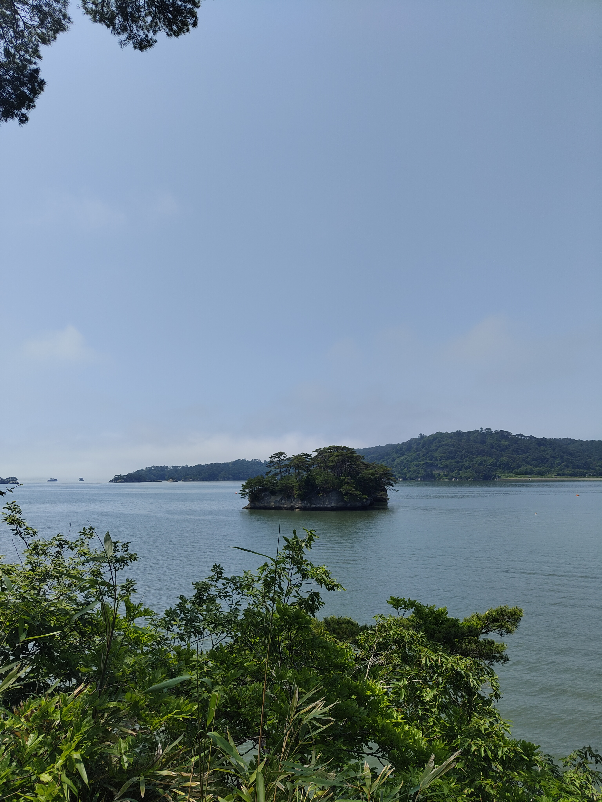
    <figcaption class="media-caption">The islands — hundreds of them, each one pine-covered, each one different.</figcaption>
  </figure>
  <figure style="margin: 0;">
    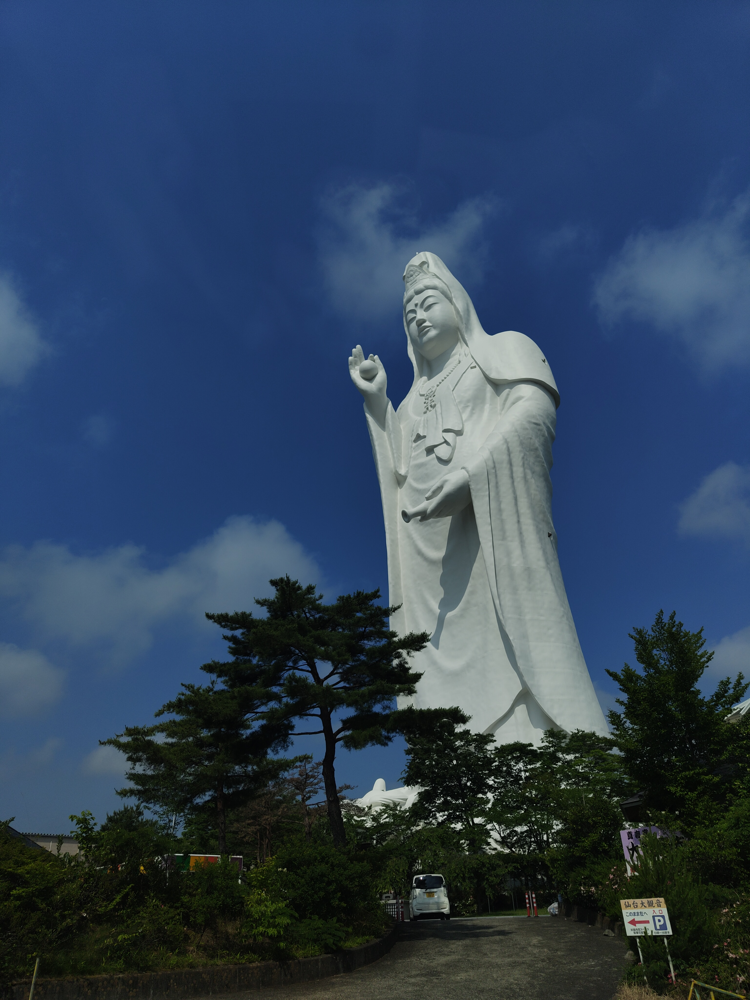
    <figcaption class="media-caption">The Dai Kannon — forty metres of white stone above the city.</figcaption>
  </figure>
</div>

<div style="display: grid; grid-template-columns: 1fr 1fr 1fr; gap: 1rem; margin: 2rem 0;">
  <figure style="margin: 0;">
    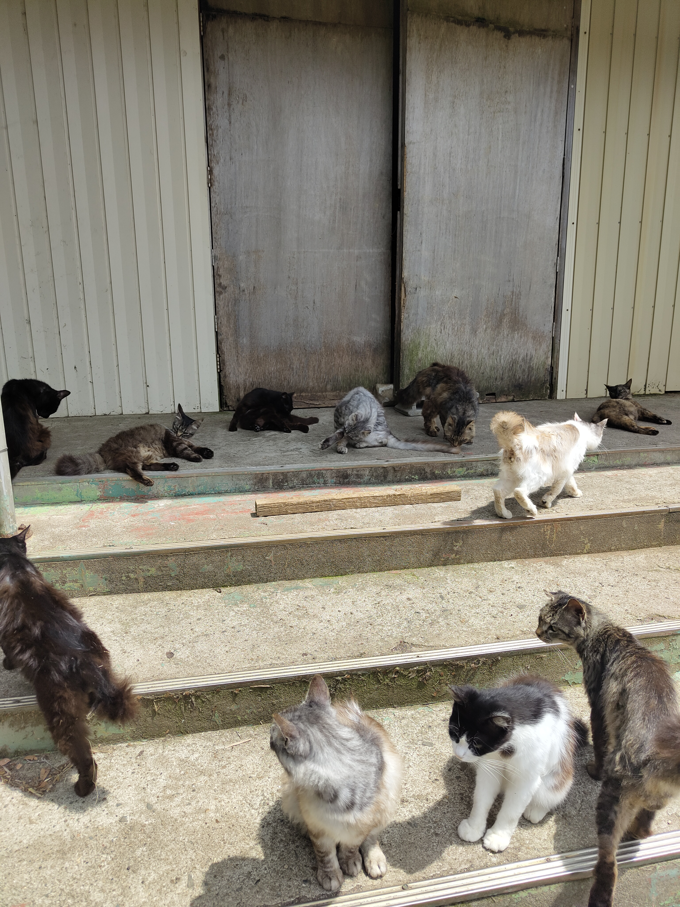
    <figcaption class="media-caption">Tashirojima — the cats have the run of the entire island.</figcaption>
  </figure>
  <figure style="margin: 0;">
    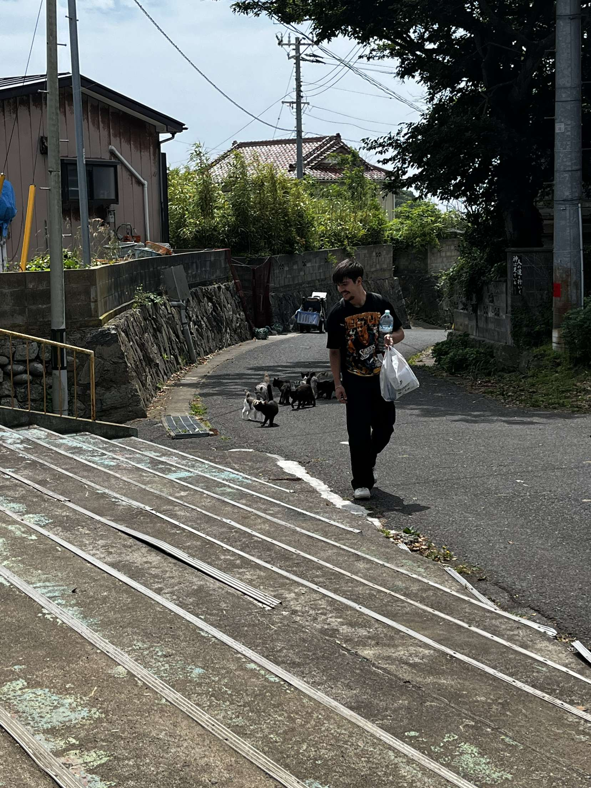
    <figcaption class="media-caption">Entirely untroubled by visitors.</figcaption>
  </figure>
  <figure style="margin: 0;">
    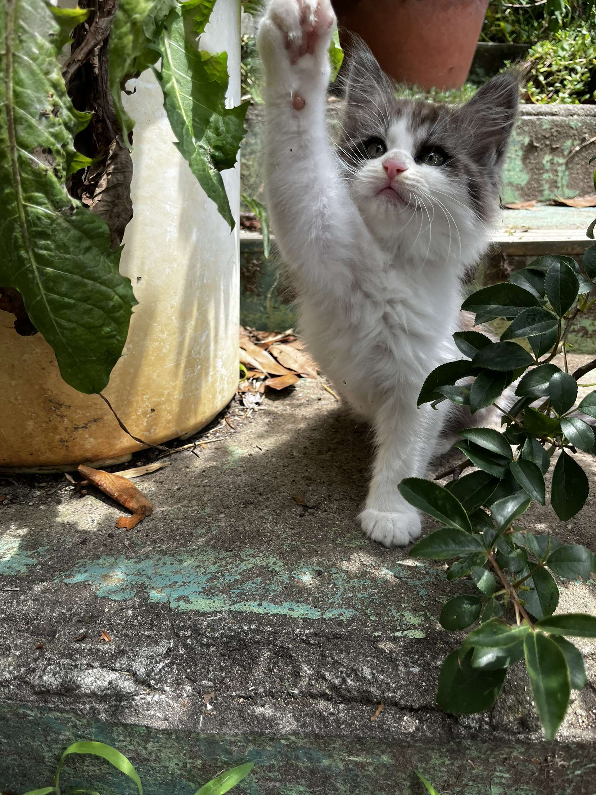
    <figcaption class="media-caption">The resident population vastly outnumbers the human one.</figcaption>
  </figure>
</div>

<div style="display: grid; grid-template-columns: 1fr 1fr; gap: 1rem; margin: 2rem 0;">
  <figure style="margin: 0;">
    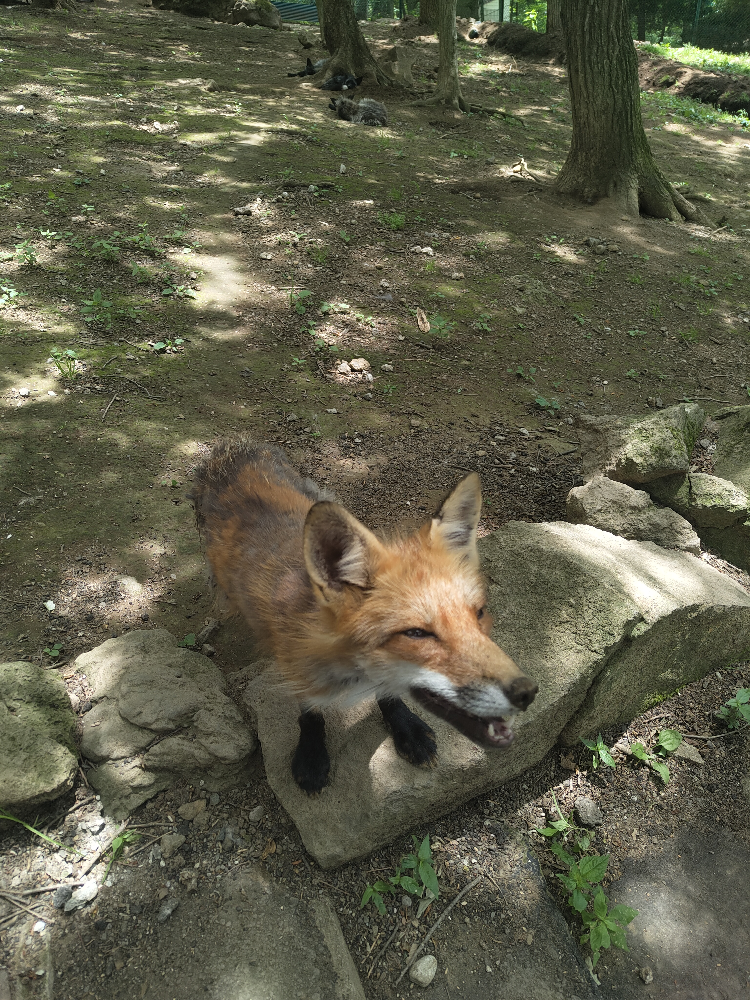
    <figcaption class="media-caption">Zao Fox Village — charming, but hard to shake the feeling they'd be better off in the wild.</figcaption>
  </figure>
  <figure style="margin: 0;">
    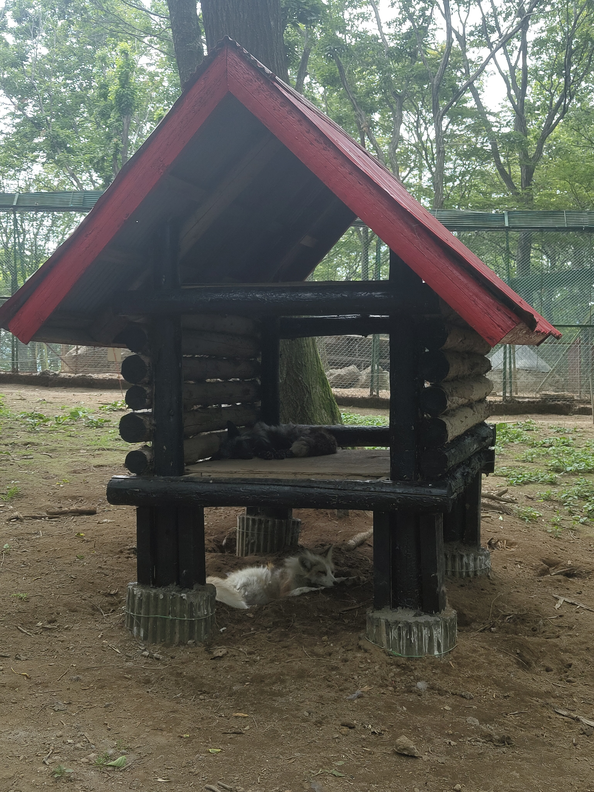
    <figcaption class="media-caption">The foxes — go with managed expectations.</figcaption>
  </figure>
</div>

<div class="media-block">
  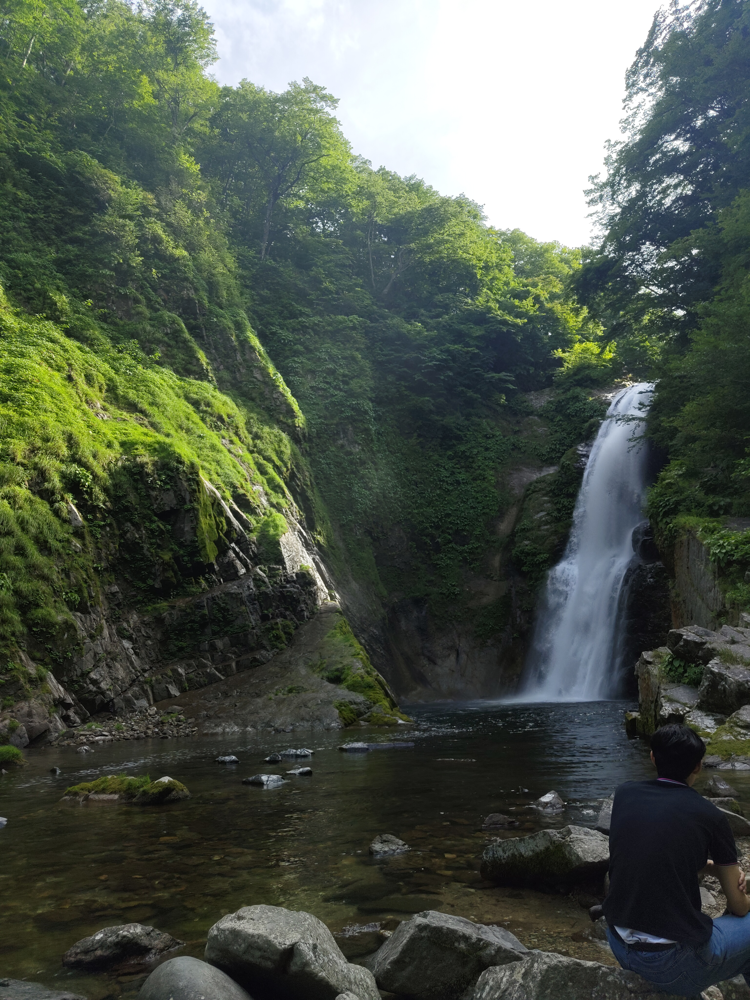
  <p class="media-caption">Akiu Great Falls — secluded, quiet, the kind of waterfall that feels found rather than visited.</p>
</div>

<hr class="section-divider">

<div id="iwate"></div>
::: {.prose}

## Iwate — The Gorge and the Earthquake

Iwate carries the weight of the 2011 Tōhoku earthquake more visibly than anywhere else on the trip — the broken bridge and the road split in two are still there, left as reminders rather than cleared away, and standing in front of them is one of those moments where the scale of what happened becomes concrete in a way that statistics don't manage.

Gembikei Gorge is the counterpoint: a narrow valley with a river running through green rock, utterly peaceful, and home to one of the more memorable food delivery systems in Japan — a small shop on one side of the gorge sends dango across on a rope pulley to visitors on the other side. The Akkoku-no-Iwaya Bishamondō shrine is built directly into the mountainside in the way that Tohoku shrines sometimes are, the rock face forming the back wall, the whole thing feeling like it grew out of the mountain rather than was placed on it.

:::

<div class="media-block">
  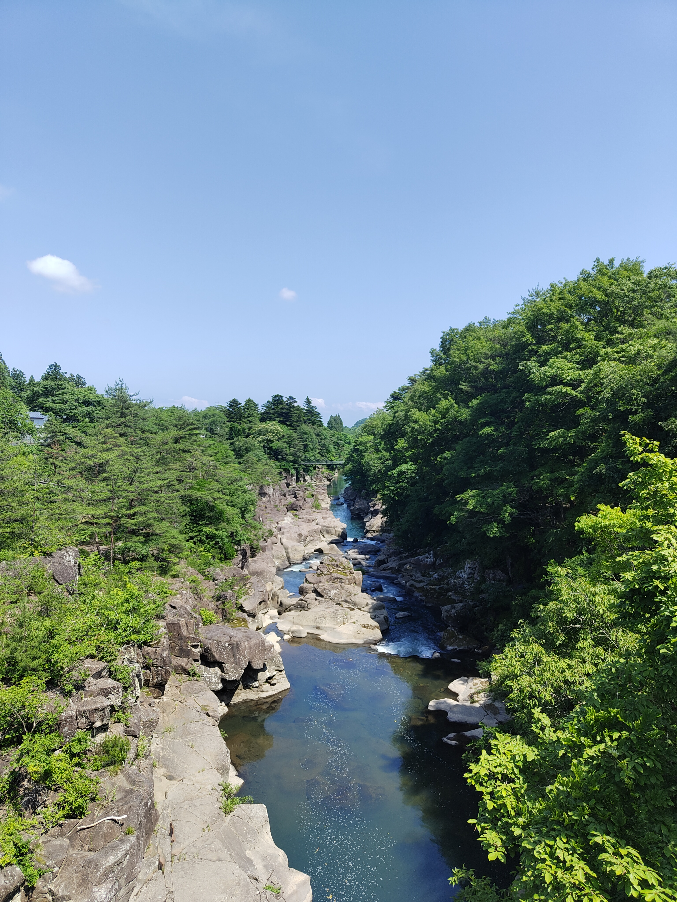
  <p class="media-caption">Gembikei Gorge — narrow, green, and entirely peaceful.</p>
</div>

<div class="media-block" style="margin: 2rem 0;">
  <video autoplay muted loop playsinline
         style="width: 100%; max-height: 480px; object-fit: cover; object-position: center; border-radius: 6px; display: block;">
    <source src="https://github.com/martinas-jucysbrady/martinas-jucysbrady.github.io/releases/download/v1.0-media/iwate_dangov.mp4" type="video/mp4" />
  </video>
  <p class="media-caption">The dango pulley — sent across the gorge on a rope by the shopkeeper on the other side.</p>
</div>

<div style="display: grid; grid-template-columns: 1fr 1fr 1fr; gap: 1rem; margin: 2rem 0;">
  <figure style="margin: 0;">
    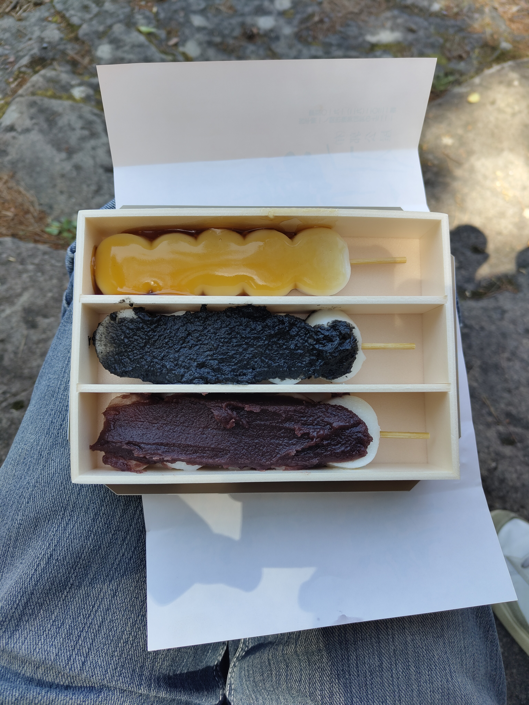
    <figcaption class="media-caption">The dango — arrived by rope, eaten by the river.</figcaption>
  </figure>
  <figure style="margin: 0;">
    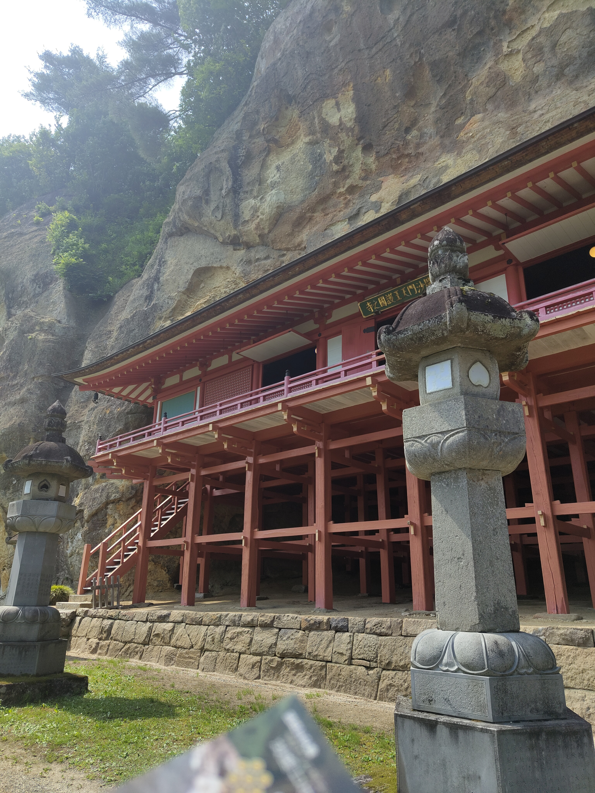
    <figcaption class="media-caption">Akkoku-no-Iwaya — the shrine that grew out of the mountain.</figcaption>
  </figure>
  <figure style="margin: 0;">
    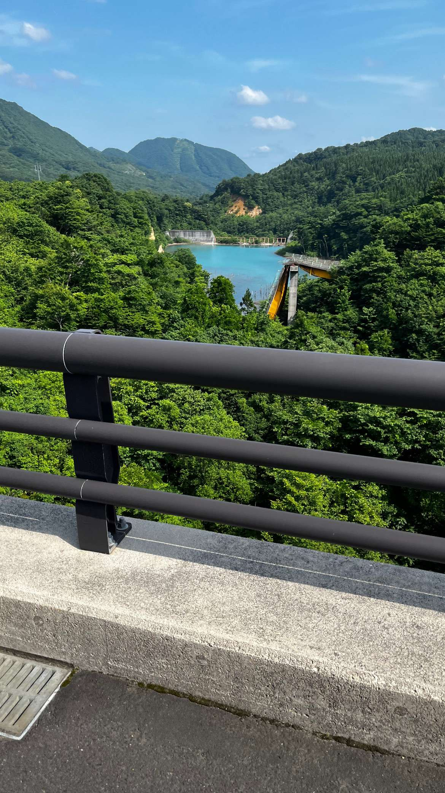
    <figcaption class="media-caption">The broken bridge — left as a reminder, not cleared away.</figcaption>
  </figure>
</div>

<hr class="section-divider">

<div id="akita"></div>
::: {.prose}

## Akita — Hot Springs and Near Misses

Oyasukyo is a gorge walk where the valley walls leak steam from the hot springs running through the rock — the path goes alongside the river at the base, the steam rising on both sides in the cold air, the whole thing feeling like walking through somewhere geologically active in real time. It is relaxing in the way that things are when they're slightly otherworldly.

Mount Kurikoma is a longer commitment — the walk up to the hot spring shrine is beautiful, the views from the top are splendid, and at some point on the way there was a snake we nearly stoood on. The views were worth it regardless.

:::

<div style="display: grid; grid-template-columns: 1fr 1fr; gap: 1rem; margin: 2rem 0;">
  <figure style="margin: 0;">
    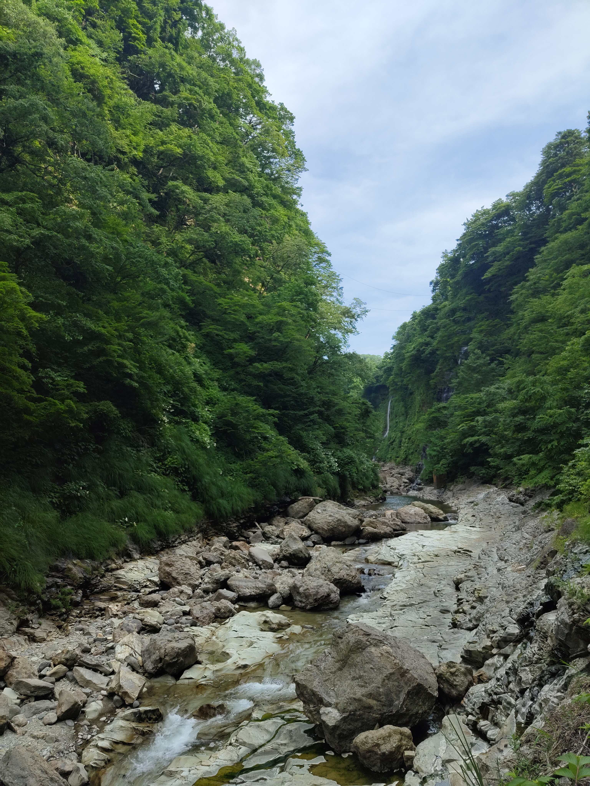
    <figcaption class="media-caption">Oyasukyo — steam rising from the valley walls, the hot springs running through the rock.</figcaption>
  </figure>
  <figure style="margin: 0;">
    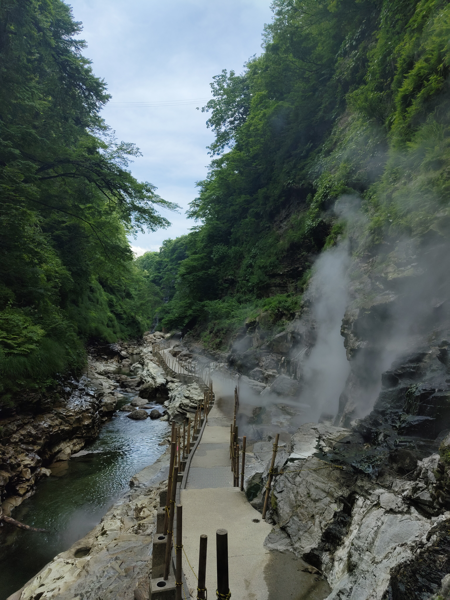
    <figcaption class="media-caption">The ravine — otherworldly in the best possible way.</figcaption>
  </figure>
</div>

<div class="media-block">
  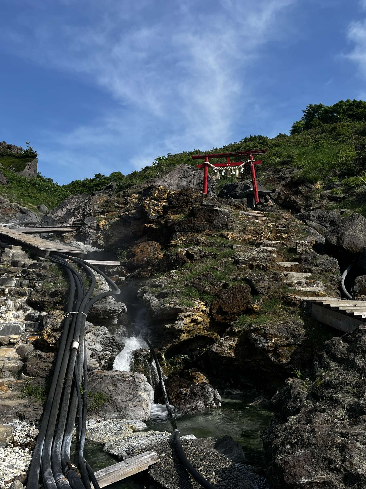
  <p class="media-caption">Mount Kurikoma — the hot spring shrine at the top, the snake somewhere on the way up.</p>
</div>

<hr class="section-divider">

<div id="yamagata"></div>
::: {.prose}

## Yamagata — A Thousand Steps and a Hot Spring Village

Yamadera is a temple complex built into the cliffs of a mountain above the Yamagata valley, and the thousand steps to reach it are the point rather than the obstacle. The views from the top — the valley below, the mountains beyond, the rooftops of the temple buildings emerging from the rock — are the kind that make the climb feel like a formality. It is one of the more rewarding temple visits in Japan.

Ginzan Onsen is a different experience entirely. The village sits in a narrow valley surrounded by mountains, a small river running through the centre, the ryokan buildings lining both banks — traditional wooden architecture, lanterns in the evening, hot spring steam rising from the water. It is beautiful in a way that photographs come close to but don't quite capture, and the whole place feels like it was designed to exist exactly where it does.

:::

<div style="display: grid; grid-template-columns: 1fr 1fr; gap: 1rem; margin: 2rem 0;">
  <figure style="margin: 0;">
    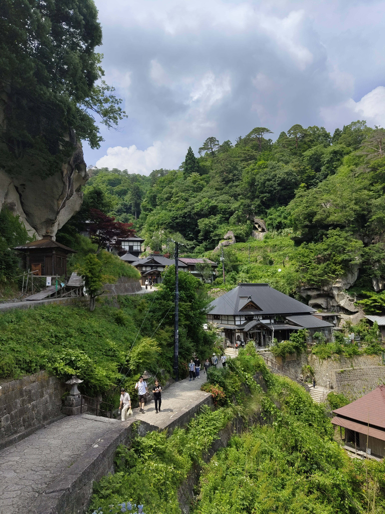
    <figcaption class="media-caption">Yamadera — the temple buildings emerging from the cliff face.</figcaption>
  </figure>
  <figure style="margin: 0;">
    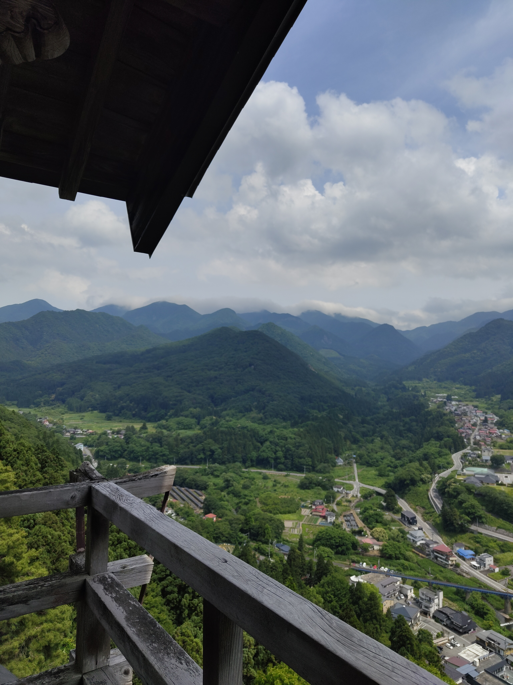
    <figcaption class="media-caption">From the top — the valley below, the mountains beyond, the thousand steps worth every one.</figcaption>
  </figure>
</div>

<div style="display: grid; grid-template-columns: 1fr 1fr; gap: 1rem; margin: 2rem 0;">
  <figure style="margin: 0;">
    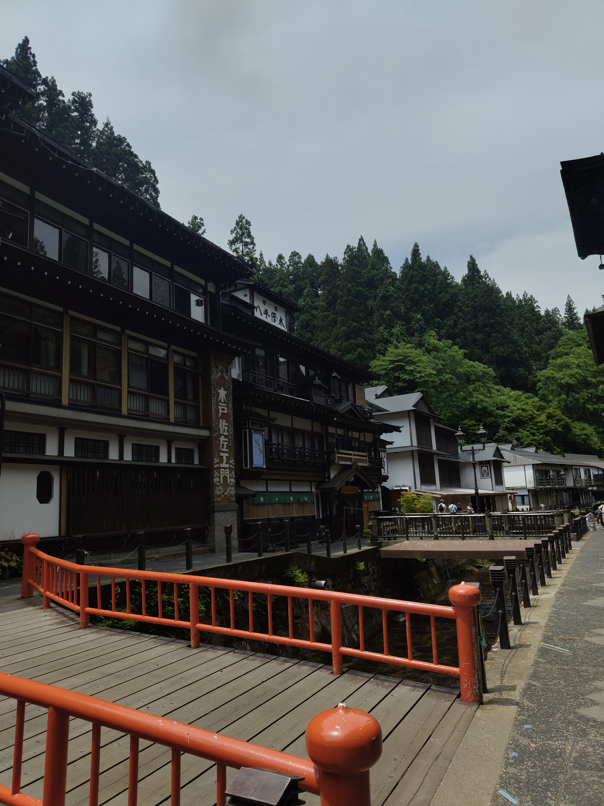
    <figcaption class="media-caption">Ginzan Onsen — traditional ryokan buildings lining the river, steam rising in the evening.</figcaption>
  </figure>
  <figure style="margin: 0;">
    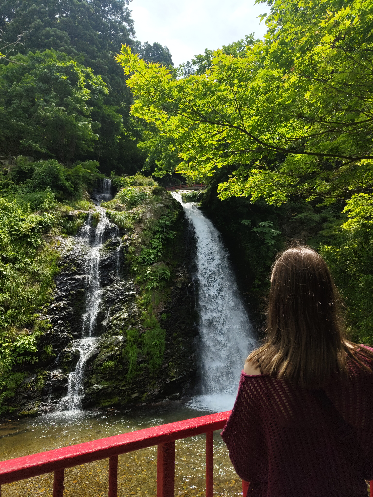
    <figcaption class="media-caption">The waterfall at Ginzan — the valley has more than one thing to offer.</figcaption>
  </figure>
</div>

<div class="pull-quote">
  "Beautiful in a way that photographs come close to but don't quite capture."
</div>

<hr class="section-divider">

<div id="fukushima"></div>
::: {.prose}

## Fukushima — The Skyline Drive

The Bandai Azuma Skyline is a mountain road that runs through volcanic terrain above the cloud line, the landscape shifting between forest and bare rock and crater lakes as the road climbs. It is one of those drives where the scenery keeps demanding attention and the conditions — mist, sulphurous air, the occasional appearance of monkeys on the road — make it feel like somewhere the rules of normal geography don't fully apply.

Lake Hibara sits in the valley below, and the light on it at sunrise and sunset is the kind that makes staying an extra morning feel like the obvious decision.

:::

<div class="media-block" style="margin: 2rem 0;">
  <video autoplay muted loop playsinline
         style="width: 100%; object-fit: none; object-position: center; border-radius: 6px; display: block;">
    <source src="https://github.com/martinas-jucysbrady/martinas-jucysbrady.github.io/releases/download/v1.0-media/fukushima_monkey.mp4" type="video/mp4" />
  </video>
  <p class="media-caption">Bandai Azuma Skyline — the monkeys on the road, entirely unbothered by passing cars.</p>
</div>

<div class="media-block">
  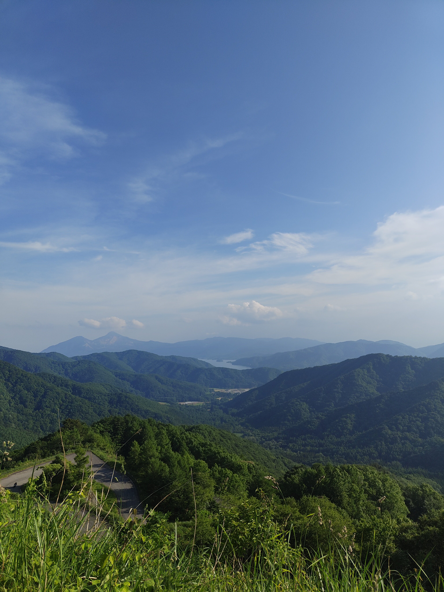
  <p class="media-caption">The Skyline — volcanic terrain, crater lakes, and the kind of scenery that keeps demanding attention.</p>
</div>

<div class="pull-quote">
  "Somewhere the rules of normal geography don't fully apply."
</div>

<hr class="section-divider">

::: {.prose}

Five days through a region that most visitors to Japan never reach, and every day different enough from the last that the variety starts to feel like the point. Tohoku is remote in the best sense — the distances between places are real, the crowds are not, and the things worth seeing are worth the effort of getting to them.

Tashirojima for the cats. Gembikei for the dango and the gorge. Ginzan Onsen for the evening. Yamadera for the view from the top. The broken bridge in Iwate for the reminder.

:::

<div class="media-block">
  
  <p class="media-caption">Ginzan Onsen — the image Tohoku leaves you with.</p>
</div>