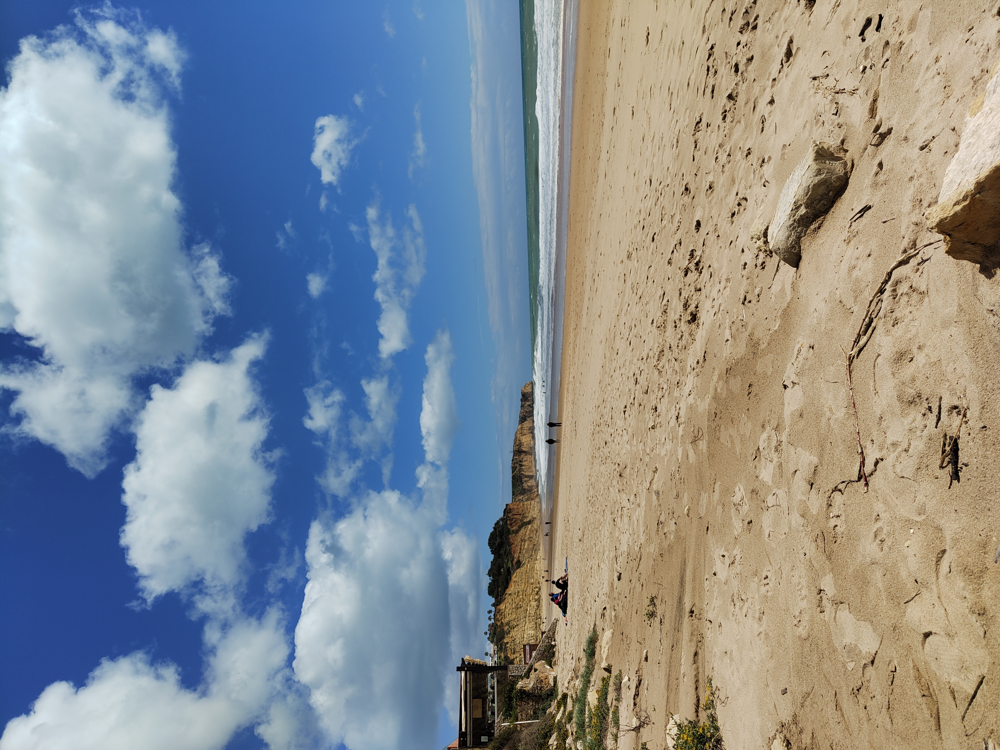
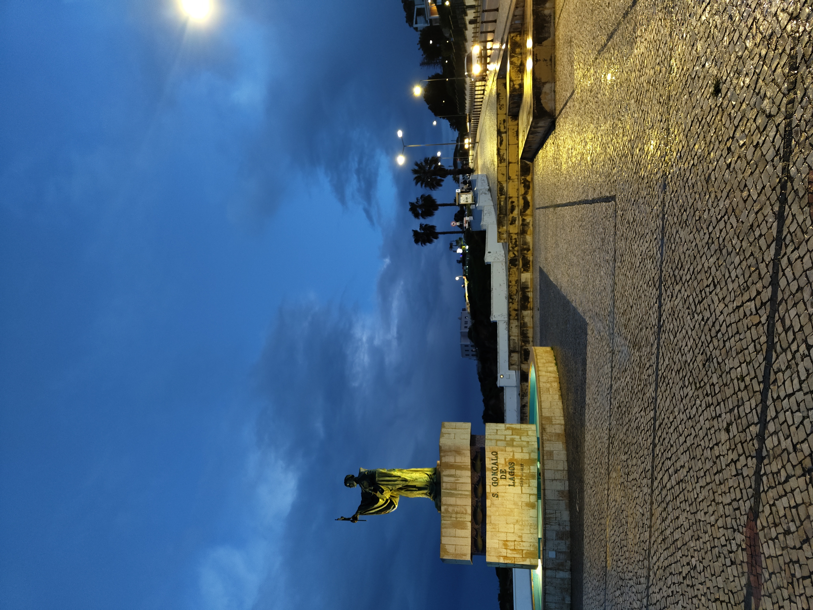
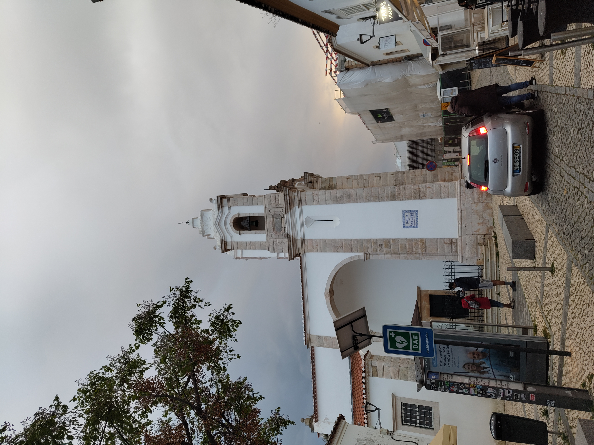
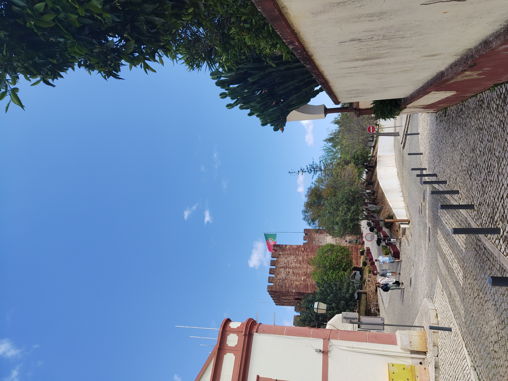
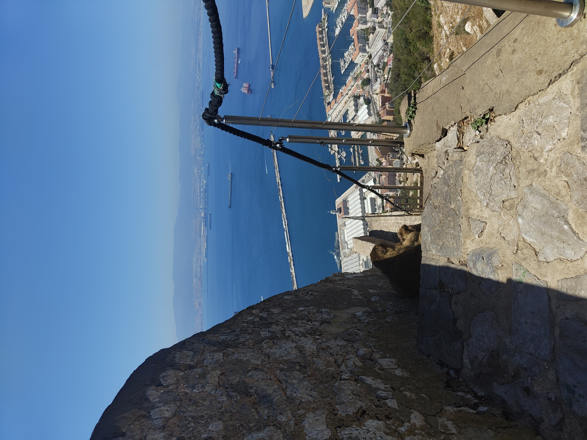
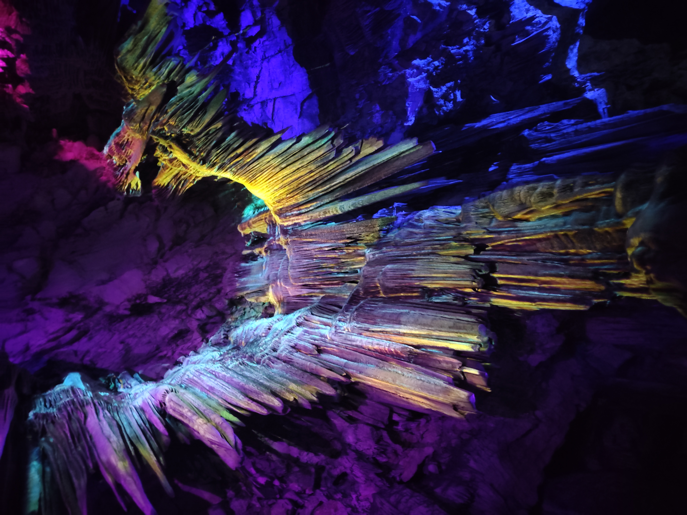
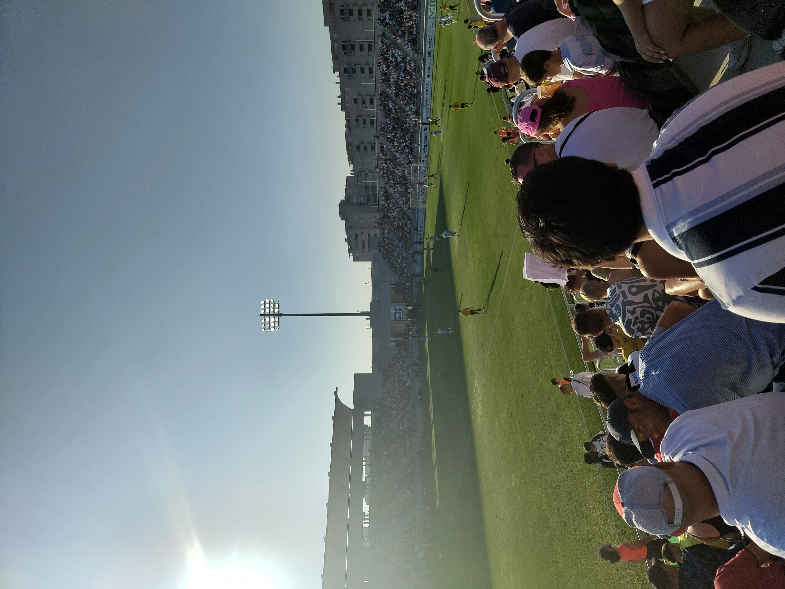
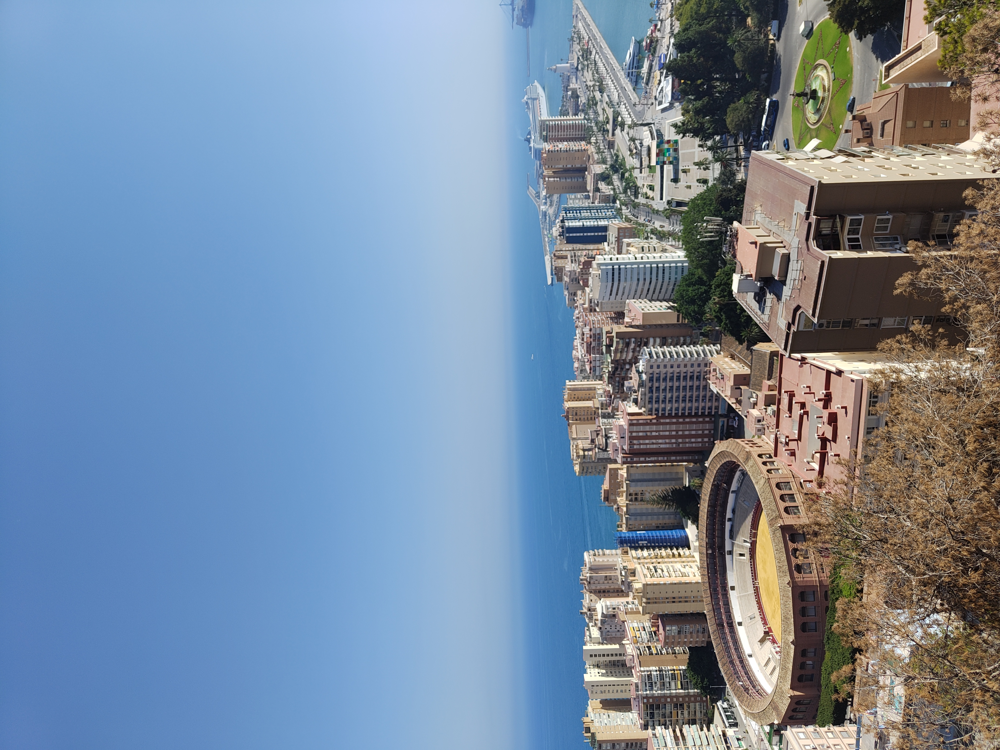
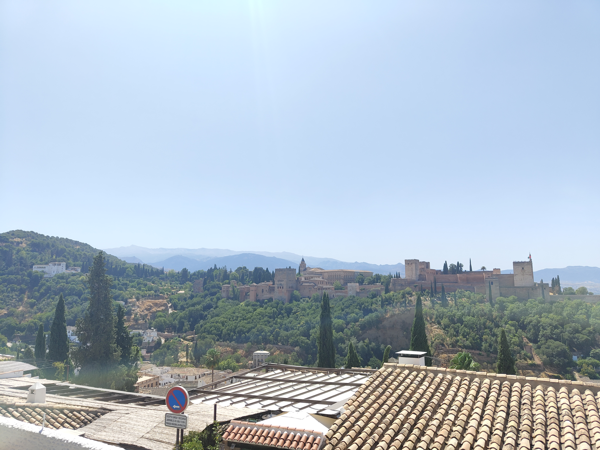
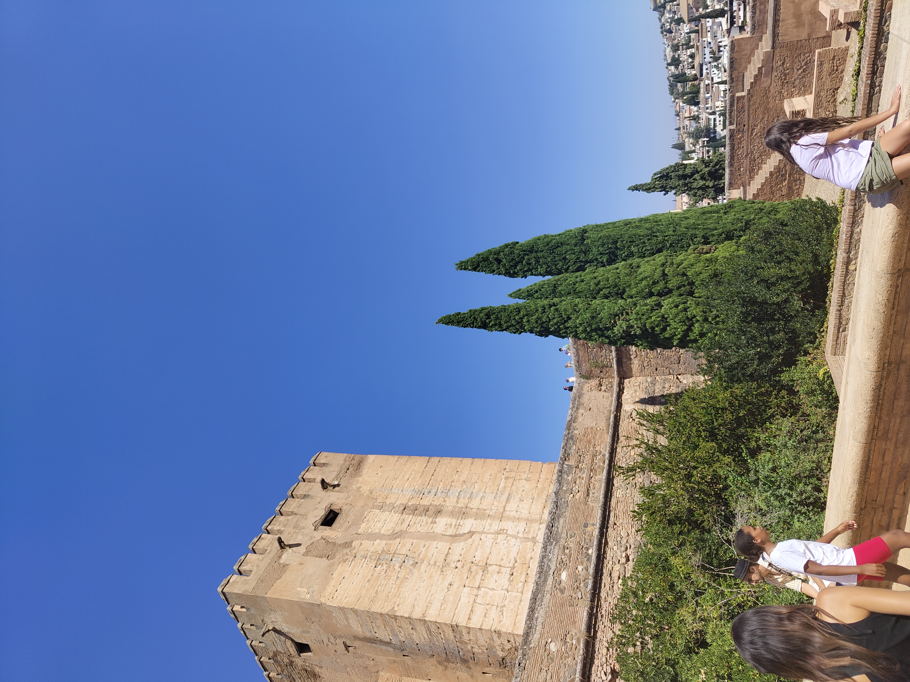

```{=html}
<style>
  .trip-header {
    text-align: center;
    padding: 60px 20px 40px;
    max-width: 860px;
    margin: 0 auto;
  }
  .trip-label {
    font-size: 0.75rem;
    letter-spacing: 0.2em;
    text-transform: uppercase;
    color: #9b8877;
    margin-bottom: 8px;
  }
  .trip-title {
    font-family: 'Plus Jakarta Sans', sans-serif;
    font-size: 2.6rem;
    font-weight: 800;
    color: #1E4264;
    margin: 0 0 12px;
    line-height: 1.1;
  }
  .trip-subtitle {
    font-family: 'Cormorant Garamond', serif;
    font-style: italic;
    font-size: 1.2rem;
    color: #6b7280;
    margin-bottom: 24px;
  }
  .trip-meta {
    display: flex;
    gap: 24px;
    justify-content: center;
    font-size: 0.8rem;
    color: #9b8877;
    letter-spacing: 0.06em;
    text-transform: uppercase;
    flex-wrap: wrap;
  }
  .section-divider {
    border: none;
    border-top: 1px solid #e0e0f0;
    margin: 48px auto;
    max-width: 600px;
  }
  .prose {
    max-width: 720px;
    margin: 0 auto;
    font-size: 1.05rem;
    line-height: 1.85;
    color: #2d3748;
  }
  .prose h2 {
    font-family: 'Plus Jakarta Sans', sans-serif;
    font-weight: 800;
    font-size: 1.6rem;
    color: #1E4264;
    margin-top: 56px;
    margin-bottom: 12px;
    text-align: center;
  }
  .prose p {
    margin-bottom: 1.4rem;
  }
  .media-block {
    max-width: 860px;
    margin: 32px auto;
    border-radius: 14px;
    overflow: hidden;
    box-shadow: 0 4px 24px rgba(0,0,0,0.10);
  }
  .media-block img,
  .media-block video {
    width: 100%;
    display: block;
    object-fit: cover;
  }
  .media-caption {
    font-family: 'Cormorant Garamond', serif;
    font-style: italic;
    font-size: 0.9rem;
    color: #9b8877;
    text-align: center;
    margin-top: 10px;
    padding: 0 12px 4px;
  }
  .pull-quote {
    font-family: 'Cormorant Garamond', serif;
    font-style: italic;
    font-size: 1.55rem;
    font-weight: 600;
    color: #1E4264;
    text-align: center;
    max-width: 640px;
    margin: 48px auto;
    line-height: 1.5;
    padding: 0 24px;
    border-left: 3px solid #c9aa96;
  }

  #quarto-document-content {
    display: flex;
    flex-direction: column;
    align-items: center;
  }

  #quarto-document-content > * {
    width: 100%;
    max-width: 860px;
  }
</style>

<div class="trip-header">
  <p class="trip-label">🍊 Travel</p>
  <h1 class="trip-title">Oranges, Cliffs, and the Rock</h1>
  <p class="trip-subtitle">Two trips along the southern edge of Europe</p>
  <div class="trip-meta">
    <span>March 2024 & July–August 2024</span>
    <span>📍 Portugal & Spain</span>
    <span>✈️ 2 trips</span>
  </div>
</div>

<hr class="section-divider">
```

<div id="lagos"></div>
::: {.prose}

## Lagos — The Coastline That Earns Every Photo

Lagos is the kind of place that makes you understand why people move somewhere rather than just visit. The beaches are beautiful, the old town is full of history and charm, and the coastline is some of the most dramatic in Europe — golden limestone cliffs dropping into the Atlantic, sea caves and arches worn through the rock over thousands of years, the ocean a deep blue-green that shifts colour depending on the light.

The walks along the coast path are the point. Every few hundred metres brings a new angle on a new formation, and the whole thing has the quality of scenery that looks better the more you slow down. The oranges everywhere are a detail that ends up becoming part of the memory of the place — on trees, in markets, in everything. Lagos has a lot of history in a small footprint and rewards an extra day.

:::

<div class="media-block">
  
  <p class="media-caption">Lagos — the beach that makes the drive worth it before you've even walked down to it.</p>
</div>

<div style="display: grid; grid-template-columns: 1fr 1fr; gap: 1rem; margin: 2rem 0;">
  <figure style="margin: 0;">
    
    <figcaption class="media-caption">The Algarve coastline — limestone cliffs and sea arches worn through over millennia.</figcaption>
  </figure>
  <figure style="margin: 0;">
    
    <figcaption class="media-caption">Every few hundred metres, a new angle on something already extraordinary.</figcaption>
  </figure>
</div>

<div class="media-block" style="margin: 2rem 0;">
  <video autoplay muted loop playsinline
         style="width: 100%; max-height: 560px; object-fit: cover; object-position: center; border-radius: 6px; display: block;">
    <source src="https://github.com/martinas-jucysbrady/martinas-jucysbrady.github.io/releases/download/v1.0-media/lagos_ocean.mp4" type="video/mp4" />
  </video>
  <p class="media-caption">The Atlantic on the coast path — the waves arriving from a long way off.</p>
</div>

<div style="display: grid; grid-template-columns: 1fr 1fr; gap: 1rem; margin: 2rem 0;">
  <figure style="margin: 0;">
    
    <figcaption class="media-caption">The old town — history in a small footprint, worth an extra day.</figcaption>
  </figure>
  <figure style="margin: 0;">
    
    <figcaption class="media-caption">Lagos — the kind of town that rewards slowing down.</figcaption>
  </figure>
</div>

<hr class="section-divider">

<div id="faro"></div>
::: {.prose}

## Silves — The Castle in the Hills

Silves is a short drive inland and worth it. The castle sits above the town on a hill and has been there, in various forms, since the Moorish occupation — the red sandstone walls and towers are in good condition and the views over the surrounding countryside are excellent. The cathedral below it is similarly well-preserved. It is a small town with a lot of charm and no particular hurry about itself, which is exactly the right pace for an afternoon.

:::

<div style="display: grid; grid-template-columns: 1fr 1fr; gap: 1rem; margin: 2rem 0;">
  <figure style="margin: 0;">
    
    <figcaption class="media-caption">Silves Castle — red sandstone and Moorish history above a very quiet town.</figcaption>
  </figure>
  <figure style="margin: 0;">
    
    <figcaption class="media-caption">Faro — oranges on every tree, on every street, the whole trip.</figcaption>
  </figure>
</div>

<hr class="section-divider">

::: {.prose}

## Albufeira — Back for the Beaches

The second trip, four months later, brought different priorities — beaches, food, and the particular quality of late July sun on the Algarve coast. Albufeira delivers all three without much effort. The beaches are wide and busy in the way that good beach towns are, and the water is warm enough that getting in requires no particular courage.

:::

<div class="media-block">
  
  <p class="media-caption">Albufeira — wide, busy, warm, and entirely the point.</p>
</div>

<div class="media-block" style="margin: 2rem 0;">
  <video autoplay muted loop playsinline
         style="width: 100%; max-height: 480px; object-fit: cover; object-position: center; border-radius: 6px; display: block;">
    <source src="https://github.com/martinas-jucysbrady/martinas-jucysbrady.github.io/releases/download/v1.0-media/albufeira_ball.mp4" type="video/mp4" />
  </video>
  <p class="media-caption">In the water at Albufeira — the simplest possible way to spend an afternoon.</p>
</div>

<hr class="section-divider">

<div id="cadiz"></div>
::: {.prose}

## Cádiz — The Atlantic City

Cádiz sits on a narrow peninsula jutting into the Atlantic and feels, appropriately, like a city that has been shaped by the sea from every side. It is one of the oldest cities in Western Europe and carries that history lightly — the old town is compact and full of character, and the nightlife is genuinely good. El Puerto de Santa María across the bay is worth the short ferry ride for the evening.

:::

<div class="media-block" style="margin: 2rem 0;">
  <video autoplay muted loop playsinline
         style="width: 100%; max-height: 560px; object-fit: cover; object-position: center; border-radius: 6px; display: block;">
    <source src="https://github.com/martinas-jucysbrady/martinas-jucysbrady.github.io/releases/download/v1.0-media/cadiz_club.mp4" type="video/mp4" />
  </video>
  <p class="media-caption">Cádiz after dark — outdoor, open-air, entirely the right way to spend an evening in Andalusia.</p>
</div>

<hr class="section-divider">

<div id="gibraltar"></div>
::: {.prose}

## Gibraltar — The Rock, the Apes, and Al Nassr

Gibraltar is one of those places that takes a moment to process. You cross the border from La Línea de la Concepción — which involves walking directly across the airport runway, an experience that is exactly as surreal as it sounds — and find yourself in what is, unmistakably, a small piece of Britain on the southern tip of Europe. Red phone boxes, pints of bitter, fish and chips, English signage. The cognitive dissonance with the Spanish hills visible on three sides never fully resolves.

The Rock itself is the reason to come. The cable car takes you to the top, and from there you access the Apes' Den — the famous Barbary macaques that have been on the Rock for centuries and treat the tourists with complete indifference, occasionally confiscating belongings. They are faster than they look. St. Michael's Cave, carved through the limestone, is illuminated and genuinely impressive.

The unexpected highlight: Al Nassr versus Granada in the stadium in La Línea de la Concepción, a preseason friendly that had no right to be as entertaining as it was. Watching Cristiano Ronaldo play football in a small Spanish stadium a few hundred metres from the Gibraltar border is the kind of thing that only happens by accident and makes a trip.

:::

<div style="display: grid; grid-template-columns: 1fr 1fr; gap: 1rem; margin: 2rem 0;">
  <figure style="margin: 0;">
    
    <figcaption class="media-caption">The Barbary macaques — indifferent to tourists, fast when it matters.</figcaption>
  </figure>
  <figure style="margin: 0;">
    
    <figcaption class="media-caption">The stairs — proceed with caution. Many people have not.</figcaption>
  </figure>
</div>

<div style="display: grid; grid-template-columns: 1fr 1fr; gap: 1rem; margin: 2rem 0;">
  <figure style="margin: 0;">
    
    <figcaption class="media-caption">St. Michael's Cave — illuminated limestone, carved through the Rock.</figcaption>
  </figure>
  <figure style="margin: 0;">
    
    <figcaption class="media-caption">The runway crossing — the only way in or out on foot, and entirely worth it for the story.</figcaption>
  </figure>
</div>

<div class="media-block" style="margin: 2rem 0;">
  <video autoplay muted loop playsinline
         style="width: 100%; max-height: 480px; object-fit: cover; object-position: center; border-radius: 6px; display: block;">
    <source src="https://github.com/martinas-jucysbrady/martinas-jucysbrady.github.io/releases/download/v1.0-media/gibraltar_food.mp4" type="video/mp4" />
  </video>
  <p class="media-caption">Lunch by the harbour — Gibraltar doing its best impression of a British seaside town.</p>
</div>

<div class="media-block">
  
  <p class="media-caption">Al Nassr v Granada in La Línea — the kind of thing that only happens by accident.</p>
</div>

<div class="pull-quote">
  "A small piece of Britain on the southern tip of Europe — the cognitive dissonance never fully resolves."
</div>

<hr class="section-divider">

<div id="malaga"></div>
::: {.prose}

## Málaga — The View from the Castle

Málaga rewards the climb to the Castillo de Gibralfaro. The castle sits on a hill above the city and the view from the top takes in the whole thing — the bullring directly below, the port, the sea, the mountains behind. It is one of those panoramas that makes the size and shape of a city suddenly legible in a way it isn't from street level.

:::

<div class="media-block">
  
  <p class="media-caption">Málaga from the Castillo de Gibralfaro — the bullring below, the sea beyond, the whole city suddenly legible.</p>
</div>

<hr class="section-divider">

<div id="granada"></div>
::: {.prose}

## Granada — The Alhambra

The Alhambra is one of those places where the photographs have been so widely circulated that you arrive expecting to be slightly disappointed. You are not slightly disappointed. The complex — palace, fortress, gardens, and the Generalife above — is extraordinary in person in a way that the images don't fully convey, because what they can't capture is the scale, the detail, and the accumulation of it: each room giving way to the next, each courtyard more considered than the last, the whole thing sitting on a hill above the city with the Sierra Nevada visible behind it.

Granada itself carries the Moorish history of Andalusia more visibly than most cities in the region. The Albaicín quarter — the old Moorish neighbourhood on the hill opposite the Alhambra — has streets that look largely as they have for centuries. The street music in the evening is traditional Andalusian, and it is the right soundtrack for the place.

:::

<div class="media-block">
  
  <p class="media-caption">The Alhambra from a distance — the photographs have been widely circulated and still don't prepare you.</p>
</div>

<div class="media-block">
  
  <p class="media-caption">Inside the complex — each courtyard more considered than the last.</p>
</div>

<div class="media-block" style="margin: 2rem 0;">
  <video autoplay muted loop playsinline
         style="width: 100%; max-height: 480px; object-fit: cover; object-position: center; border-radius: 6px; display: block;">
    <source src="https://github.com/martinas-jucysbrady/martinas-jucysbrady.github.io/releases/download/v1.0-media/granada_music.mp4" type="video/mp4" />
  </video>
  <p class="media-caption">Traditional Andalusian music on the street — the right soundtrack for the place.</p>
</div>

<div class="pull-quote">
  "Each room giving way to the next, each courtyard more considered than the last."
</div>

<hr class="section-divider">

::: {.prose}

Two trips, eight cities, two countries — all along the same stretch of southern coastline, and each place different enough from the last to feel like a separate argument for coming back. The Algarve is the Atlantic coast at its most dramatic. Andalusia is history and heat and nightlife in roughly equal measure. Gibraltar is something that shouldn't exist and does.

The oranges were everywhere the whole time. That turns out to be one of the things you remember most.

:::

<div class="media-block">
  
  <p class="media-caption">The southern edge of Europe — worth coming back to.</p>
</div>
