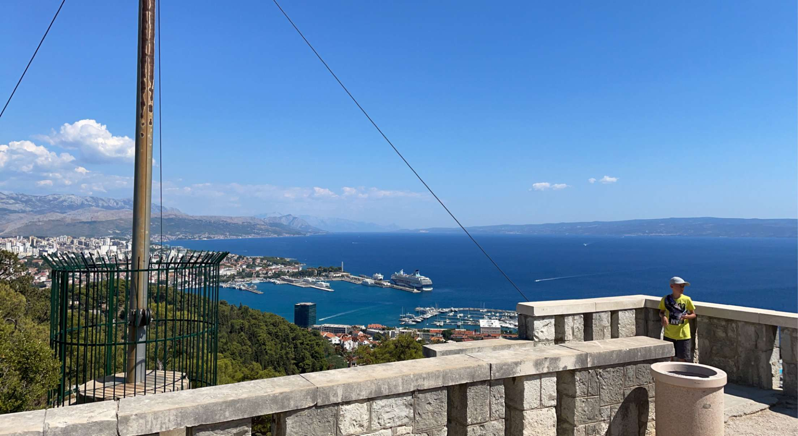
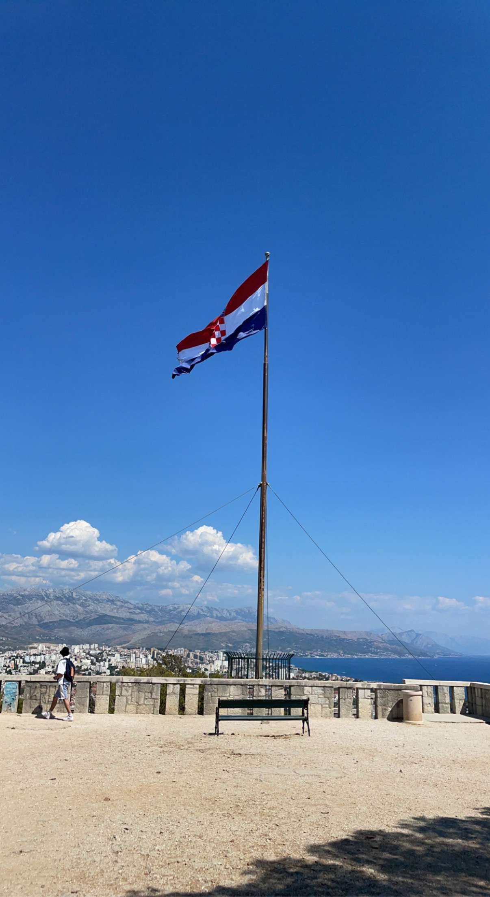
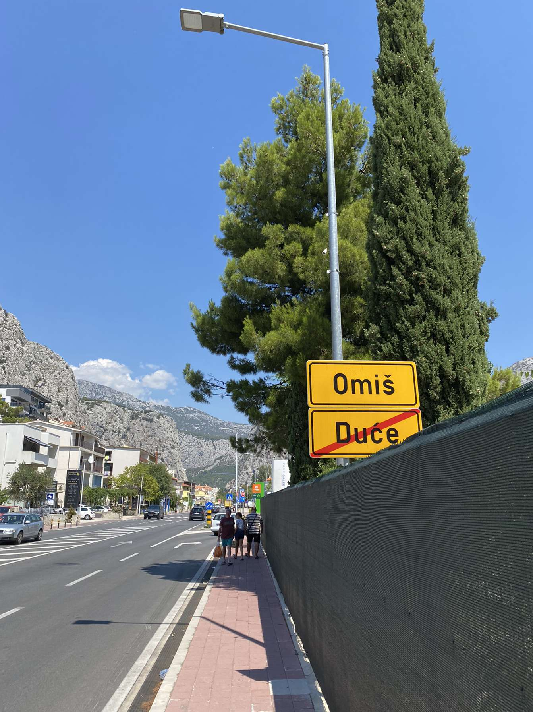
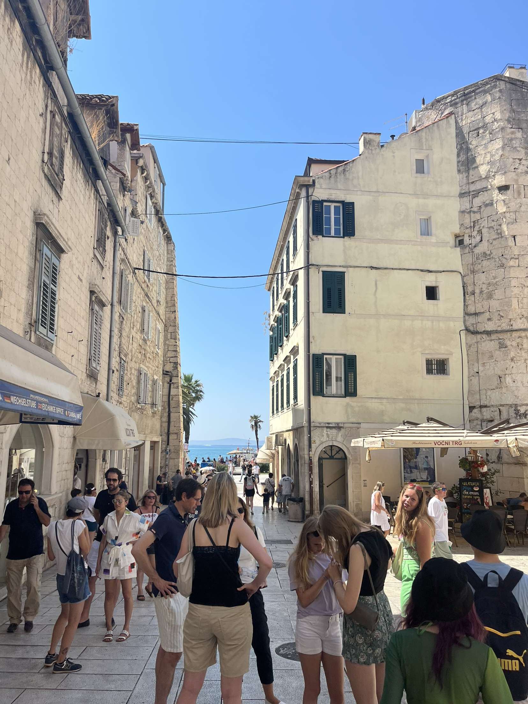
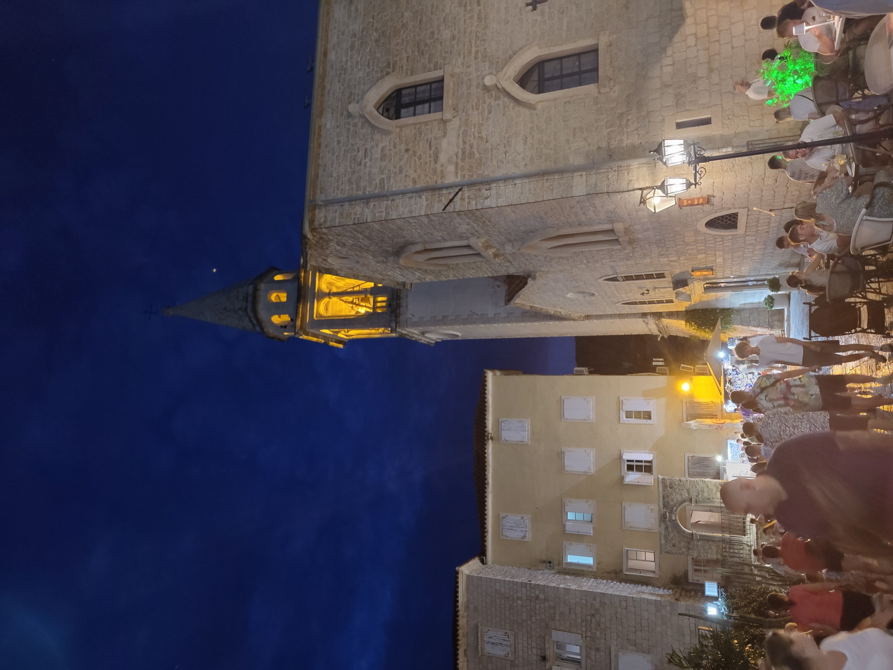
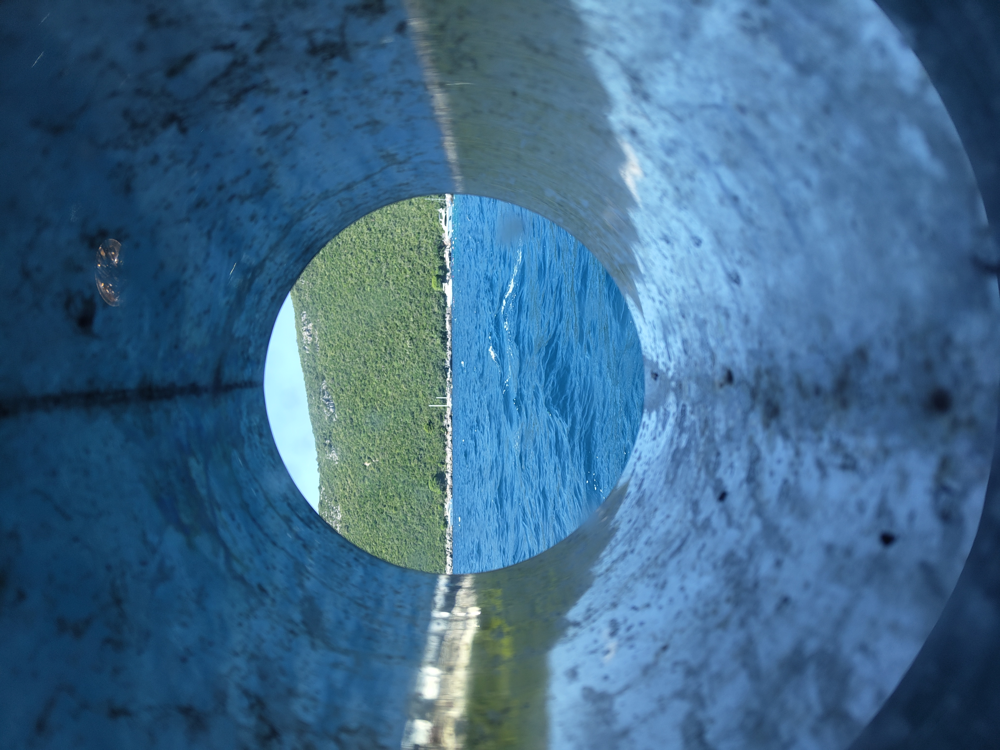
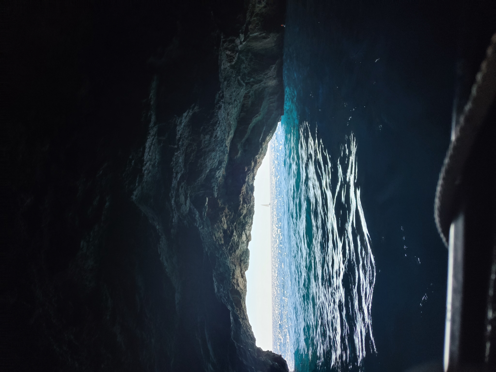
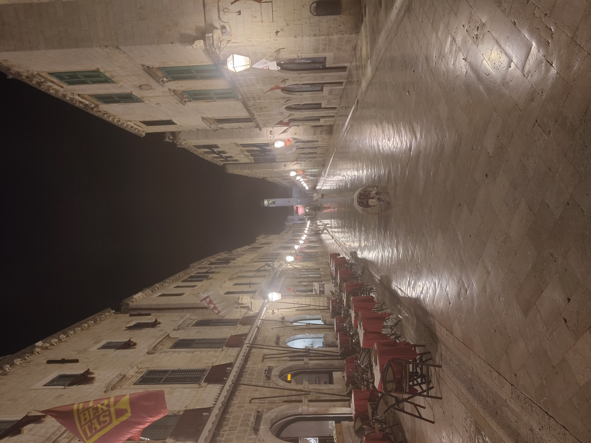
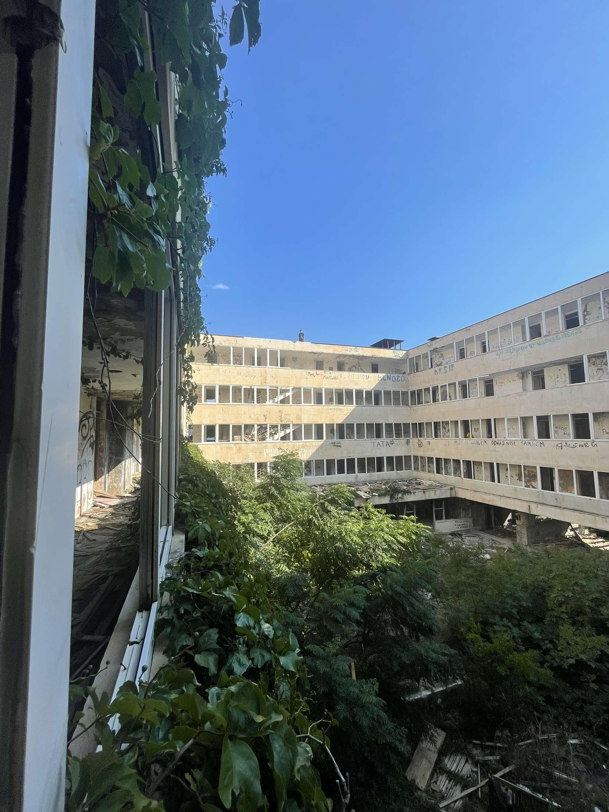
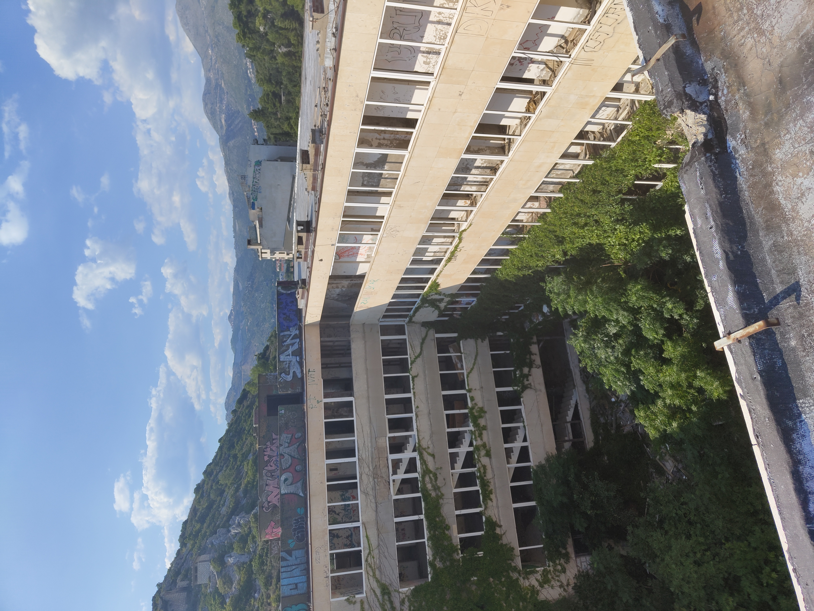

```{=html}
<style>
  .trip-header {
    text-align: center;
    padding: 60px 20px 40px;
    max-width: 860px;
    margin: 0 auto;
  }
  .trip-label {
    font-size: 0.75rem;
    letter-spacing: 0.2em;
    text-transform: uppercase;
    color: #9b8877;
    margin-bottom: 8px;
  }
  .trip-title {
    font-family: 'Plus Jakarta Sans', sans-serif;
    font-size: 2.6rem;
    font-weight: 800;
    color: #1E4264;
    margin: 0 0 12px;
    line-height: 1.1;
  }
  .trip-subtitle {
    font-family: 'Cormorant Garamond', serif;
    font-style: italic;
    font-size: 1.2rem;
    color: #6b7280;
    margin-bottom: 24px;
  }
  .trip-meta {
    display: flex;
    gap: 24px;
    justify-content: center;
    font-size: 0.8rem;
    color: #9b8877;
    letter-spacing: 0.06em;
    text-transform: uppercase;
    flex-wrap: wrap;
  }
  .section-divider {
    border: none;
    border-top: 1px solid #e0e0f0;
    margin: 48px auto;
    max-width: 600px;
  }
  .prose {
    max-width: 720px;
    margin: 0 auto;
    font-size: 1.05rem;
    line-height: 1.85;
    color: #2d3748;
  }
  .prose h2 {
    font-family: 'Plus Jakarta Sans', sans-serif;
    font-weight: 800;
    font-size: 1.6rem;
    color: #1E4264;
    margin-top: 56px;
    margin-bottom: 12px;
    text-align: center;
  }
  .prose p {
    margin-bottom: 1.4rem;
  }
  .media-block {
    max-width: 860px;
    margin: 32px auto;
    border-radius: 14px;
    overflow: hidden;
    box-shadow: 0 4px 24px rgba(0,0,0,0.10);
  }
  .media-block img,
  .media-block video {
    width: 100%;
    display: block;
    object-fit: cover;
  }
  .media-caption {
    font-family: 'Cormorant Garamond', serif;
    font-style: italic;
    font-size: 0.9rem;
    color: #9b8877;
    text-align: center;
    margin-top: 10px;
    padding: 0 12px 4px;
  }
  .pull-quote {
    font-family: 'Cormorant Garamond', serif;
    font-style: italic;
    font-size: 1.55rem;
    font-weight: 600;
    color: #1E4264;
    text-align: center;
    max-width: 640px;
    margin: 48px auto;
    line-height: 1.5;
    padding: 0 24px;
    border-left: 3px solid #c9aa96;
  }

  #quarto-document-content {
    display: flex;
    flex-direction: column;
    align-items: center;
  }

  #quarto-document-content > * {
    width: 100%;
    max-width: 860px;
  }
</style>

<div class="trip-header">
  <p class="trip-label">🌊 Travel</p>
  <h1 class="trip-title">The Adriatic Coast</h1>
  <p class="trip-subtitle">Two summers on the water — Croatia and Montenegro</p>
  <div class="trip-meta">
    <span>July–August 2022 & August 2023</span>
    <span>📍 Croatia & Montenegro</span>
    <span>✈️ 2 trips</span>
  </div>
</div>

<hr class="section-divider">
```

<div id="split"></div>
::: {.prose}

## Split — The First Proper One

Split was the first proper holiday somewhere new with friends, and it delivered in the way that first trips like that tend to — loudly, memorably, and in a way that sets a bar that subsequent trips spend a long time trying to clear. Seven days that covered everything: the beaches, the old town, the nightlife, the mountains above the city. Split does all of it and does it well.

The city is built around Diocletian's Palace — a Roman emperor's retirement complex that was gradually inhabited after his death and eventually became the old town, with people living inside the palace walls for over a thousand years. The result is a city centre that is genuinely, structurally ancient in a way that most historic cities only gesture at. Walking through the peristyle at night, the nightlife operating in the same spaces as the Roman stonework, is one of those experiences that takes a moment to fully accept.

The beaches are as good as advertised and the nightlife is genuinely excellent — the kind that runs until morning and doesn't apologise for it. The day trip to Omiš is worth making: a small town at the mouth of the Cetina River canyon where the mountains come down to the sea, and the ćevapi is the best reason to go. Order it immediately on arrival.

:::

<div class="media-block">
  
  <p class="media-caption">Split from above — the old town, the coastline, the Adriatic stretching out beyond.</p>
</div>

<div style="display: grid; grid-template-columns: 1fr 1fr; gap: 1rem; margin: 2rem 0;">
  <figure style="margin: 0;">
    
    <figcaption class="media-caption">The Croatian flag above Split — the city and the sea below it.</figcaption>
  </figure>
  <figure style="margin: 0;">
    
    <figcaption class="media-caption">The road into Omiš — the canyon walls coming in on both sides.</figcaption>
  </figure>
</div>

<div class="media-block">
  
  <p class="media-caption">Omiš — a small town where the mountains meet the sea, and the ćevapi is essential.</p>
</div>

<div class="pull-quote">
  "Seven days that covered everything — loudly, memorably, and in the best possible way."
</div>

<hr class="section-divider">

<div id="budva"></div>
::: {.prose}

## Budva — Montenegro Announces Itself

Budva is the kind of place that makes you wonder why more people don't come. The old town sits on a small peninsula jutting into the Adriatic, its medieval walls and terracotta rooftops framed on every side by the Montenegrin mountains and the sea — the combination of scale and intimacy is immediate and striking. The view from the apartment over the town and the water was the kind you spend the first morning just sitting with.

Montenegro as a whole operates at a different register from Croatia — quieter, less visited, and with a wildness to the landscape that makes every drive feel like the scenery is trying to outdo itself. The day tour from Budva covers most of what the country does best in a single circuit.

:::

<div class="media-block" style="margin: 2rem 0;">
  <video autoplay muted loop playsinline
         style="width: 100%; max-height: 560px; object-fit: cover; object-position: center; border-radius: 6px; display: block;">
    <source src="https://github.com/martinas-jucysbrady/martinas-jucysbrady.github.io/releases/download/v1.0-media/budva_view.mp4" type="video/mp4" />
  </video>
  <p class="media-caption">Budva from the apartment — the old town, the sea, the mountains closing in behind.</p>
</div>

<div class="media-block">
  
  <p class="media-caption">The old town — medieval walls on a peninsula, framed by mountains on every side.</p>
</div>

<hr class="section-divider">

::: {.prose}

## Kotor, Perast and Herceg-Novi — The Day Tour

Kotor is a walled medieval city at the end of a long, narrow bay that the Adriatic pushes deep into the Montenegrin coast — from above, the bay looks more like a fjord, and the city at its far end looks like something that was placed there deliberately to make the view complete. The harbour is beautiful and the streets inside the walls are dense and charming. The bridge above the harbour gives one of the better angles on the whole thing.

Perast, a short drive along the bay, is a small and very beautiful town with one of the more unusual sights on the Adriatic: Our Lady of the Rocks, a church built on an artificial island in the middle of the bay. The island was constructed over centuries by Perast sailors who dropped stones into the water around a reef, gradually building it up until there was enough to build on. The church interior is covered with votive paintings and relics brought back by sailors, and the ceiling painting is extraordinary — intricate, golden, the kind of thing you stand under and slowly take in for longer than you expect.

Herceg-Novi closes the day at the mouth of the bay. The boat to the Blue Caves takes you along the coast to a series of sea caves where the light enters through underwater openings and turns the water an electric blue that photographs can gesture at but not quite replicate. It is the kind of colour that needs to be seen.

:::

<div style="display: grid; grid-template-columns: 1fr 1fr; gap: 1rem; margin: 2rem 0;">
  <figure style="margin: 0;">
    
    <figcaption class="media-caption">Kotor from the bridge — the harbour, the walls, the bay beyond.</figcaption>
  </figure>
  <figure style="margin: 0;">
    
    <figcaption class="media-caption">Inside the walls — dense streets, medieval stonework, all of it in good condition.</figcaption>
  </figure>
</div>

<div style="display: grid; grid-template-columns: 1fr 1fr; gap: 1rem; margin: 2rem 0;">
  <figure style="margin: 0;">
    
    <figcaption class="media-caption">Our Lady of the Rocks — a church on an island built stone by stone over centuries.</figcaption>
  </figure>
  <figure style="margin: 0;">
    
    <figcaption class="media-caption">The ceiling inside — gold and paint and centuries of votive offerings above your head.</figcaption>
  </figure>
</div>

<div style="display: grid; grid-template-columns: 1fr 1fr; gap: 1rem; margin: 2rem 0;">
  <figure style="margin: 0;">
    
    <figcaption class="media-caption">Herceg-Novi — the coast framed through an opening in the old walls.</figcaption>
  </figure>
  <figure style="margin: 0;">
    
    <figcaption class="media-caption">The Blue Caves — the kind of colour that needs to be seen rather than photographed.</figcaption>
  </figure>
</div>

<div class="pull-quote">
  "Montenegro — a hidden gem of Europe, and the kind of place that makes you wonder why more people don't come."
</div>

<hr class="section-divider">

<div id="dubrovnik"></div>
::: {.prose}

## Dubrovnik — The Old Town

Dubrovnik is one of those cities that has been photographed so many times that arriving feels like stepping into a place you already know, and then it exceeds it anyway. The old town is extraordinary — limestone streets, baroque churches, the city walls running along the clifftop above the Adriatic, the whole thing preserved to a standard that makes it feel like it was built recently and very carefully, which is almost the opposite of the truth.

The narrow streets reward wandering without any particular destination. The hidden beach below the walls is one of those finds that improves with knowing it exists — clear water, quiet, reached by a path that most visitors don't take.

:::

<div class="media-block">
  
  <p class="media-caption">Dubrovnik old town — limestone and baroque, preserved to an almost implausible standard.</p>
</div>

<div style="display: grid; grid-template-columns: 1fr 1fr; gap: 1rem; margin: 2rem 0;">
  <figure style="margin: 0;">
    
    <figcaption class="media-caption">The narrow streets — the old town rewards wandering without a plan.</figcaption>
  </figure>
  <figure style="margin: 0;">
    
    <figcaption class="media-caption">The hidden beach — clear water, quiet, reached by a path most visitors don't take.</figcaption>
  </figure>
</div>

<hr class="section-divider">

::: {.prose}

## Kupari — The Hotel That Time Left Behind

Kupari is a short drive from Dubrovnik and the reason to go is the Hotel Goričina complex — a grand Yugoslav-era resort that was shelled and abandoned during the 1991–95 war and has been left exactly as the war left it ever since. The buildings are enormous, overgrown, and completely open. Walking through them is one of the stranger and more affecting experiences on the whole coastline — grand staircases going nowhere, ballrooms with the roof open to the sky, a swimming pool full of debris, the sea visible through what used to be windows.

The beach below is beautiful and largely empty, the ruined hotels forming an unlikely backdrop. The contrast between the building above and the water below — one in a state of complete collapse, the other entirely indifferent to it — is the kind of thing that stays with you.

:::

<div class="media-block">
  
  <p class="media-caption">Kupari beach from the hotel roof — the water below entirely indifferent to the ruin above it.</p>
</div>

<div style="display: grid; grid-template-columns: 1fr 1fr; gap: 1rem; margin: 2rem 0;">
  <figure style="margin: 0;">
    
    <figcaption class="media-caption">Inside Hotel Goričina — grand staircases, open sky, the war frozen in place.</figcaption>
  </figure>
  <figure style="margin: 0;">
    
    <figcaption class="media-caption">From the roof — looking down into a ballroom the sea still hasn't reclaimed.</figcaption>
  </figure>
</div>

<div class="pull-quote">
  "Grand staircases going nowhere, ballrooms with the roof open to the sky — the war frozen in place."
</div>

<hr class="section-divider">

::: {.prose}

Two summers, two countries, one coastline. The Adriatic is one of those places where the combination of history, landscape, and water produces something that no single element would manage on its own — Roman walls and sea caves and abandoned hotels and medieval islands, all within a few hours of each other.

Split was the one that started it. Dubrovnik was the one that confirmed it. Montenegro was the one that surprised it. Kupari was the one that made it stay.

:::

<div class="media-block">
  
  <p class="media-caption">The Adriatic — the one that started everything.</p>
</div>
