```{=html}
<style>
  .trip-header {
    text-align: center;
    padding: 60px 20px 40px;
    max-width: 860px;
    margin: 0 auto;
  }
  .trip-label {
    font-size: 0.75rem;
    letter-spacing: 0.2em;
    text-transform: uppercase;
    color: #9b8877;
    margin-bottom: 8px;
  }
  .trip-title {
    font-family: 'Plus Jakarta Sans', sans-serif;
    font-size: 2.6rem;
    font-weight: 800;
    color: #1E4264;
    margin: 0 0 12px;
    line-height: 1.1;
  }
  .trip-subtitle {
    font-family: 'Cormorant Garamond', serif;
    font-style: italic;
    font-size: 1.2rem;
    color: #6b7280;
    margin-bottom: 24px;
  }
  .trip-meta {
    display: flex;
    gap: 24px;
    justify-content: center;
    font-size: 0.8rem;
    color: #9b8877;
    letter-spacing: 0.06em;
    text-transform: uppercase;
    flex-wrap: wrap;
  }
  .section-divider {
    border: none;
    border-top: 1px solid #e0e0f0;
    margin: 48px auto;
    max-width: 600px;
  }
  .prose {
    max-width: 720px;
    margin: 0 auto;
    font-size: 1.05rem;
    line-height: 1.85;
    color: #2d3748;
  }
  .prose h2 {
    font-family: 'Plus Jakarta Sans', sans-serif;
    font-weight: 800;
    font-size: 1.6rem;
    color: #1E4264;
    margin-top: 56px;
    margin-bottom: 12px;
    text-align: center;
  }
  .prose p {
    margin-bottom: 1.4rem;
  }
  .media-block {
    max-width: 860px;
    margin: 32px auto;
    border-radius: 14px;
    overflow: hidden;
    box-shadow: 0 4px 24px rgba(0,0,0,0.10);
  }
  .media-block img,
  .media-block video {
    width: 100%;
    display: block;
    object-fit: cover;
  }
  .media-caption {
    font-family: 'Cormorant Garamond', serif;
    font-style: italic;
    font-size: 0.9rem;
    color: #9b8877;
    text-align: center;
    margin-top: 10px;
    padding: 0 12px 4px;
  }
  .pull-quote {
    font-family: 'Cormorant Garamond', serif;
    font-style: italic;
    font-size: 1.55rem;
    font-weight: 600;
    color: #1E4264;
    text-align: center;
    max-width: 640px;
    margin: 48px auto;
    line-height: 1.5;
    padding: 0 24px;
    border-left: 3px solid #c9aa96;
  }

  #quarto-document-content {
    display: flex;
    flex-direction: column;
    align-items: center;
  }

  #quarto-document-content > * {
    width: 100%;
    max-width: 860px;
  }
</style>

<div class="trip-header">
  <p class="trip-label">🏰 Travel</p>
  <h1 class="trip-title">Three Capitals on the Danube</h1>
  <p class="trip-subtitle">Six days across Vienna, Bratislava and Budapest</p>
  <div class="trip-meta">
    <span>June 2023</span>
    <span>📍 Austria, Slovakia & Hungary</span>
    <span>✈️ 6 days</span>
  </div>
</div>

<hr class="section-divider">
```

<div id="vienna"></div>
::: {.prose}

## Vienna — Elegance as a Default Setting

Vienna operates at a level of architectural consistency that becomes quietly overwhelming after a day or two. Every street seems to have been designed with the understanding that someone would eventually be looking at it, and the effect is cumulative — by the time you've walked past the fourth or fifth monumental building in an hour, you start to understand why the city has the reputation it does.

The palaces and churches set the tone, but it's the streets themselves that sustain it — narrow lanes flanked by tall, ornate buildings that make the city feel like it was built at a scale just slightly larger than necessary, which turns out to be exactly the right scale. The Prater amusement park offers a useful counterpoint: the old Ferris wheel, in particular, is a city landmark that earns its place on the skyline.

The Wiener Schnitzel is non-negotiable. Order it properly — veal, thin, fried in clarified butter, lemon on the side — and it tastes like the city tastes: rich, considered, slightly formal, and entirely worth it.

:::

<div style="display: grid; grid-template-columns: 1fr 1fr 1fr; gap: 1rem; margin: 2rem 0;">
  <figure style="margin: 0;">
    
    <figcaption class="media-caption">Gothic stonework — Vienna's churches competing quietly for attention.</figcaption>
  </figure>
  <figure style="margin: 0;">
    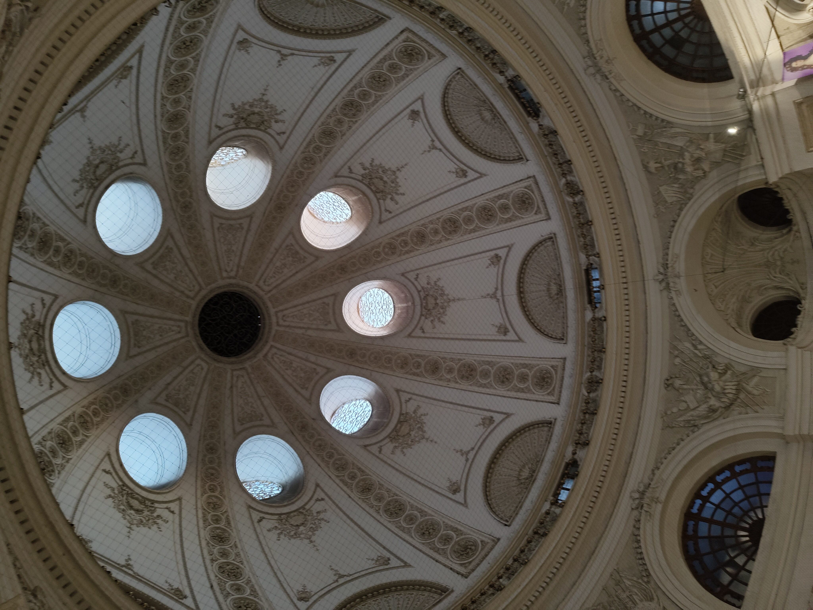
    <figcaption class="media-caption">Inside the dome — the kind of interior that makes you stand still.</figcaption>
  </figure>
  <figure style="margin: 0;">
    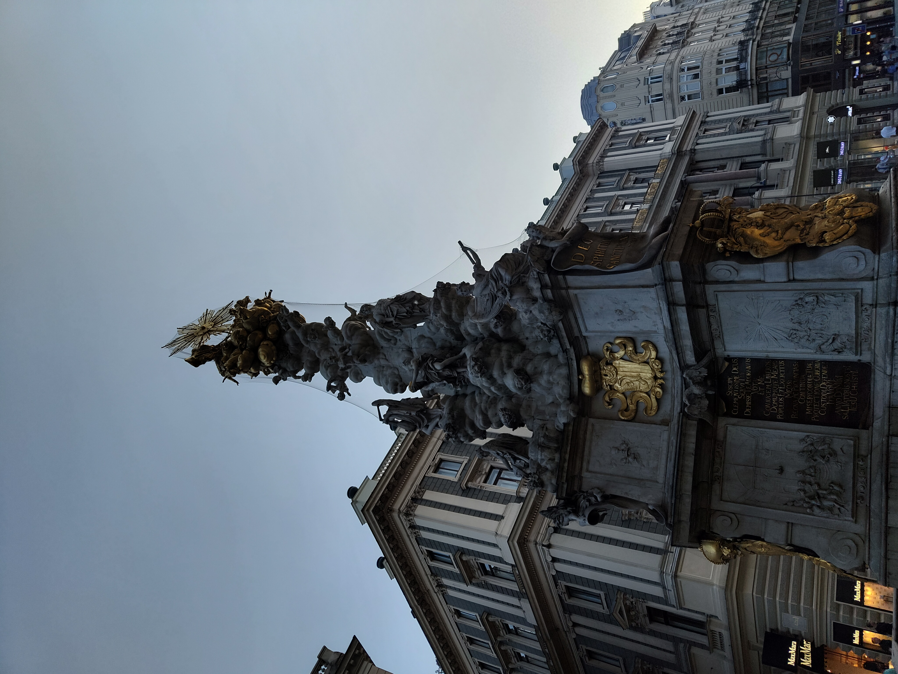
    <figcaption class="media-caption">Gold leaf and ornament — Vienna's decorative vocabulary in one statue.</figcaption>
  </figure>
</div>

<div style="display: grid; grid-template-columns: 1fr 1fr; gap: 1rem; margin: 2rem 0;">
  <figure style="margin: 0;">
    
    <figcaption class="media-caption">Vienna at its most characteristic — grand, considered, built to last.</figcaption>
  </figure>
  <figure style="margin: 0;">
    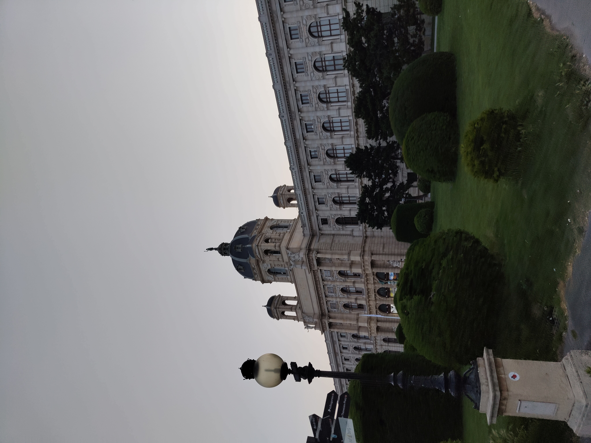
    <figcaption class="media-caption">The pink sky at sunset — the city at its most theatrical.</figcaption>
  </figure>
</div>

<div style="display: grid; grid-template-columns: 1fr 1fr 1fr; gap: 1rem; margin: 2rem 0;">
  <figure style="margin: 0;">
    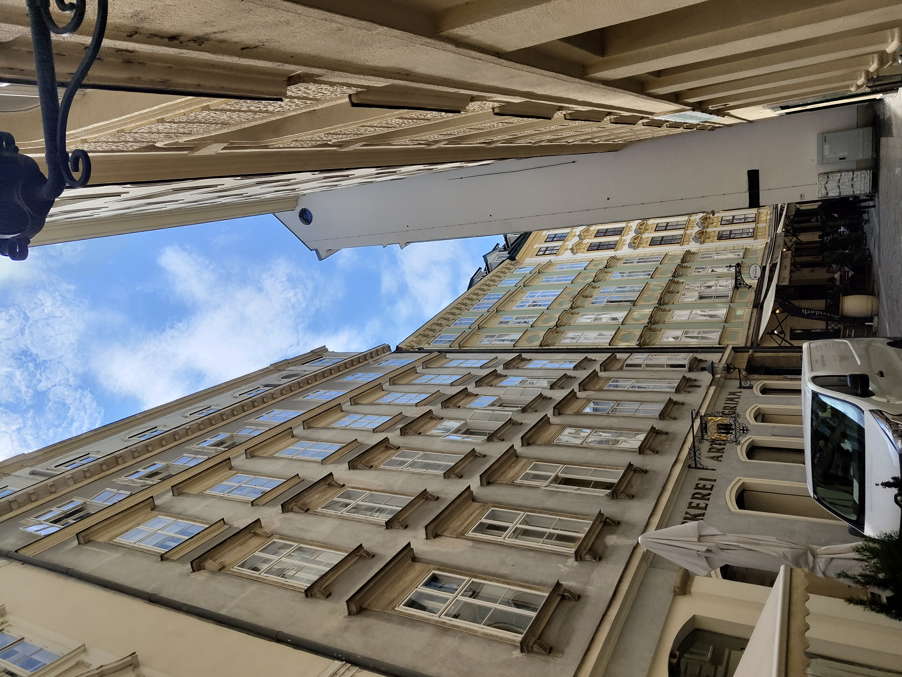
    <figcaption class="media-caption">The narrow streets — tall buildings on both sides, everywhere you turn.</figcaption>
  </figure>
  <figure style="margin: 0;">
    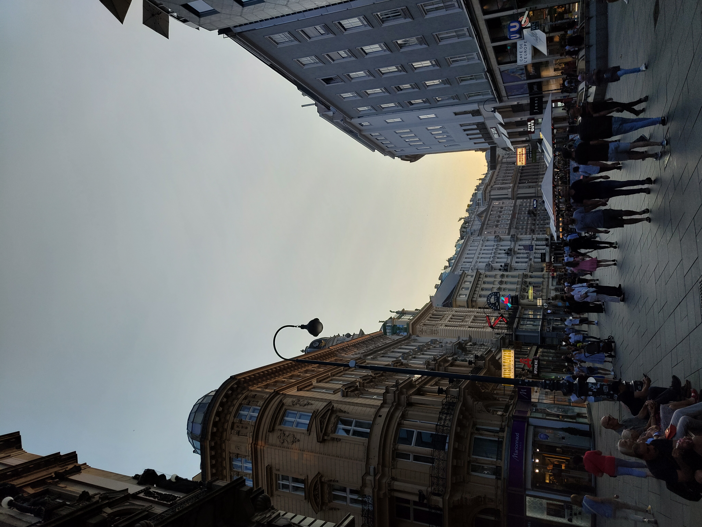
    <figcaption class="media-caption">The centre — built at a scale slightly larger than necessary, which is exactly right.</figcaption>
  </figure>
  <figure style="margin: 0;">
    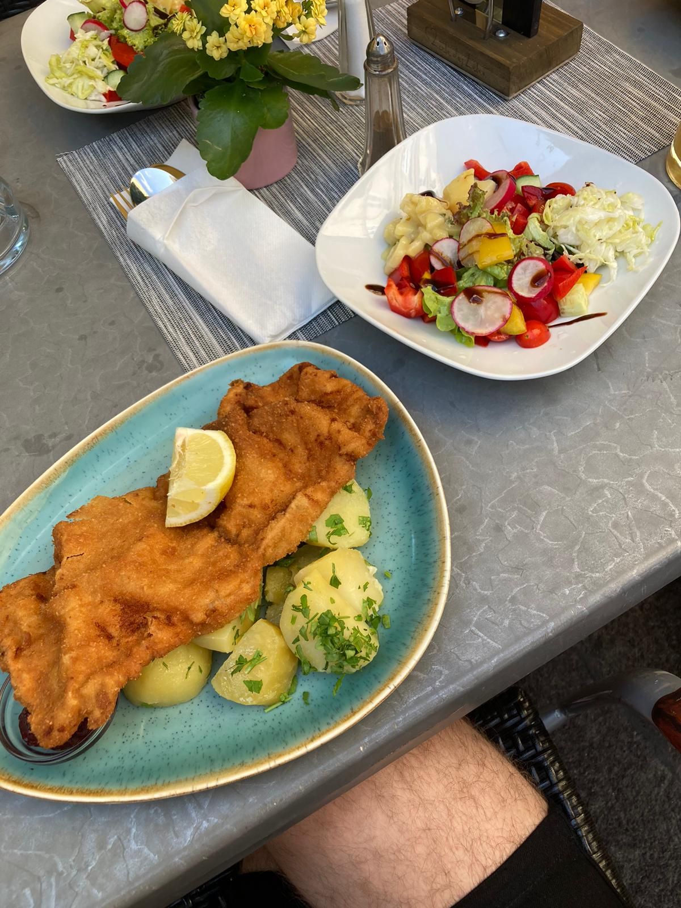
    <figcaption class="media-caption">The Wiener Schnitzel. Non-negotiable.</figcaption>
  </figure>
</div>

<div class="pull-quote">
  "Every street seems to have been designed with the understanding that someone would eventually be looking at it."
</div>

<hr class="section-divider">

<div id="bratislava"></div>
::: {.prose}

## Bratislava — The Castle on the Hill

Bratislava is an easy day trip from Vienna — an hour by train — and the contrast is instructive. Where Vienna is grand and self-certain, Bratislava is smaller and livelier in the evenings, its old town full of small bars and cafés that fill up as the sun goes down. It is a city that operates at a more human scale and is the better for it.

The castle sits on a hill above the city overlooking the Danube, and the view from the gardens explains immediately why someone chose to build there. The chimney cake — kürtőskalács, a spiral of sweet dough cooked over charcoal — is the essential street food purchase and is best eaten immediately, warm, from the paper bag.

:::

<div class="media-block">
  
  <p class="media-caption">Bratislava Castle — sitting on the hill above the Danube, the view earning its place.</p>
</div>

<div style="display: grid; grid-template-columns: 1fr 1fr 1fr; gap: 1rem; margin: 2rem 0;">
  <figure style="margin: 0;">
    
    <figcaption class="media-caption">The castle gardens — worth the climb.</figcaption>
  </figure>
  <figure style="margin: 0;">
    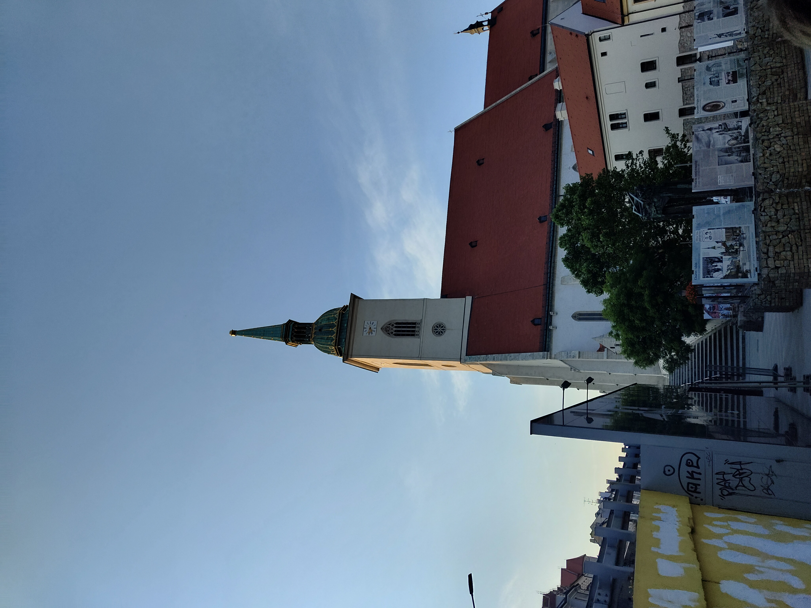
    <figcaption class="media-caption">Bratislava's old town — more charm than the city gets credit for.</figcaption>
  </figure>
  <figure style="margin: 0;">
    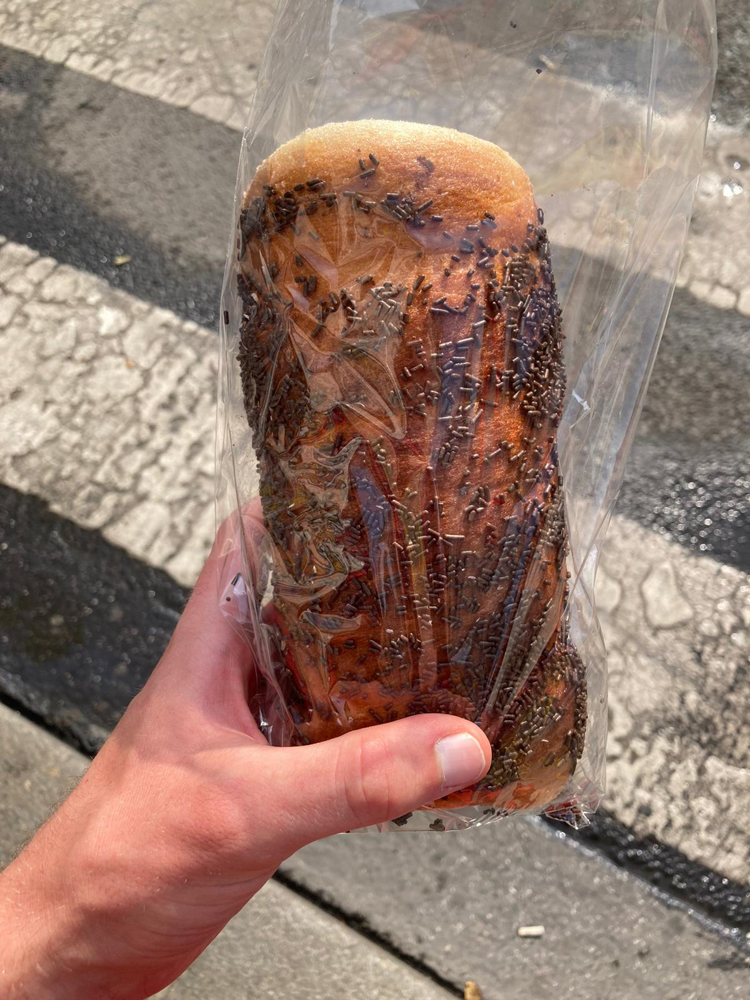
    <figcaption class="media-caption">Chimney cake — eat it warm, immediately, from the bag.</figcaption>
  </figure>
</div>

<hr class="section-divider">

<div id="budapest"></div>
::: {.prose}

## Budapest — The One That Has Everything

Budapest is the kind of city that makes you feel slightly guilty for not having come sooner. Three days is not enough. St. Stephen's Basilica stops you in your tracks from the outside and then delivers again on the inside — the Holy Right Hand of St. Stephen in its reliquary is one of those things that sounds strange until you're standing in front of it. The Parliament Building is one of the most beautiful in the world, full stop: from the Buda side of the Danube it looks like something that shouldn't exist, and the interior — painted ceilings, gilded everything — confirms the exterior was not overselling it.

The Buda side repays the walk across: the Citadel, Buda Castle, and Fisherman's Bastion offer successive vantage points over the city, and the Bastion itself is architectural theatre — turrets and terraces and sweeping views of the Parliament across the water. The caves under Budapest are something else entirely: a network of passages and chambers formed by thermal springs, running beneath the city in a way that makes the surface feel like a different world.

The nightlife is legendary for good reason. The ruin bars — Instant, Fogas, the whole complex — are a Budapest invention: former industrial and residential buildings taken over and turned into multi-room venues that work on a logic that only makes sense once you're inside them. The food is cheap and good. Borzas borda and a cheap beer is the right order. The Pinball Museum is exactly what it sounds like and better than it has any right to be — a room full of working machines from every decade, all included in the entry price.

:::

<div style="display: grid; grid-template-columns: 1fr 1fr; gap: 1rem; margin: 2rem 0;">
  <figure style="margin: 0;">
    
    <figcaption class="media-caption">The Parliament Building — one of the most beautiful in the world, from the outside.</figcaption>
  </figure>
  <figure style="margin: 0;">
    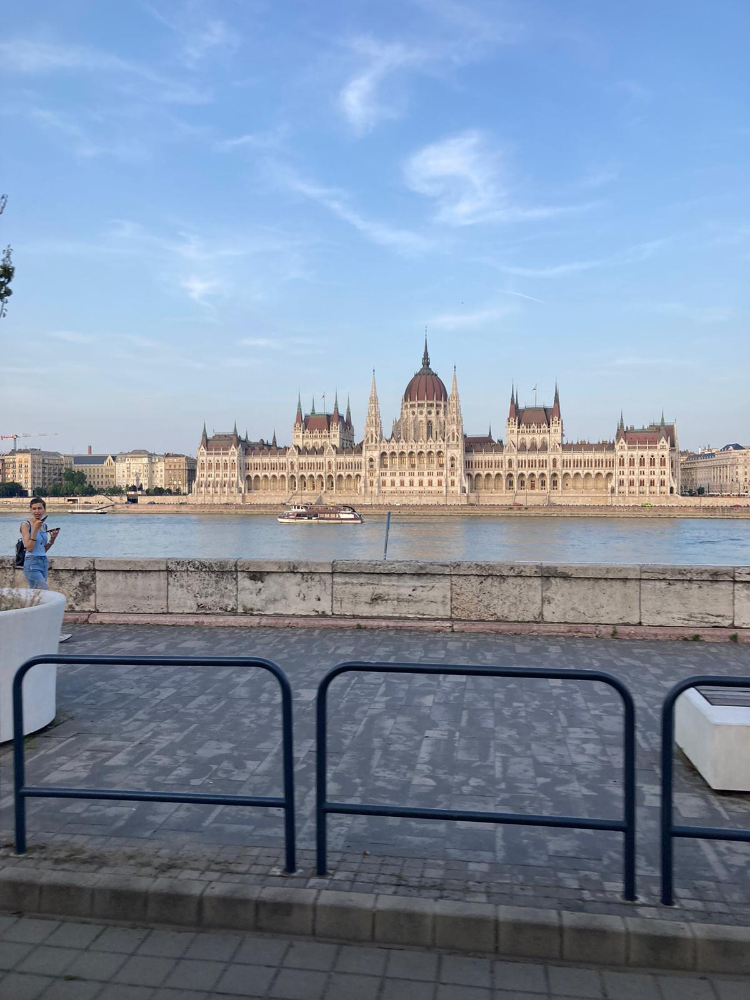
    <figcaption class="media-caption">From the Buda side — looking like something that shouldn't exist.</figcaption>
  </figure>
</div>

<div class="media-block">
  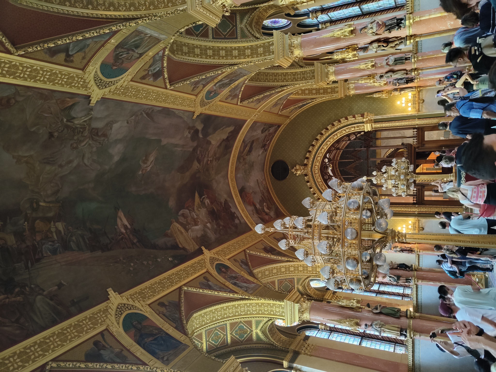
  <p class="media-caption">Inside the Parliament — painted ceilings, gilded everything, the interior matching the exterior's promise.</p>
</div>

<div style="display: grid; grid-template-columns: 1fr 1fr; gap: 1rem; margin: 2rem 0;">
  <figure style="margin: 0;">
    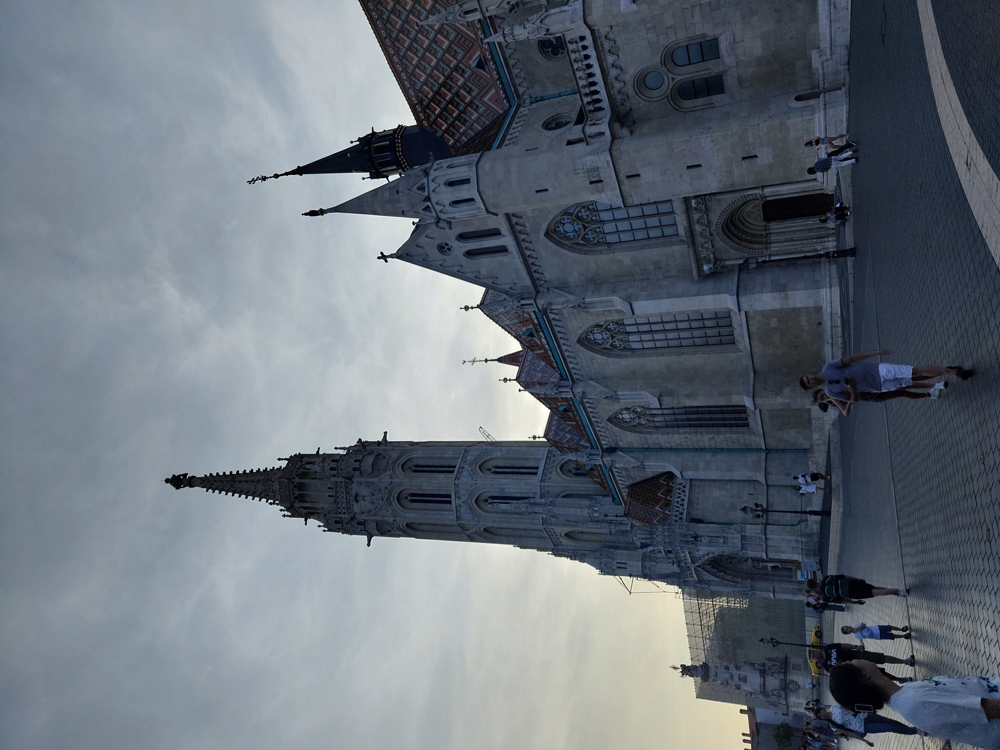
    <figcaption class="media-caption">Fisherman's Bastion — turrets, terraces, and views of the Parliament across the water.</figcaption>
  </figure>
  <figure style="margin: 0;">
    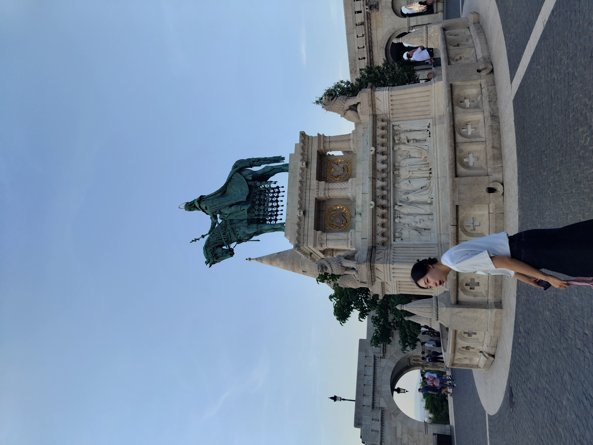
    <figcaption class="media-caption">The statue at the Bastion — architectural theatre on the Buda side.</figcaption>
  </figure>
</div>

<div style="display: grid; grid-template-columns: 1fr 1fr; gap: 1rem; margin: 2rem 0;">
  <figure style="margin: 0;">
    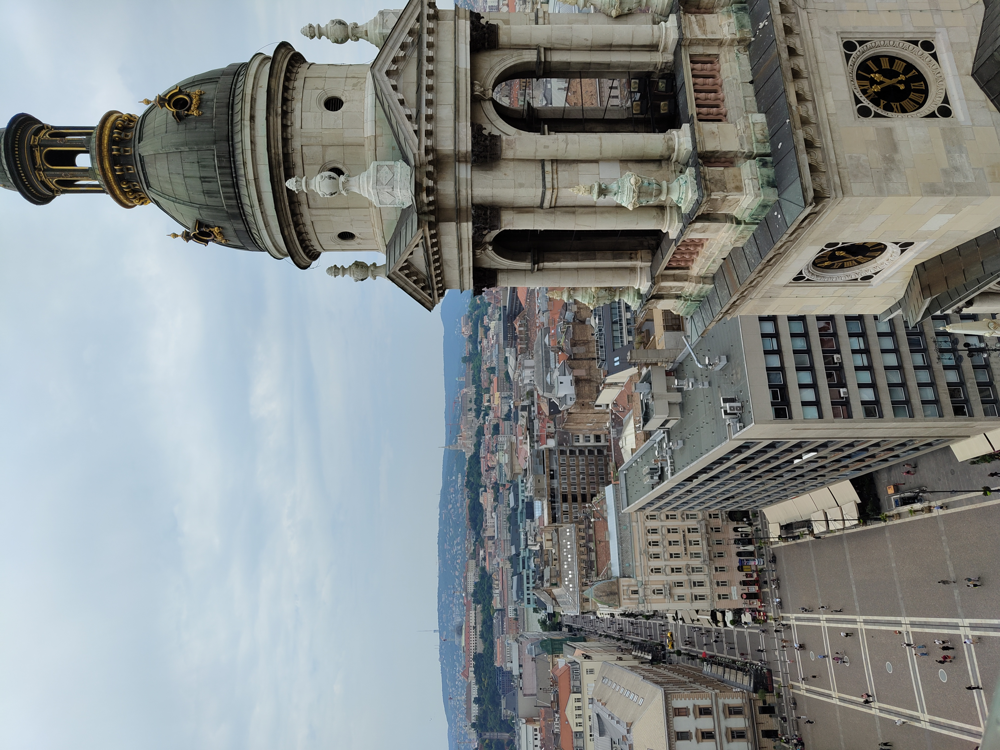
    <figcaption class="media-caption">From the top of the Basilica — Budapest laid out in every direction.</figcaption>
  </figure>
  <figure style="margin: 0;">
    
    <figcaption class="media-caption">The Holy Right Hand of St. Stephen — sounds strange until you're standing in front of it.</figcaption>
  </figure>
</div>

<div style="display: grid; grid-template-columns: 1fr 1fr; gap: 1rem; margin: 2rem 0;">
  <figure style="margin: 0;">
    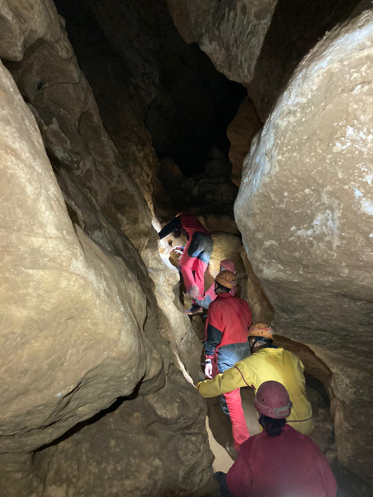
    <figcaption class="media-caption">The caves beneath the city — thermal springs, passages, a different world entirely.</figcaption>
  </figure>
  <figure style="margin: 0;">
    
    <figcaption class="media-caption">Underground Budapest — the surface feels far away down here.</figcaption>
  </figure>
</div>

<div style="display: grid; grid-template-columns: 1fr 1fr; gap: 1rem; margin: 2rem 0;">
  <figure style="margin: 0;">
    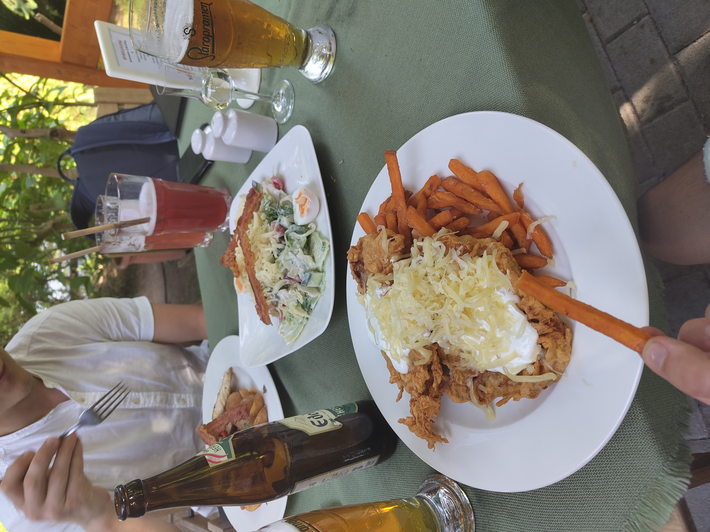
    <figcaption class="media-caption">Borzas borda — the right order, at the right price.</figcaption>
  </figure>
  <figure style="margin: 0;">
    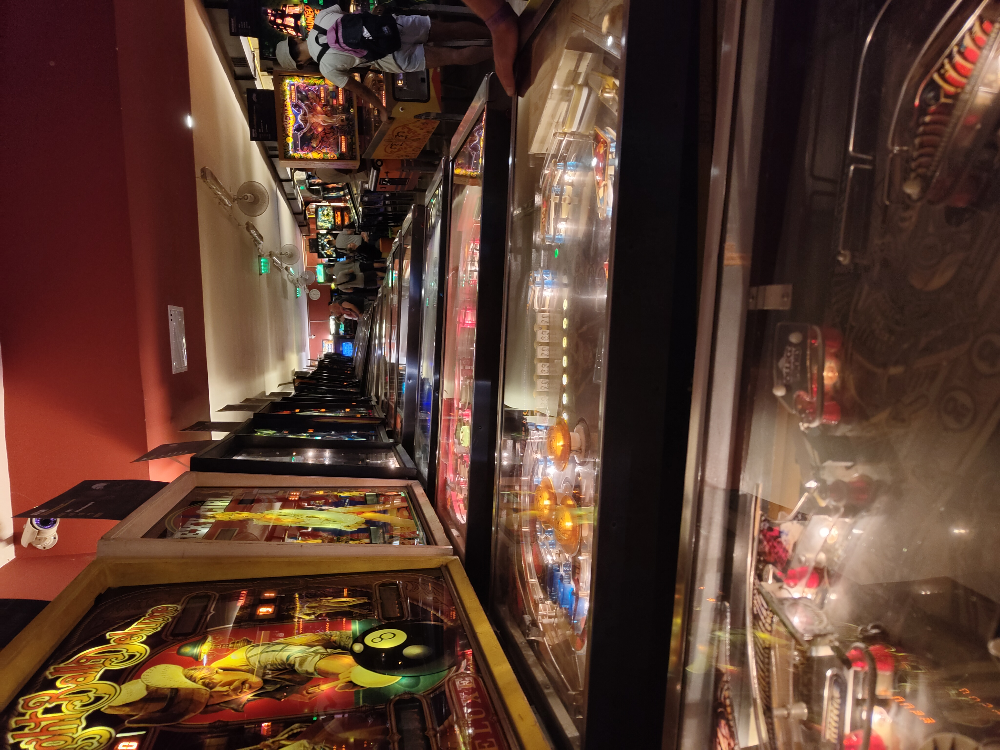
    <figcaption class="media-caption">The Pinball Museum — better than it has any right to be.</figcaption>
  </figure>
</div>

<div class="pull-quote">
  "The kind of city that makes you feel slightly guilty for not having come sooner."
</div>

<hr class="section-divider">

::: {.prose}

Three cities, six days, all on the Danube. The river connects them in more than geography — there's a shared scale, a shared sense that these cities were built for something, and a shared appetite for the evening hours that makes all three worth staying in past dark.

Vienna is the one with the reputation and it earns it. Bratislava is the one that surprises you. Budapest is the one that makes you want to stay longer than you planned and come back sooner than you expect.

:::

<div class="media-block">
  
  <p class="media-caption">Budapest from across the Danube — the one that has everything.</p>
</div>
