```{=html}
<style>
  .trip-header {
    text-align: center;
    padding: 60px 20px 40px;
    max-width: 860px;
    margin: 0 auto;
  }
  .trip-label {
    font-size: 0.75rem;
    letter-spacing: 0.2em;
    text-transform: uppercase;
    color: #9b8877;
    margin-bottom: 8px;
  }
  .trip-title {
    font-family: 'Plus Jakarta Sans', sans-serif;
    font-size: 2.6rem;
    font-weight: 800;
    color: #1E4264;
    margin: 0 0 12px;
    line-height: 1.1;
  }
  .trip-subtitle {
    font-family: 'Cormorant Garamond', serif;
    font-style: italic;
    font-size: 1.2rem;
    color: #6b7280;
    margin-bottom: 24px;
  }
  .trip-meta {
    display: flex;
    gap: 24px;
    justify-content: center;
    font-size: 0.8rem;
    color: #9b8877;
    letter-spacing: 0.06em;
    text-transform: uppercase;
    flex-wrap: wrap;
  }
  .section-divider {
    border: none;
    border-top: 1px solid #e0e0f0;
    margin: 48px auto;
    max-width: 600px;
  }
  .prose {
    max-width: 720px;
    margin: 0 auto;
    font-size: 1.05rem;
    line-height: 1.85;
    color: #2d3748;
  }
  .prose h2 {
    font-family: 'Plus Jakarta Sans', sans-serif;
    font-weight: 800;
    font-size: 1.6rem;
    color: #1E4264;
    margin-top: 56px;
    margin-bottom: 12px;
    text-align: center;
  }
  .prose p {
    margin-bottom: 1.4rem;
  }
  .media-block {
    max-width: 860px;
    margin: 32px auto;
    border-radius: 14px;
    overflow: hidden;
    box-shadow: 0 4px 24px rgba(0,0,0,0.10);
  }
  .media-block img,
  .media-block video {
    width: 100%;
    display: block;
    object-fit: cover;
  }
  .media-caption {
    font-family: 'Cormorant Garamond', serif;
    font-style: italic;
    font-size: 0.9rem;
    color: #9b8877;
    text-align: center;
    margin-top: 10px;
    padding: 0 12px 4px;
  }
  .pull-quote {
    font-family: 'Cormorant Garamond', serif;
    font-style: italic;
    font-size: 1.55rem;
    font-weight: 600;
    color: #1E4264;
    text-align: center;
    max-width: 640px;
    margin: 48px auto;
    line-height: 1.5;
    padding: 0 24px;
    border-left: 3px solid #c9aa96;
  }

  #quarto-document-content {
    display: flex;
    flex-direction: column;
    align-items: center;
  }

  #quarto-document-content > * {
    width: 100%;
    max-width: 860px;
  }
</style>

<div class="trip-header">
  <p class="trip-label">🏙️ Travel</p>
  <h1 class="trip-title">City Breaks</h1>
  <p class="trip-subtitle">Nine cities, each one worth the weekend</p>
  <div class="trip-meta">
    <span>2023 – 2026</span>
    <span>📍 Europe</span>
  </div>
</div>

<hr class="section-divider">
```

<div id="edinburgh"></div>
::: {.prose}

## Edinburgh — One of My Favourites

Edinburgh is one of those cities that gets under your skin quickly and stays there. The streets alongside the castle are full of quirky shops and the kind of architectural character that comes from centuries of building on top of and around itself — narrow wynds, sudden views, every corner slightly different from the last. It is one of my favourite places I've been, and three days felt like a good introduction rather than enough time.

Swanston Farm gave a first glimpse of the Scottish countryside — highland cows in a field with Arthur's Seat and the city visible behind them, the kind of scene that makes you want to come back and go further north. Edinburgh Zoo sits on a surprisingly steep slope and rewards the walking shoes. Greyfriars Kirkyard is quietly excellent. The National Museum of Scotland is one of the better natural history museums in the UK — genuinely immersive, well-curated, worth more time than most people give it.

The food deserves better press than it gets. Haggis is surprisingly delicious — properly seasoned, properly served, not the thing the reputation suggests. Irn Bru is decent. The fried Mars bar is exactly as sweet as you've been warned and should be approached with caution.

:::

<div class="media-block">
  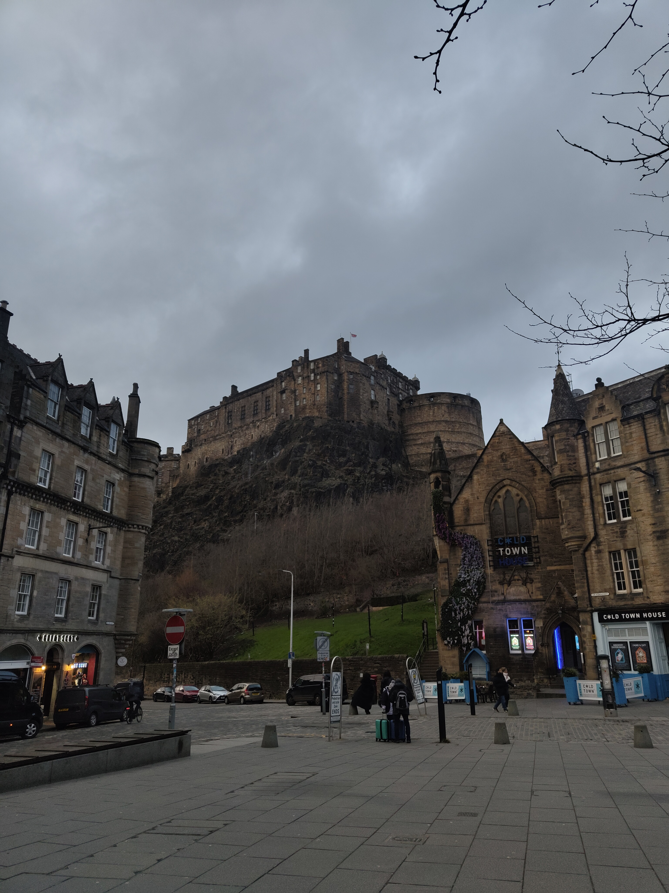
  <p class="media-caption">Edinburgh Castle — an angle that makes it look exactly as old as it is.</p>
</div>

<div style="display: grid; grid-template-columns: 1fr 1fr; gap: 1rem; margin: 2rem 0;">
  <figure style="margin: 0;">
    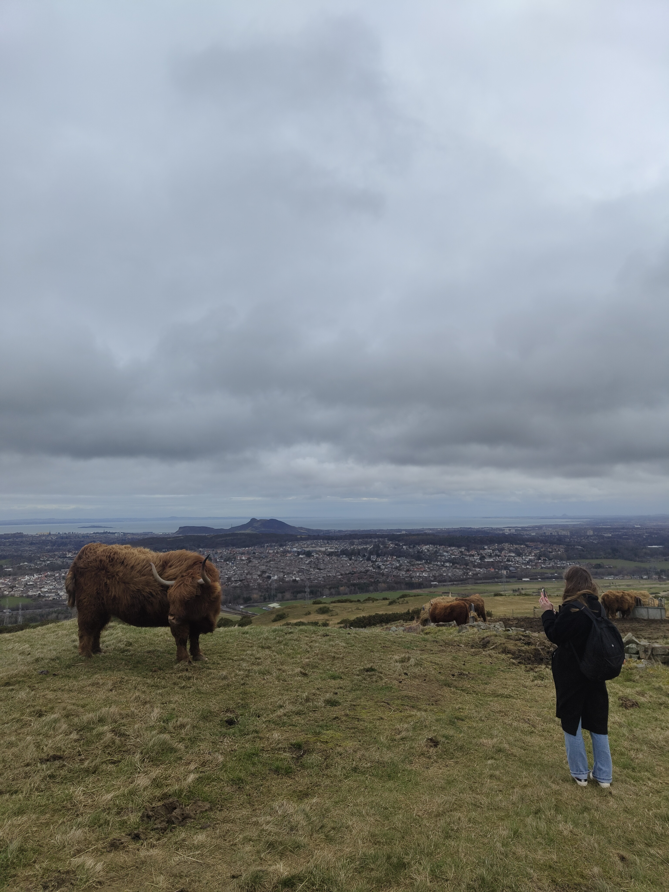
    <figcaption class="media-caption">Swanston Farm — highland cow, Arthur's Seat, and a first glimpse of Scotland beyond the city.</figcaption>
  </figure>
  <figure style="margin: 0;">
    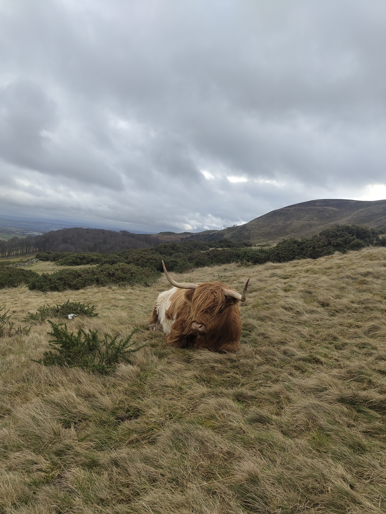
    <figcaption class="media-caption">The highland cow — entirely unbothered by visitors, deeply photogenic about it.</figcaption>
  </figure>
</div>

<div style="display: grid; grid-template-columns: 1fr 1fr; gap: 1rem; margin: 2rem 0;">
  <figure style="margin: 0;">
    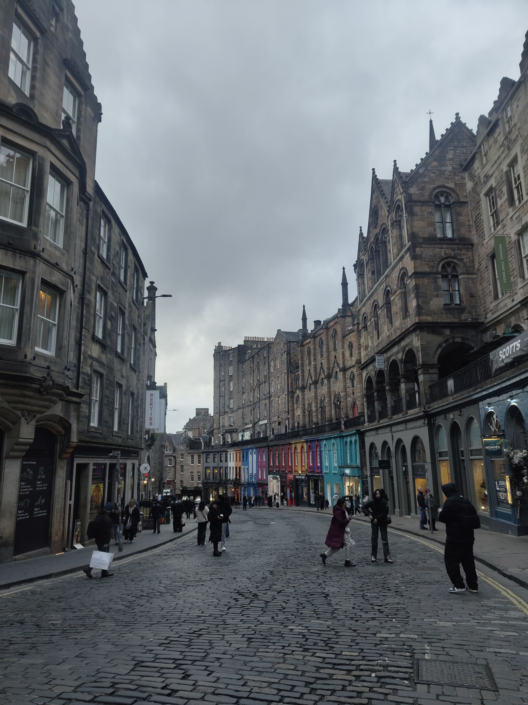
    <figcaption class="media-caption">The streets beside the castle — quirky shops, old stone, the kind of character that accumulates over centuries.</figcaption>
  </figure>
  <figure style="margin: 0;">
    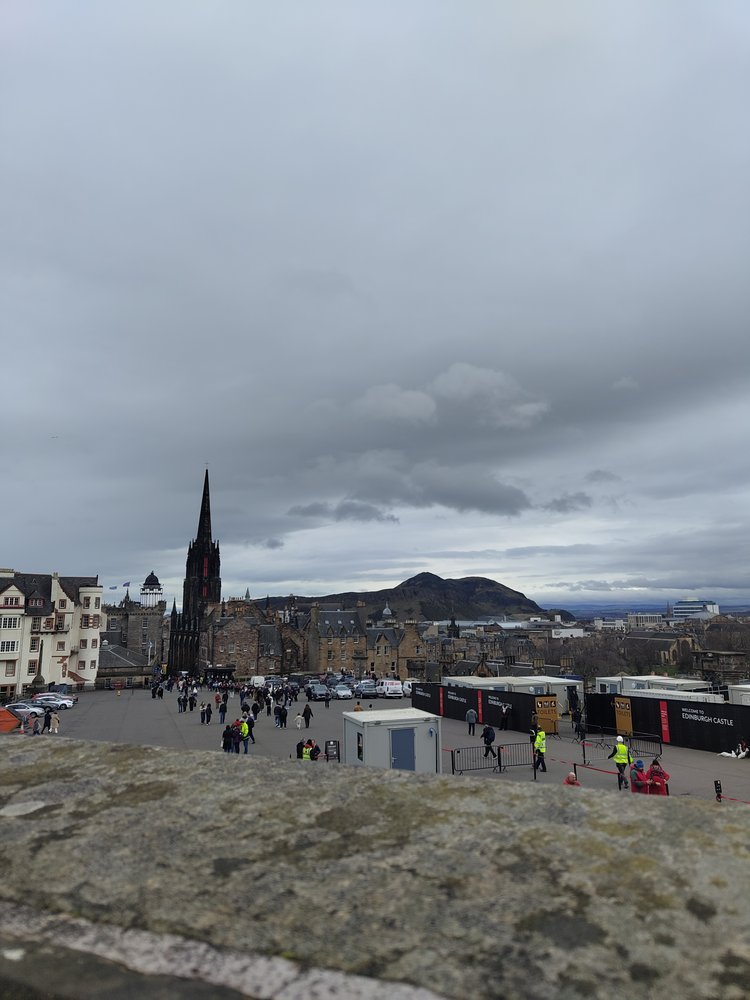
    <figcaption class="media-caption">Arthur's Seat from the castle — the extinct volcano that sits in the middle of the city like it belongs there.</figcaption>
  </figure>
</div>

<div style="display: grid; grid-template-columns: 1fr 1fr; gap: 1rem; margin: 2rem 0;">
  <figure style="margin: 0;">
    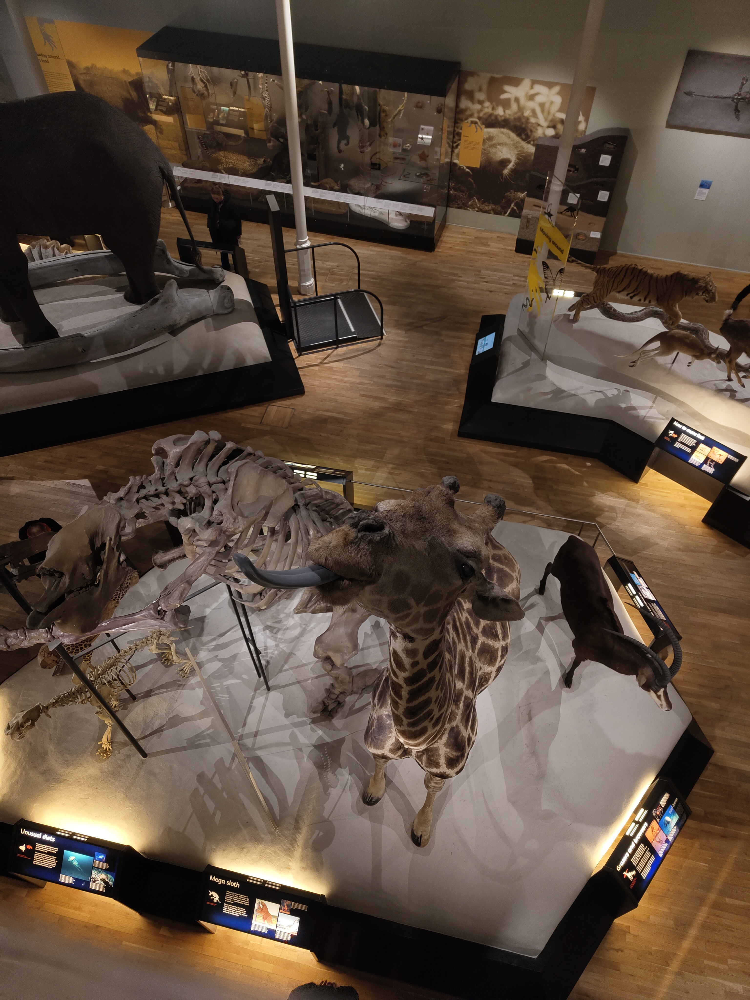
    <figcaption class="media-caption">The National Museum — the giraffe watching from above.</figcaption>
  </figure>
  <figure style="margin: 0;">
    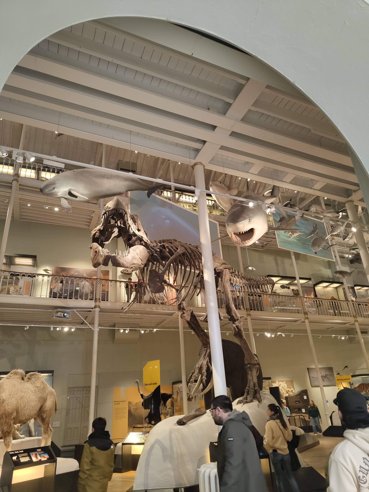
    <figcaption class="media-caption">The T-Rex — a museum worth more time than most people give it.</figcaption>
  </figure>
</div>

<div class="pull-quote">
  "One of my favourite places I've been — three days felt like an introduction rather than enough."
</div>

<hr class="section-divider">

<div id="london"></div>
::: {.prose}

## London — All of It at Once

London is a city that operates at a scale that takes time to accept. Three days covers a fraction of it and the fraction is already overwhelming — Big Ben (Elizabeth Tower; Big Ben is technically just the bell, a fact worth deploying at the right moment) is a genuinely magnificent piece of Victorian engineering up close, the kind of structure that looks better the nearer you get to it. Illuminated at night it is something else entirely.

The Natural History Museum is spectacular — the whale skeleton in the main hall is one of those exhibits that stops you in your tracks and makes the scale of the building suddenly apparent. The Rosetta Stone in the British Museum is one of those objects that carries more weight in person than in photographs — a small, unremarkable-looking slab of rock that changed the course of how we understand human history. Tower Bridge from the water is the right angle. The Shard towers over everything nearby. The Gherkin is peculiar in exactly the right way.

Platform 9¾ at King's Cross is a tourist trap that is entirely worth doing once. Buckingham Palace is exactly what it is. The Westminster Underground sign is one of those pieces of design that has been so thoroughly absorbed into the visual language of the city that seeing it in context still feels surprising.

:::

<div class="media-block">
  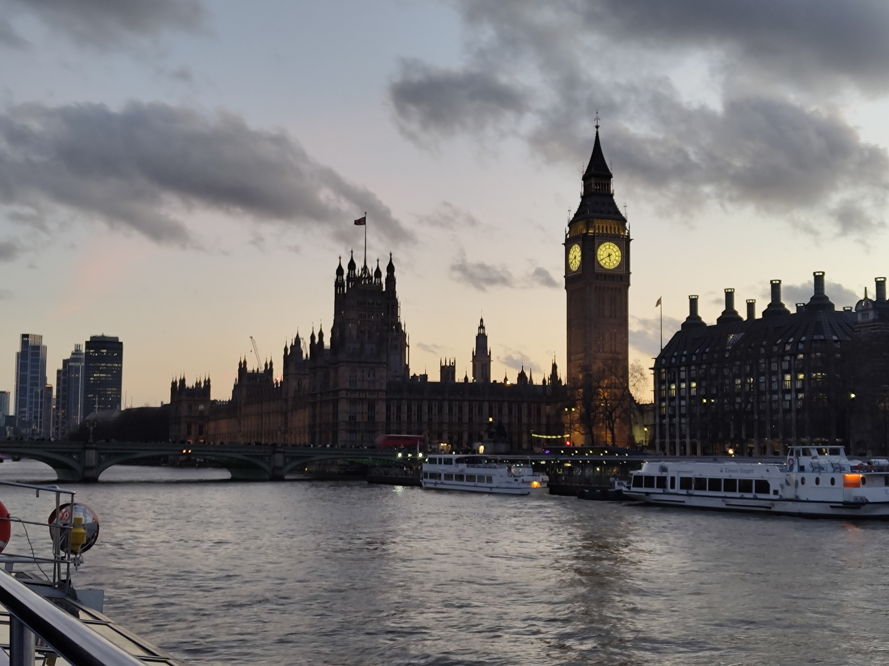
  <p class="media-caption">Elizabeth Tower and Westminster — the Victorian confidence of it all, fully intact.</p>
</div>

<div style="display: grid; grid-template-columns: 1fr 1fr; gap: 1rem; margin: 2rem 0;">
  <figure style="margin: 0;">
    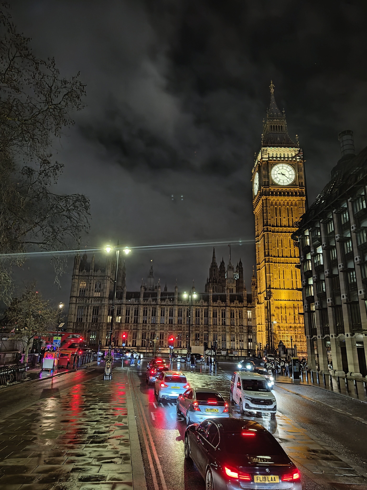
    <figcaption class="media-caption">Big Ben at night — illuminated, and a true spectacle.</figcaption>
  </figure>
  <figure style="margin: 0;">
    
    <figcaption class="media-caption">Up close — it looks better the nearer you get.</figcaption>
  </figure>
</div>

<div style="display: grid; grid-template-columns: 1fr 1fr; gap: 1rem; margin: 2rem 0;">
  <figure style="margin: 0;">
    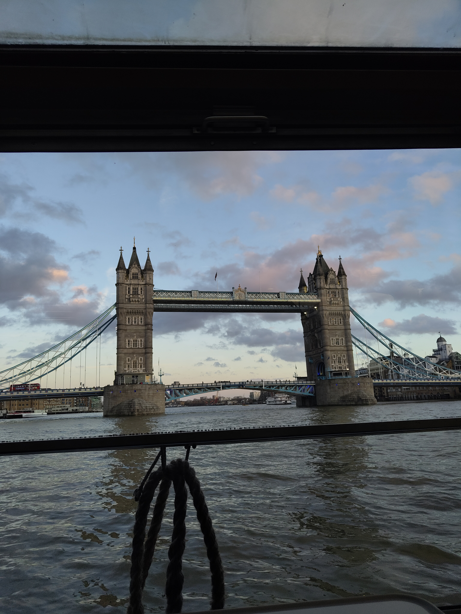
    <figcaption class="media-caption">Tower Bridge from the water — the right angle for it.</figcaption>
  </figure>
  <figure style="margin: 0;">
    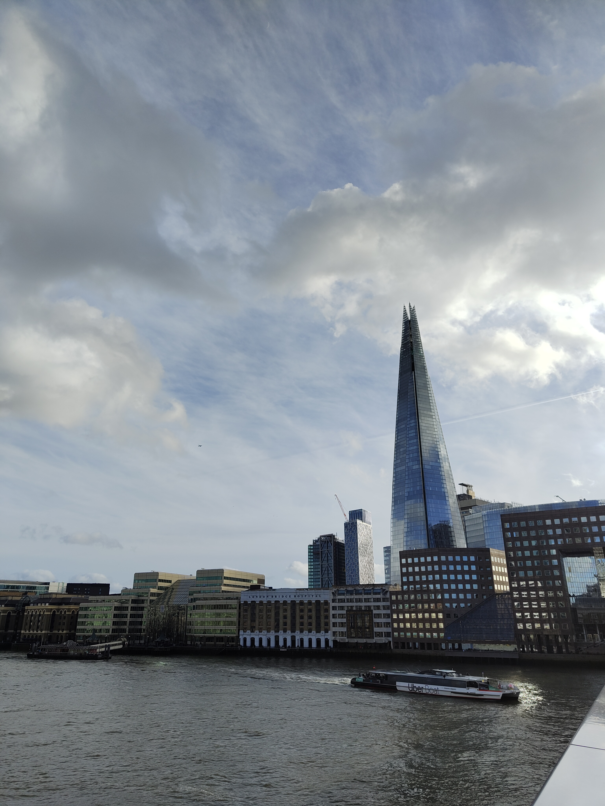
    <figcaption class="media-caption">The Shard — towering over everything nearby without apology.</figcaption>
  </figure>
</div>

<div style="display: grid; grid-template-columns: 1fr 1fr 1fr; gap: 1rem; margin: 2rem 0;">
  <figure style="margin: 0;">
    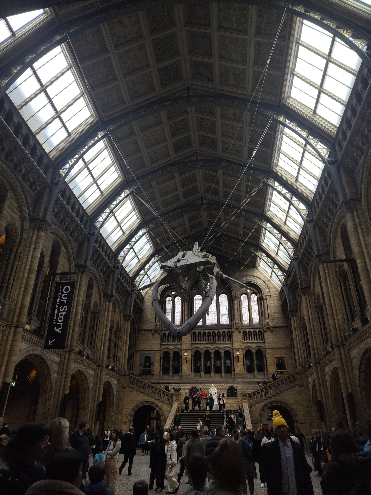
    <figcaption class="media-caption">The whale skeleton — stops you in your tracks and makes the building's scale apparent.</figcaption>
  </figure>
  <figure style="margin: 0;">
    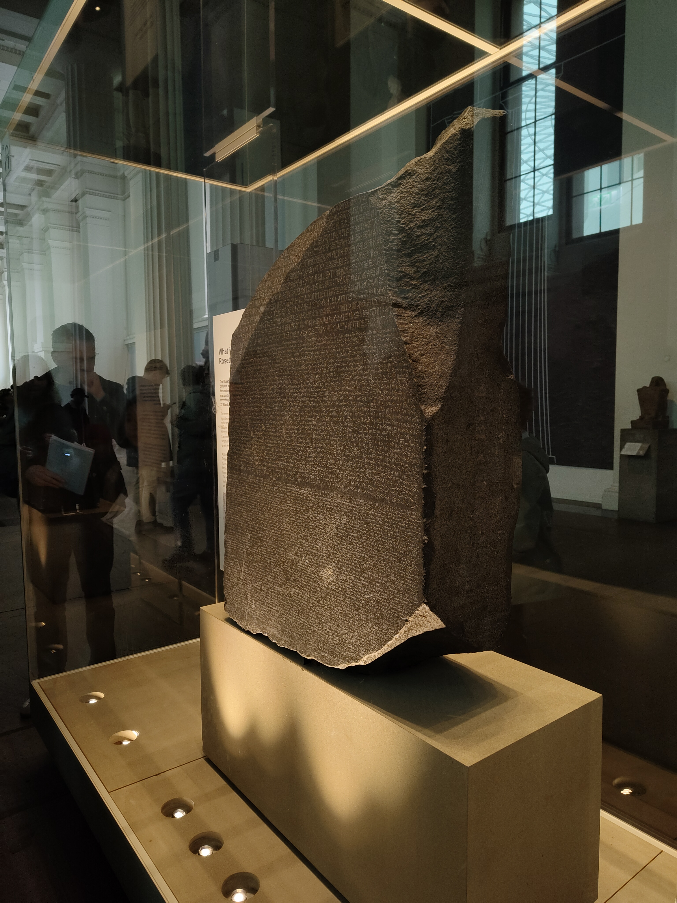
    <figcaption class="media-caption">The Rosetta Stone — a small slab that changed how we understand history.</figcaption>
  </figure>
  <figure style="margin: 0;">
    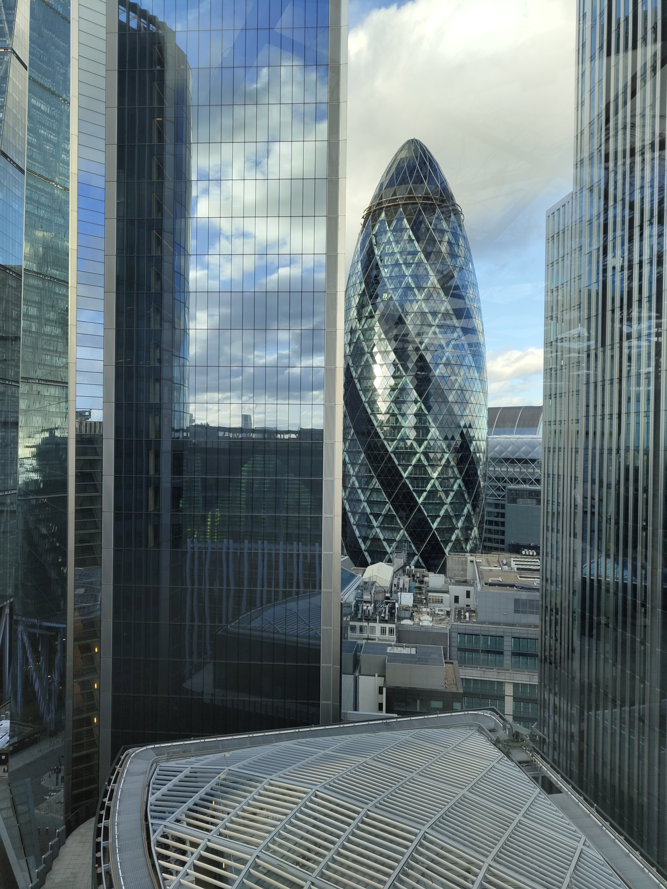
    <figcaption class="media-caption">The Gherkin — peculiar in exactly the right way.</figcaption>
  </figure>
</div>

<div style="display: grid; grid-template-columns: 1fr 1fr 1fr; gap: 1rem; margin: 2rem 0;">
  <figure style="margin: 0;">
    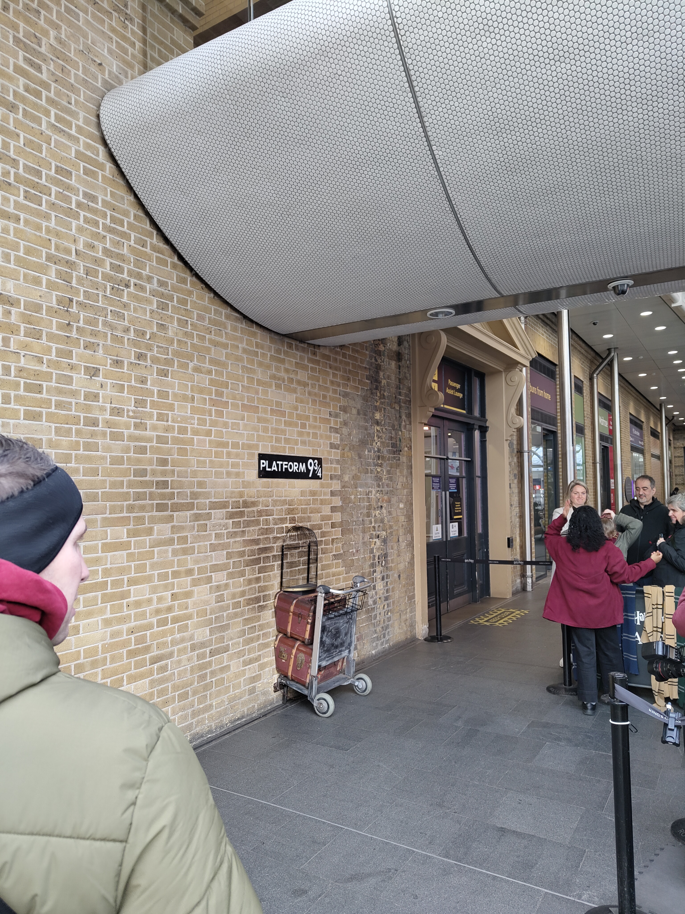
    <figcaption class="media-caption">Platform 9¾ — a tourist trap entirely worth doing once.</figcaption>
  </figure>
  <figure style="margin: 0;">
    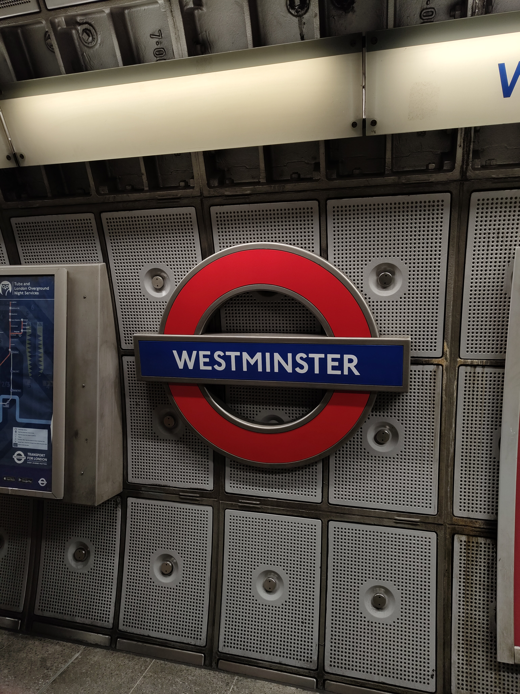
    <figcaption class="media-caption">Westminster Underground — a piece of design so absorbed into the city it still surprises you in context.</figcaption>
  </figure>
  <figure style="margin: 0;">
    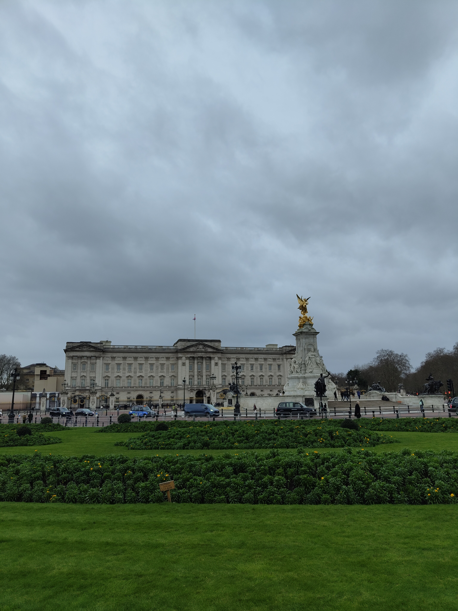
    <figcaption class="media-caption">Buckingham Palace — exactly what it is.</figcaption>
  </figure>
</div>

<div class="media-block">
  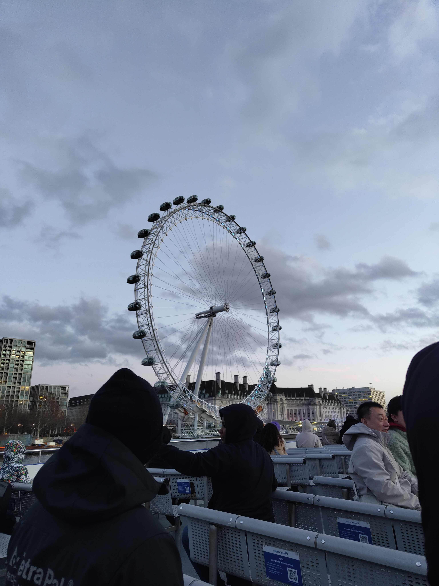
  <p class="media-caption">The London Eye — the Thames and the city laid out on both sides.</p>
</div>

<hr class="section-divider">

<div id="madrid"></div>
::: {.prose}

## Madrid — Food First

Madrid has been twice and both times the food has been the main event. Spain in general operates at a level of food quality that makes the rest of Europe look like it's not trying particularly hard, and Madrid concentrates this — the markets, the tapas bars, the restaurants that feel too good for their prices.

The TORO burger is the one. A burger served with a whole bowl of melted cheese that went viral for good reason — it is exactly as good as the videos suggest and worth tracking down specifically. The Royal Palace and Plaza Mayor are the architectural highlights and both deliver, the palace in particular having the kind of scale that takes a moment to process. Madrid is a beautiful city with a lot to offer and is easy to spend time in.

:::

<div style="display: grid; grid-template-columns: 1fr 1fr; gap: 1rem; margin: 2rem 0;">
  <figure style="margin: 0;">
    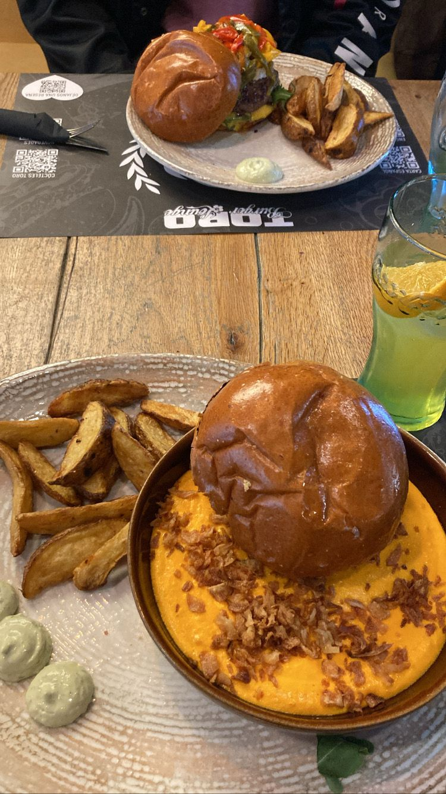
    <figcaption class="media-caption">The TORO burger — a whole bowl of cheese, and entirely worth it.</figcaption>
  </figure>
  <figure style="margin: 0;">
    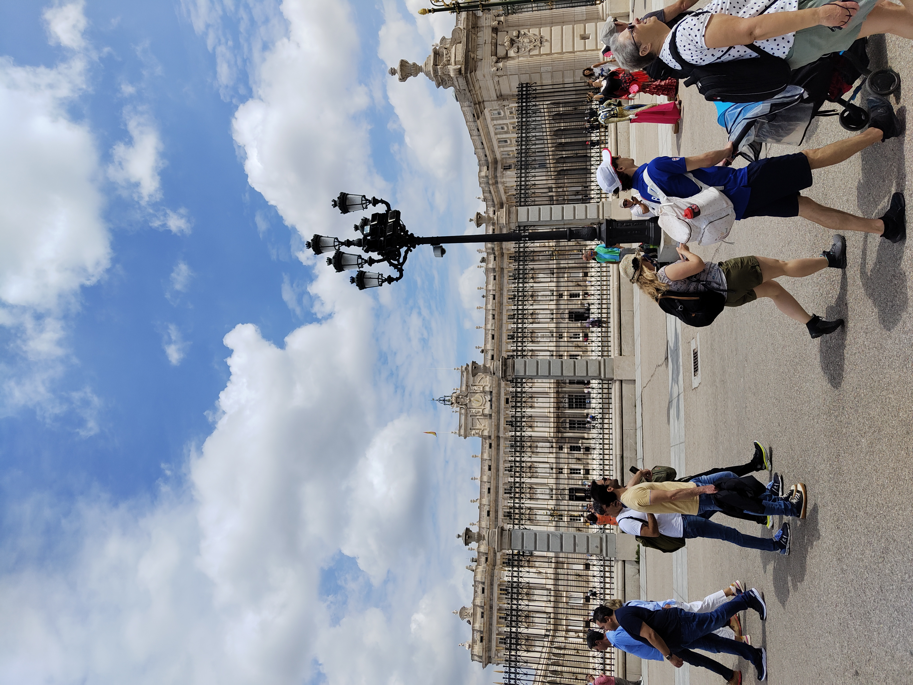
    <figcaption class="media-caption">The Royal Palace — scale that takes a moment to process.</figcaption>
  </figure>
</div>

<hr class="section-divider">

<div id="rome"></div>
::: {.prose}

## Rome — The City That Keeps Going

Rome is a city that keeps revealing itself. Three days covers the main sites but leaves enough undone that going back is already decided before you leave. The Colosseum is an unbelievable piece of history in person — knowing the dates and dimensions doesn't prepare you for standing outside it and understanding that people built this by hand two thousand years ago. The Roman Forum beside it is a landscape of ruins that rewards slow walking and a willingness to look up the context as you go.

Castel Sant'Angelo is the underrated one — the view from the top takes in the Tiber, the Vatican, and the rooftops of Rome in a way that the more famous vantage points don't quite manage. St. Peter's Basilica is as stunning as advertised and the walk up is worth doing; I'll go back specifically to see the interior properly. The narrow streets around Piazza Navona, the Pantheon, and the Trevi Fountain are full of history and the kind of architecture that makes you stop mid-step on a regular basis.

The smaller churches are the secret. Every few streets in Rome there is a church with a painted ceiling or a gilded altar or a glass casket that would be the centrepiece of any museum anywhere else, sitting quietly with no queue and no entry fee.

:::

<div class="media-block">
  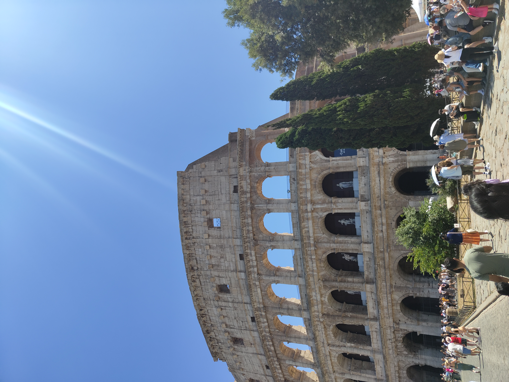
  <p class="media-caption">The Colosseum — two thousand years old and still the most impressive thing in the city.</p>
</div>

<div style="display: grid; grid-template-columns: 1fr 1fr; gap: 1rem; margin: 2rem 0;">
  <figure style="margin: 0;">
    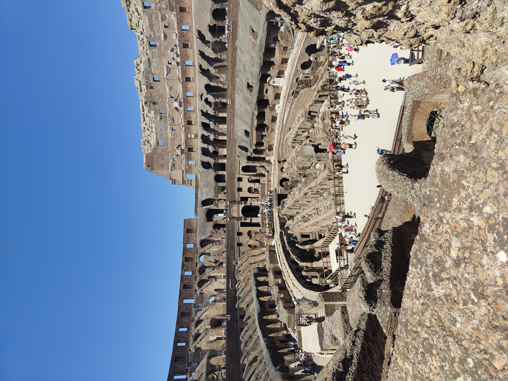
    <figcaption class="media-caption">Inside — the scale of it only fully lands from in here.</figcaption>
  </figure>
  <figure style="margin: 0;">
    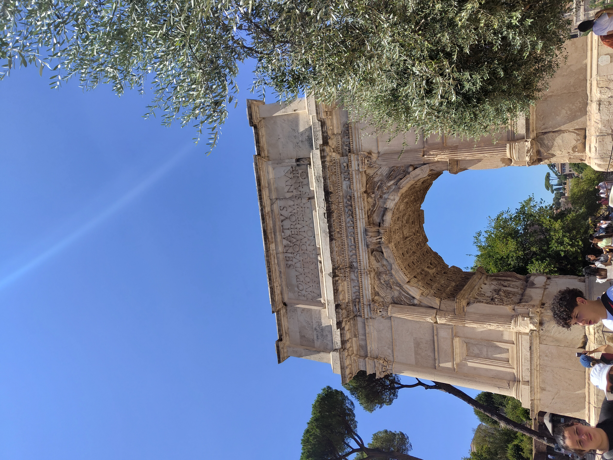
    <figcaption class="media-caption">The Roman Forum — ruins that reward slow walking and context.</figcaption>
  </figure>
</div>

<div style="display: grid; grid-template-columns: 1fr 1fr; gap: 1rem; margin: 2rem 0;">
  <figure style="margin: 0;">
    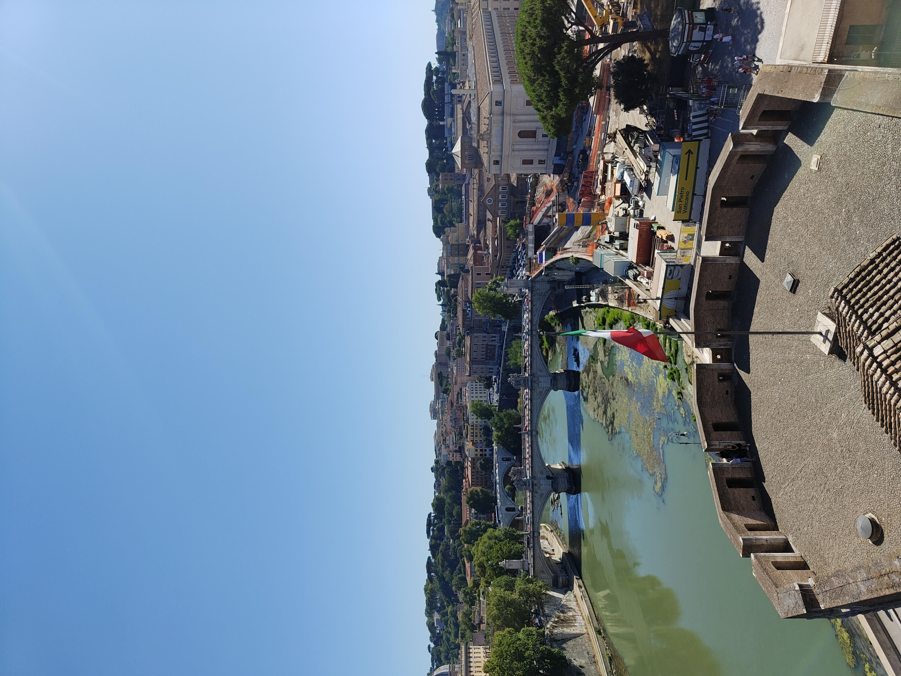
    <figcaption class="media-caption">The Tiber from the top of Castel Sant'Angelo — the underrated vantage point.</figcaption>
  </figure>
  <figure style="margin: 0;">
    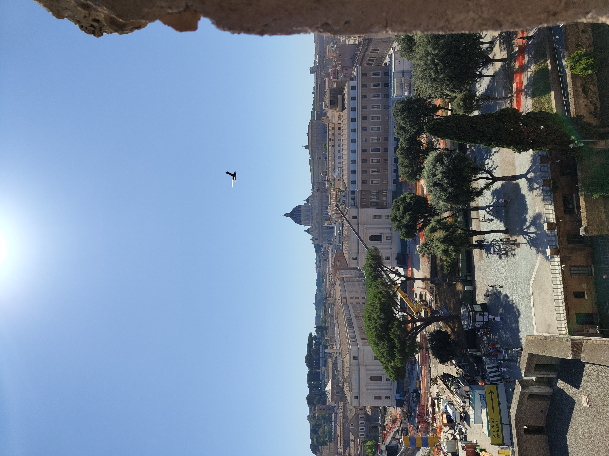
    <figcaption class="media-caption">The Vatican and St. Peter's from across the Tiber — the view that makes the climb worth it.</figcaption>
  </figure>
</div>

<div class="media-block" style="margin: 2rem 0;">
  <video autoplay muted loop playsinline
         style="width: 100%; max-height: 480px; object-fit: cover; object-position: center; border-radius: 6px; display: block;">
    <source src="https://github.com/martinas-jucysbrady/martinas-jucysbrady.github.io/releases/download/v1.0-media/rome_trevi.mp4" type="video/mp4" />
  </video>
  <p class="media-caption">The Trevi Fountain — the crowds are always there, and it's still worth it.</p>
</div>

<div class="media-block">
  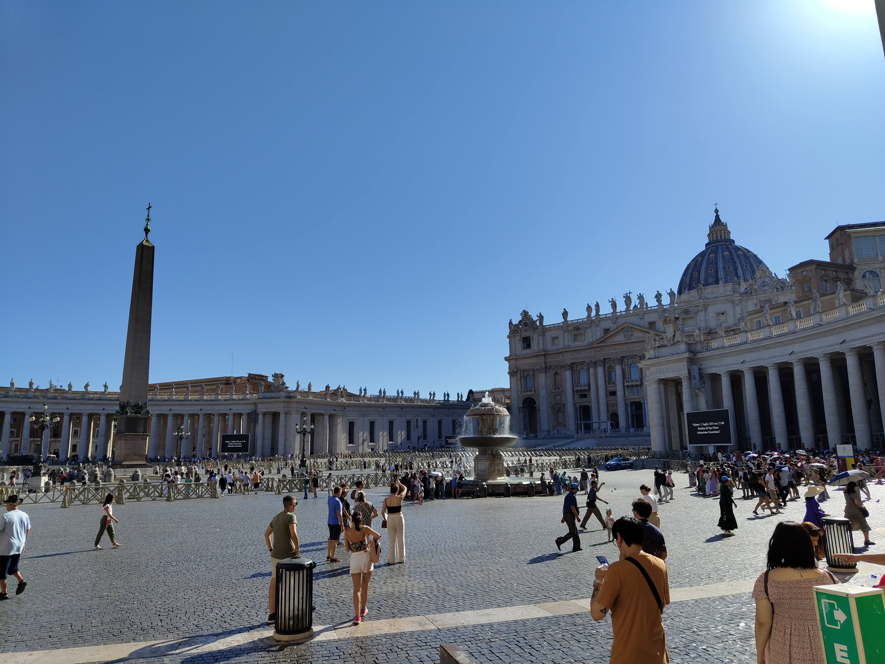
  <p class="media-caption">St. Peter's Square — I'll go back to see the interior properly.</p>
</div>

<div style="display: grid; grid-template-columns: 1fr 1fr; gap: 1rem; margin: 2rem 0;">
  <figure style="margin: 0;">
    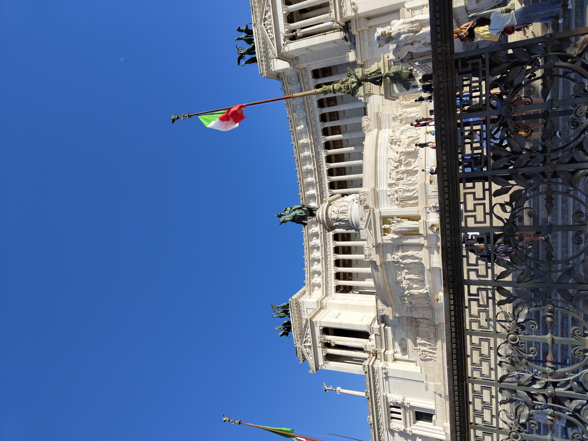
    <figcaption class="media-caption">Santa Maria in Aracoeli — one of the basilicas that rewards looking up.</figcaption>
  </figure>
  <figure style="margin: 0;">
    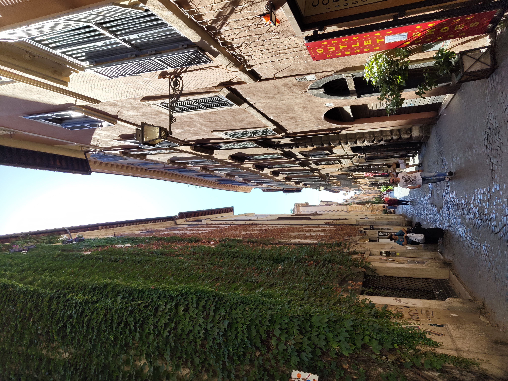
    <figcaption class="media-caption">The streets around the historic centre — every corner slightly different, all of it full of history.</figcaption>
  </figure>
</div>

<div style="display: grid; grid-template-columns: 1fr 1fr 1fr; gap: 1rem; margin: 2rem 0;">
  <figure style="margin: 0;">
    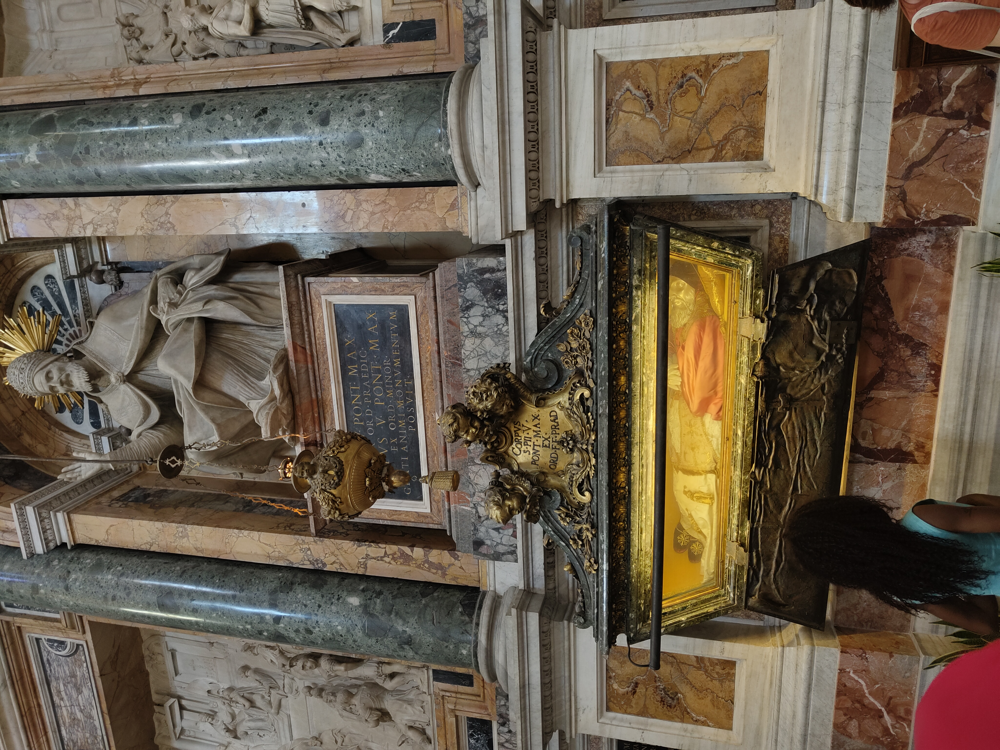
    <figcaption class="media-caption">Basilica of St. Mary Maggiore — the glass casket, quiet and extraordinary.</figcaption>
  </figure>
  <figure style="margin: 0;">
    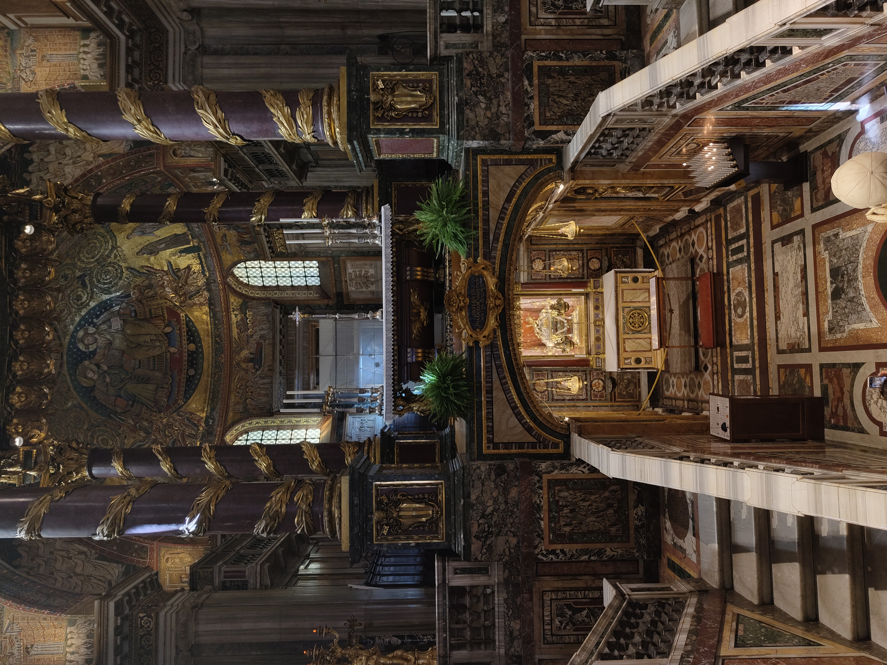
    <figcaption class="media-caption">The altar — the kind of thing that would be the centrepiece of any museum anywhere else.</figcaption>
  </figure>
  <figure style="margin: 0;">
    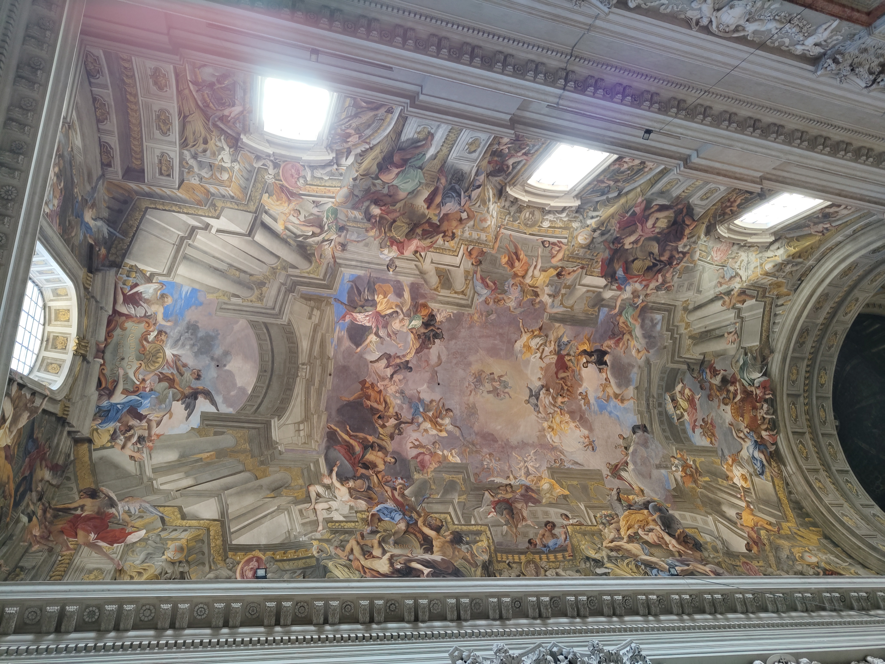
    <figcaption class="media-caption">A small church, no queue, no entry fee — Rome's best-kept secret.</figcaption>
  </figure>
</div>

<div class="pull-quote">
  "Every few streets, a church with a painted ceiling that would be the centrepiece of any museum anywhere else."
</div>

<hr class="section-divider">

<div id="liverpool"></div>
::: {.prose}

## Liverpool and Manchester — Goodison, Parklife, and One More Season

Goodison Park before the move. That was the reason for the trip, and it delivered in a way that only a proper football ground can — the atmosphere before kick-off, Z-Cars playing over the speakers, the crowd in full voice for a 1-0 win over Brentford. There is something about old football grounds that new stadiums haven't yet figured out, and Goodison has it in a way that very few places do. The walk to the new Hill Dickinson Stadium at Bramley-Moore Dock afterward confirmed that the future is going to be spectacular — a masterpiece of a design, the site already making its intentions clear.

Liverpool's streets are charming and worth a proper explore. The Parklife festival in Manchester the following summer was good music and a good atmosphere — the kind of festival that delivers on the lineup and the energy in equal measure.

:::

<div class="media-block">
  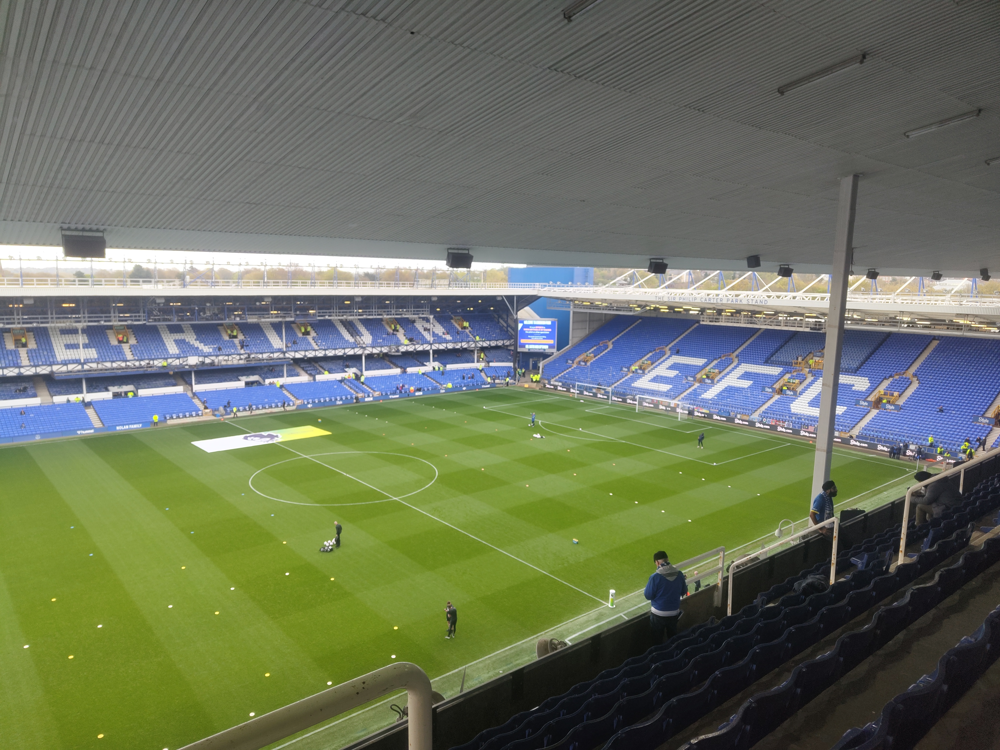
  <p class="media-caption">Goodison Park — the inside of a proper football ground, before the move.</p>
</div>

<div style="display: grid; grid-template-columns: 1fr 1fr; gap: 1rem; margin: 2rem 0;">
  <figure style="margin: 0;">
    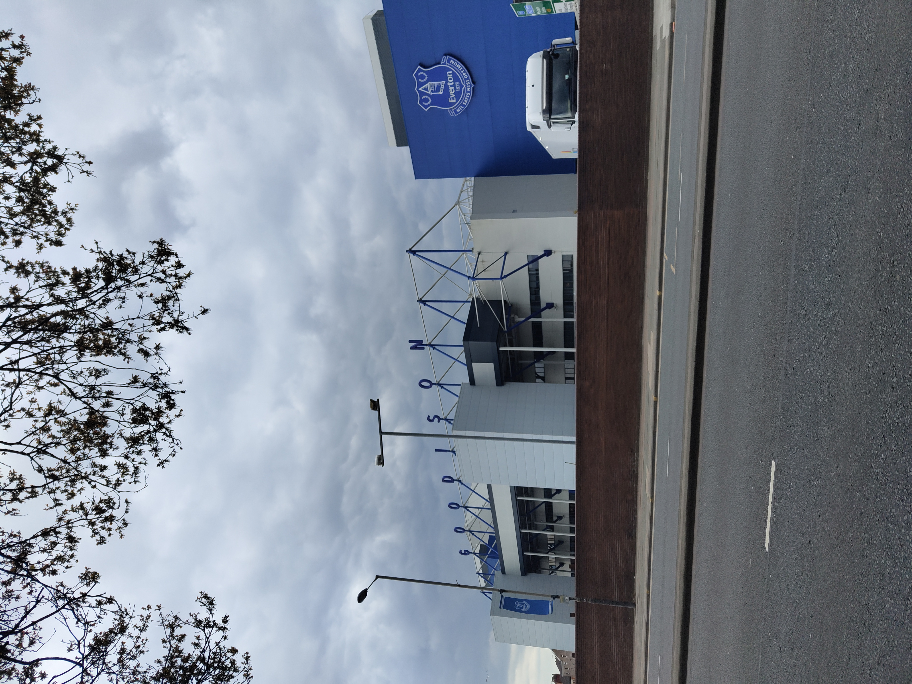
    <figcaption class="media-caption">Outside Goodison — a ground that new stadiums haven't yet figured out how to replicate.</figcaption>
  </figure>
  <figure style="margin: 0;">
    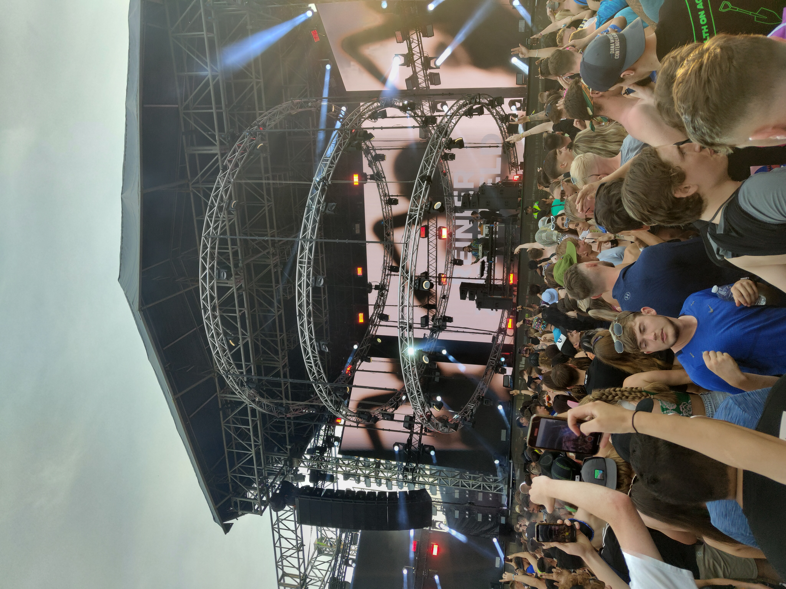
    <figcaption class="media-caption">Parklife — good music, good atmosphere, Manchester doing what it does.</figcaption>
  </figure>
</div>

<div class="media-block" style="margin: 2rem 0;">
  <video autoplay muted loop playsinline
         style="width: 100%; max-height: 480px; object-fit: cover; object-position: center; border-radius: 6px; display: block;">
    <source src="https://github.com/martinas-jucysbrady/martinas-jucysbrady.github.io/releases/download/v1.0-media/goodison_zcars.mp4" type="video/mp4" />
  </video>
  <p class="media-caption">Z-Cars before kick-off — the atmosphere I only dreamt about before.</p>
</div>

<hr class="section-divider">

<div id="amsterdam"></div>
::: {.prose}

## Amsterdam — Canals and Atmosphere

Amsterdam is one of those cities that is immediately and completely itself — the canals, the narrow houses leaning slightly over the water, the cycling, the particular atmosphere of a city that has been cosmopolitan for centuries and is entirely comfortable with it. The cafés and shops are excellent. The canals are everywhere and every one of them is scenic.

Anne Frank's House is a visit that takes time to process afterward — the rooms are small and the experience is quietly devastating in the way that the best historical sites are, without theatrics. The Royal Palace on Dam Square is a contrast in scale. The Red Light District is interesting and unsettling in roughly equal measure, and worth seeing once.

:::

<div style="display: grid; grid-template-columns: 1fr 1fr 1fr; gap: 1rem; margin: 2rem 0;">
  <figure style="margin: 0;">
    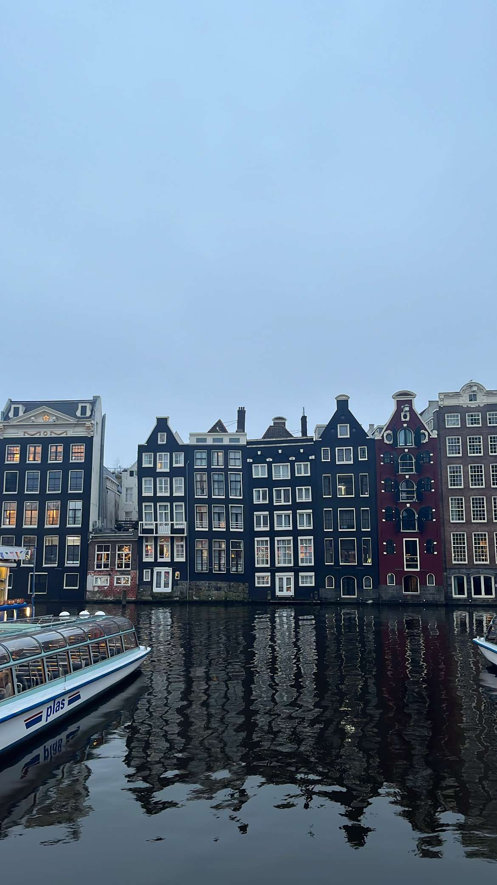
    <figcaption class="media-caption">The leaning houses — Amsterdam being completely and immediately itself.</figcaption>
  </figure>
  <figure style="margin: 0;">
    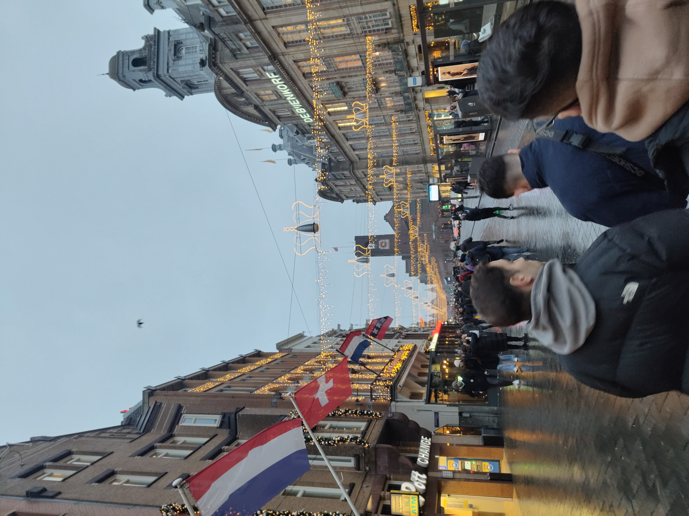
    <figcaption class="media-caption">The streets — canals everywhere, all of them scenic.</figcaption>
  </figure>
  <figure style="margin: 0;">
    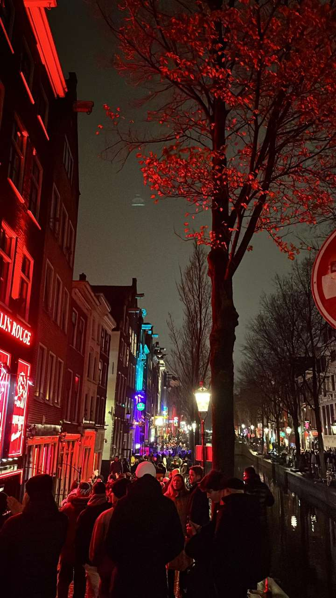
    <figcaption class="media-caption">The Red Light District — interesting and unsettling in roughly equal measure.</figcaption>
  </figure>
</div>

<hr class="section-divider">

<div id="cologne"></div>
::: {.prose}

## Cologne — Carnival and the Cathedral

Cologne during carnival is the right time to go. The streets are full, everyone is in costume, and the atmosphere is one of the more joyful things a European city produces — singing, drinking, total strangers sharing the pavement in the best possible way. The contrast with the cathedral is part of the experience: one of the most magnificent Gothic buildings in the world, rising above a city that is, for three days, entirely devoted to being cheerful about it.

The cathedral is genuinely magnificent — the kind of building that makes you stand outside and look up for longer than you expected. Bonn, a short train ride away, is a quiet and historic town worth the afternoon: the birthplace of Beethoven, former capital of West Germany, and pleasantly uncrowded.

The meat vending machine is something truly German and should not be skipped.

:::

<div style="display: grid; grid-template-columns: 1fr 1fr; gap: 1rem; margin: 2rem 0;">
  <figure style="margin: 0;">
    
    <figcaption class="media-caption">Cologne Cathedral — one of the most magnificent Gothic buildings in the world.</figcaption>
  </figure>
  <figure style="margin: 0;">
    
    <figcaption class="media-caption">The meat vending machine — something truly German, not to be skipped.</figcaption>
  </figure>
</div>

<div class="media-block" style="margin: 2rem 0;">
  <video autoplay muted loop playsinline
         style="width: 100%; max-height: 480px; object-fit: cover; object-position: center; border-radius: 6px; display: block;">
    <source src="https://github.com/martinas-jucysbrady/martinas-jucysbrady.github.io/releases/download/v1.0-media/koln_carnival.mp4" type="video/mp4" />
  </video>
  <p class="media-caption">Carnival in Cologne — everybody singing and drinking on the streets, the cathedral watching from above.</p>
</div>

<hr class="section-divider">

<div id="paris"></div>
::: {.prose}

## Paris — The One That Has Everything

Paris is the city that has it all and knows it, and the knowing it is part of the charm rather than a problem. Five days is the right amount — enough to cover the main things without rushing, enough to discover things that weren't planned.

The Eiffel Tower is magnificent in the way that famous things sometimes actually are. The twinkling at night, seen from the top of the Arc de Triomphe with the whole city laid out below it, is one of the better views available anywhere. The Louvre is overwhelming in the best possible way — the Mona Lisa is smaller than you expect, which is the correct expectation to have, and the building around it is the actual spectacle. The Musée d'Orsay is the better art museum.

The catacombs are essential. Nothing prepares you for the scale of them — the tunnels running under the city, the walls made of bones arranged with a strange care, the silence. Versailles is everything the photographs suggest and the gardens are worth the time even if the palace crowds are not. Disneyland Paris is genuinely a great day out and should not require defending.

The pastries, the hot chocolate, the parks. Paris earns its reputation and then exceeds it, and the city is best understood on foot, slowly, with no particular schedule.

:::

<div class="media-block">
  
  <p class="media-caption">The Eiffel Tower lit up — magnificent in the way that famous things sometimes actually are.</p>
</div>

<div class="media-block" style="margin: 2rem 0;">
  <video autoplay muted loop playsinline
         style="width: 100%; max-height: 480px; object-fit: cover; object-position: center; border-radius: 6px; display: block;">
    <source src="https://github.com/martinas-jucysbrady/martinas-jucysbrady.github.io/releases/download/v1.0-media/paris_twinkle.mp4" type="video/mp4" />
  </video>
  <p class="media-caption">The twinkling, from the top of the Arc de Triomphe — the whole city below it.</p>
</div>

<div style="display: grid; grid-template-columns: 1fr 1fr; gap: 1rem; margin: 2rem 0;">
  <figure style="margin: 0;">
    
    <figcaption class="media-caption">Paris from Galeries Lafayette — the Eiffel Tower in every direction you look.</figcaption>
  </figure>
  <figure style="margin: 0;">
    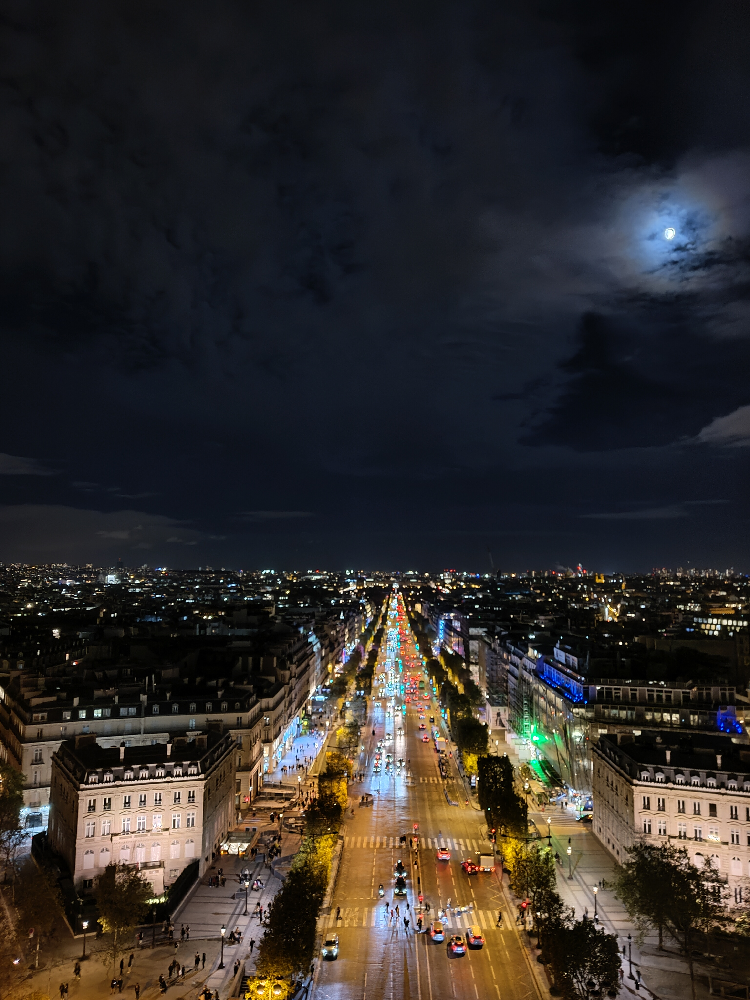
    <figcaption class="media-caption">The Champs-Élysées at night from the Arc de Triomphe — the city laid out below.</figcaption>
  </figure>
</div>

<div style="display: grid; grid-template-columns: 1fr 1fr 1fr; gap: 1rem; margin: 2rem 0;">
  <figure style="margin: 0;">
    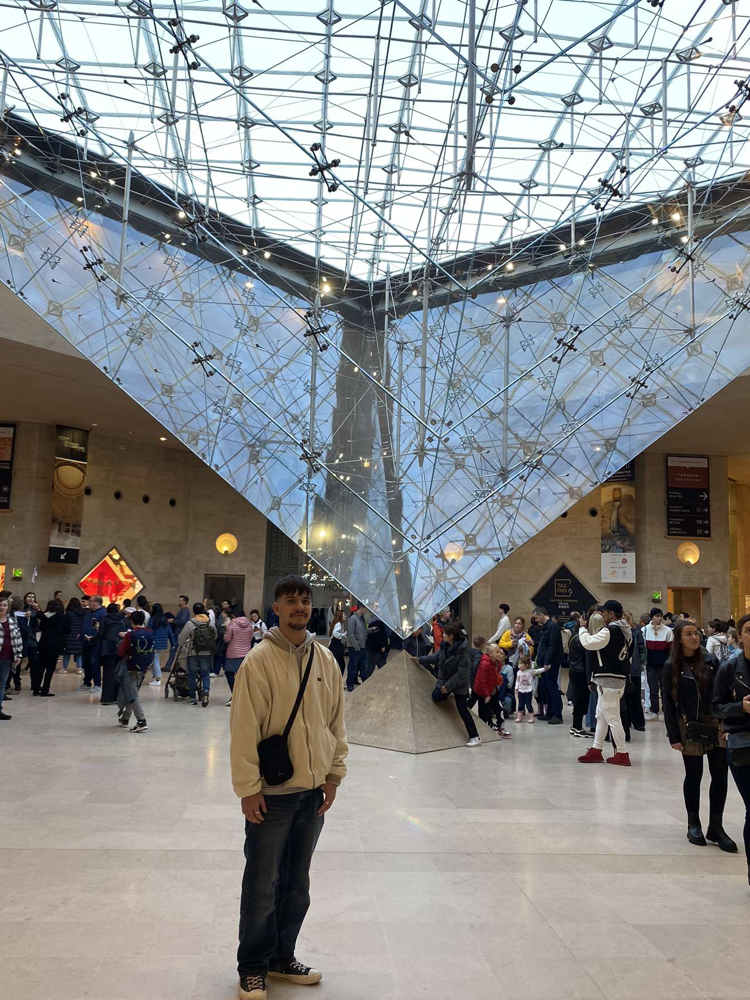
    <figcaption class="media-caption">The Louvre — the building is the spectacle.</figcaption>
  </figure>
  <figure style="margin: 0;">
    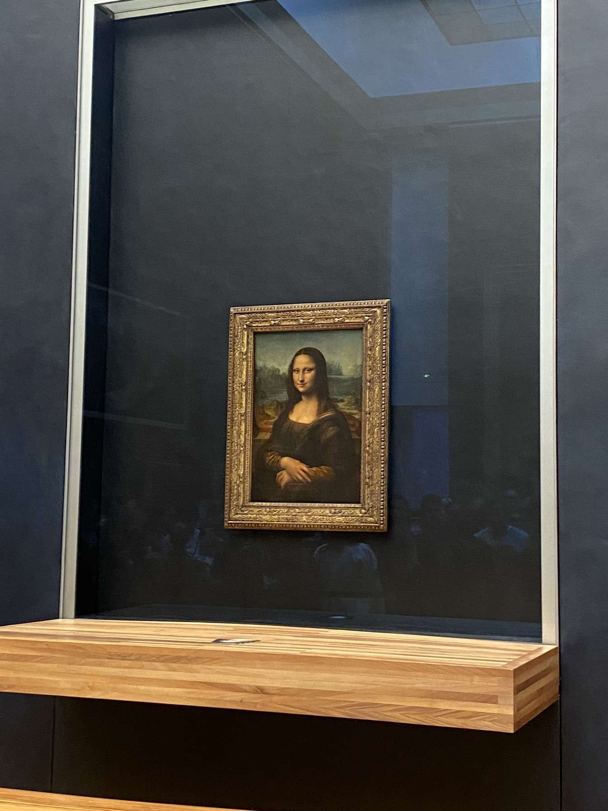
    <figcaption class="media-caption">The Mona Lisa — smaller than expected, which is the correct expectation to have.</figcaption>
  </figure>
  <figure style="margin: 0;">
    
    <figcaption class="media-caption">The natural history museum — dinosaurs and deep time.</figcaption>
  </figure>
</div>

<div style="display: grid; grid-template-columns: 1fr 1fr; gap: 1rem; margin: 2rem 0;">
  <figure style="margin: 0;">
    
    <figcaption class="media-caption">The Catacombs — tunnels under the city, walls made of bones arranged with strange care.</figcaption>
  </figure>
  <figure style="margin: 0;">
    
    <figcaption class="media-caption">Essential. Nothing prepares you for the scale of them.</figcaption>
  </figure>
</div>

<div style="display: grid; grid-template-columns: 1fr 1fr; gap: 1rem; margin: 2rem 0;">
  <figure style="margin: 0;">
    
    <figcaption class="media-caption">Disneyland Paris — a genuinely great day out that should not require defending.</figcaption>
  </figure>
  <figure style="margin: 0;">
    
    <figcaption class="media-caption">Skull Island — Disneyland doing what it does best.</figcaption>
  </figure>
</div>

<div class="media-block" style="margin: 2rem 0;">
  <video autoplay muted loop playsinline
         style="width: 100%; max-height: 480px; object-fit: cover; object-position: center; border-radius: 6px; display: block;">
    <source src="https://github.com/martinas-jucysbrady/martinas-jucysbrady.github.io/releases/download/v1.0-media/versailles_fountain.mp4" type="video/mp4" />
  </video>
  <p class="media-caption">The fountains at Versailles — the gardens worth the time even when the palace is crowded.</p>
</div>

<div class="media-block">
  
  <p class="media-caption">Inside Versailles — the Hall of Mirrors doing exactly what it was built to do.</p>
</div>

<div style="display: grid; grid-template-columns: 1fr 1fr; gap: 1rem; margin: 2rem 0;">
  <figure style="margin: 0;">
    
    <figcaption class="media-caption">Notre Dame — beautiful from outside, the restoration underway.</figcaption>
  </figure>
  <figure style="margin: 0;">
    
    <figcaption class="media-caption">The stained glass — immense and worth finding.</figcaption>
  </figure>
</div>

<div class="pull-quote">
  "Best understood on foot, slowly, with no particular schedule."
</div>

<hr class="section-divider">

<div id="venice"></div>
::: {.prose}

## Venice — Everything the City Promises

Venice delivers. The canals, the bridges, the winding streets that go somewhere unexpected every time, the basilicas — all of it is as good as the photographs suggest and better in person. February is the right time to go: quieter, the light different, the city more itself without the summer crowds.

Piazza San Marco is the centrepiece and earns it — the basilica on one end, the vast open space between, the pigeons doing what pigeons do. The Ponte di Rialto is the most beautiful bridge, but every bridge in Venice has something distinct about it and the city rewards the habit of stopping on each one. Murano glass is worth the vaporetto trip across to the island. The food and wine are very good.

The narrow streets away from the main routes are where Venice becomes something else — suddenly quiet, the canals close on both sides, the city feeling much smaller and much more intimate than the map suggests.

:::

<div class="media-block">
  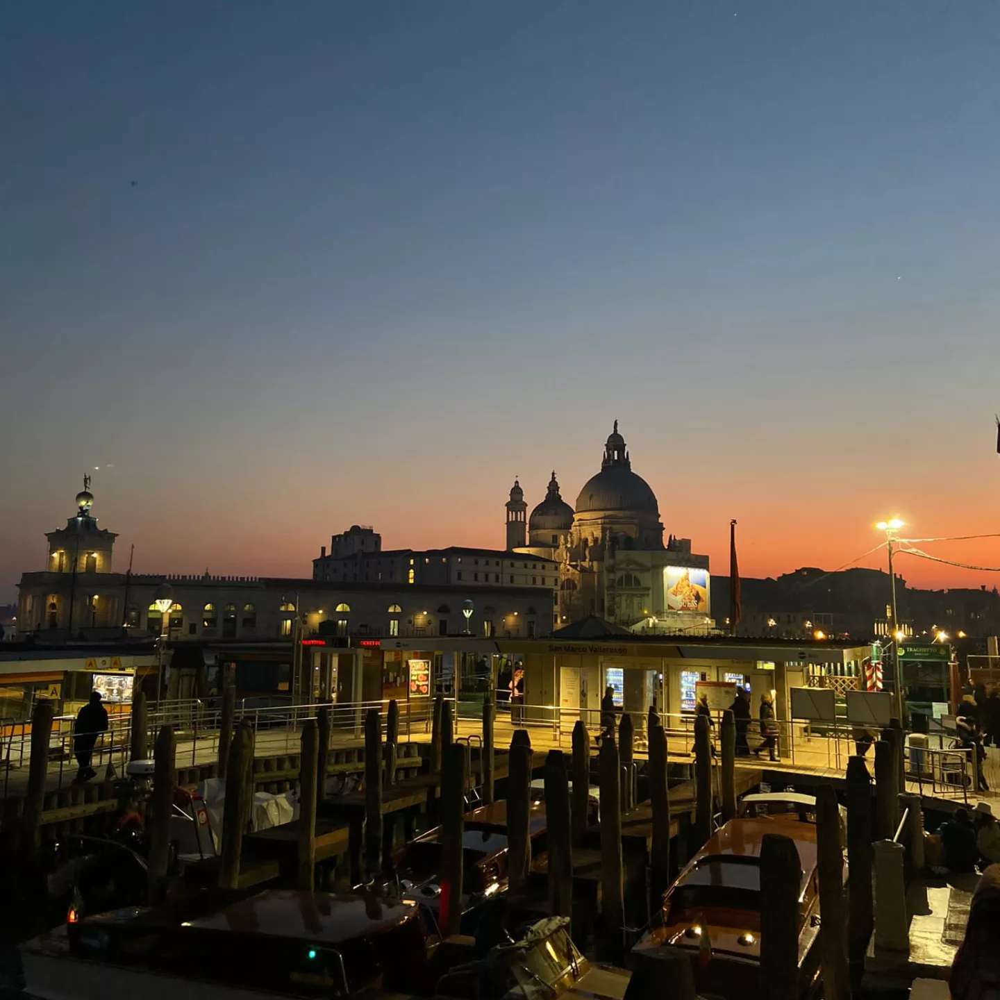
  <p class="media-caption">Venice at sunset — the domes on the other side of the canal, the light doing what it does in February.</p>
</div>

<div style="display: grid; grid-template-columns: 1fr 1fr; gap: 1rem; margin: 2rem 0;">
  <figure style="margin: 0;">
    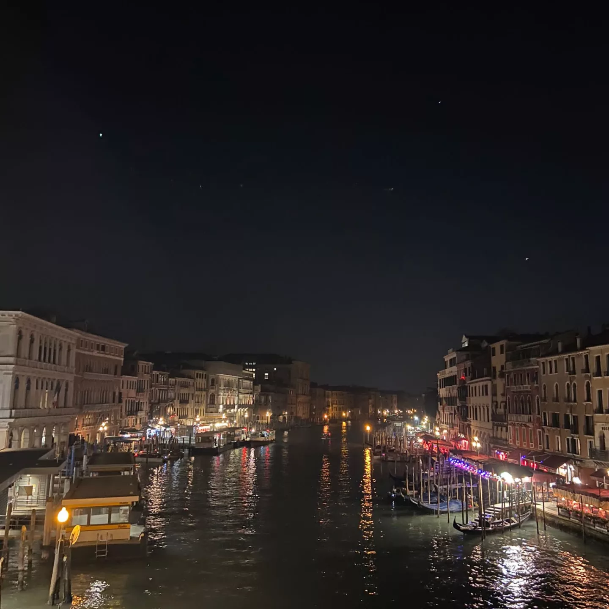
    <figcaption class="media-caption">The canals at night — the city at its most itself.</figcaption>
  </figure>
  <figure style="margin: 0;">
    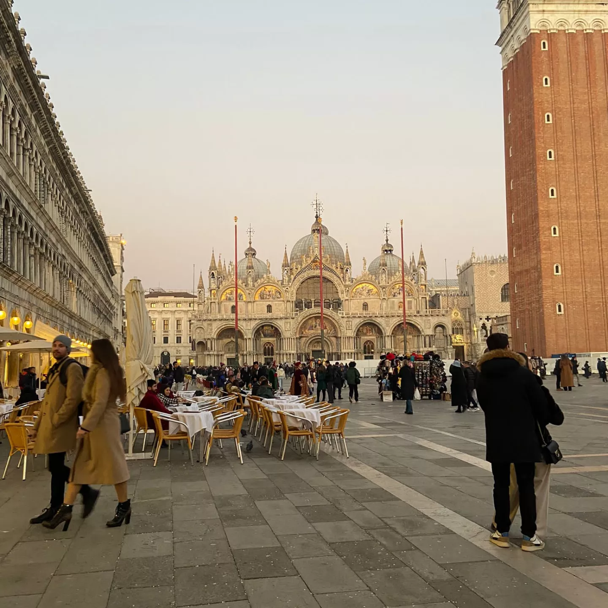
    <figcaption class="media-caption">Piazza San Marco — vast, stunning, and entirely worth it.</figcaption>
  </figure>
</div>

<div style="display: grid; grid-template-columns: 1fr 1fr; gap: 1rem; margin: 2rem 0;">
  <figure style="margin: 0;">
    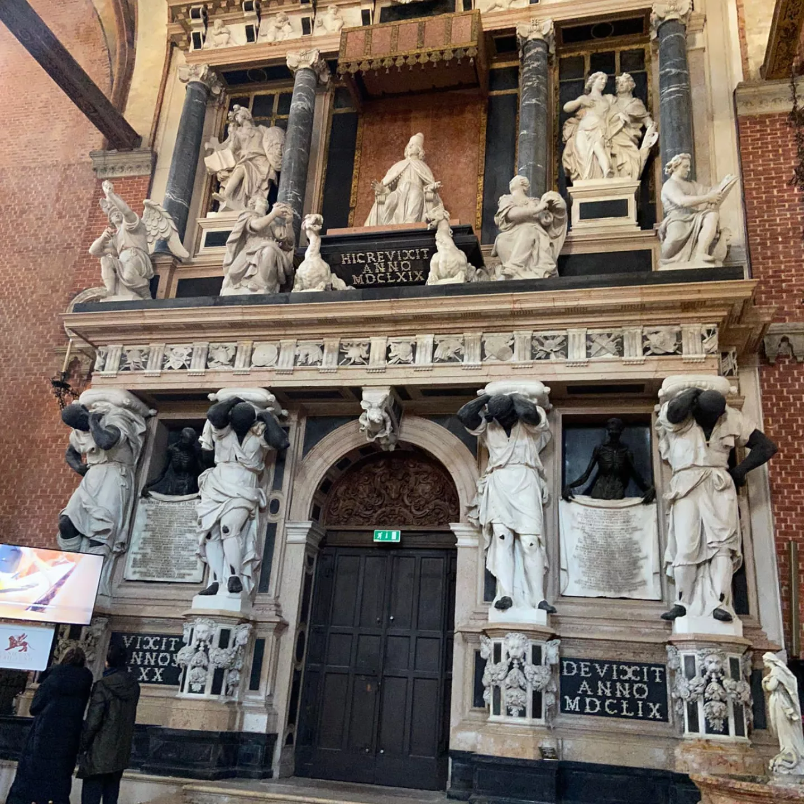
    <figcaption class="media-caption">Santa Maria Gloriosa dei Frari — one of the better basilica interiors in a city full of them.</figcaption>
  </figure>
  <figure style="margin: 0;">
    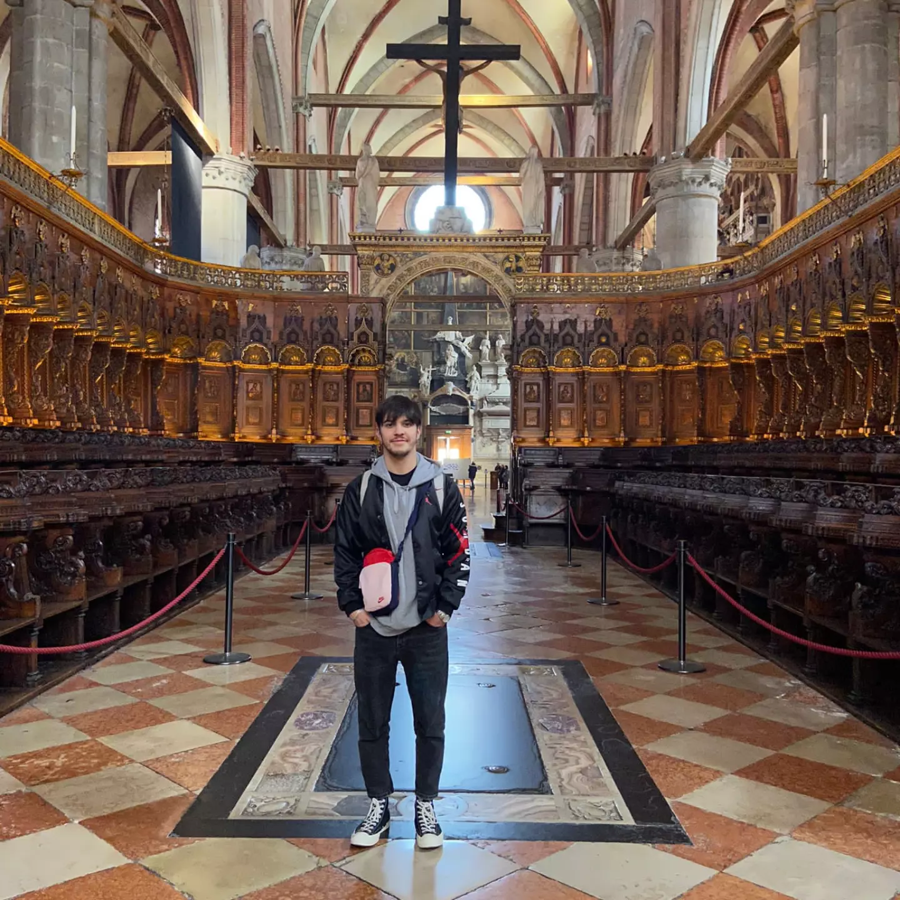
    <figcaption class="media-caption">Inside — the narrow streets lead here eventually if you walk long enough.</figcaption>
  </figure>
</div>

<div class="pull-quote">
  "The narrow streets away from the main routes — suddenly quiet, the city feeling much smaller and more intimate."
</div>

<hr class="section-divider">

::: {.prose}

Nine cities across three years. Each one different enough from the last to feel like its own argument for the weekend trip — the format that takes the least planning and delivers the most reliably. Edinburgh is the one that surprised the most. Paris is the one that delivered the most. Rome is the one with the most left to go back for. Venice in February is the one to recommend to anyone who hasn't been.

The running thread is that every city on this list rewards walking slowly, eating well, and not having a plan rigid enough to prevent the unexpected.

:::

<div class="media-block">
  
  <p class="media-caption">Edinburgh — the one that surprised the most, and the one most worth going back to.</p>
</div>
