```{=html}
<style>
  .trip-header {
    text-align: center;
    padding: 60px 20px 40px;
    max-width: 860px;
    margin: 0 auto;
  }
  .trip-label {
    font-size: 0.75rem;
    letter-spacing: 0.2em;
    text-transform: uppercase;
    color: #9b8877;
    margin-bottom: 8px;
  }
  .trip-title {
    font-family: 'Plus Jakarta Sans', sans-serif;
    font-size: 2.6rem;
    font-weight: 800;
    color: #1E4264;
    margin: 0 0 12px;
    line-height: 1.1;
  }
  .trip-subtitle {
    font-family: 'Cormorant Garamond', serif;
    font-style: italic;
    font-size: 1.2rem;
    color: #6b7280;
    margin-bottom: 24px;
  }
  .trip-meta {
    display: flex;
    gap: 24px;
    justify-content: center;
    font-size: 0.8rem;
    color: #9b8877;
    letter-spacing: 0.06em;
    text-transform: uppercase;
    flex-wrap: wrap;
  }
  .section-divider {
    border: none;
    border-top: 1px solid #e0e0f0;
    margin: 48px auto;
    max-width: 600px;
  }
  .prose {
    max-width: 720px;
    margin: 0 auto;
    font-size: 1.05rem;
    line-height: 1.85;
    color: #2d3748;
  }
  .prose h2 {
    font-family: 'Plus Jakarta Sans', sans-serif;
    font-weight: 800;
    font-size: 1.6rem;
    color: #1E4264;
    margin-top: 56px;
    margin-bottom: 12px;
    text-align: center;
  }
  .prose p {
    margin-bottom: 1.4rem;
  }
  .media-block {
    max-width: 860px;
    margin: 32px auto;
    border-radius: 14px;
    overflow: hidden;
    box-shadow: 0 4px 24px rgba(0,0,0,0.10);
  }
  .media-block img,
  .media-block video {
    width: 100%;
    display: block;
    object-fit: cover;
  }
  .media-caption {
    font-family: 'Cormorant Garamond', serif;
    font-style: italic;
    font-size: 0.9rem;
    color: #9b8877;
    text-align: center;
    margin-top: 10px;
    padding: 0 12px 4px;
  }
  .pull-quote {
    font-family: 'Cormorant Garamond', serif;
    font-style: italic;
    font-size: 1.55rem;
    font-weight: 600;
    color: #1E4264;
    text-align: center;
    max-width: 640px;
    margin: 48px auto;
    line-height: 1.5;
    padding: 0 24px;
    border-left: 3px solid #c9aa96;
  }

  #quarto-document-content {
    display: flex;
    flex-direction: column;
    align-items: center;
  }

  #quarto-document-content > * {
    width: 100%;
    max-width: 860px;
  }
</style>

<div class="trip-header">
  <p class="trip-label">🍀 Home</p>
  <h1 class="trip-title">Ireland</h1>
  <p class="trip-subtitle">Sometimes you don't appreciate the beauty on your doorstep</p>
  <div class="trip-meta">
    <span>📍 Ulster · Leinster · Connacht</span>
  </div>
</div>

<hr class="section-divider">
```

<div id="ulster"></div>
::: {.prose}

## Ulster — Ruins, Coastline, and the Aurora

Ulster holds more than most people who live in it realise. The landscape shifts across it — the lakelands of Fermanagh, the basalt coast of Antrim, the mountains of Mourne, the headlands of Donegal — and each corner has something that would draw visitors from anywhere else in the world if it were somewhere else in the world.

Crom Castle on the shores of Upper Lough Erne is one of the better estate grounds in Ireland — the lake visible between the old trees, the ruins of the earlier castle sitting above it, the whole place largely to yourself on most days. Castle Saunderson nearby in Co. Fermanagh is more dramatic in its ruin — the massive complex abandoned and returned to nature, the old church on the grounds still standing with a particular quality of light in the afternoon. Places like this are everywhere in Ireland and mostly unmarked on any tourist map.

Navan Fort in Co. Armagh has the quarry beside it — the water is that specific shade of blue that old quarries in limestone occasionally produce, the kind that makes you check whether it's been artificially coloured. The Giants Causeway on the north Antrim coast is one of the genuine natural wonders of the island, the hexagonal basalt columns extending into the sea and the waves working against them — the sound and the spray, in any weather, make it a different experience from the photographs. Portstewart Strand along the same coast is one of the better beaches in the country.

The aurora, seen from home on one of the nights in 2024 when it was visible across Ireland and Britain — the kind of thing you stand in the garden and look at for a long time, unable to quite believe it is happening at your latitude, above your own house.

Galboly in Co. Antrim is one of the most beautiful places in Ireland and almost nobody knows it. A deserted clachan on a clifftop above the North Channel — the famine-era houses preserved, the thatched roofs reconstructed, the mountains behind the settlement and Scotland visible across the water on a clear day. Free to walk around, entirely uncommercialized. The Silent Valley Mountain Park in the Mournes frames the reservoir between the peaks in a way that makes the dam look like it was placed rather than built. Cairdhnu House near Belfast — a massive abandoned country house that you can walk through inside and out, the interior open to the elements, the grounds reverting slowly to woodland. The carginagh sunflower fields in August. Rossnowlagh Beach in Donegal, the waves long and rolling and the sand wide. Spelga Dam at sunset, the light coming across the reservoir and the hills above it.

:::

<div style="display: grid; grid-template-columns: 1fr 1fr; gap: 1rem; margin: 2rem 0;">
  <figure style="margin: 0;">
    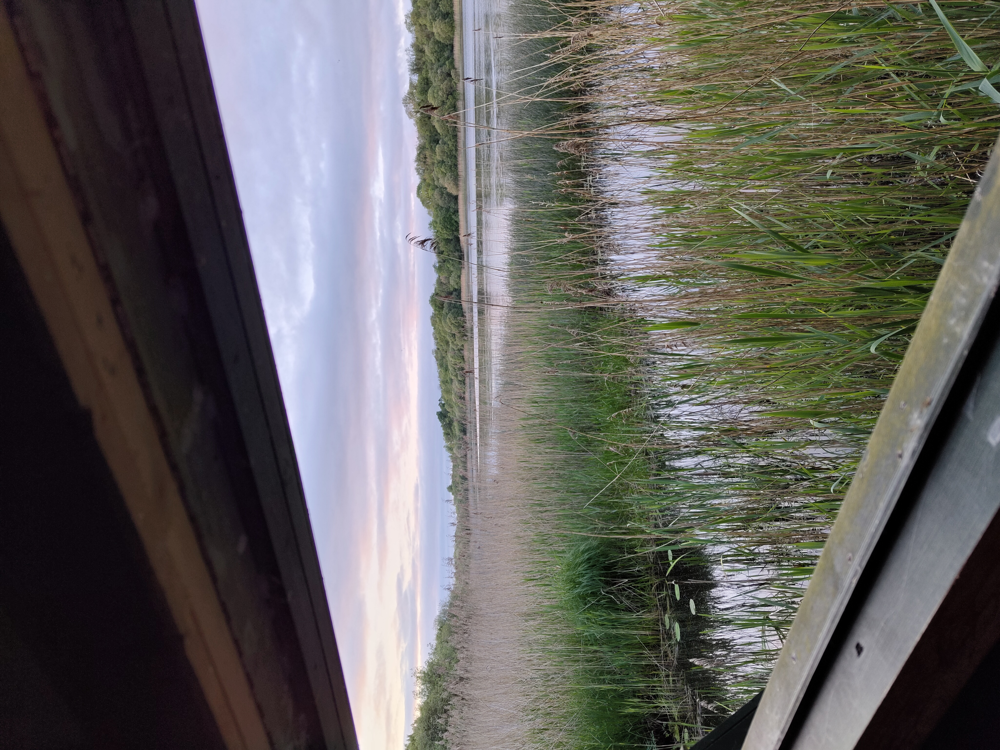
    <figcaption class="media-caption">Crom Castle — the lake between the old trees, largely to yourself on most days.</figcaption>
  </figure>
  <figure style="margin: 0;">
    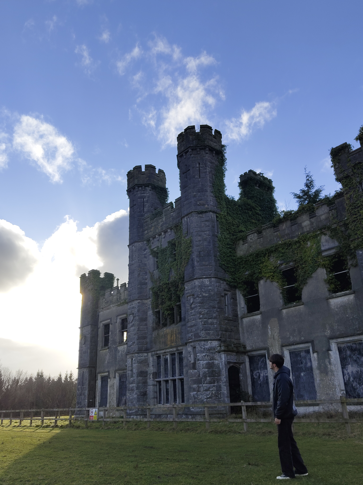
    <figcaption class="media-caption">Castle Saunderson — abandoned, returned to nature, a massive complex to explore.</figcaption>
  </figure>
</div>

<div style="display: grid; grid-template-columns: 1fr 1fr; gap: 1rem; margin: 2rem 0;">
  <figure style="margin: 0;">
    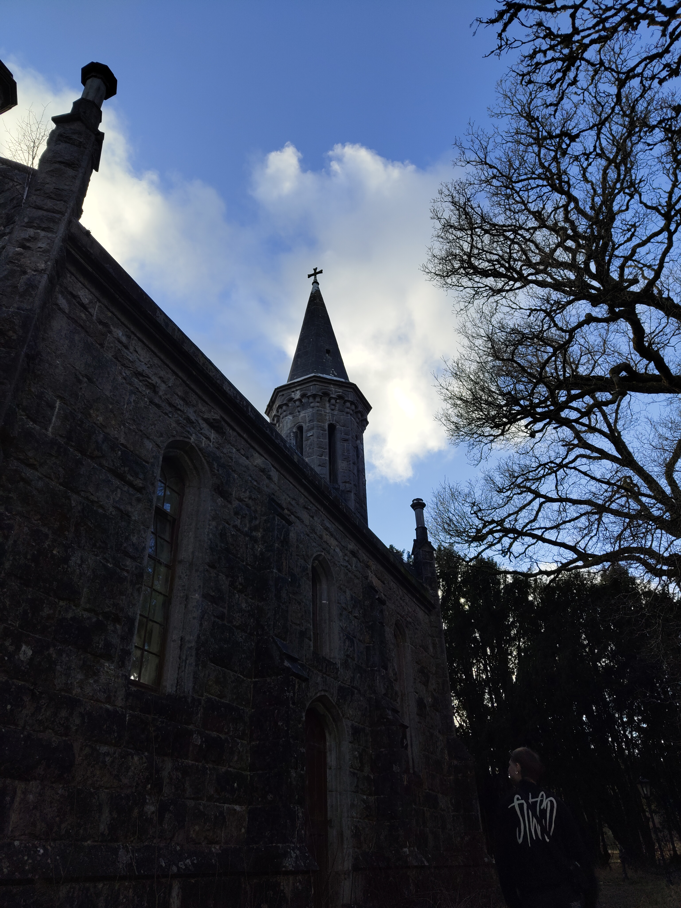
    <figcaption class="media-caption">The church on the Castle Saunderson grounds — still standing, the afternoon light particular.</figcaption>
  </figure>
  <figure style="margin: 0;">
    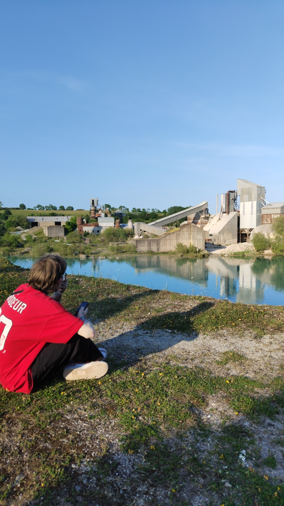
    <figcaption class="media-caption">The quarry at Navan Fort — that specific shade of blue old limestone quarries occasionally produce.</figcaption>
  </figure>
</div>

<div style="display: grid; grid-template-columns: 1fr 1fr; gap: 1rem; margin: 2rem 0;">
  <figure style="margin: 0;">
    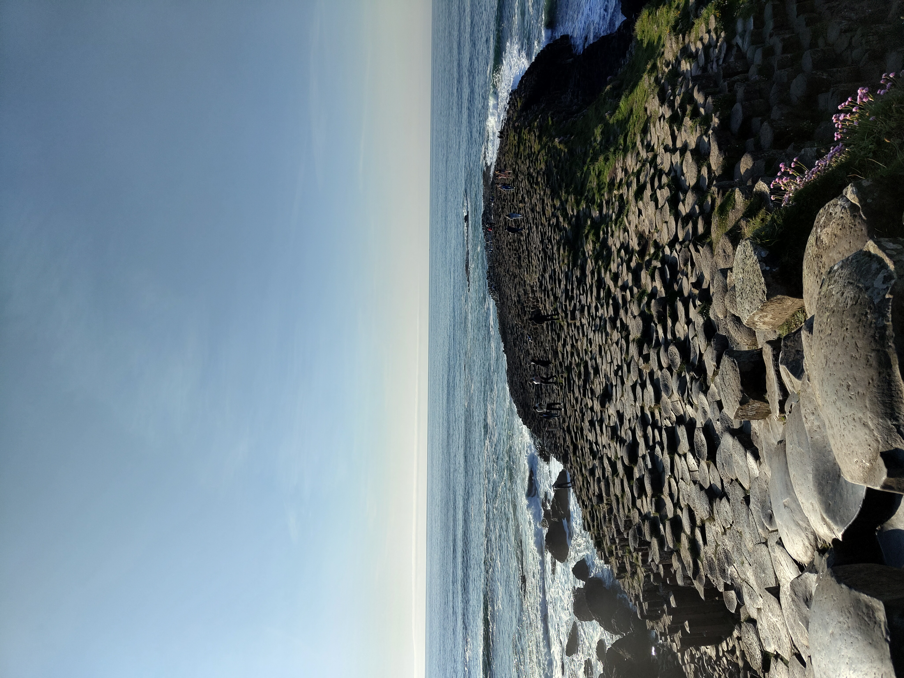
    <figcaption class="media-caption">The Giants Causeway — one of the genuine natural wonders of the island.</figcaption>
  </figure>
  <figure style="margin: 0;">
    <video autoplay muted loop playsinline
           style="width: 100%; height: 480px; object-fit: cover; border-radius: 6px; display: block;">
      <source src="https://github.com/martinas-jucysbrady/martinas-jucysbrady.github.io/releases/download/v1.0-media/ulster_giant2.mp4" type="video/mp4" />
    </video>
    <figcaption class="media-caption">The waves against the basalt pillars — the sound and the spray, a different experience from the photographs.</figcaption>
  </figure>
</div>

<div class="media-block">
  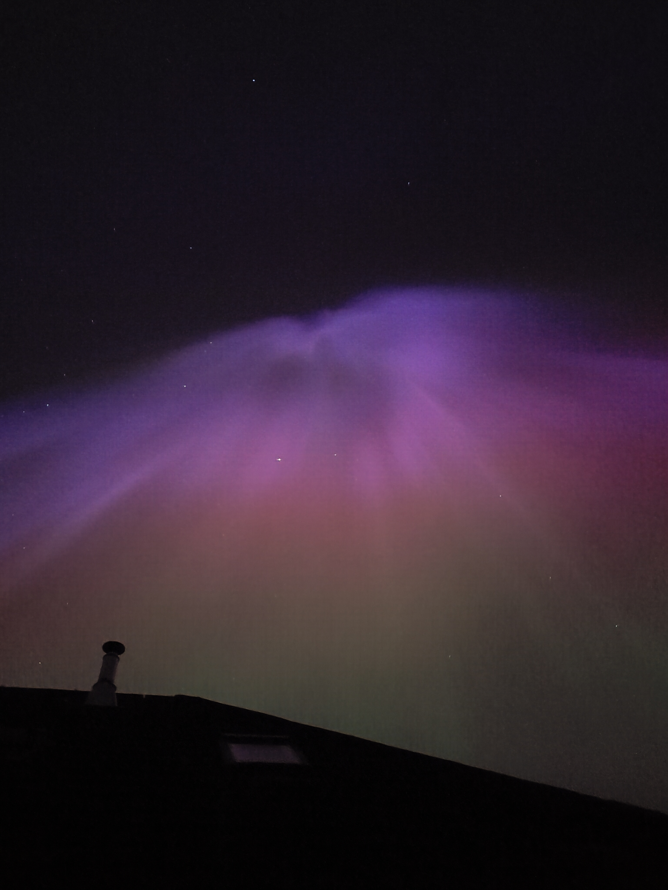
  <p class="media-caption">The aurora from home — above your own house, at your own latitude, impossible to quite believe.</p>
</div>

<div style="display: grid; grid-template-columns: 1fr 1fr; gap: 1rem; margin: 2rem 0;">
  <figure style="margin: 0;">
    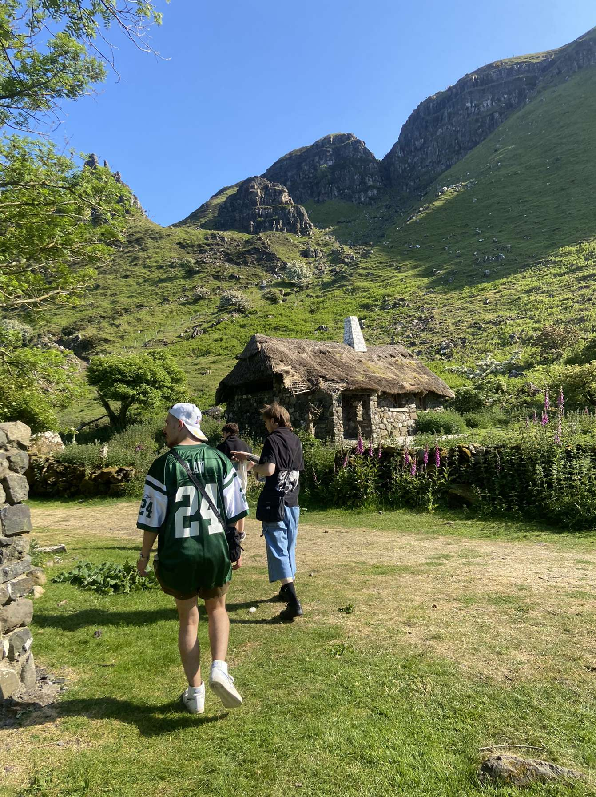
    <figcaption class="media-caption">Galboly — a deserted clachan on a clifftop, the famine-era houses preserved, almost nobody knows it.</figcaption>
  </figure>
  <figure style="margin: 0;">
    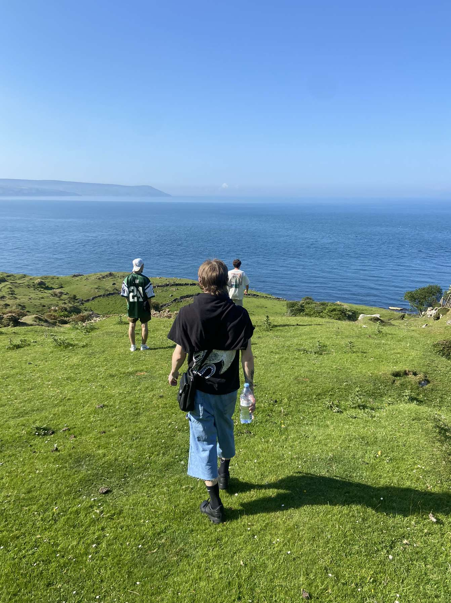
    <figcaption class="media-caption">From the cliffside — Scotland visible across the water on a clear day.</figcaption>
  </figure>
</div>

<div style="display: grid; grid-template-columns: 1fr 1fr; gap: 1rem; margin: 2rem 0;">
  <figure style="margin: 0;">
    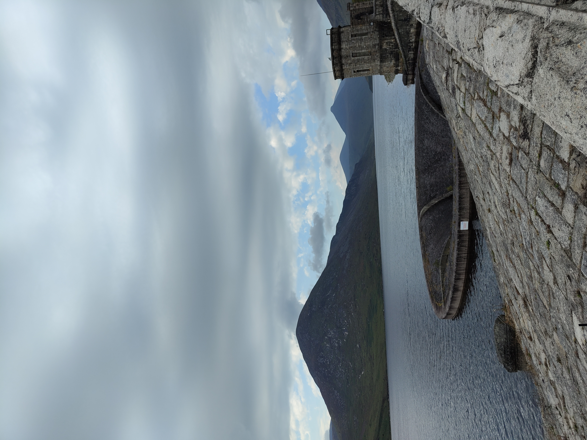
    <figcaption class="media-caption">Silent Valley — the reservoir between the Mourne peaks, spectacular.</figcaption>
  </figure>
  <figure style="margin: 0;">
    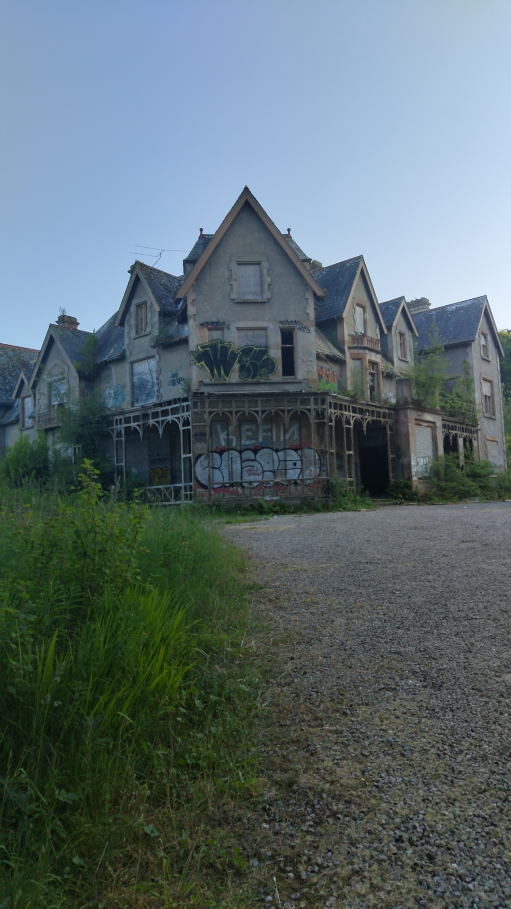
    <figcaption class="media-caption">Cairdhnu House — a massive abandoned country house, open to explore inside and out.</figcaption>
  </figure>
</div>

<div style="display: grid; grid-template-columns: 1fr 1fr 1fr; gap: 1rem; margin: 2rem 0;">
  <figure style="margin: 0;">
    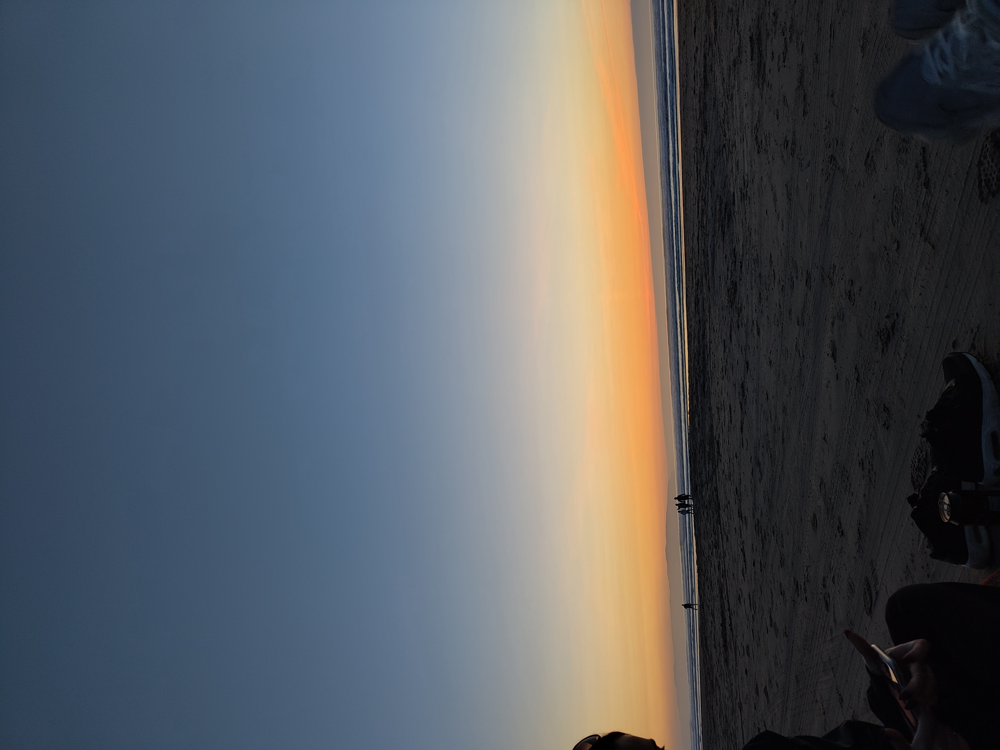
    <figcaption class="media-caption">Portstewart Strand — one of the better beaches in Ireland.</figcaption>
  </figure>
  <figure style="margin: 0;">
    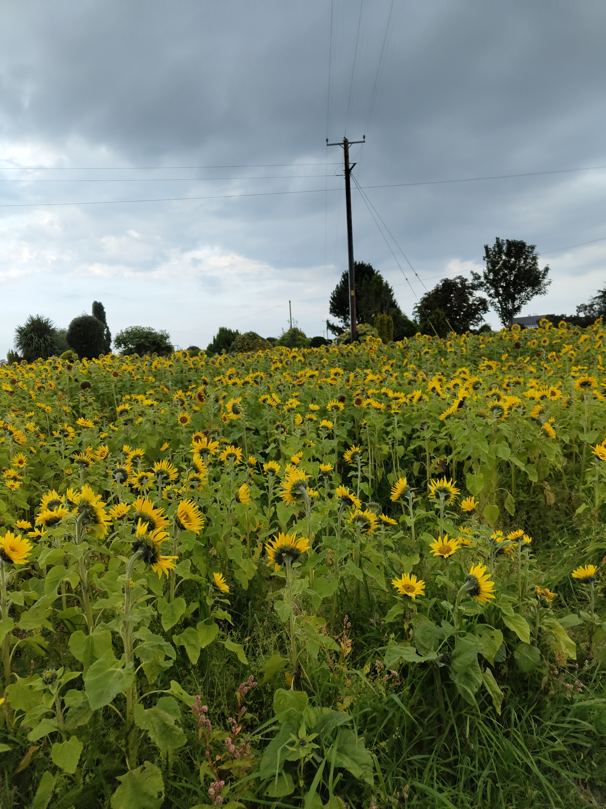
    <figcaption class="media-caption">The sunflower fields at Carginagh — so many of them, August at its best.</figcaption>
  </figure>
  <figure style="margin: 0;">
    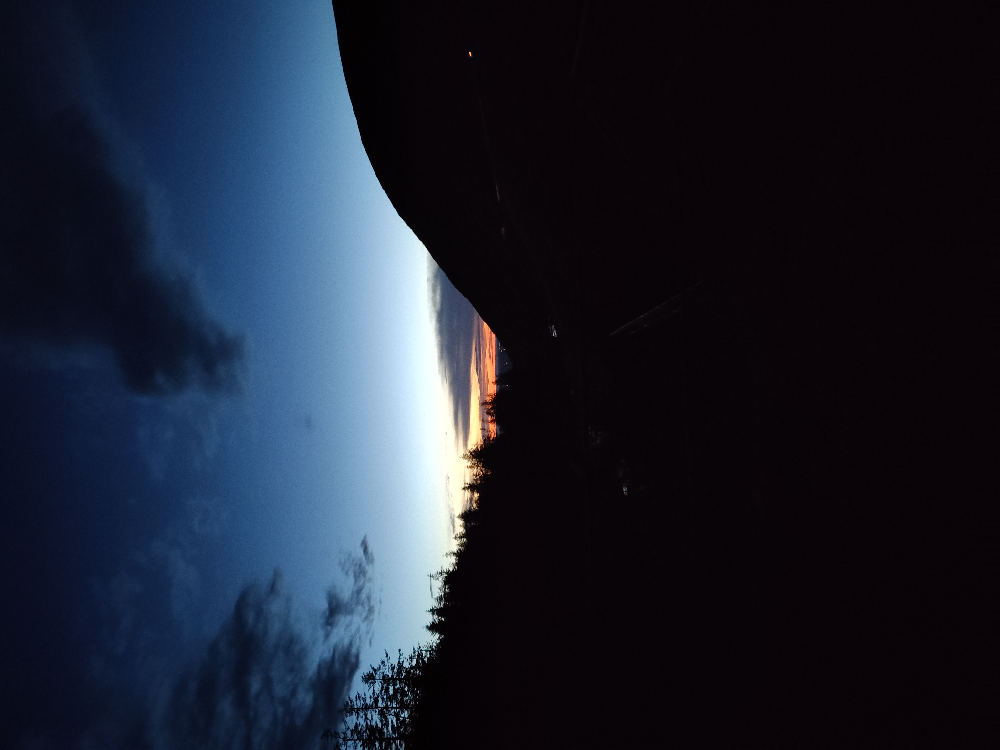
    <figcaption class="media-caption">Spelga Dam at sunset — the light across the reservoir and the hills above it.</figcaption>
  </figure>
</div>

<div class="media-block">
  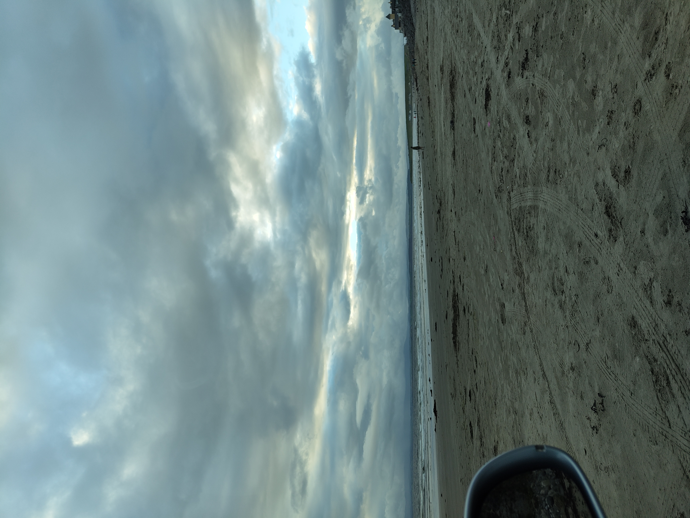
  <p class="media-caption">Rossnowlagh — the waves long and rolling, the sand wide, Donegal doing what Donegal does.</p>
</div>

<div class="pull-quote">
  "Places like this are everywhere in Ireland and mostly unmarked on any tourist map."
</div>

<hr class="section-divider">

<div id="leinster"></div>
::: {.prose}

## Leinster — Dublin and the East

Dublin is a city that takes a certain amount of familiarity to appreciate properly. The Spire on O'Connell Street, which most Dubliners have a complicated relationship with, is genuinely striking from certain angles in certain light. Temple Bar at Christmas, the pub lit up and decorated, is the tourist image of the city and one that earns its place. The Aviva in full voice for an Ireland rugby international is a different kind of experience — the stadium compact and loud in the way that smaller grounds tend to be, the crowd close to the pitch.

Carlingford is one of the better small towns in the country — the medieval ruins, the mountain above it, the lough on the other side, the whole thing compact and charming. Blackrock near Dundalk is the kind of local gem that most counties have and most visitors miss: a pretty village on a tidal estuary where the beach at low tide extends so far out that you can walk across to the sandbar in the middle of the channel. Edenvale Woods has a waterfall and a swimming spot that earns the drive. Curracloe Beach in Wexford is long, wide, and excellent.

The World Darts Championship in Dublin: the crowd at the Ally Pally of Dublin, the atmosphere matching the original.

:::

<div style="display: grid; grid-template-columns: 1fr 1fr; gap: 1rem; margin: 2rem 0;">
  <figure style="margin: 0;">
    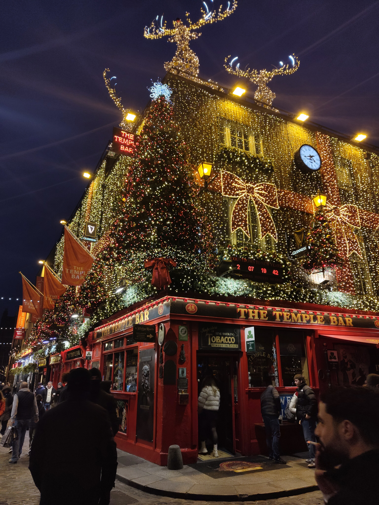
    <figcaption class="media-caption">Temple Bar at Christmas — the tourist image of Dublin, earning its place.</figcaption>
  </figure>
  <figure style="margin: 0;">
    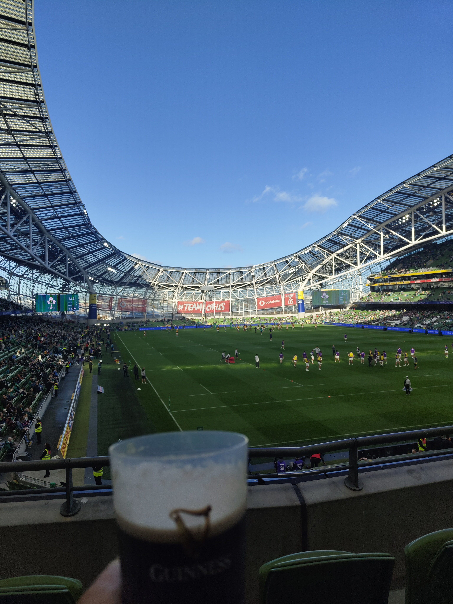
    <figcaption class="media-caption">Ireland v Japan at the Aviva — the stadium compact and loud, the crowd close to the pitch.</figcaption>
  </figure>
</div>

<div style="display: grid; grid-template-columns: 1fr 1fr; gap: 1rem; margin: 2rem 0;">
  <figure style="margin: 0;">
    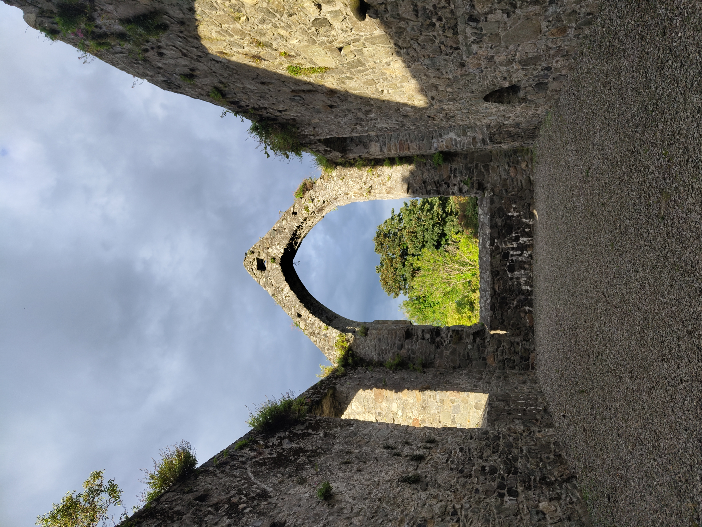
    <figcaption class="media-caption">Carlingford — medieval ruins, mountain above, lough behind, the whole thing compact and charming.</figcaption>
  </figure>
  <figure style="margin: 0;">
    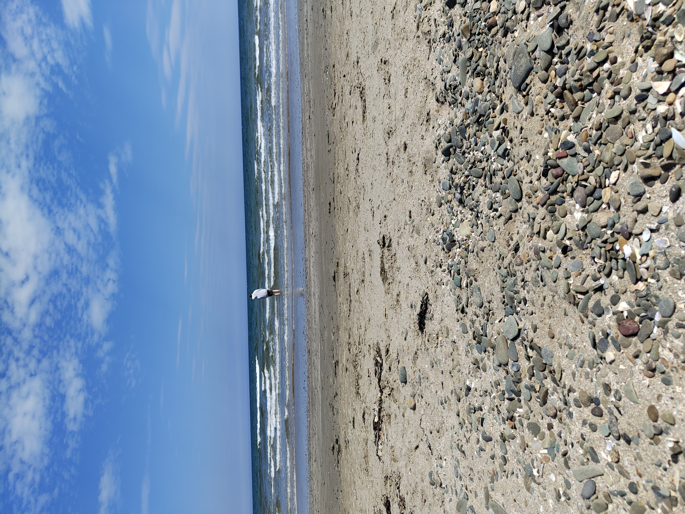
    <figcaption class="media-caption">Blackrock at low tide — the beach extending so far out you can walk to the sandbar.</figcaption>
  </figure>
</div>

<div style="display: grid; grid-template-columns: 1fr 1fr; gap: 1rem; margin: 2rem 0;">
  <figure style="margin: 0;">
    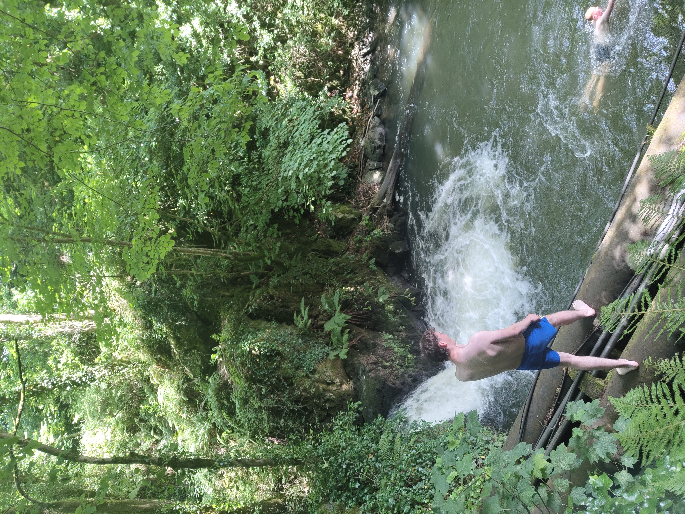
    <figcaption class="media-caption">Edenvale Woods — the waterfall and the swimming spot that earns the drive.</figcaption>
  </figure>
  <figure style="margin: 0;">
    <video autoplay muted loop playsinline
           style="width: 100%; height: 420px; object-fit: cover; border-radius: 6px; display: block;">
      <source src="https://github.com/martinas-jucysbrady/martinas-jucysbrady.github.io/releases/download/v1.0-media/leinster_darts.mp4" type="video/mp4" />
    </video>
    <figcaption class="media-caption">World Darts Championship in Dublin — the atmosphere matching the occasion.</figcaption>
  </figure>
</div>

<hr class="section-divider">

<div id="connacht"></div>
::: {.prose}

## Connacht — The West

The west of Ireland operates at a different pace and in a different light. Rosses Point in Co. Sligo, looking out over the Atlantic with Knocknarea above it, is the kind of view that makes you understand why people who leave the west keep talking about it. Streedagh Beach along the Sligo coast — the long walk along the strand, the dunes behind, the sea ahead — is the beach that most Sligo people would point you to over the more famous ones.

Gleniff Horseshoe is the drive worth making in Sligo — a loop road through a deep glacial valley ringed by limestone cliffs, the hillsides often in cloud, a waterfall at the old mill sites visible from the road. Remote, quiet, and the kind of landscape that makes you understand the word sublime in the original sense.

Scardan Waterfall in Co. Leitrim requires the drive into the back hills and the walk, and both reward. The viewpoint beside it looks out over a valley and lake system that has no visible human intrusion — the kind of landscape that Ireland holds more of than most people who live here realise. The Shannon by boat is the correct way to experience the river midlands — the pace of the water, the bankside vegetation, the locks.

:::

<div class="media-block" style="margin: 2rem 0;">
  <video autoplay muted loop playsinline
         style="width: 100%; max-height: 520px; object-fit: cover; object-position: center; border-radius: 6px; display: block;">
    <source src="https://github.com/martinas-jucysbrady/martinas-jucysbrady.github.io/releases/download/v1.0-media/connacht_shannon.mp4" type="video/mp4" />
  </video>
  <p class="media-caption">The Shannon by boat — the correct pace for the river midlands.</p>
</div>

<div style="display: grid; grid-template-columns: 1fr 1fr; gap: 1rem; margin: 2rem 0;">
  <figure style="margin: 0;">
    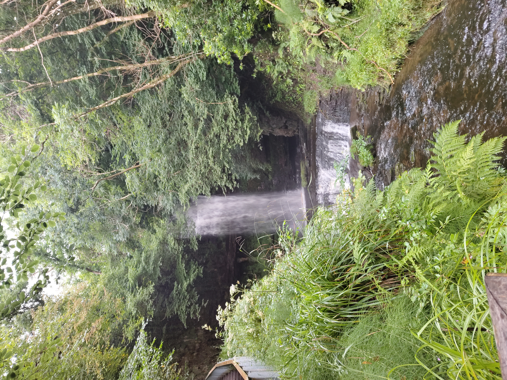
    <figcaption class="media-caption">Scardan Waterfall — remote, worth the drive and the walk.</figcaption>
  </figure>
  <figure style="margin: 0;">
    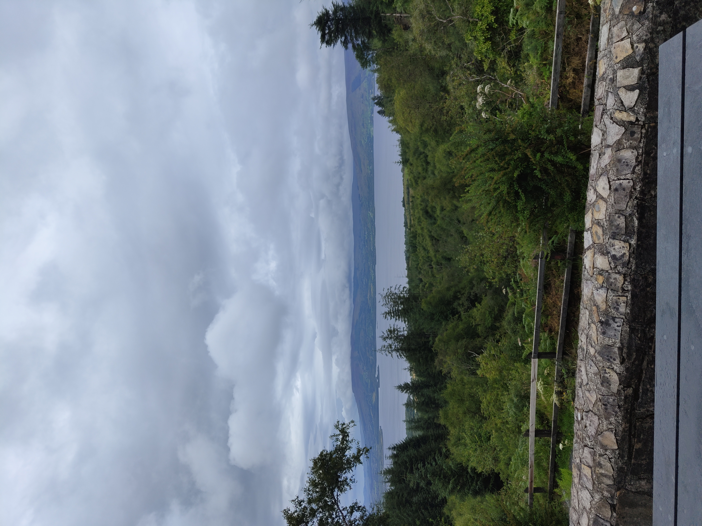
    <figcaption class="media-caption">From the viewpoint — a valley and lake system with no visible human intrusion.</figcaption>
  </figure>
</div>

<div style="display: grid; grid-template-columns: 1fr 1fr; gap: 1rem; margin: 2rem 0;">
  <figure style="margin: 0;">
    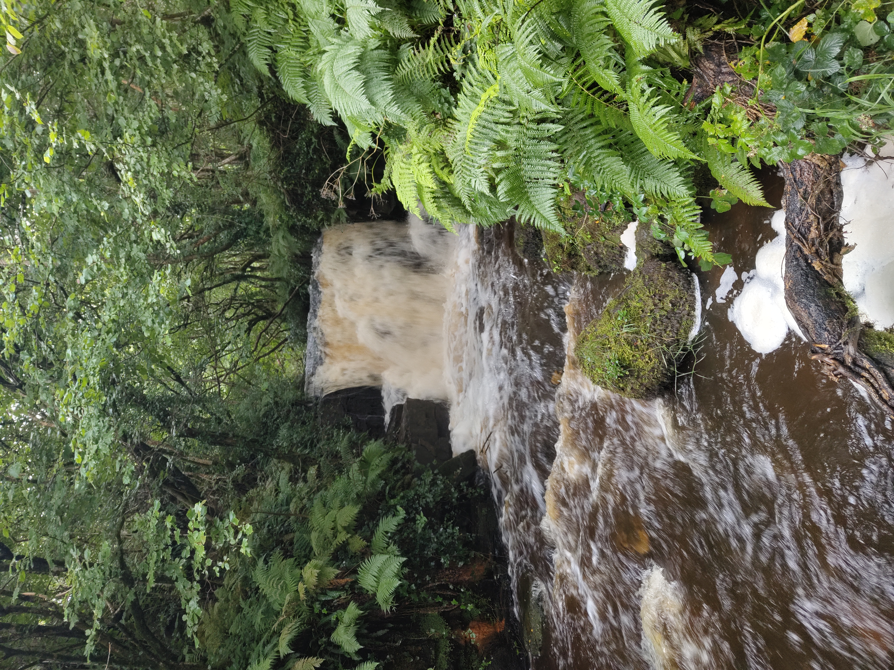
    <figcaption class="media-caption">Gleniff Horseshoe — the waterfall at the old mill sites, the valley closed in on both sides.</figcaption>
  </figure>
  <figure style="margin: 0;">
    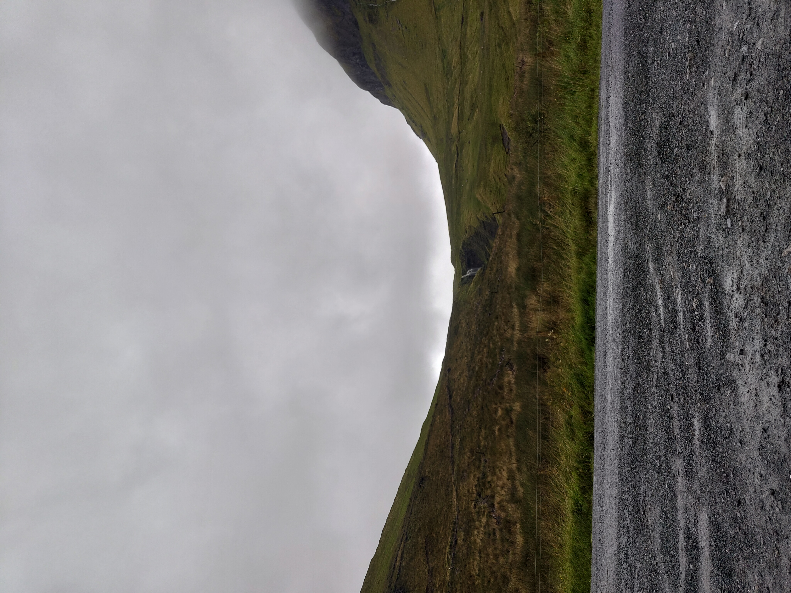
    <figcaption class="media-caption">The hillside in cloud — the landscape making the word sublime make sense.</figcaption>
  </figure>
</div>

<div style="display: grid; grid-template-columns: 1fr 1fr; gap: 1rem; margin: 2rem 0;">
  <figure style="margin: 0;">
    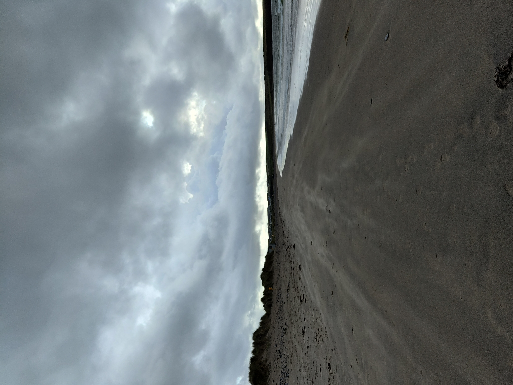
    <figcaption class="media-caption">Streedagh Beach — the one Sligo people would point you to over the famous ones.</figcaption>
  </figure>
  <figure style="margin: 0;">
    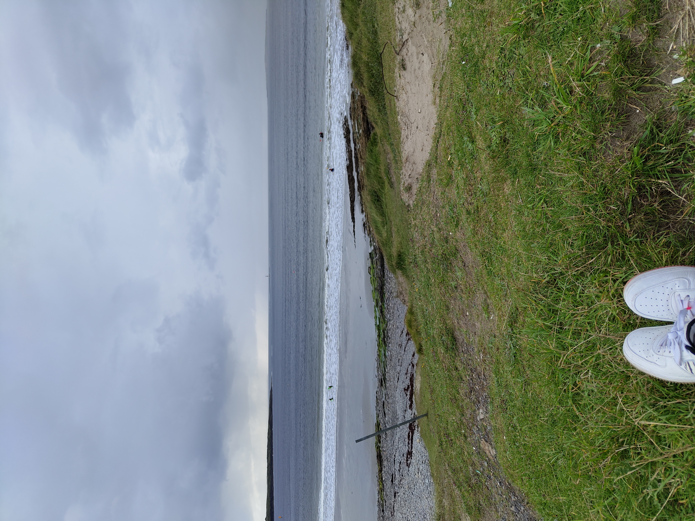
    <figcaption class="media-caption">Rosses Point — looking out over the Atlantic, Knocknarea above, the view that makes people keep talking about the west.</figcaption>
  </figure>
</div>

<div class="pull-quote">
  "Ireland holds more beauty than most people who live here realise — and most of it is unmarked."
</div>

<hr class="section-divider">

::: {.prose}

Travelling far enough eventually produces a particular kind of appreciation for home — not the sentimental kind, but the specific, grounded kind that comes from having seen enough elsewhere to know what comparison looks like. Ireland holds extraordinary landscapes, extraordinary history, and extraordinary light, and most of it exists without fanfare or a ticket queue.

The aurora from your own garden. The cliffside village that nobody visits. The waterfall in the back hills. The beach that extends to the horizon in low tide. None of it requires a flight.

:::

<div class="media-block">
  
  <p class="media-caption">Galboly — Scotland on the horizon, the Atlantic below, home behind you.</p>
</div>
