```{=html}
<style>
  .trip-header {
    text-align: center;
    padding: 60px 20px 40px;
    max-width: 860px;
    margin: 0 auto;
  }
  .trip-label {
    font-size: 0.75rem;
    letter-spacing: 0.2em;
    text-transform: uppercase;
    color: #9b8877;
    margin-bottom: 8px;
  }
  .trip-title {
    font-family: 'Plus Jakarta Sans', sans-serif;
    font-size: 2.6rem;
    font-weight: 800;
    color: #1E4264;
    margin: 0 0 12px;
    line-height: 1.1;
  }
  .trip-subtitle {
    font-family: 'Cormorant Garamond', serif;
    font-style: italic;
    font-size: 1.2rem;
    color: #6b7280;
    margin-bottom: 24px;
  }
  .trip-meta {
    display: flex;
    gap: 24px;
    justify-content: center;
    font-size: 0.8rem;
    color: #9b8877;
    letter-spacing: 0.06em;
    text-transform: uppercase;
    flex-wrap: wrap;
  }
  .section-divider {
    border: none;
    border-top: 1px solid #e0e0f0;
    margin: 48px auto;
    max-width: 600px;
  }
  .prose {
    max-width: 720px;
    margin: 0 auto;
    font-size: 1.05rem;
    line-height: 1.85;
    color: #2d3748;
  }
  .prose h2 {
    font-family: 'Plus Jakarta Sans', sans-serif;
    font-weight: 800;
    font-size: 1.6rem;
    color: #1E4264;
    margin-top: 56px;
    margin-bottom: 12px;
    text-align: center;
  }
  .prose p {
    margin-bottom: 1.4rem;
  }
  .media-block {
    max-width: 860px;
    margin: 32px auto;
    border-radius: 14px;
    overflow: hidden;
    box-shadow: 0 4px 24px rgba(0,0,0,0.10);
  }
  .media-block img,
  .media-block video {
    width: 100%;
    display: block;
    object-fit: cover;
  }
  .media-caption {
    font-family: 'Cormorant Garamond', serif;
    font-style: italic;
    font-size: 0.9rem;
    color: #9b8877;
    text-align: center;
    margin-top: 10px;
    padding: 0 12px 4px;
  }
  .pull-quote {
    font-family: 'Cormorant Garamond', serif;
    font-style: italic;
    font-size: 1.55rem;
    font-weight: 600;
    color: #1E4264;
    text-align: center;
    max-width: 640px;
    margin: 48px auto;
    line-height: 1.5;
    padding: 0 24px;
    border-left: 3px solid #c9aa96;
  }

  #quarto-document-content {
    display: flex;
    flex-direction: column;
    align-items: center;
  }

  #quarto-document-content > * {
    width: 100%;
    max-width: 860px;
  }
</style>

<div class="trip-header">
  <p class="trip-label">🌊 Travel</p>
  <h1 class="trip-title">Take Me Back</h1>
  <p class="trip-subtitle">Six days on the island of eternal spring</p>
  <div class="trip-meta">
    <span>July 2024</span>
    <span>📍 Madeira, Portugal</span>
    <span>✈️ 6 days</span>
  </div>
</div>

<hr class="section-divider">
```

::: {.prose}

## Funchal — The City and the Coast

The landing at Madeira airport sets the tone immediately — the runway extends over the sea on concrete stilts and the approach, in any kind of wind, is the kind that makes you grip the armrest and reassess your relationship with aviation. It delivers you into Funchal, which then proceeds to be entirely worth it.

Funchal is a charming city built on a hillside above a harbour, and it rewards walking in any direction. The coast path is the highlight — a long route along the shoreline that passes stony beaches, sea caves, and rock formations that the Atlantic has been working on for a long time. The botanic gardens above the city are beautiful in the way that things are when someone has been taking care of them for a very long time. Cristiano Ronaldo has a statue near the harbour, which is either a point of civic pride or an interesting aesthetic decision depending on your perspective.

Poncha is the local drink — aguardente de cana, lemon, honey — and it is deceptively strong and very good. Order it from somewhere that makes it properly.

:::

<div style="display: grid; grid-template-columns: 1fr 1fr; gap: 1rem; margin: 2rem 0;">
  <figure style="margin: 0;">
    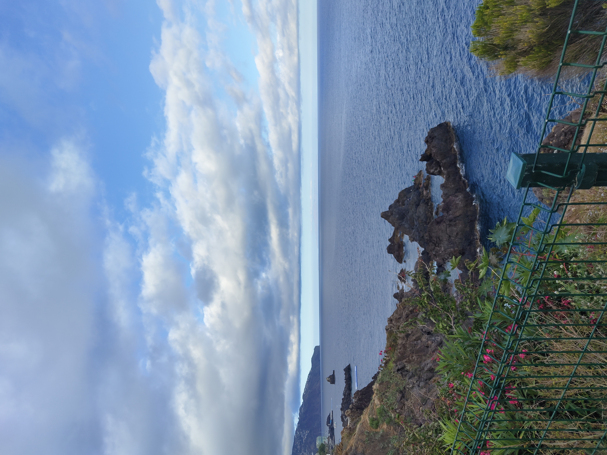
    <figcaption class="media-caption">The coast path — rock formations the Atlantic has been working on for a very long time.</figcaption>
  </figure>
  <figure style="margin: 0;">
    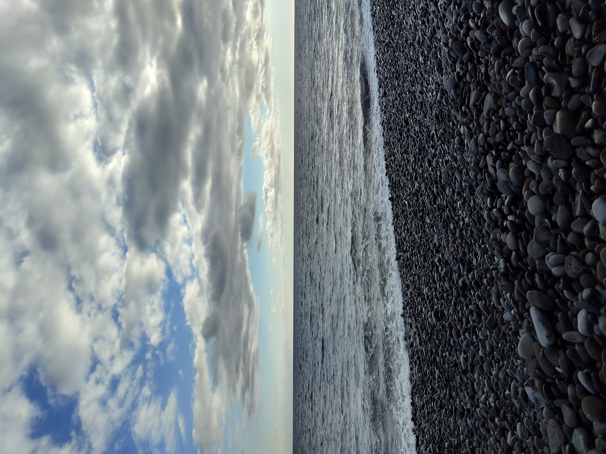
    <figcaption class="media-caption">The stony beach — not a sand beach, but the water makes up for it.</figcaption>
  </figure>
</div>

<div style="display: grid; grid-template-columns: 1fr 1fr 1fr; gap: 1rem; margin: 2rem 0;">
  <figure style="margin: 0;">
    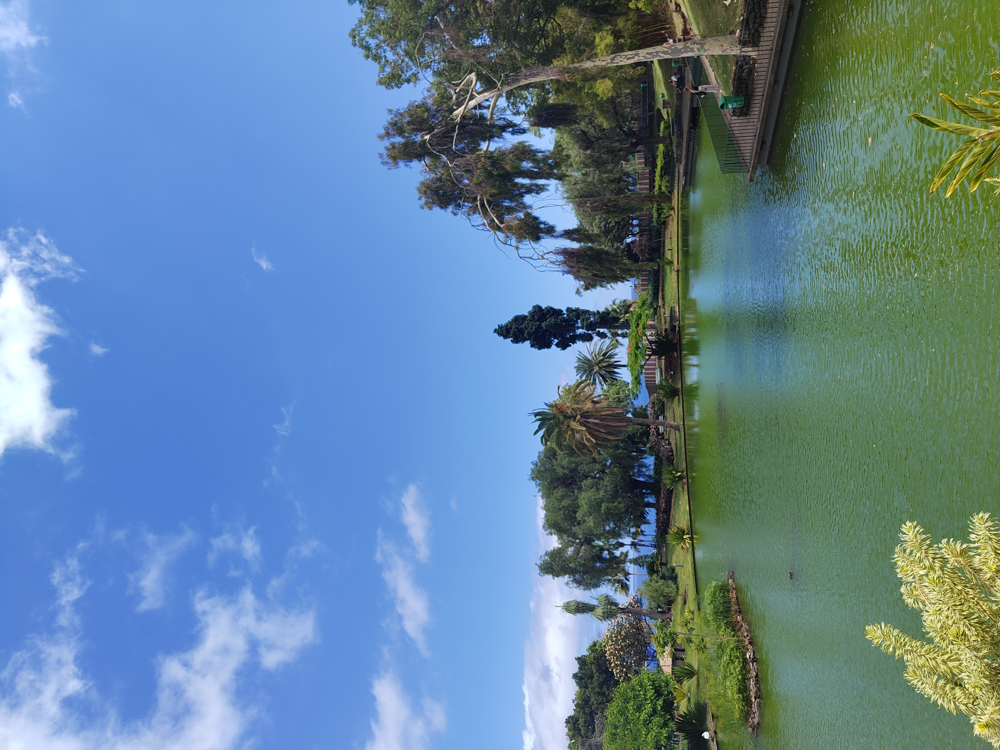
    <figcaption class="media-caption">The gardens above the city — tended carefully, worth the climb.</figcaption>
  </figure>
  <figure style="margin: 0;">
    
    <figcaption class="media-caption">The botanic gardens — the kind that make you slow down.</figcaption>
  </figure>
  <figure style="margin: 0;">
    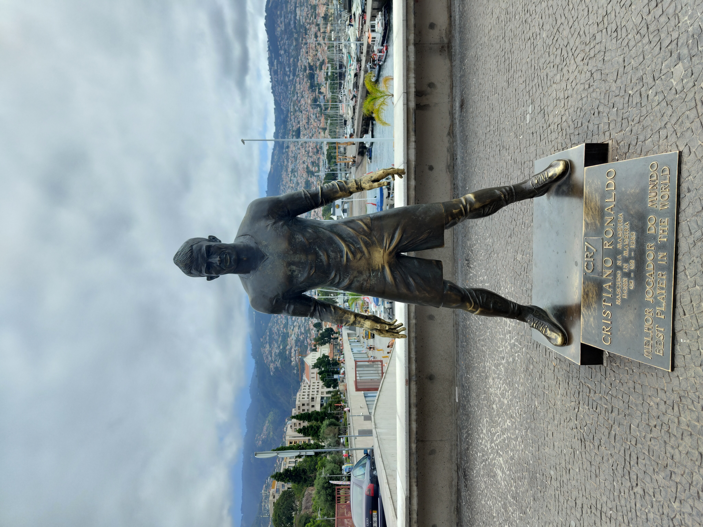
    <figcaption class="media-caption">The Ronaldo statue — Funchal's most debated piece of public art.</figcaption>
  </figure>
</div>

<hr class="section-divider">

::: {.prose}

## Cabo Girão — 580 Metres of Nothing Below You

Cabo Girão is one of the highest sea cliffs in Europe — 580 metres from the glass viewing platform to the water, straight down. The platform extends out over the edge with a glass floor, and the effect is immediate and total: the Atlantic spread out below, the coastline curving away in both directions, and between you and all of it, nothing but air and a pane of glass. It is the kind of view that resets your sense of scale.

Câmara de Lobos sits at the base of the cliff, a small fishing village that Churchill painted from during a visit in 1950, and it is exactly as charming as that suggests — colourful boats in the harbour, steep streets, the kind of quiet that coastal villages have in the afternoon.

:::

<div class="media-block" style="margin: 2rem 0;">
  <video autoplay muted loop playsinline
         style="width: 100%; max-height: 560px; object-fit: cover; object-position: center; border-radius: 6px; display: block;">
    <source src="https://github.com/martinas-jucysbrady/martinas-jucysbrady.github.io/releases/download/v1.0-media/girao_video.mp4" type="video/mp4" />
  </video>
  <p class="media-caption">Cabo Girão — the immense Atlantic and the coastline from 580 metres above the sea.</p>
</div>

<div class="media-block">
  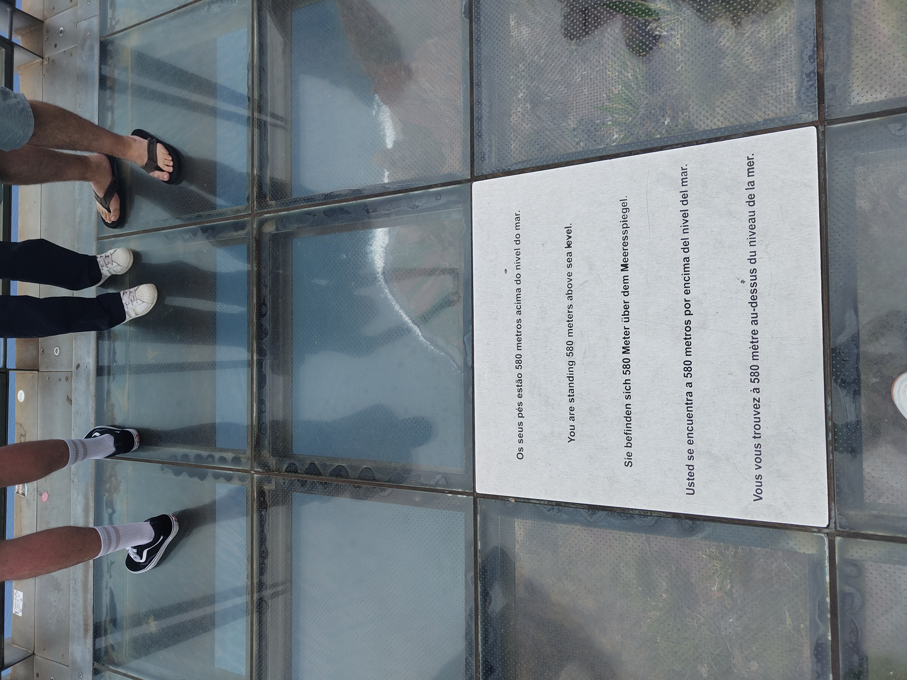
  <p class="media-caption">580 metres above the sea — the plaque making official what the stomach already knew.</p>
</div>

<div class="pull-quote">
  "The Atlantic spread out below, the coastline curving away in both directions, and between you and all of it — nothing."
</div>

<hr class="section-divider">

::: {.prose}

## Pico do Arieiro — Sunrise Above the Clouds

The sunrise at Pico do Arieiro is one of those experiences that earns the early alarm without any qualification. The peak sits at 1,818 metres and at that height, at that hour, the clouds are below you — the island hidden underneath, the sky above going from black to deep blue to orange to something that doesn't have a name. Magical is the word, and it is not an overstatement.

The four-hour hike from Pico do Arieiro to Pico Ruivo — the highest point on the island at 1,862 metres — follows a path cut into the ridge, through tunnels in the rock and along edges where the valley drops away on both sides. There are moments on the path where you exit a cave and look straight down into a valley floor that seems to be in a different country. The views throughout are genuinely among the best I've seen anywhere.

:::

<div class="media-block" style="margin: 2rem 0;">
  <video autoplay muted loop playsinline
         style="width: 100%; max-height: 560px; object-fit: cover; object-position: center; border-radius: 6px; display: block;">
    <source src="https://github.com/martinas-jucysbrady/martinas-jucysbrady.github.io/releases/download/v1.0-media/pico_sunrise.mp4" type="video/mp4" />
  </video>
  <p class="media-caption">Sunrise at Pico do Arieiro — the clouds below, the sky doing something without a name.</p>
</div>

<div class="media-block" style="margin: 2rem 0;">
  <video autoplay muted loop playsinline
         style="width: 100%; max-height: 560px; object-fit: cover; object-position: center; border-radius: 6px; display: block;">
    <source src="https://github.com/martinas-jucysbrady/martinas-jucysbrady.github.io/releases/download/v1.0-media/pico_path.mp4" type="video/mp4" />
  </video>
  <p class="media-caption">The path to Pico Ruivo — walking above the clouds, the island somewhere far below.</p>
</div>

<div class="media-block" style="margin: 2rem 0;">
  <video autoplay muted loop playsinline
         style="width: 100%; max-height: 560px; object-fit: cover; object-position: center; border-radius: 6px; display: block;">
    <source src="https://github.com/martinas-jucysbrady/martinas-jucysbrady.github.io/releases/download/v1.0-media/pico_valley.mp4" type="video/mp4" />
  </video>
  <p class="media-caption">Exiting the tunnel — the valley straight below, impossibly deep.</p>
</div>

<div class="pull-quote">
  "At that height, at that hour, the clouds are below you."
</div>

<hr class="section-divider">

::: {.prose}

## Porto Santo — The Ferry and the Beach

The ferry from Funchal to Porto Santo takes about two and a half hours and the island announces itself as a different proposition entirely — flat where Madeira is vertical, golden sand where Funchal is stone, calm where the main island is kinetic. The beach at Praia do Ribeiro Salgado is nine kilometres of uninterrupted sand and the water is warm and clear. The sun is more intense than it looks. Do not underestimate the sun.

The Christopher Columbus house — he lived on Porto Santo for a period in the 1470s while married to the governor's daughter — is a small museum that puts the island in an unexpected historical context. Porto Santo is a very calm, pretty place, and the pace of it after a few days in Funchal felt like exactly the right gear change.

:::

<div style="display: grid; grid-template-columns: 1fr 1fr; gap: 1rem; margin: 2rem 0;">
  <figure style="margin: 0;">
    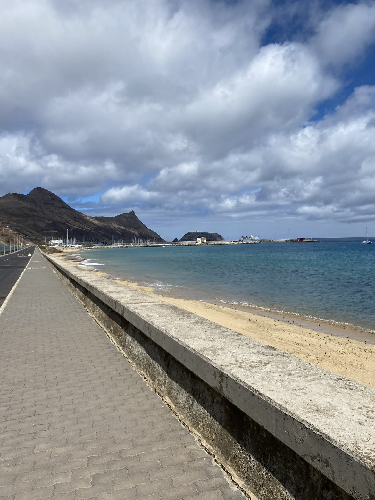
    <figcaption class="media-caption">Porto Santo — nine kilometres of golden sand, the sun more intense than it looks.</figcaption>
  </figure>
  <figure style="margin: 0;">
    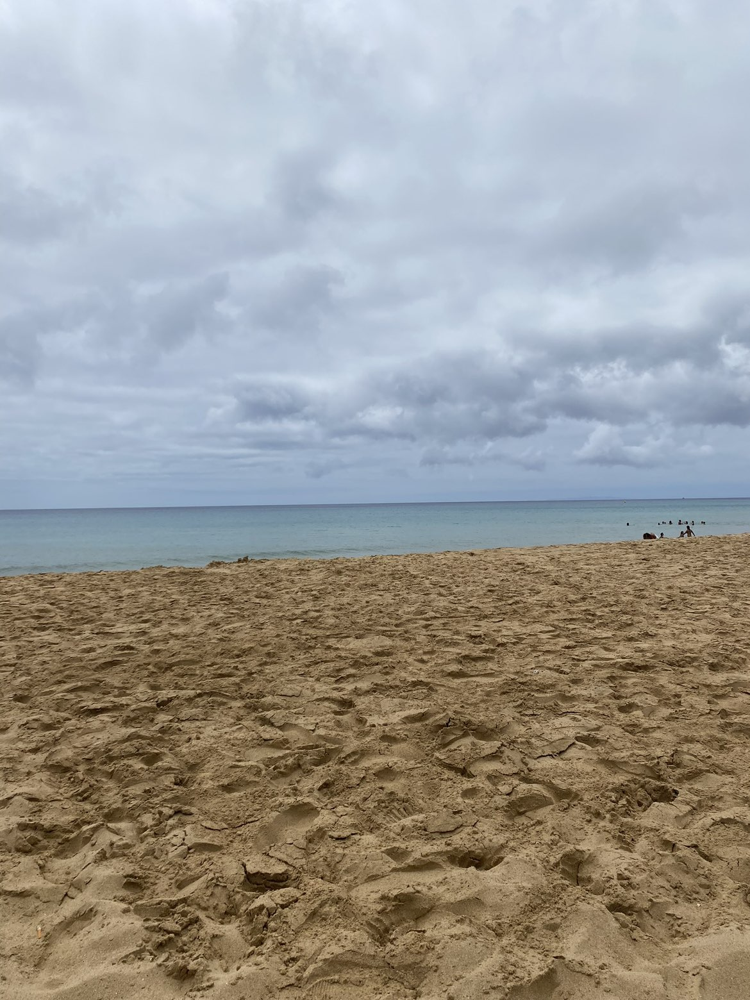
    <figcaption class="media-caption">The water at Praia do Ribeiro Salgado — warm, clear, and worth the ferry.</figcaption>
  </figure>
</div>

<div class="media-block" style="margin: 2rem 0;">
  <video autoplay muted loop playsinline
         style="width: 100%; max-height: 480px; object-fit: cover; object-position: center; border-radius: 6px; display: block;">
    <source src="https://github.com/martinas-jucysbrady/martinas-jucysbrady.github.io/releases/download/v1.0-media/santo_ferry.mp4" type="video/mp4" />
  </video>
  <p class="media-caption">The ferry crossing — two and a half hours, the islands exchanging places on the horizon.</p>
</div>

<hr class="section-divider">

::: {.prose}

## The 4x4 Tour — Into the Island

The jeep tour covers the parts of Madeira that aren't reachable any other way, and it is the best single day on the island. The interior is a completely different world from the coast — dense forest, narrow roads cut into hillsides, waterfalls appearing without warning, landscapes that keep changing every few kilometres in a way that makes the island feel much larger than it is.

Ponta da Sol from above the clouds is one of those viewpoints that stops conversation. The village far below, the sea beyond it, the clouds sitting between you and both — the kind of view that makes you understand why people come back to Madeira. Fanal Forest is something else entirely: ancient laurisilva trees covered in moss, thick mist moving through them, a silence that feels absolute. It is eerie in the best possible way. Porto Moniz, at the northwest tip, has natural lava pools carved out by the sea that are as dramatic from above as they are to swim in.

:::

<div class="media-block" style="margin: 2rem 0;">
  <video autoplay muted loop playsinline
         style="width: 100%; max-height: 560px; object-fit: cover; object-position: center; border-radius: 6px; display: block;">
    <source src="https://github.com/martinas-jucysbrady/martinas-jucysbrady.github.io/releases/download/v1.0-media/tour_road.mp4" type="video/mp4" />
  </video>
  <p class="media-caption">The jeep roads — the interior opening up with every kilometre.</p>
</div>

<div class="media-block" style="margin: 2rem 0;">
  <video autoplay muted loop playsinline
         style="width: 100%; max-height: 560px; object-fit: cover; object-position: center; border-radius: 6px; display: block;">
    <source src="https://github.com/martinas-jucysbrady/martinas-jucysbrady.github.io/releases/download/v1.0-media/tour_ponta.mp4" type="video/mp4" />
  </video>
  <p class="media-caption">Ponta da Sol from above — the village below, the sea beyond it, the clouds between.</p>
</div>

<div style="display: grid; grid-template-columns: 1fr 1fr; gap: 1rem; margin: 2rem 0;">
  <figure style="margin: 0;">
    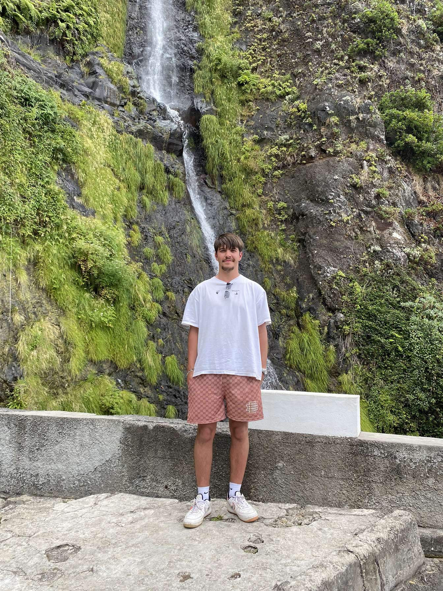
    <figcaption class="media-caption">One of the waterfalls — appearing without warning, gone around the next bend.</figcaption>
  </figure>
  <figure style="margin: 0;">
    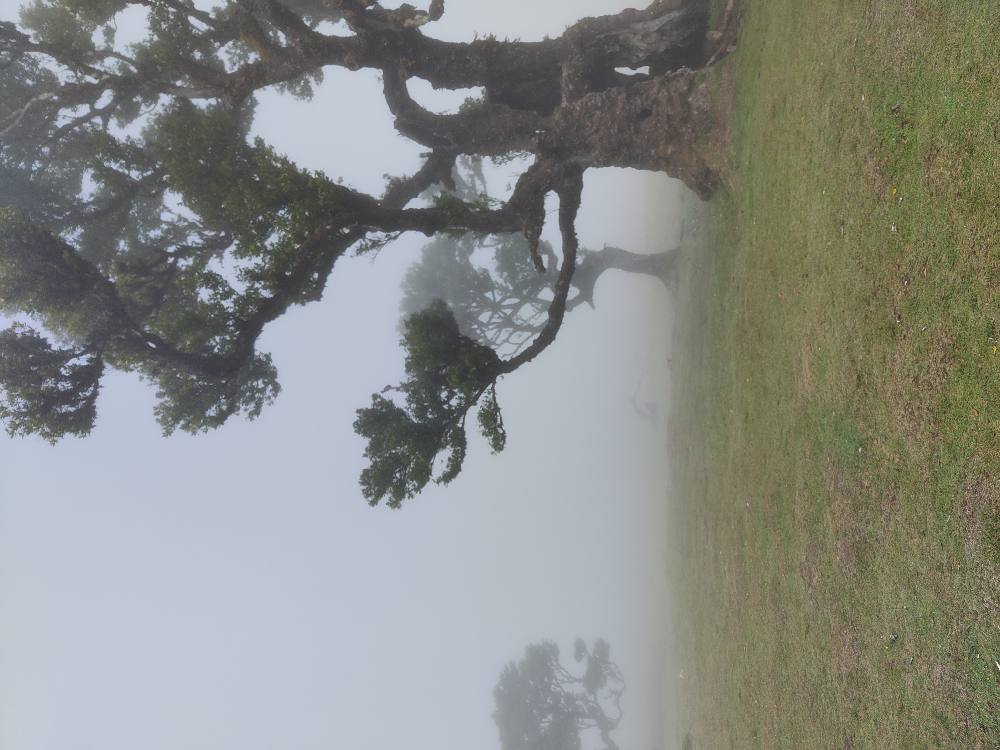
    <figcaption class="media-caption">Fanal Forest — ancient trees, thick mist, a silence that feels absolute.</figcaption>
  </figure>
</div>

<div style="display: grid; grid-template-columns: 1fr 1fr; gap: 1rem; margin: 2rem 0;">
  <figure style="margin: 0;">
    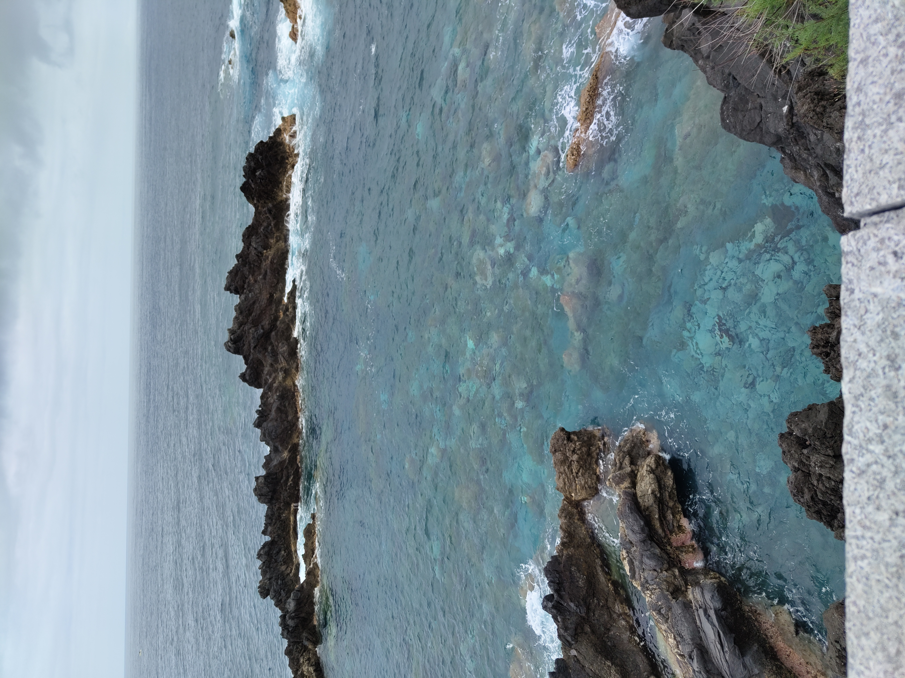
    <figcaption class="media-caption">Porto Moniz — lava coastline carved into something extraordinary.</figcaption>
  </figure>
  <figure style="margin: 0;">
    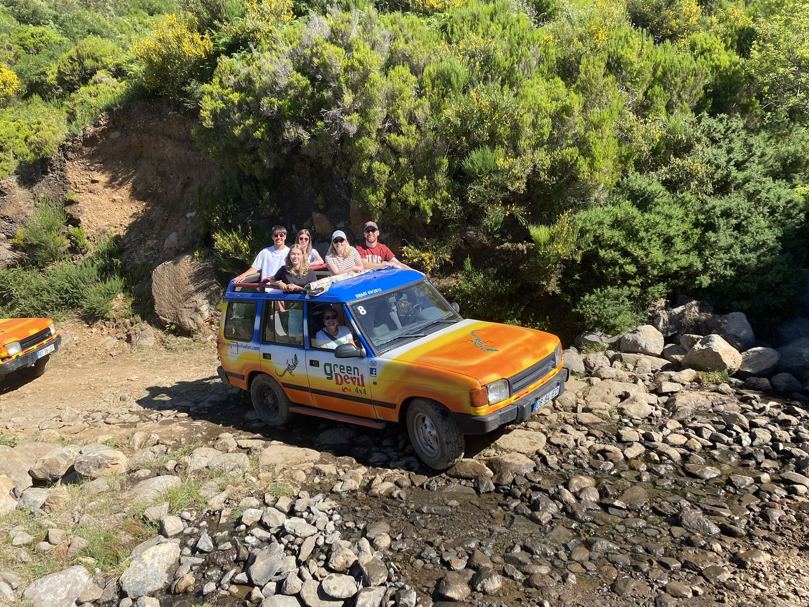
    <figcaption class="media-caption">The jeep — the best way to see the island, by some margin.</figcaption>
  </figure>
</div>

<div class="pull-quote">
  "Take me back."
</div>

<hr class="section-divider">

::: {.prose}

Six days is not enough. Madeira is one of those places that keeps revealing itself — the coast, the mountains, the forest, the other island — and each layer is better than the last. The sunrise at Pico do Arieiro alone justifies the trip. Everything else is a bonus that doesn't feel like a bonus.

It is genuinely one of the best places I've been. The kind that goes on a list not of places visited but of places to return to, specifically, with more time.

:::

<div class="media-block">
  
  <p class="media-caption">Madeira — take me back.</p>
</div>
