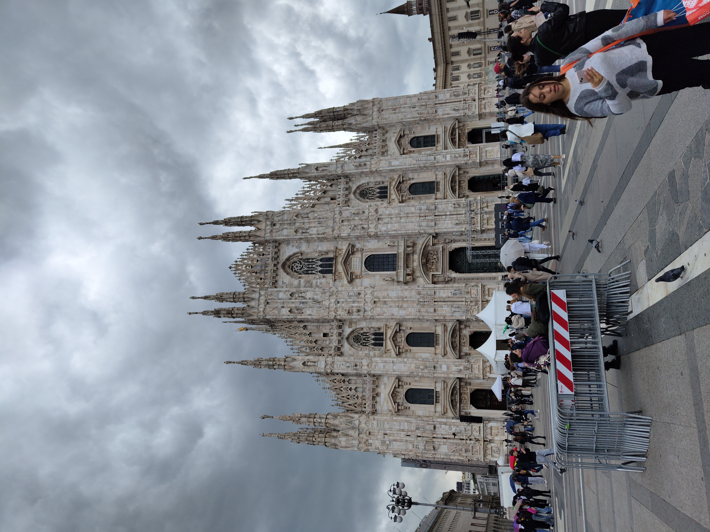
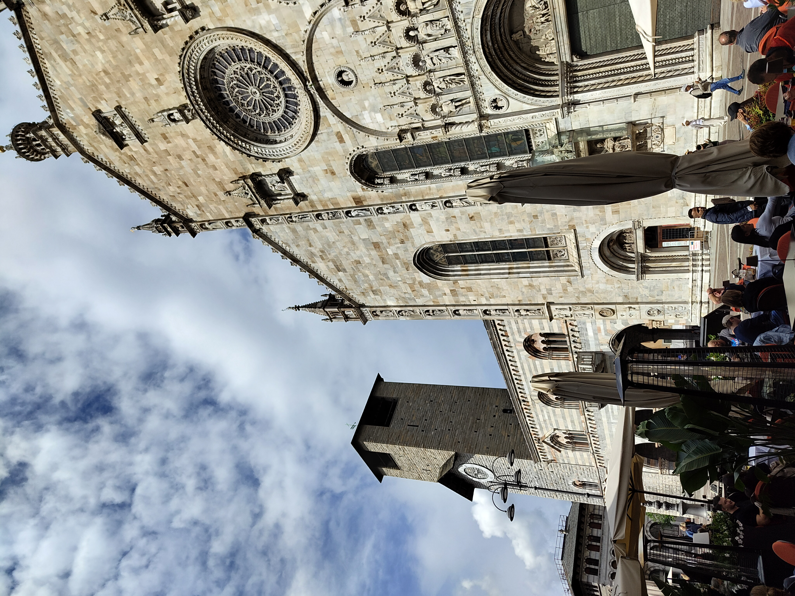
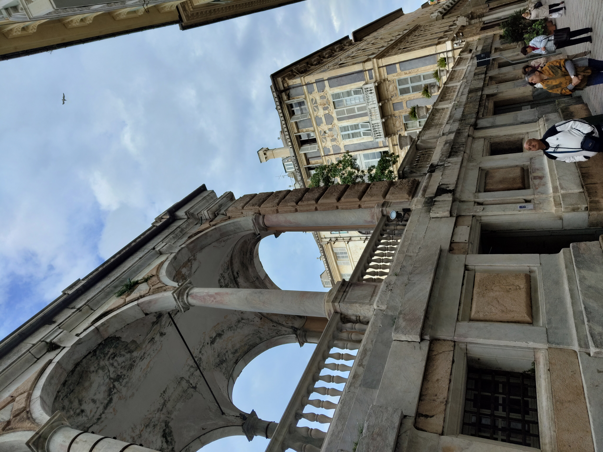
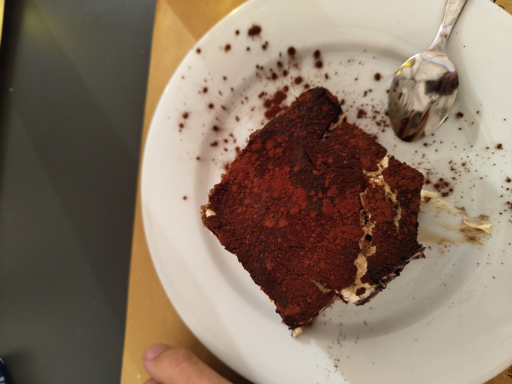
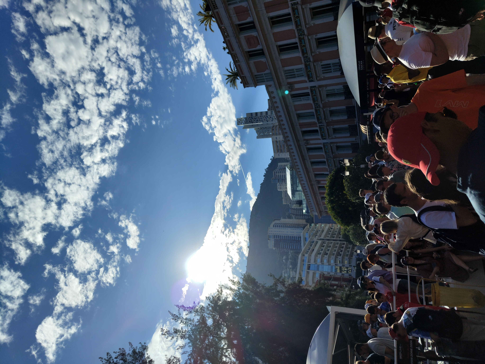
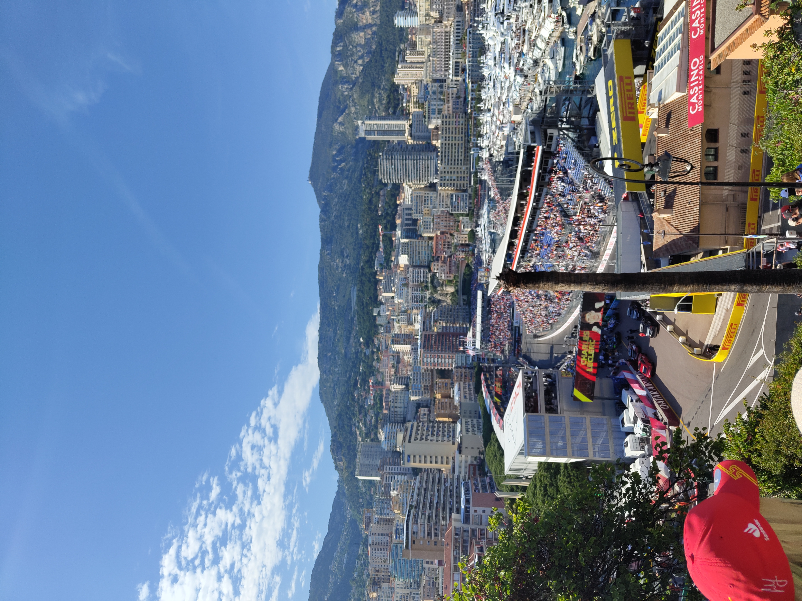

```{=html}
<style>
  .trip-header {
    text-align: center;
    padding: 60px 20px 40px;
    max-width: 860px;
    margin: 0 auto;
  }
  .trip-label {
    font-size: 0.75rem;
    letter-spacing: 0.2em;
    text-transform: uppercase;
    color: #9b8877;
    margin-bottom: 8px;
  }
  .trip-title {
    font-family: 'Plus Jakarta Sans', sans-serif;
    font-size: 2.6rem;
    font-weight: 800;
    color: #1E4264;
    margin: 0 0 12px;
    line-height: 1.1;
  }
  .trip-subtitle {
    font-family: 'Cormorant Garamond', serif;
    font-style: italic;
    font-size: 1.2rem;
    color: #6b7280;
    margin-bottom: 24px;
  }
  .trip-meta {
    display: flex;
    gap: 24px;
    justify-content: center;
    font-size: 0.8rem;
    color: #9b8877;
    letter-spacing: 0.06em;
    text-transform: uppercase;
    flex-wrap: wrap;
  }
  .section-divider {
    border: none;
    border-top: 1px solid #e0e0f0;
    margin: 48px auto;
    max-width: 600px;
  }
  .prose {
    max-width: 720px;
    margin: 0 auto;
    font-size: 1.05rem;
    line-height: 1.85;
    color: #2d3748;
  }
  .prose h2 {
    font-family: 'Plus Jakarta Sans', sans-serif;
    font-weight: 800;
    font-size: 1.6rem;
    color: #1E4264;
    margin-top: 56px;
    margin-bottom: 12px;
    text-align: center;
  }
  .prose p {
    margin-bottom: 1.4rem;
  }
  .media-block {
    max-width: 860px;
    margin: 32px auto;
    border-radius: 14px;
    overflow: hidden;
    box-shadow: 0 4px 24px rgba(0,0,0,0.10);
  }
  .media-block img,
  .media-block video {
    width: 100%;
    display: block;
    object-fit: cover;
  }
  .media-caption {
    font-family: 'Cormorant Garamond', serif;
    font-style: italic;
    font-size: 0.9rem;
    color: #9b8877;
    text-align: center;
    margin-top: 10px;
    padding: 0 12px 4px;
  }
  .pull-quote {
    font-family: 'Cormorant Garamond', serif;
    font-style: italic;
    font-size: 1.55rem;
    font-weight: 600;
    color: #1E4264;
    text-align: center;
    max-width: 640px;
    margin: 48px auto;
    line-height: 1.5;
    padding: 0 24px;
    border-left: 3px solid #c9aa96;
  }

  #quarto-document-content {
    display: flex;
    flex-direction: column;
    align-items: center;
  }

  #quarto-document-content > * {
    width: 100%;
    max-width: 860px;
  }
</style>

<div class="trip-header">
  <p class="trip-label">🏎️ Travel</p>
  <h1 class="trip-title">Formula One and the Italian Riviera</h1>
  <p class="trip-subtitle">A week from Milan to Monaco and along the Côte d'Azur</p>
  <div class="trip-meta">
    <span>May 2024</span>
    <span>📍 Italy & France</span>
    <span>✈️ 1 week</span>
  </div>
</div>

<hr class="section-divider">
```

<div id="milan"></div>
::: {.prose}

## Milan — The Cathedral and the Shopping

Milan does two things better than almost anywhere: architecture and fashion. The Duomo di Milano sits at the centre of both — one of the largest Gothic cathedrals in the world, and surrounded on every side by high street shops that seem to be in quiet competition with it for attention. The cathedral itself takes a moment to process. The facade is dense with spires, statues and detail that become more elaborate the longer you look, and climbing to the rooftop puts you level with the stonework in a way that makes the scale finally land.

The shopping was a different kind of overwhelming. Every major label within walking distance of each other, the kind of density that makes you do rapid mental arithmetic about luggage allowances. I didn't buy anything. I would go back specifically to rectify that.

:::

<div class="media-block">
  
  <p class="media-caption">The Duomo di Milano — Gothic on a scale that takes a moment to fully accept.</p>
</div>

<hr class="section-divider">

<div id="como"></div>
::: {.prose}

## Como — The Lake, the Town, and Bellagio

The day trip to Como started with the town itself. The Duomo di Como is smaller and quieter than Milan's but no less considered — a Romanesque-Gothic church that anchors a set of charming streets that reward an hour of wandering without any particular agenda.

Bellagio sits at the tip of the peninsula where Lake Como splits, and getting there involves a bus ride along roads that are narrower than any bus has any right to be on. The driver seemed unconcerned. The scenery made it easy to forgive. Bellagio is the kind of place that people describe as one of the most beautiful spots in Italy and then you arrive and understand that they were being conservative. The burrata pizza was, by some margin, one of the better things I ate on the whole trip.

:::

<div class="media-block">
  
  <p class="media-caption">The Duomo di Como — quieter than Milan's, no less worth the stop.</p>
</div>

<div class="media-block" style="margin: 2rem 0;">
  <video autoplay muted loop playsinline
         style="width: 100%; max-height: 560px; object-fit: cover; object-position: center; border-radius: 6px; display: block;">
    <source src="https://github.com/martinas-jucysbrady/martinas-jucysbrady.github.io/releases/download/v1.0-media/como_bellagio.mp4" type="video/mp4" />
  </video>
  <p class="media-caption">Bellagio — at the point where Lake Como splits, and every direction looks like a painting.</p>
</div>

<hr class="section-divider">

<div id="genoa"></div>
::: {.prose}

## Genoa — Tiramisu and the Caruggi

Genoa doesn't get the attention it deserves. The city is built on hills that tumble down to a working port, and the historic centre is a dense web of narrow medieval lanes — the caruggi — that go on further than seems possible and turn up something worth looking at every few minutes. It is a city that rewards aimless walking more than most.

The food made the strongest case for a longer stay. The tiramisu in particular was the kind that makes you reconsider every tiramisu you've had before — the right balance, the right texture, the right amount of everything. Italian cities are competitive about their food and Genoa holds its own without making any fuss about it.

:::

<div style="display: grid; grid-template-columns: 1fr 1fr; gap: 1rem; margin: 2rem 0;">
  <figure style="margin: 0;">
    
    <figcaption class="media-caption">The caruggi — Genoa's medieval lanes, going further than seems possible.</figcaption>
  </figure>
  <figure style="margin: 0;">
    
    <figcaption class="media-caption">The tiramisu. The best argument for staying another day.</figcaption>
  </figure>
</div>

<hr class="section-divider">

<div id="monaco"></div>
::: {.prose}

## Monaco — Charles Leclerc

The whole trip was built around Monaco. The Formula 1 Grand Prix is the race on the calendar — the streets, the barriers, the sound, the scale of what it means to run a modern Formula 1 car through a city that was not designed for it. The cheapest tickets turned out to be exactly right: no grandstand walls between you and the atmosphere, and the atmosphere in Monaco during race weekend is something that needs to be experienced rather than described.

Charles Leclerc winning at home was the kind of moment that makes sport worth following. The Monégasque driver had been trying for years and the crowd knew it — the streets after the race were the loudest and most joyful I've ever been in the middle of. We walked the track after the race, which is something you can do once the barriers allow it, and the circuit feels different on foot: narrower than it looks on television, the barriers closer, the gradients steeper.

The Rock of Monaco — the old city on the promontory above the port — is worth the climb on its own terms, with views over the harbour and the yachts that make the scale of the place apparent. The iconic Route de la Piscine, the stretch of circuit around the harbour, is genuinely one of the most recognisable pieces of road in the world.

:::

<div style="display: grid; grid-template-columns: 1fr 1fr; gap: 1rem; margin: 2rem 0;">
  <figure style="margin: 0;">
    
    <figcaption class="media-caption">Monaco on race weekend — the streets full in a way that only happens once a year.</figcaption>
  </figure>
  <figure style="margin: 0;">
    
    <figcaption class="media-caption">Leclerc winning at home — the moment the whole crowd had been waiting for.</figcaption>
  </figure>
</div>

<div style="display: grid; grid-template-columns: 1fr 1fr; gap: 1rem; margin: 2rem 0;">
  <figure style="margin: 0;">
    
    <figcaption class="media-caption">Route de la Piscine — one of the most recognisable stretches of road in the world.</figcaption>
  </figure>
  <figure style="margin: 0;">
    
    <figcaption class="media-caption">From the Rock — the yachts below making the scale of the harbour apparent.</figcaption>
  </figure>
</div>

<div class="media-block" style="margin: 2rem 0;">
  <video autoplay muted loop playsinline
         style="width: 100%; max-height: 560px; object-fit: cover; object-position: center; border-radius: 6px; display: block;">
    <source src="https://github.com/martinas-jucysbrady/martinas-jucysbrady.github.io/releases/download/v1.0-media/monaco_race.mp4" type="video/mp4" />
  </video>
  <p class="media-caption">Earlier in the weekend — the F2 race through the streets, the sound arriving before the cars do.</p>
</div>

<div class="media-block" style="margin: 2rem 0;">
  <video autoplay muted loop playsinline
         style="width: 100%; max-height: 560px; object-fit: cover; object-position: center; border-radius: 6px; display: block;">
    <source src="https://github.com/martinas-jucysbrady/martinas-jucysbrady.github.io/releases/download/v1.0-media/monaco_f1.mp4" type="video/mp4" />
  </video>
  <p class="media-caption">The F1 race — restricted view, unrestricted sound.</p>
</div>

<div class="pull-quote">
  "The cheapest tickets turned out to be exactly right — no grandstand walls between you and the atmosphere."
</div>

<hr class="section-divider">

::: {.prose}

## Nice and Cannes — The Côte d'Azur

Nice is a city that earns its reputation quietly. The architecture along the Promenade des Anglais is ornate and unhurried, the old town is genuinely charming rather than performed for tourists, and the pace after Monaco felt like a deliberate decompression. It is a city with a lot to offer and very little urgency about offering it.

Cannes was a day trip along the coast and delivered exactly what it promised: a beautiful beach, a beautiful atmosphere, and the particular kind of glamour that the Croisette manages without seeming to try too hard. The view from the Suquet — the old town on the hill above the port — is one of the better ones on the whole stretch of coastline.

:::

<div style="display: grid; grid-template-columns: 1fr 1fr; gap: 1rem; margin: 2rem 0;">
  <figure style="margin: 0;">
    
    <figcaption class="media-caption">Cannes from the Suquet — the port and coastline laid out below.</figcaption>
  </figure>
  <figure style="margin: 0;">
    
    <figcaption class="media-caption">The beach at Cannes — the kind of atmosphere that justifies the reputation.</figcaption>
  </figure>
</div>

<div class="pull-quote">
  "A city with a lot to offer and very little urgency about offering it."
</div>

<hr class="section-divider">

::: {.prose}

A week across two countries and several cities that have nothing obvious in common except that they each do something better than almost anywhere else. Milan does cathedrals and fashion. Como does lakes. Genoa does food and medieval streets. Monaco does spectacle, once a year, in a way nothing else competes with. Nice does the Côte d'Azur on its own terms. Cannes does glamour without effort.

The Monaco Grand Prix was the reason for the trip. It delivered. Everything around it turned out to be worth the journey independently.

:::

<div class="media-block">
  
  <p class="media-caption">Monaco — the one that was worth building the whole trip around.</p>
</div>
