```{=html}
<style>
  .trip-header {
    text-align: center;
    padding: 60px 20px 40px;
    max-width: 860px;
    margin: 0 auto;
  }
  .trip-label {
    font-size: 0.75rem;
    letter-spacing: 0.2em;
    text-transform: uppercase;
    color: #9b8877;
    margin-bottom: 8px;
  }
  .trip-title {
    font-family: 'Plus Jakarta Sans', sans-serif;
    font-size: 2.6rem;
    font-weight: 800;
    color: #1E4264;
    margin: 0 0 12px;
    line-height: 1.1;
  }
  .trip-subtitle {
    font-family: 'Cormorant Garamond', serif;
    font-style: italic;
    font-size: 1.2rem;
    color: #6b7280;
    margin-bottom: 24px;
  }
  .trip-meta {
    display: flex;
    gap: 24px;
    justify-content: center;
    font-size: 0.8rem;
    color: #9b8877;
    letter-spacing: 0.06em;
    text-transform: uppercase;
    flex-wrap: wrap;
  }
  .section-divider {
    border: none;
    border-top: 1px solid #e0e0f0;
    margin: 48px auto;
    max-width: 600px;
  }
  .prose {
    max-width: 720px;
    margin: 0 auto;
    font-size: 1.05rem;
    line-height: 1.85;
    color: #2d3748;
  }
  .prose h2 {
    font-family: 'Plus Jakarta Sans', sans-serif;
    font-weight: 800;
    font-size: 1.6rem;
    color: #1E4264;
    margin-top: 56px;
    margin-bottom: 12px;
    text-align: center;
  }
  .prose p {
    margin-bottom: 1.4rem;
  }
  .media-block {
    max-width: 860px;
    margin: 32px auto;
    border-radius: 14px;
    overflow: hidden;
    box-shadow: 0 4px 24px rgba(0,0,0,0.10);
  }
  .media-block img,
  .media-block video {
    width: 100%;
    display: block;
    object-fit: cover;
  }
  .media-caption {
    font-family: 'Cormorant Garamond', serif;
    font-style: italic;
    font-size: 0.9rem;
    color: #9b8877;
    text-align: center;
    margin-top: 10px;
    padding: 0 12px 4px;
  }
  .pull-quote {
    font-family: 'Cormorant Garamond', serif;
    font-style: italic;
    font-size: 1.55rem;
    font-weight: 600;
    color: #1E4264;
    text-align: center;
    max-width: 640px;
    margin: 48px auto;
    line-height: 1.5;
    padding: 0 24px;
    border-left: 3px solid #c9aa96;
  }

  #quarto-document-content {
    display: flex;
    flex-direction: column;
    align-items: center;
  }

  #quarto-document-content > * {
    width: 100%;
    max-width: 860px;
  }
</style>

<div class="trip-header">
  <p class="trip-label">🏔️ Travel</p>
  <h1 class="trip-title">Above the Clouds</h1>
  <p class="trip-subtitle">Eight days across Switzerland and Liechtenstein</p>
  <div class="trip-meta">
    <span>June – July 2023</span>
    <span>📍 Switzerland & Liechtenstein</span>
    <span>✈️ 8 days</span>
  </div>
</div>

<hr class="section-divider">
```

::: {.prose}

## Winterthur — A Good Start

Winterthur sets the tone for the trip in the best possible way. It is not the Switzerland of postcards — no Alps on the horizon, no lake — but it has a youthful energy that larger Swiss cities sometimes lose. Live music spilling out of bars, cafés that feel like they were designed for staying in rather than moving through, and a pace that suggests the city is comfortable with what it is without needing to prove anything. A good first evening.

:::

<hr class="section-divider">

::: {.prose}

## Kreuzlingen and Arbon — The Border and the Lake

Kreuzlingen sits directly against the German city of Konstanz, separated by a river — cross it and you're in a different country, the transition marked by nothing more dramatic than a change in the street signs. The city itself is peaceful and unhurried, with an architectural character that feels distinctly its own: the kind of place that rewards a slow morning walk without asking much in return.

Arbon is a short distance along the shore of Lake Konstanz, and the medieval town is immediately apparent — towers, painted facades, and buildings that have been standing long enough to develop a personality. It is a small place and doesn't need long, but what it offers is genuinely charming.

:::

<div style="display: grid; grid-template-columns: 1fr 1fr; gap: 1rem; margin: 2rem 0;">
  <figure style="margin: 0;">
    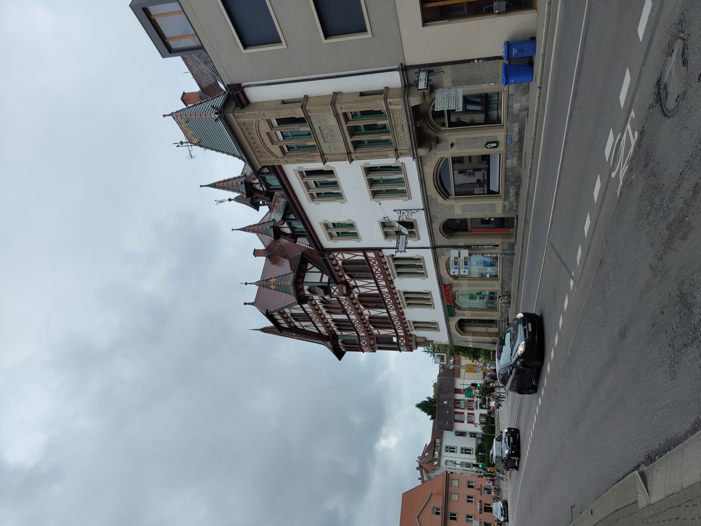
    <figcaption class="media-caption">Kreuzlingen — a city that sits comfortably on its own terms.</figcaption>
  </figure>
  <figure style="margin: 0;">
    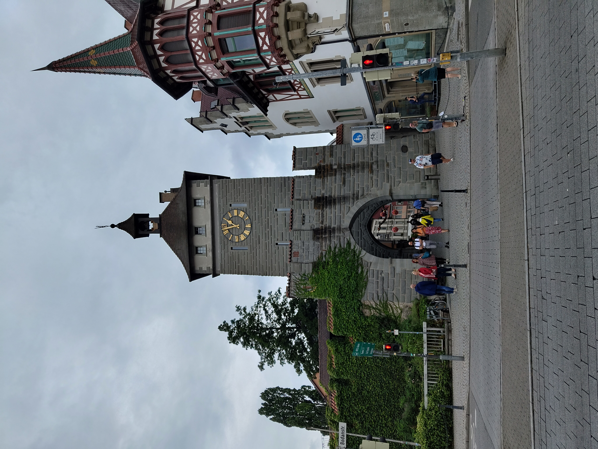
    <figcaption class="media-caption">The architecture along the streets — distinct enough to be worth noticing.</figcaption>
  </figure>
</div>

<div style="display: grid; grid-template-columns: 1fr 1fr 1fr; gap: 1rem; margin: 2rem 0;">
  <figure style="margin: 0;">
    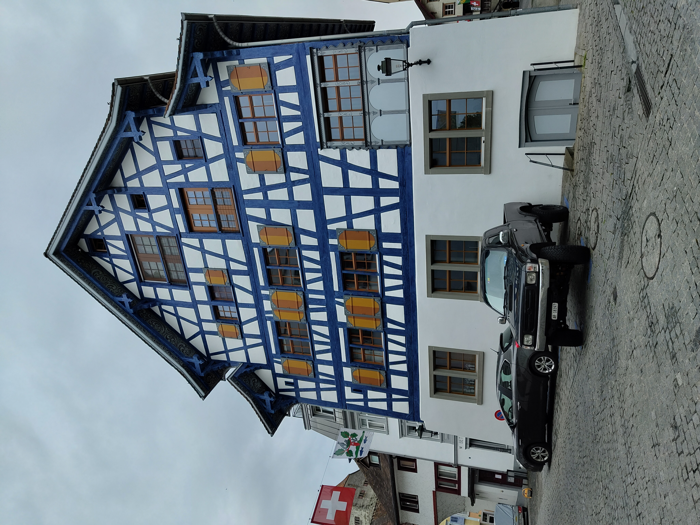
    <figcaption class="media-caption">Arbon — medieval buildings that have been standing long enough to develop a personality.</figcaption>
  </figure>
  <figure style="margin: 0;">
    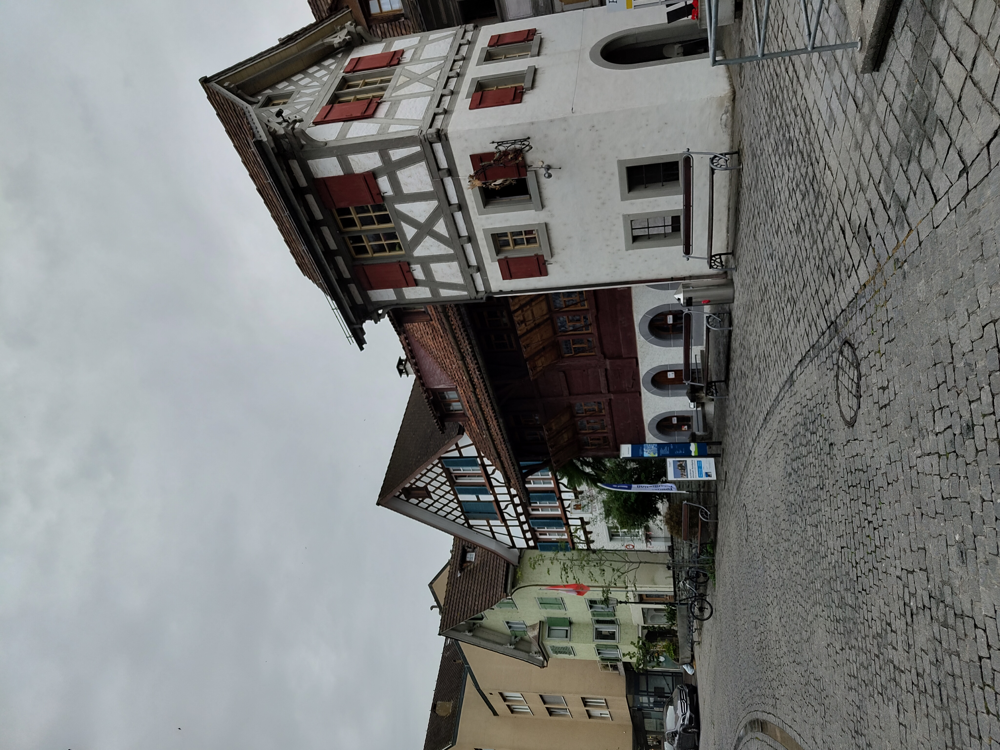
    <figcaption class="media-caption">The painted facades along the old town.</figcaption>
  </figure>
  <figure style="margin: 0;">
    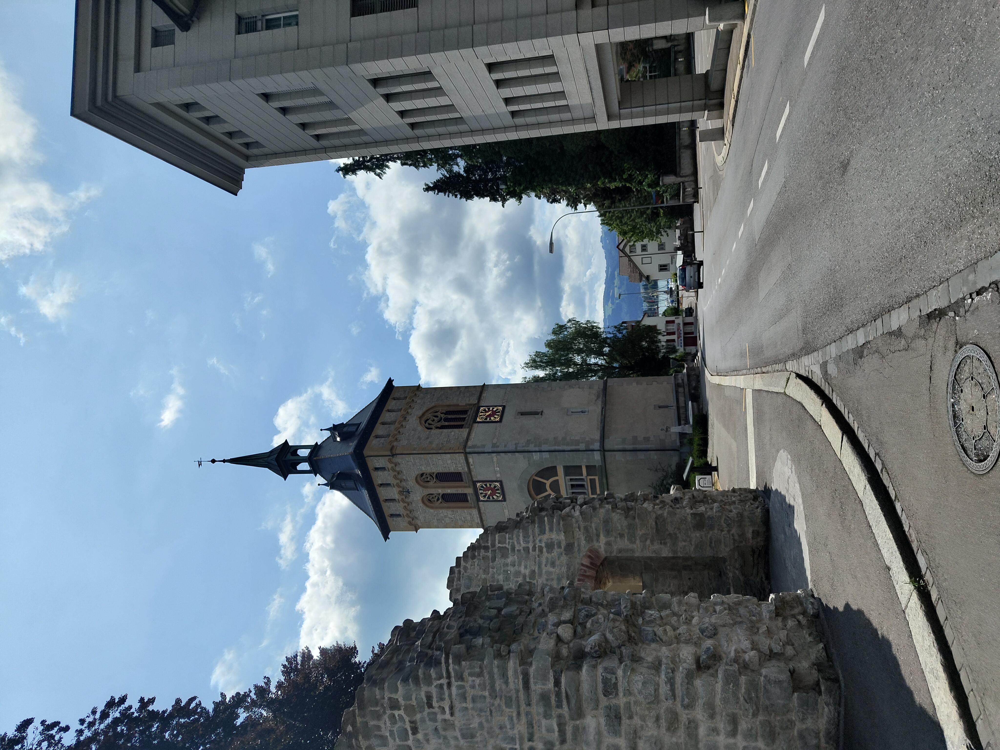
    <figcaption class="media-caption">The tower — Arbon's medieval centre holds its ground quietly.</figcaption>
  </figure>
</div>

<hr class="section-divider">

<div id="liechtenstein"></div>
::: {.prose}

## Liechtenstein — Completely Surrounded by Mountains

The train to Buchs and then the bus to Vaduz is a journey worth paying attention to — the mountains begin to close in on all sides in a way that makes Liechtenstein feel exactly as small and contained as it is, which turns out to be a feature rather than a limitation. The country is surrounded on every side, and the effect is of a place that exists in its own pocket of the Alps, unhurried and entirely comfortable with it.

Vaduz Castle was under repairs during the visit, which was a minor frustration, but the area around it gives a panoramic view over the valley that more than compensates. The people were genuinely friendly — not in the way that tourist infrastructure produces, but in the way that small countries sometimes manage where there's no performance required. St. Gallen, on the way back, is another of those Swiss towns that seems to have an excess of charm relative to its size.

:::

<div style="display: grid; grid-template-columns: 1fr 1fr; gap: 1rem; margin: 2rem 0;">
  <figure style="margin: 0;">
    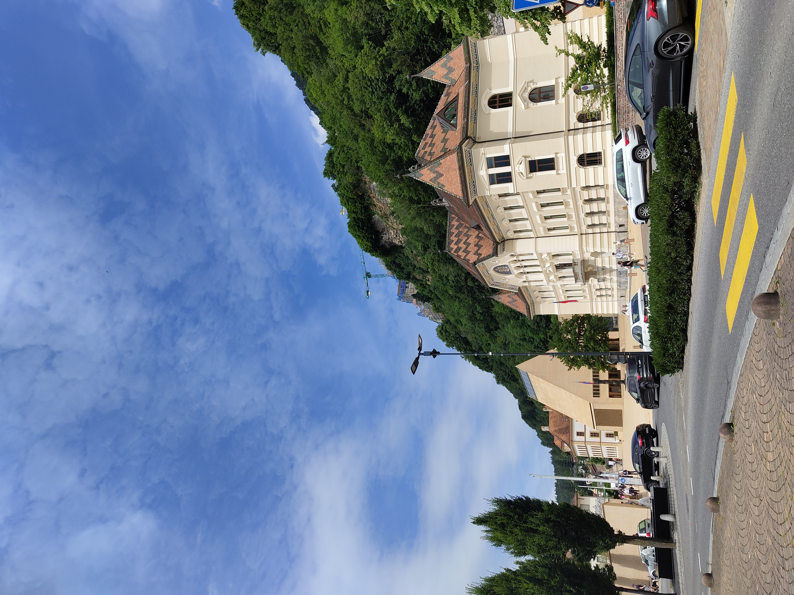
    <figcaption class="media-caption">Vaduz Castle — under repairs, but the view up to it still delivered.</figcaption>
  </figure>
  <figure style="margin: 0;">
    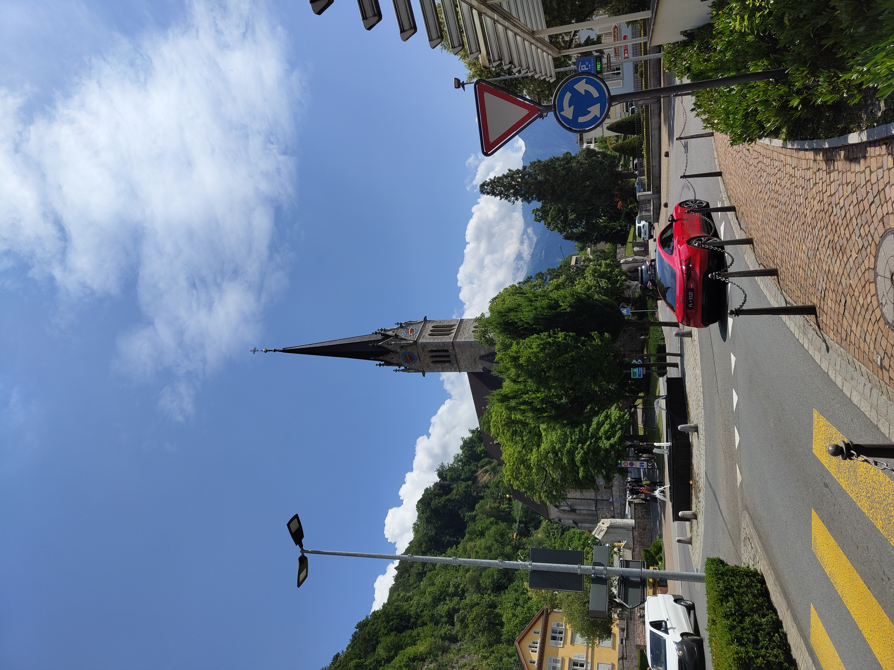
    <figcaption class="media-caption">The church framed by mountains — Liechtenstein in one image.</figcaption>
  </figure>
</div>

<div class="media-block" style="margin: 2rem 0;">
  <video autoplay muted loop playsinline
         style="width: 100%; max-height: 560px; object-fit: cover; object-position: center; border-radius: 6px; display: block;">
    <source src="https://github.com/martinas-jucysbrady/martinas-jucysbrady.github.io/releases/download/v1.0-media/vaduz_video.mp4" type="video/mp4" />
  </video>
  <p class="media-caption">Liechtenstein from the castle area — mountains on every side, the valley below.</p>
</div>

<div class="media-block">
  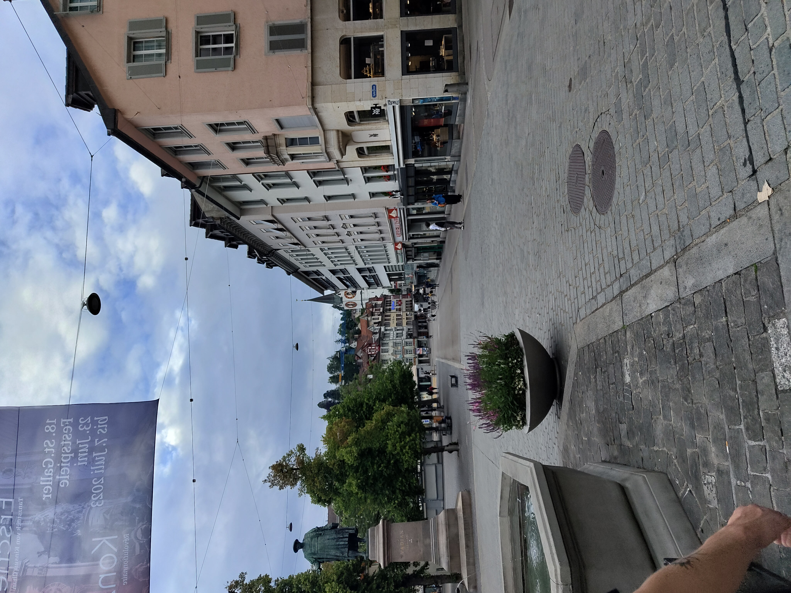
  <p class="media-caption">St. Gallen — charming in the way that Swiss towns seem to manage without trying.</p>
</div>

<hr class="section-divider">

::: {.prose}

## Schaffhausen and Zurich — The Waterfall and the Concert

Schaffhausen exists largely as the gateway to Rheinfall, and Rheinfall justifies the detour entirely. Europe's largest waterfall doesn't announce itself from a distance — you hear it before you see it, and then it arrives all at once: the Rhine dropping over a wide horseshoe of rock with a weight and noise that the photographs don't quite capture. The best angles are from the side and from above, and the mist reaches far enough that you feel it well before you're close.

Zurich in the evening was a Coldplay concert, and it was one of the better live experiences I've had. The production is well-documented — the wristbands that light up the crowd at nightfall, the colourful balloons that move through the audience, the scale of it. What's harder to convey is how well it works in person: the stadium turning into something collective in a way that makes the whole thing feel like more than a concert.

:::

<div style="display: grid; grid-template-columns: 1fr 1fr; gap: 1rem; margin: 2rem 0;">
  <figure style="margin: 0;">
    
    <figcaption class="media-caption">Rheinfall — Europe's largest waterfall, best understood from the side.</figcaption>
  </figure>
  <figure style="margin: 0;">
    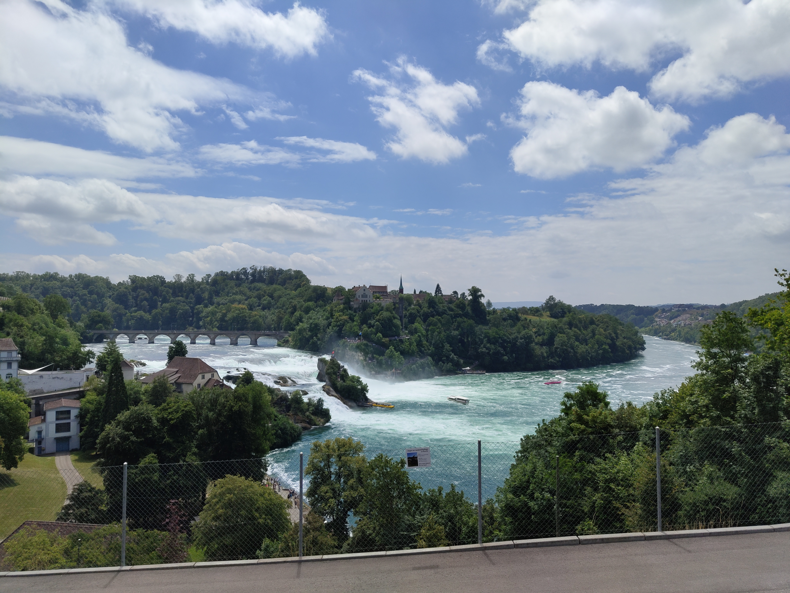
    <figcaption class="media-caption">From above — the Rhine dropping over rock with a noise you hear long before you arrive.</figcaption>
  </figure>
</div>

<div class="media-block" style="margin: 2rem 0;">
  <video autoplay muted loop playsinline
         style="width: 100%; max-height: 560px; object-fit: cover; object-position: center; border-radius: 6px; display: block;">
    <source src="https://github.com/martinas-jucysbrady/martinas-jucysbrady.github.io/releases/download/v1.0-media/rheinfall_video.mp4" type="video/mp4" />
  </video>
  <p class="media-caption">Rheinfall — the mist reaches you well before you're close.</p>
</div>

<div style="display: grid; grid-template-columns: 1fr 1fr; gap: 1rem; margin: 2rem 0;">
  <figure style="margin: 0;">
    <video autoplay muted loop playsinline
           style="width: 100%; height: 420px; object-fit: cover; border-radius: 6px; display: block;">
      <source src="https://github.com/martinas-jucysbrady/martinas-jucysbrady.github.io/releases/download/v1.0-media/zurich_coldplay1.mp4" type="video/mp4" />
    </video>
    <figcaption class="media-caption">The colourful balloons moving through the crowd — Coldplay doing what Coldplay does.</figcaption>
  </figure>
  <figure style="margin: 0;">
    <video autoplay muted loop playsinline
           style="width: 100%; height: 420px; object-fit: cover; border-radius: 6px; display: block;">
      <source src="https://github.com/martinas-jucysbrady/martinas-jucysbrady.github.io/releases/download/v1.0-media/zurich_coldplay2.mp4" type="video/mp4" />
    </video>
    <figcaption class="media-caption">Nightfall — every wristband in the stadium lit up at once.</figcaption>
  </figure>
</div>

<hr class="section-divider">

::: {.prose}

## Interlaken and Lauterbrunnen — Into the Alps

Bern is the capital and worth the time, but the draw of this part of the trip is further south. Interlaken sits between two lakes — the Brienzersee and the Thunersee — and the water is that particular shade of blue that makes you stop and check whether you're imagining it. We swam in it. The air coming off the mountains is the kind that makes city air feel like a different substance entirely.

The train from Interlaken to Lauterbrunnen climbs into a valley that gets narrower and steeper with every kilometre, the mountains growing on both sides until they're close enough to feel present rather than scenic. Lauterbrunnen is surrounded by waterfalls — seventy-two of them in the valley, the most famous dropping straight off the cliff face above the village. Beer steins in a place like this feel earned.

:::

<div class="media-block">
  
  <p class="media-caption">Brienzersee — that particular shade of blue that makes you stop and check whether you're imagining it.</p>
</div>

<div style="display: grid; grid-template-columns: 1fr 1fr 1fr; gap: 1rem; margin: 2rem 0;">
  <figure style="margin: 0;">
    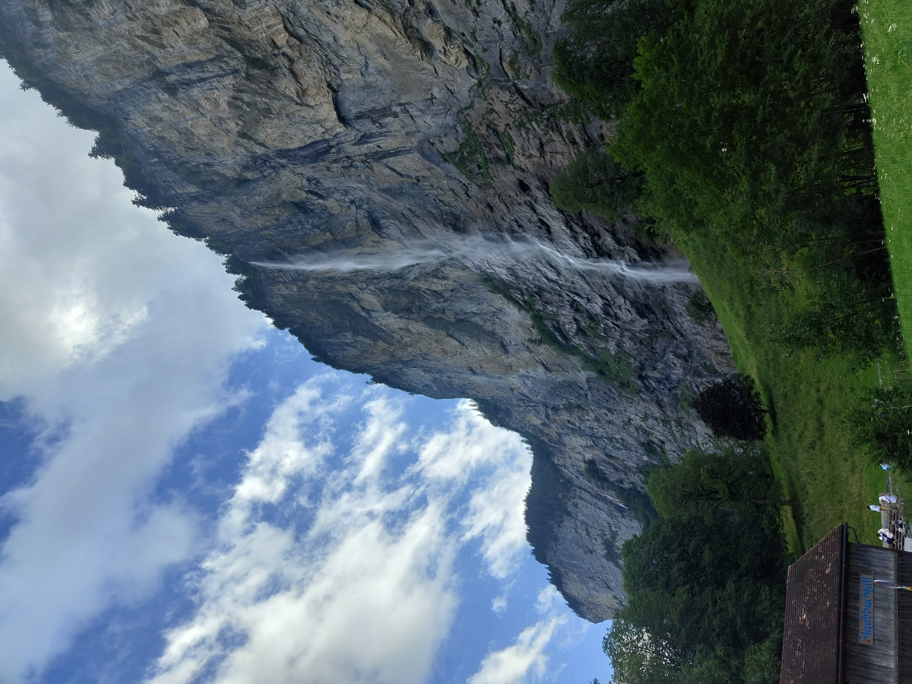
    <figcaption class="media-caption">The falls dropping straight off the cliff above the village.</figcaption>
  </figure>
  <figure style="margin: 0;">
    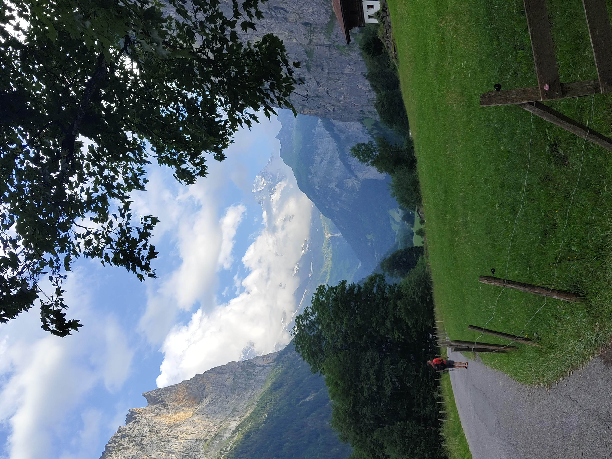
    <figcaption class="media-caption">Lauterbrunnen valley — the mountains close enough to feel present rather than scenic.</figcaption>
  </figure>
  <figure style="margin: 0;">
    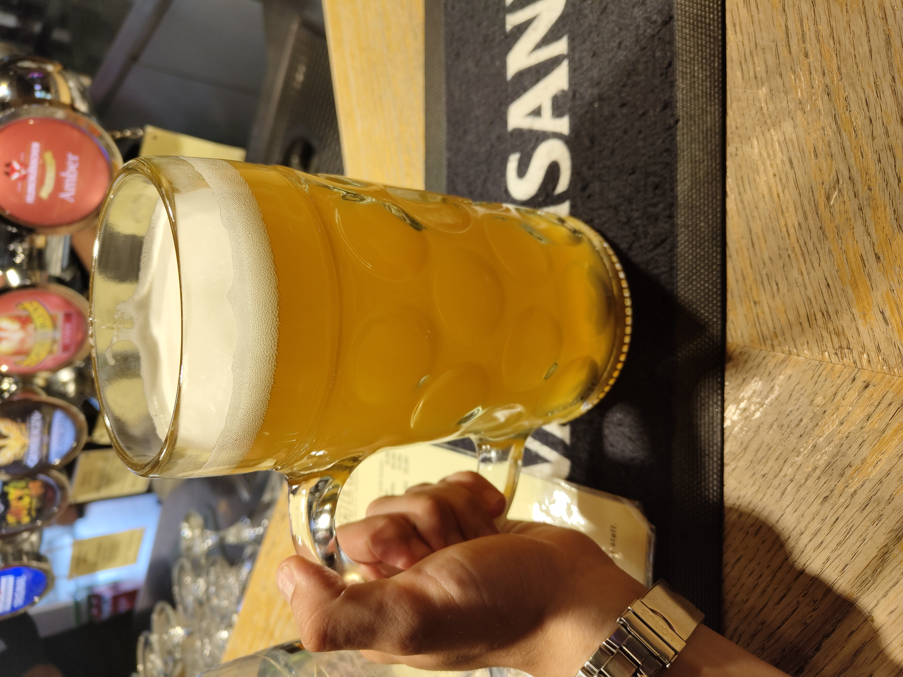
    <figcaption class="media-caption">The beer stein. One litre. Earned.</figcaption>
  </figure>
</div>

<hr class="section-divider">

::: {.prose}

## Grindelwald — Above the Clouds

Grindelwald is the reason the Alps have a reputation. Two days here — a morning hike up the mountain on the first, the cliff walk on the second — and both delivered in ways that are difficult to describe without sounding like a brochure. The scenery is simply at a different scale to what most places offer: glaciers, peaks, the valley floor impossibly far below, the air thin enough to notice.

The cliff walk on the second day takes you above the cloud line. Looking down at Grindelwald from that height — the village small, the surrounding peaks eye-level — is one of those moments that resets your sense of what the world looks like. Walking around the mountain after gives views of peaks that you are, for a short time, literally level with. It is a lot.

:::

<div class="media-block" style="margin: 2rem 0;">
  <video autoplay muted loop playsinline
         style="width: 100%; max-height: 560px; object-fit: cover; object-position: center; border-radius: 6px; display: block;">
    <source src="https://github.com/martinas-jucysbrady/martinas-jucysbrady.github.io/releases/download/v1.0-media/grindel_scene.mp4" type="video/mp4" />
  </video>
  <p class="media-caption">Grindelwald — the Alps at full scale.</p>
</div>

<div style="display: grid; grid-template-columns: 1fr 1fr; gap: 1rem; margin: 2rem 0;">
  <figure style="margin: 0;">
    
    <figcaption class="media-caption">The view on the morning hike — the valley beginning to open up below.</figcaption>
  </figure>
  <figure style="margin: 0;">
    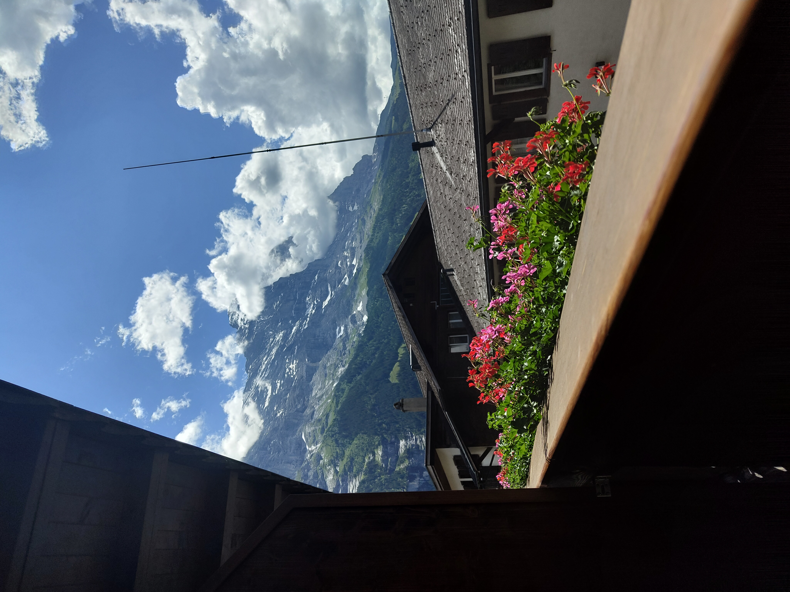
    <figcaption class="media-caption">Glaciers and peaks — the scenery at a different scale to most places.</figcaption>
  </figure>
</div>

<div style="display: grid; grid-template-columns: 1fr 1fr; gap: 1rem; margin: 2rem 0;">
  <figure style="margin: 0;">
    
    <figcaption class="media-caption">Day two — the cliff walk beginning.</figcaption>
  </figure>
  <figure style="margin: 0;">
    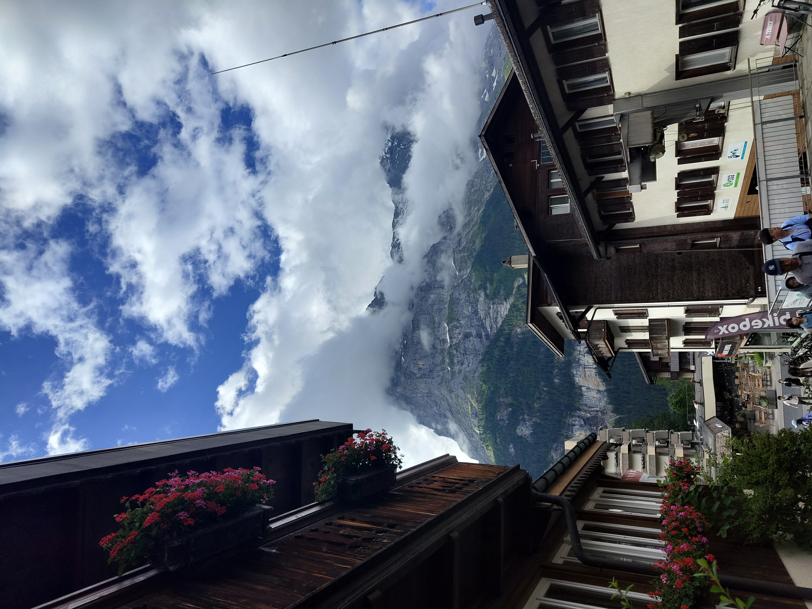
    <figcaption class="media-caption">The cliff walk — above the cloud line, looking out at peaks at eye level.</figcaption>
  </figure>
</div>

<div class="media-block">
  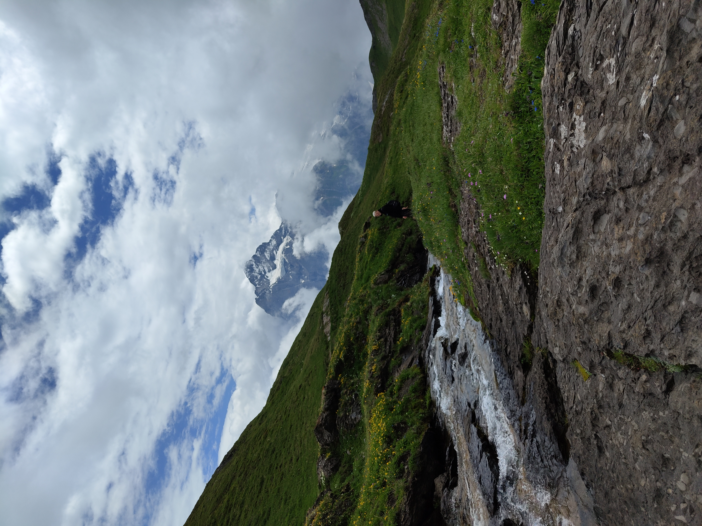
  <p class="media-caption">Above the clouds — walking around the mountain with the peaks level with you.</p>
</div>

<div class="media-block" style="margin: 2rem 0;">
  <video autoplay muted loop playsinline
         style="width: 100%; max-height: 560px; object-fit: cover; object-position: center; border-radius: 6px; display: block;">
    <source src="https://github.com/martinas-jucysbrady/martinas-jucysbrady.github.io/releases/download/v1.0-media/grindel_fromabove.mp4" type="video/mp4" />
  </video>
  <p class="media-caption">Looking down at Grindelwald from the cliff walk — the village small, the valley floor far below.</p>
</div>

<div class="pull-quote">
  "The air thin enough to notice, the peaks close enough to feel level with."
</div>

<hr class="section-divider">

::: {.prose}

## Lausanne and Geneva — The Western End

Lausanne closes the mountain section of the trip on a gentler note. The city sits above Lake Geneva with a picturesque quality that feels earned rather than arranged — the lake below, the hills behind, the old town climbing in between. The birds over the water in the evening were worth staying for.

Geneva is a different register entirely. Businesslike, expensive, and polished to a standard that reflects its role as a city of international institutions. Beautiful in the way that very wealthy cities sometimes are, with the added context that most of what happens here happens behind closed doors. A good place to end the trip from — the airport is efficient and the coffee is excellent.

:::

<div class="media-block" style="margin: 2rem 0;">
  <video autoplay muted loop playsinline
         style="width: 100%; max-height: 560px; object-fit: cover; object-position: center; border-radius: 6px; display: block;">
    <source src="https://github.com/martinas-jucysbrady/martinas-jucysbrady.github.io/releases/download/v1.0-media/lausanne_birds.mp4" type="video/mp4" />
  </video>
  <p class="media-caption">Lausanne — the birds over the lake at the end of the day.</p>
</div>

<div class="pull-quote">
  "The air coming off the mountains is the kind that makes city air feel like a different substance entirely."
</div>

<hr class="section-divider">

::: {.prose}

Eight days across a country that operates at a level of consistency that becomes slightly surreal — the trains run to the second, the scenery improves with every kilometre south, and the food and drink are quietly excellent throughout. Liechtenstein is the unexpected highlight: a country small enough to understand in an afternoon, charming enough to want more time in.

The Alps are the point of the trip and they deliver completely. Grindelwald above the cloud line is one of the better things I've done — the kind of experience that recalibrates what you think a landscape can look like. Switzerland rewards the journey south, and the journey south rewards the time.

:::

<div class="media-block">
  
  <p class="media-caption">Somewhere above Grindelwald — and above most things.</p>
</div>
