```{=html}
<style>
  .trip-header {
    text-align: center;
    padding: 60px 20px 40px;
    max-width: 860px;
    margin: 0 auto;
  }
  .trip-label {
    font-size: 0.75rem;
    letter-spacing: 0.2em;
    text-transform: uppercase;
    color: #9b8877;
    margin-bottom: 8px;
  }
  .trip-title {
    font-family: 'Plus Jakarta Sans', sans-serif;
    font-size: 2.6rem;
    font-weight: 800;
    color: #1E4264;
    margin: 0 0 12px;
    line-height: 1.1;
  }
  .trip-subtitle {
    font-family: 'Cormorant Garamond', serif;
    font-style: italic;
    font-size: 1.2rem;
    color: #6b7280;
    margin-bottom: 24px;
  }
  .trip-meta {
    display: flex;
    gap: 24px;
    justify-content: center;
    font-size: 0.8rem;
    color: #9b8877;
    letter-spacing: 0.06em;
    text-transform: uppercase;
    flex-wrap: wrap;
  }
  .section-divider {
    border: none;
    border-top: 1px solid #e0e0f0;
    margin: 48px auto;
    max-width: 600px;
  }
  .prose {
    max-width: 720px;
    margin: 0 auto;
    font-size: 1.05rem;
    line-height: 1.85;
    color: #2d3748;
  }
  .prose h2 {
    font-family: 'Plus Jakarta Sans', sans-serif;
    font-weight: 800;
    font-size: 1.6rem;
    color: #1E4264;
    margin-top: 56px;
    margin-bottom: 12px;
  }
  .prose p {
    margin-bottom: 1.4rem;
  }
  .media-block {
    max-width: 860px;
    margin: 32px auto;
    border-radius: 14px;
    overflow: hidden;
    box-shadow: 0 4px 24px rgba(0,0,0,0.10);
  }
  .media-block img,
  .media-block video {
    width: 100%;
    display: block;
    object-fit: cover;
  }
  .media-caption {
    font-family: 'Cormorant Garamond', serif;
    font-style: italic;
    font-size: 0.9rem;
    color: #9b8877;
    text-align: center;
    margin-top: 10px;
    padding: 0 12px 4px;
  }
  .media-grid {
    display: grid;
    grid-template-columns: 1fr 1fr;
    gap: 16px;
    max-width: 860px;
    margin: 32px auto;
  }
  .media-grid .media-block {
    margin: 0;
  }
  .pull-quote {
    font-family: 'Cormorant Garamond', serif;
    font-style: italic;
    font-size: 1.55rem;
    font-weight: 600;
    color: #1E4264;
    text-align: center;
    max-width: 640px;
    margin: 48px auto;
    line-height: 1.5;
    padding: 0 24px;
    border-left: 3px solid #c9aa96;
  }

  #quarto-document-content {
  display: flex;
  flex-direction: column;
  align-items: center;
  }

  #quarto-document-content > * {
  width: 100%;
  max-width: 860px;
  }
</style>

<div class="trip-header">
  <p class="trip-label">🥢 Travel</p>
  <h1 class="trip-title">End of One Year, Start of Another</h1>
  <p class="trip-subtitle">Five days across Taiwan and Vietnam</p>
  <div class="trip-meta">
    <span>December 2025 – January 2026</span>
    <span>📍 Taiwan & Vietnam</span>
    <span>✈️ 5 days</span>
  </div>
</div>

<hr class="section-divider">
```

::: {.prose}

Taipei — Dense, Layered, and Relentlessly Interesting {#taipei}

Landing in Taipei on the 28th of December, the city wastes no time. It is one of those places that rewards wandering — each neighbourhood slightly different from the last, the streets dense with temples, street food stalls, and architecture that spans several different centuries without any apparent attempt to reconcile them.

The Chiang Kai-shek Memorial Hall is the kind of place that stops you mid-step. The complex is enormous — a vast ceremonial plaza flanked by the National Theatre and Concert Hall, with the memorial itself rising at the far end in white marble and blue octagonal tile. Walking up to it, you understand why the proportions feel ceremonial: they were designed to. Inside, a bronze statue of Chiang Kai-shek sits surveying the hall from an elevated platform, and the changing of the guard — slow, precise, almost hypnotic — draws a crowd every hour.

Lungshan Temple sits in the older western part of the city and operates on a completely different register: incense smoke, the sound of chanting, worshippers moving between shrines with practised ease. It has been rebuilt several times since the 18th century and still functions as an active place of worship rather than a heritage exhibit, which makes the whole experience feel grounded in something real rather than performed for visitors.

:::

<div style="display: grid; grid-template-columns: 1fr 1fr; gap: 1rem; margin: 2rem 0;"> 
  <figure style="margin: 0;"> 
    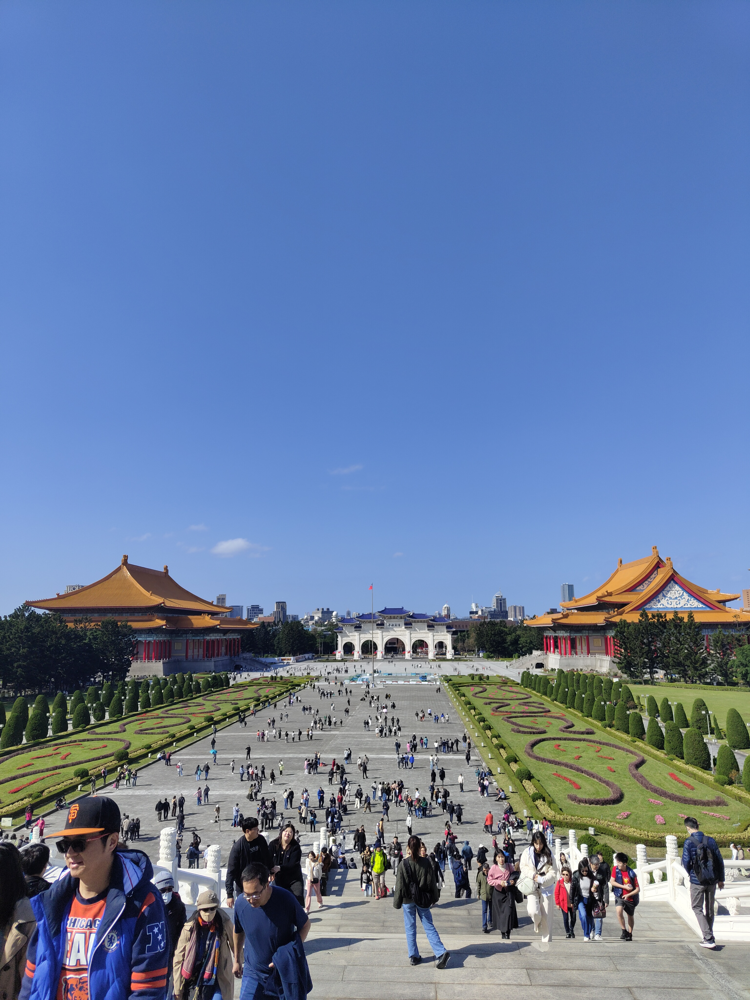 
    <figcaption class="media-caption">The memorial complex from above — a scale that only makes sense once you're inside it.</figcaption> 
  </figure> 
  <figure style="margin: 0;"> 
     
    <figcaption class="media-caption">The bronze statue inside the memorial hall — surveying the room from on high.</figcaption> 
  </figure> 
</div>
  
<div class="media-block" style="margin: 2rem 0;"> 
  <video autoplay muted loop playsinline style="width: 100%; max-height: 560px; object-fit: cover; object-position: center; border-radius: 6px; display: block;"> <source src="https://github.com/martinas-jucysbrady/martinas-jucysbrady.github.io/releases/download/v1.0-media/taipei_chiang.mp4" type="video/mp4" /> </video> 
  <p class="media-caption">The memorial hall — the scale of it only lands on video.</p> 
</div>

<div class="media-block"> 
  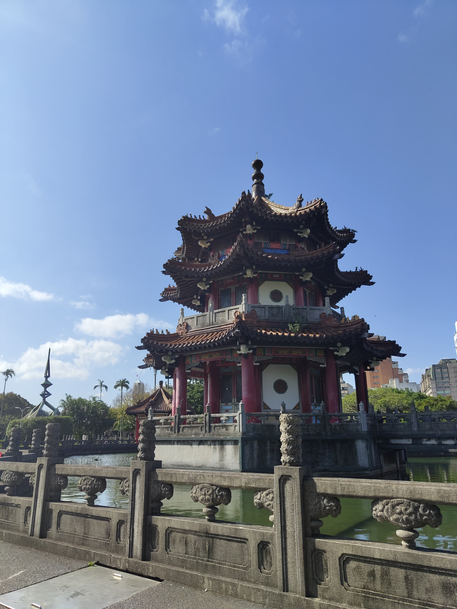 
  <p class="media-caption">The city layers centuries without apology — traditional architecture holding its ground beside everything else.</p> 
</div>
::: {.prose}

Taipei 101 anchors the skyline in the way only a few buildings in the world actually manage. At 508 metres and 101 floors, it held the title of the world's tallest building from 2004 until 2010 — the first structure ever to break the half-kilometre mark. The observation deck on the 89th floor gives you the whole city spread out below: mountains at the edge, the grid of streets below, the haze sitting over everything in that particular way that Southeast Asian cities share. The view at night — Taipei lit up and stretching in every direction — is something else entirely.

:::
<div style="display: grid; grid-template-columns: 1fr 1fr; gap: 1rem; margin: 2rem 0;">
  <figure style="margin: 0;">
    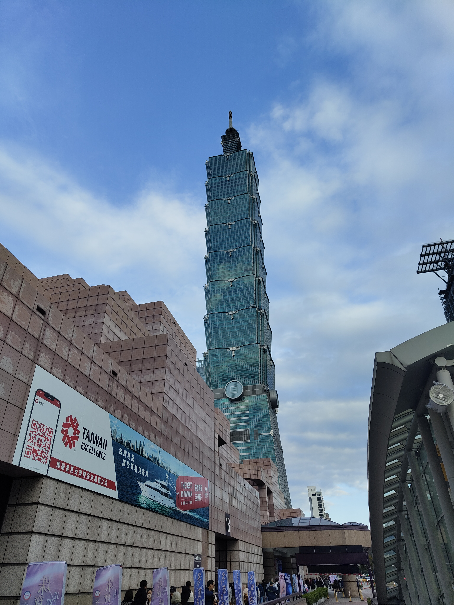
    <figcaption class="media-caption">Taipei 101 by day — 508 metres, the former tallest building on earth.</figcaption>
  </figure>
  <figure style="margin: 0;">
    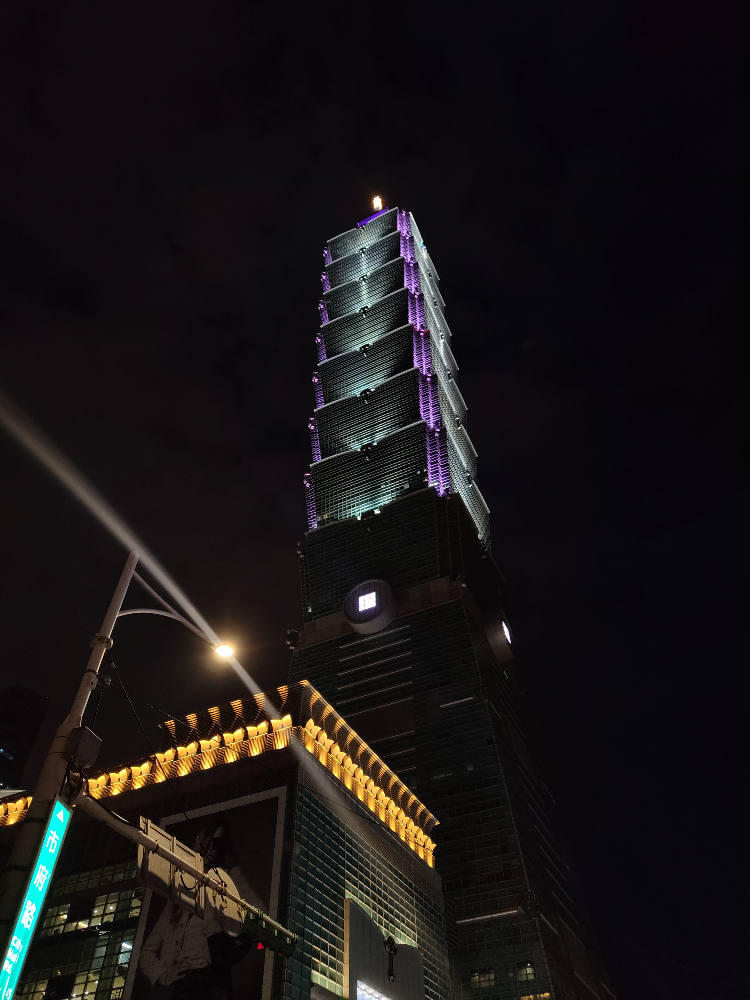
    <figcaption class="media-caption">By night — the city lights up in every direction below it.</figcaption>
  </figure>
</div>

<div class="media-block" style="margin: 2rem 0;">
  <video autoplay muted loop playsinline
         style="width: 100%; max-height: 560px; object-fit: cover; object-position: center; border-radius: 6px; display: block;">
    <source src="https://github.com/martinas-jucysbrady/martinas-jucysbrady.github.io/releases/download/v1.0-media/taipei_101.mp4" type="video/mp4" />
  </video>
  <p class="media-caption">The view from the top of Taipei 101 — the whole city, mountains at the edge.</p>
</div>

::: {.prose}

The North Coast Tour — Yehliu, Shifen, Jiufen

The 30th was a full-day tour north of the city, and it covered three places that together felt like a compressed tour of what Taiwan does better than almost anywhere: strange geology, living tradition, and the kind of atmosphere that makes you want to stay until the lights come on.

Yehliu Geopark sits on a peninsula on the north coast and contains one of the more genuinely surreal landscapes you can walk through. Wind and sea erosion have carved the sandstone into formations over millions of years — mushroom rocks, sea candles, honeycomb weathering — that look more like props than geology. The most famous is the Queen's Head, a rock balanced on a narrowing pedestal that has been wearing thinner for decades. There is also, somewhere in that park, a rock that looks precisely like two dogs kissing. These things are real.
:::

<div style="display: grid; grid-template-columns: 1fr 1fr; gap: 1rem; margin: 2rem 0;">
  <figure style="margin: 0;">
    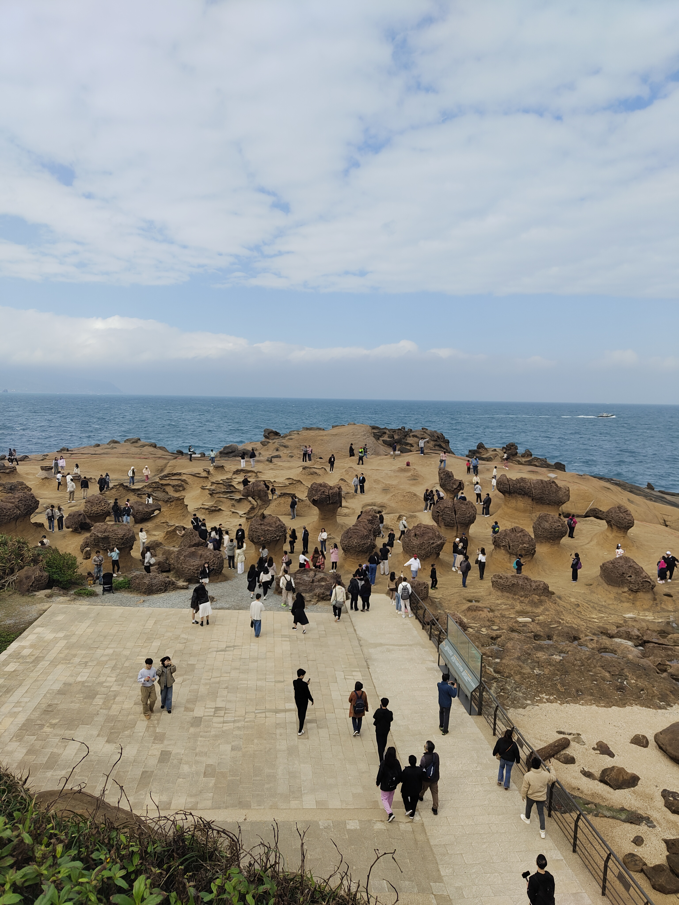
    <figcaption class="media-caption">Yehliu Geopark — millions of years of erosion, arranged into something that looks deliberate.</figcaption>
  </figure>
  <figure style="margin: 0;">
    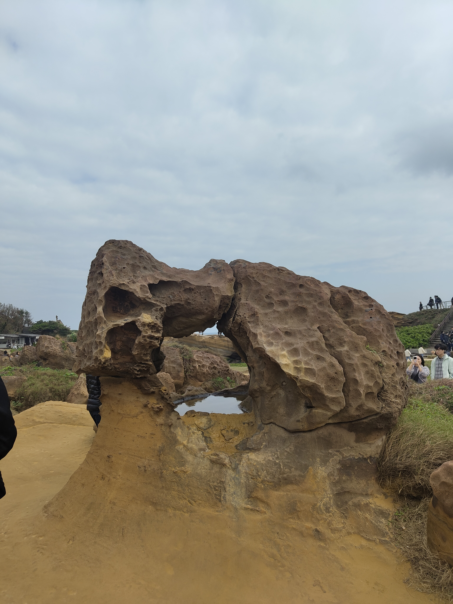
    <figcaption class="media-caption">The two dogs. Real. Unplanned. Completely convincing.</figcaption>
  </figure>
</div>
::: {.prose}

Shifen sits in a river valley along a stretch of old railway, and the town's defining tradition is the release of sky lanterns over the tracks — paper lanterns written with wishes and let go into the air above the gorge. Watching a dozen of them drift upward at once, glowing orange against the grey sky before disappearing into the valley, is the kind of moment that would feel contrived anywhere else and somehow doesn't here. The Shifen Waterfall is a short walk along the gorge trail — wide, powerful, and tucked into the valley in a way that makes it feel discovered rather than signposted.

:::

<div style="display: grid; grid-template-columns: 1fr 1fr; gap: 1rem; margin: 2rem 0;">
  <figure style="margin: 0;">
    <video autoplay muted loop playsinline
           style="width: 100%; height: 420px; object-fit: cover; border-radius: 6px; display: block;">
      <source src="https://github.com/martinas-jucysbrady/martinas-jucysbrady.github.io/releases/download/v1.0-media/taipei_shifen2.mp4" type="video/mp4" />
    </video>
    <figcaption class="media-caption">Shifen Waterfall — wide, powerful, and entirely worth the walk along the gorge.</figcaption>
  </figure>
  <figure style="margin: 0;">
    <video autoplay muted loop playsinline
           style="width: 100%; height: 420px; object-fit: cover; border-radius: 6px; display: block;">
      <source src="https://github.com/martinas-jucysbrady/martinas-jucysbrady.github.io/releases/download/v1.0-media/taipei_shifen1.mp4" type="video/mp4" />
    </video>
    <figcaption class="media-caption">Sky lanterns over the old street — wishes drifting up into the valley.</figcaption>
  </figure>
</div>
::: {.prose}

Jiufen closes the day in the right order. The old town climbs the hillside above the northeast coast, and the stone-stepped alleys, red lanterns, and tea houses stacked on the slope made it immediately recognisable — it's widely cited as one of the inspirations for Spirited Away, though Studio Ghibli has never confirmed it. Whether or not the legend holds, the atmosphere earns it. By the time the lanterns were lit and the fog started coming in off the sea, it felt like being inside something that had been imagined before it existed.

:::

<div style="display: grid; grid-template-columns: 1fr 1fr; gap: 1rem; margin: 2rem 0;">
  <figure style="margin: 0;">
    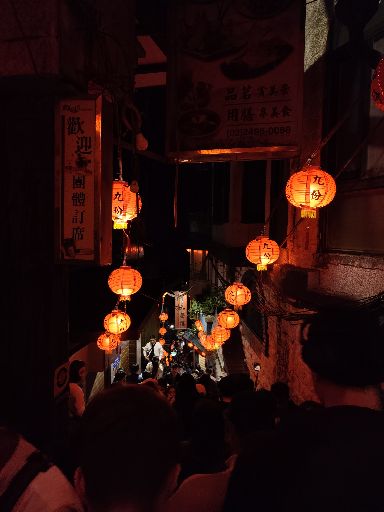
    <figcaption class="media-caption">The lantern-lit alleys of Jiufen — the fog came in off the sea just in time.</figcaption>
  </figure>
  <figure style="margin: 0;">
    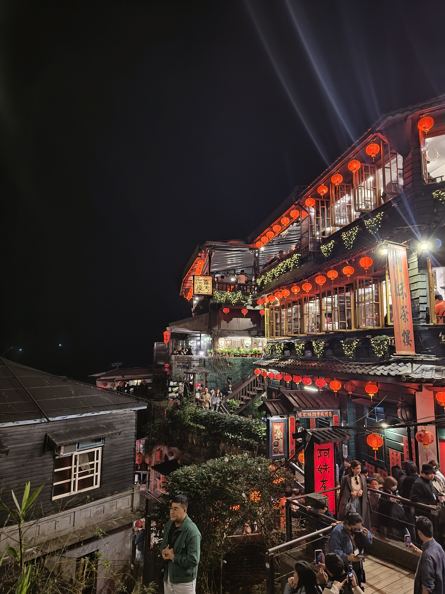
    <figcaption class="media-caption">The view Jiufen is known for — the kind that makes the legend feel earned.</figcaption>
  </figure>
</div>

<div class="pull-quote">
  "It felt like being inside something that had been imagined before it existed."
</div>

<hr class="section-divider">
::: {.prose}

Hanoi — New Year's Eve and a City Very Much Alive {#hanoi}

Flying into Hanoi on the 31st of December with the express purpose of being there at midnight is either perfect planning or an accident that worked out. It was the latter, and it delivered. The streets around Hoan Kiem Lake were already moving by the time we arrived — the kind of crowd that isn't chaotic so much as inevitable, the city collectively deciding that this particular evening required everyone outdoors at once.

Street food first, and street food often. Bánh mì from a cart on the pavement — pork, pâté, pickled vegetables, a chilli that operated in a different weight class from what I was expecting. Egg rolls that were better than most things eaten in more formal settings. And Vietnamese egg coffee, which sounds like a mistake and tastes like a revelation: a dense, sweet egg yolk foam sitting on top of strong Vietnamese coffee, served in a small ceramic cup in a dimly lit café that felt like it had been operating in that room for decades. Order two.

Midnight arrived with fireworks over the lake and the kind of noise that makes you understand why people celebrate in public spaces rather than private ones. A crowd-sourced countdown, strangers on all sides, and then the year turned.

:::

<div style="display: grid; grid-template-columns: 1fr 1fr; gap: 1rem; margin: 2rem 0;">
  <figure style="margin: 0;">
    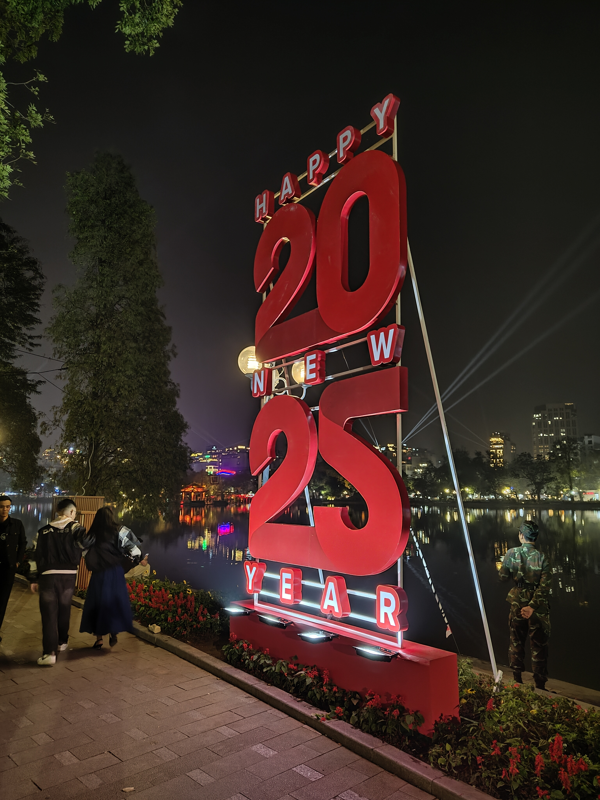
    <figcaption class="media-caption">The year turns — Hanoi fully committed to the occasion.</figcaption>
  </figure>
  <figure style="margin: 0;">
    
    <figcaption class="media-caption">Stir fry and egg rolls — street food that didn't need a table to justify itself.</figcaption>
  </figure>
</div>

<div class="media-block">
  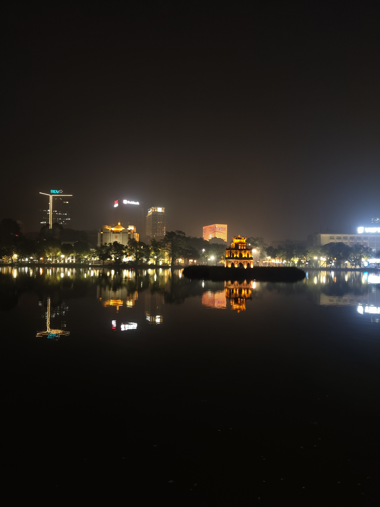
  <p class="media-caption">Hoan Kiem Lake at night — the temple on the water, the city lit up behind it.</p>
</div>
::: {.prose}

Ha Long Bay — The One That Lives Up to It {#halong}
The 1st of January was the tour to Ha Long Bay, a couple of hours east of Hanoi, and it is the kind of place that genuinely earns its UNESCO World Heritage status. Over 1,500 square kilometres of bay, dotted with thousands of limestone karst islands rising straight out of the water — geological formations tens of millions of years old, shaped by erosion into something that looks like it was composed rather than formed.

The boat moved through it slowly, which was the right speed. Sung Sot Cave — the largest cave system in Ha Long Bay — required a steep hike up to reach, and the interior paid it off: a 10,000 square metre system of chambers, stalactites and stalagmites bent into shapes that people have been naming after animals and figures for centuries. Hang Luon is a different experience entirely — a flooded cave you pass through by kayak, the limestone ceiling low overhead, opening out into a hidden lagoon ringed by karst walls on all sides.

Ti Top Island finishes the day with a climb. The beach at the base is small and quiet, and the view from the summit, after a few hundred steps up, is Ha Long Bay in every direction — islands fading into haze, the water impossibly still, the boat waiting far below. Vietnamese hospitality on the cruise was the kind that makes you feel genuinely welcomed rather than processed through an itinerary.

:::
<div class="media-block" style="margin: 2rem 0;">
  <video autoplay muted loop playsinline
         style="width: 100%; max-height: 560px; object-fit: cover; object-position: center; border-radius: 6px; display: block;">
    <source src="https://github.com/martinas-jucysbrady/martinas-jucysbrady.github.io/releases/download/v1.0-media/hanoi_halong1.mp4" type="video/mp4" />
  </video>
  <p class="media-caption">Moving through Ha Long Bay — limestone karsts on every side, the water flat and still.</p>
</div>

<div style="display: grid; grid-template-columns: 1fr 1fr; gap: 1rem; margin: 2rem 0;">
  <figure style="margin: 0;">
    <video autoplay muted loop playsinline
           style="width: 100%; height: 420px; object-fit: cover; border-radius: 6px; display: block;">
      <source src="https://github.com/martinas-jucysbrady/martinas-jucysbrady.github.io/releases/download/v1.0-media/hanoi_halong2.mp4" type="video/mp4" />
    </video>
    <figcaption class="media-caption">The bay from the water — scale that doesn't fully land in photographs.</figcaption>
  </figure>
  <figure style="margin: 0;">
    <video autoplay muted loop playsinline
           style="width: 100%; height: 420px; object-fit: cover; border-radius: 6px; display: block;">
      <source src="https://github.com/martinas-jucysbrady/martinas-jucysbrady.github.io/releases/download/v1.0-media/hanoi_halong3.mp4" type="video/mp4" />
    </video>
    <figcaption class="media-caption">Weaving through the caves and ridges of Ha Long</figcaption>
  </figure>
</div>

<div class="media-block">
  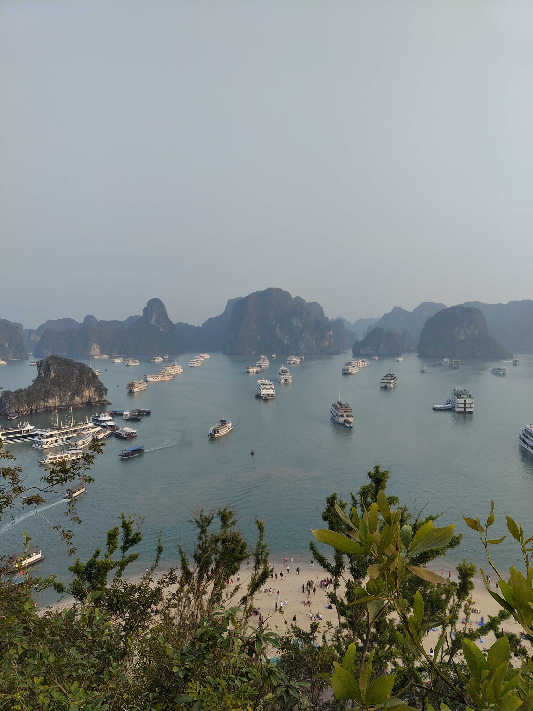
  <p class="media-caption">From the top of Ti Top — the bay spread out below, islands disappearing into the distance.</p>
</div>
::: {.prose}

Hanoi — The City Itself 
The 2nd of January was for the city. Ho Chi Minh's Mausoleum is a formal, almost austere building on the western edge of Ba Dinh Square — the scale of the square itself is designed for ceremony, and the mausoleum sits at the end of it accordingly. The Ancient Citadel, a UNESCO-listed complex dating back to the 11th century, holds the layers of Vietnamese history in a way that the mausoleum's 20th-century formality doesn't — older walls, older gates, the sense of a city that existed long before the conflicts it's most associated with abroad.

Tran Quoc Pagoda sits on a small island in West Lake, the oldest Buddhist pagoda in Hanoi, and the late afternoon light on it — particularly the Vietnamese flag catching the air beside the tower — made it the kind of photograph that doesn't require any editing to justify. The markets and shops around the Old Quarter were a different kind of browsing: fabrics, ceramics, clothing stalls that somehow managed to feel both chaotic and organised, the kind of energy that makes a city feel inhabited rather than curated.

Train Street arrived at the end of the day in the best possible way. A narrow residential alley that a functioning railway line runs directly through — houses on both sides, metres from the tracks — and every few hours the train comes through slowly enough that everyone steps back against the walls and watches it pass. It is one of those things that should feel like a tourist gimmick and somehow, in the middle of it, entirely doesn't.

:::

<div style="display: grid; grid-template-columns: 1fr 1fr; gap: 1rem; margin: 2rem 0;">
  <figure style="margin: 0;">
    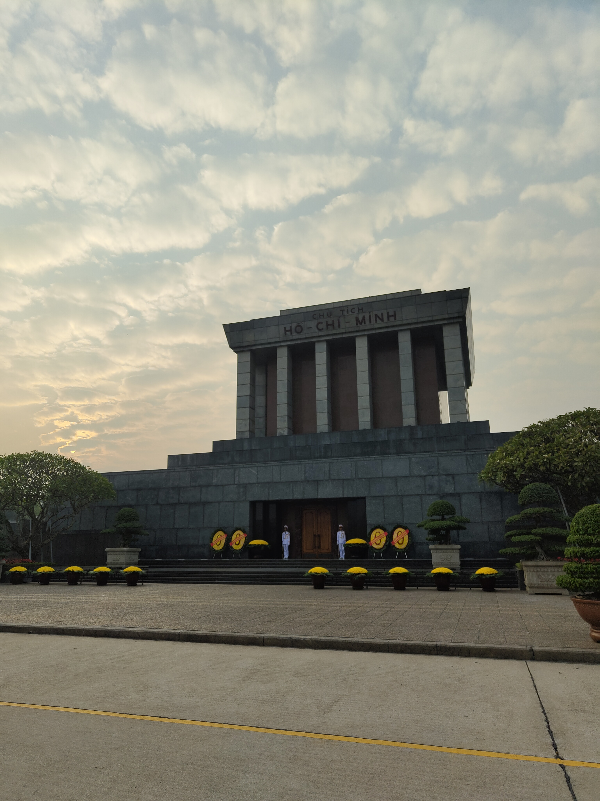
    <figcaption class="media-caption">Ho Chi Minh's Mausoleum — formal, austere, and anchored at the end of Ba Dinh Square.</figcaption>
  </figure>
  <figure style="margin: 0;">
    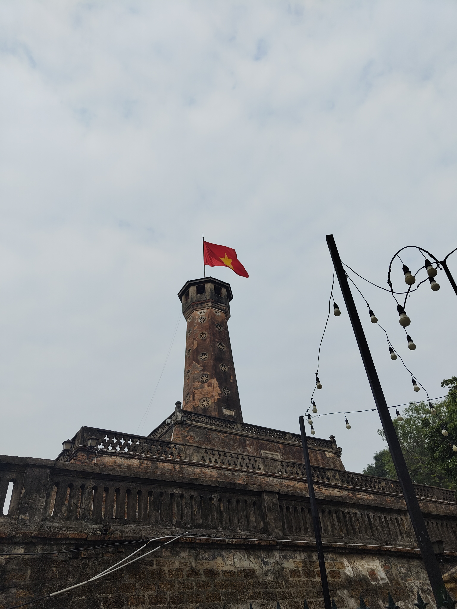
    <figcaption class="media-caption">The Ancient Citadel — eleven centuries of Hanoi in one walled complex.</figcaption>
  </figure>
</div>

<div style="display: grid; grid-template-columns: 1fr 1fr; gap: 1rem; margin: 2rem 0;">
  <figure style="margin: 0;">
    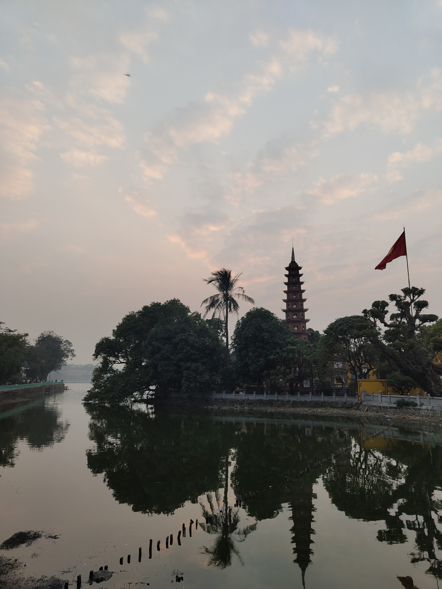
    <figcaption class="media-caption">Tran Quoc Pagoda at sunset — Hanoi's oldest Buddhist pagoda, on an island in West Lake.</figcaption>
  </figure>
  <figure style="margin: 0;">
    <video autoplay muted loop playsinline
           style="width: 100%; height: 420px; object-fit: cover; border-radius: 6px; display: block;">
      <source src="https://github.com/martinas-jucysbrady/martinas-jucysbrady.github.io/releases/download/v1.0-media/hanoi_train.mp4" type="video/mp4" />
    </video>
    <figcaption class="media-caption">Train Street — the train comes through slowly enough that you have time to press against the wall and think about it.</figcaption>
  </figure>
</div>

<div style="display: grid; grid-template-columns: 1fr 1fr; gap: 1rem; margin: 2rem 0;">
  <figure style="margin: 0;">
    
    <figcaption class="media-caption">The Old Quarter markets — slightly chaotic, entirely satisfying.</figcaption>
  </figure>
  <figure style="margin: 0;">
    
    <figcaption class="media-caption">A street shrine — fruit, alcohol, and the kind of quiet devotion that the city carries everywhere.</figcaption>
  </figure>
</div>

<div class="pull-quote">
  "A crowd-sourced countdown, strangers on all sides, and then the year turned."
</div>

<hr class="section-divider">

::: {.prose}

Five days is not enough for either of these places. Taiwan operates at a density — of history, of food, of things worth seeing — that rewards more time than a long weekend allows. Vietnam, particularly Hanoi and Ha Long Bay, is a place that keeps expanding the longer you're inside it: more layers, more detail, more reasons to stay.

What made the trip was the timing. Ending one year in Jiufen with lanterns drifting over a valley, and beginning the next in Hanoi in the middle of a crowd watching fireworks over a lake, is the kind of itinerary that sounds planned and was mostly accidental. Some trips work out in spite of themselves. This one did.

:::

<div class="media-block"> 
   
  <p class="media-caption">Somewhere between Jiufen and everything that came after.</p> 
</div>